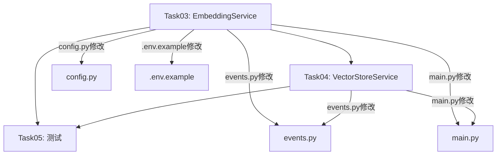

# 实施计划：Task03 + Task04 + Task05 — EmbeddingService + VectorStoreService + 测试

> 项目：XH-202630 科研文献智能助手
> 里程碑：M1 基础设施就绪 / AM1 项目骨架与模型层就绪
> 执行顺序：Task03 → Task04 → Task05（依赖关系：Task05依赖Task03和Task04的实现）

***

## 一、任务总览



| 任务     | 核心交付                                                              | 涉及文件                                                               |
| ------ | ----------------------------------------------------------------- | ------------------------------------------------------------------ |
| Task03 | EmbeddingService（阿里云百炼API优先 + 本地bge-large-zh-v1.5降级）              | config.py, embedding\_service.py, events.py, main.py, .env.example |
| Task04 | VectorStoreService（ChromaDB PersistentClient + papers collection） | vector\_store\_service.py, events.py, main.py                      |
| Task05 | conftest.py + test\_embedding.py + test\_vector\_store.py         | conftest.py, test\_embedding.py, test\_vector\_store.py            |

***

## 二、Task03 详细步骤 — 阿里云百炼API Embedding配置与EmbeddingService

### Step 03-1: 修改 config.py — 新增3个阿里云百炼配置项

**文件**: `Veritas/ai-service/app/core/config.py`

在现有 `EMBEDDING_API_MODEL` 之后新增：

```python
DASHSCOPE_API_KEY: str = ""
DASHSCOPE_EMBEDDING_MODEL: str = "text-embedding-v4"
DASHSCOPE_EMBEDDING_BASE_URL: str = "https://dashscope.aliyuncs.com/compatible-mode/v1"
```

**验证**: `python -c "from app.core.config import settings; print(settings.DASHSCOPE_EMBEDDING_MODEL)"`

### Step 03-2: 创建 embedding\_service.py — EmbeddingService完整实现

**文件**: `Veritas/ai-service/app/services/embedding_service.py`（新建）

**类设计**:

* `__init__(self, settings)` — 初始化 model=None, dimension=768, status='initializing', \_api\_client=None

* `load_model()` — 两级策略：① DASHSCOPE\_API\_KEY非空→\_init\_dashscope\_client()→status='loaded\_api'；② 降级加载本地SentenceTransformer→status='loaded\_local'；③ 都失败→status='error', raise RuntimeError

* `_init_dashscope_client()` — 创建 openai.AsyncOpenAI(api\_key=..., base\_url=...)

* `encode(text)` — 本地模型→model.encode(normalize\_embeddings=True)；API模式→\_encode\_via\_api(text)；都不可用→raise ModelNotLoadedException

* `encode_batch(texts, batch_size=32)` — 分批调用encode()，np.vstack拼接

* `_encode_via_api(text)` — 调用\_api\_client.embeddings.create(model=DASHSCOPE\_EMBEDDING\_MODEL, input=text)

**关键约束**:

* 本地模型encode是CPU密集操作，需用 `asyncio.get_event_loop().run_in_executor(None, ...)` 包装

* API调用失败需明确异常日志，不静默失败

* 日志中API Key仅输出前4位脱敏

### Step 03-3: 修改 events.py — 启动时加载EmbeddingService

**文件**: `Veritas/ai-service/app/core/events.py`

* 导入 EmbeddingService

* 声明模块级变量 `embedding_service = None`

* 在 `on_startup()` 中创建实例并调用 `await embedding_service.load_model()`

* 在 `on_shutdown()` 中添加资源释放日志

### Step 03-4: 修改 main.py — /health返回真实embedding状态

**文件**: `Veritas/ai-service/app/main.py`

* 从 `app.core.events` 导入 `embedding_service`

* 将 `"embedding": "not_loaded"` 改为 `"embedding": embedding_service.status if embedding_service else "not_loaded"`

### Step 03-5: 修改 .env.example — 新增阿里云百炼配置区域

**文件**: `Veritas/ai-service/.env.example`

在现有 Embedding 配置区域下方新增：

```
# --- 阿里云百炼/DashScope Embedding配置(优先) ---
# DASHSCOPE_API_KEY=          # 阿里云百炼API Key，用于text-embedding-v4，敏感值请勿提交
# DASHSCOPE_EMBEDDING_MODEL=  # 模型名，默认text-embedding-v4(768维)
# DASHSCOPE_EMBEDDING_BASE_URL= # API端点，默认https://dashscope.aliyuncs.com/compatible-mode/v1
```

### Step 03-6: 验证Task03

```bash
cd Veritas/ai-service && python -c "from app.services.embedding_service import EmbeddingService; from app.core.config import settings; print('OK')"
```

***

## 三、Task04 详细步骤 — ChromaDB初始化与VectorStoreService

### Step 04-1: 创建 vector\_store\_service.py — VectorStoreService完整实现

**文件**: `Veritas/ai-service/app/services/vector_store_service.py`（新建）

**类设计**:

* `__init__(self, settings)` — 初始化 client=None, collection=None, status='disconnected'

* `initialize()` — 创建 PersistentClient(path=CHROMA\_PATH)，get\_or\_create\_collection('papers', metadata={hnsw:space:cosine, hnsw:M:16, hnsw:construction\_ef:200})，记录count，status='connected'。失败→status='error', raise VectorStoreException

* `add_papers(paper_ids, embeddings, metadatas, documents)` — 参数长度校验，collection.add()，记录日志

* `search(embedding, top_k=10, filters=None)` — 构建where过滤(yearFrom→$gte, yearTo→$lte, venue→$eq, 多条件$and)，collection.query()，score=1-distance，返回\[{paperId,title,abstract,score,year,venue}]

* `delete_papers(paper_ids)` — collection.delete(ids=paper\_ids)，幂等删除

* `count()` — collection.count()，collection为None返回0

* `close()` — client=None, collection=None, status='disconnected'

**关键约束**:

* 必须使用 PersistentClient（禁止 EphemeralClient）

* HNSW参数必须：cosine/M=16/construction\_ef=200

* score = 1 - distance（cosine距离转相似度，范围0-1）

* add\_papers必须校验4个参数长度一致

### Step 04-2: 修改 events.py — 启动时初始化VectorStoreService

**文件**: `Veritas/ai-service/app/core/events.py`

* 导入 VectorStoreService

* 声明模块级变量 `vector_store_service = None`

* 在 `on_startup()` 中（EmbeddingService加载之后）创建实例并调用 `await vector_store_service.initialize()`

* 在 `on_shutdown()` 中（日志记录之前）调用 `await vector_store_service.close()`

### Step 04-3: 修改 main.py — /health返回真实chroma状态

**文件**: `Veritas/ai-service/app/main.py`

* 从 `app.core.events` 导入 `vector_store_service`

* 将 `"chroma": "not_connected"` 改为 `"chroma": vector_store_service.status if vector_store_service else "not_connected"`

### Step 04-4: 验证Task04

```bash
cd Veritas/ai-service && python -c "from app.services.vector_store_service import VectorStoreService; from app.core.config import settings; import asyncio; async def t(): svc=VectorStoreService(settings); await svc.initialize(); print(svc.status, await svc.count()); await svc.close(); asyncio.run(t())"
```

***

## 四、Task05 详细步骤 — 批量向量化测试与连接验证

### Step 05-1: 创建 conftest.py — pytest配置与共享fixture

**文件**: `Veritas/ai-service/tests/conftest.py`（新建）

**Fixture设计**:

* `embedding_service` (function scope) — 创建EmbeddingService(settings)实例，load\_model()加载本地模型(不依赖DASHSCOPE\_API\_KEY)，yield实例

* `vector_store_service` (function scope) — 使用pytest tmp\_path创建临时ChromaDB目录，修改settings.CHROMA\_PATH指向临时目录，initialize()连接，yield实例，teardown调用close()

### Step 05-2: 创建 test\_embedding.py — EmbeddingService单元测试

**文件**: `Veritas/ai-service/tests/test_embedding.py`（新建）

**测试类**:

* `TestEmbeddingServiceInit` — 初始状态验证(dimension=768, status='initializing', model=None)；load\_model后status变化

* `TestEmbeddingServiceLocal` — 本地模型encode单条(768,)、encode多条(3,768)、encode\_batch分批、向量维度校验、L2范数≈1.0

* `TestEmbeddingServiceAPI` — skipif(DASHSCOPE\_API\_KEY未设置时跳过)，API连接、encode返回768维

* `TestEmbeddingServiceError` — 未load\_model直接encode抛ModelNotLoadedException(code=503)；无效路径load\_model异常

### Step 05-3: 创建 test\_vector\_store.py — VectorStoreService单元测试

**文件**: `Veritas/ai-service/tests/test_vector_store.py`（新建）

**测试类**:

* `TestVectorStoreInit` — initialize后status='connected'、collection.name='papers'、空collection count=0

* `TestVectorStoreCRUD` — add\_papers 3条→count=3、参数不一致raise ValueError、delete 1条→count=2、删除后再添加

* `TestVectorStoreSearch` — search basic(自身最相似score>0.9)、score范围0-1、year过滤、venue过滤、空结果边界

### Step 05-4: 验证Task05

```bash
cd Veritas/ai-service && pytest tests/ -v --tb=short
```

***

## 五、文件变更清单

| 操作 | 文件路径                                                      | 任务        |
| -- | --------------------------------------------------------- | --------- |
| 修改 | `Veritas/ai-service/app/core/config.py`                   | Task03    |
| 新建 | `Veritas/ai-service/app/services/embedding_service.py`    | Task03    |
| 修改 | `Veritas/ai-service/app/core/events.py`                   | Task03+04 |
| 修改 | `Veritas/ai-service/app/main.py`                          | Task03+04 |
| 修改 | `Veritas/ai-service/.env.example`                         | Task03    |
| 新建 | `Veritas/ai-service/app/services/vector_store_service.py` | Task04    |
| 新建 | `Veritas/ai-service/tests/conftest.py`                    | Task05    |
| 新建 | `Veritas/ai-service/tests/test_embedding.py`              | Task05    |
| 新建 | `Veritas/ai-service/tests/test_vector_store.py`           | Task05    |

***

## 六、关键设计决策

1. **EmbeddingService两级策略**: 阿里云百炼API(text-embedding-v4)优先 → 本地bge-large-zh-v1.5降级。API Key非空即尝试API，失败或Key为空则降级本地
2. **本地模型encode使用run\_in\_executor**: SentenceTransformer.encode()是CPU密集操作，不能阻塞事件循环
3. **VectorStoreService使用PersistentClient**: 确保数据持久化到磁盘CHROMA\_PATH
4. **HNSW参数锁定**: cosine/M=16/construction\_ef=200，与架构文档一致
5. **score转换**: ChromaDB返回cosine距离(0-2)，需转换为相似度 score=1-distance(范围0-1)
6. **测试隔离**: vector\_store\_service fixture使用tmp\_path临时目录，function scope确保测试间互不干扰
7. **API测试条件执行**: 使用pytest.mark.skipif，DASHSCOPE\_API\_KEY未设置时优雅跳过

***

## 七、风险与注意事项

| 风险                       | 应对                                                                |
| ------------------------ | ----------------------------------------------------------------- |
| 本地bge-large-zh-v1.5模型未下载 | 首次运行会自动从HuggingFace下载(\~1.3GB)，测试环境需确保网络或预下载                      |
| 阿里云百炼API Key泄露           | .env.example中注释提醒，日志中脱敏输出                                         |
| ChromaDB版本兼容性            | 锁定chromadb==0.5.0，API可能与其他版本不兼容                                   |
| 测试中本地模型加载耗时              | conftest.py中embedding\_service使用function scope，每个测试独立加载           |
| events.py中模块级变量初始化顺序     | embedding\_service和vector\_store\_service初始化为None，在on\_startup中赋值 |

