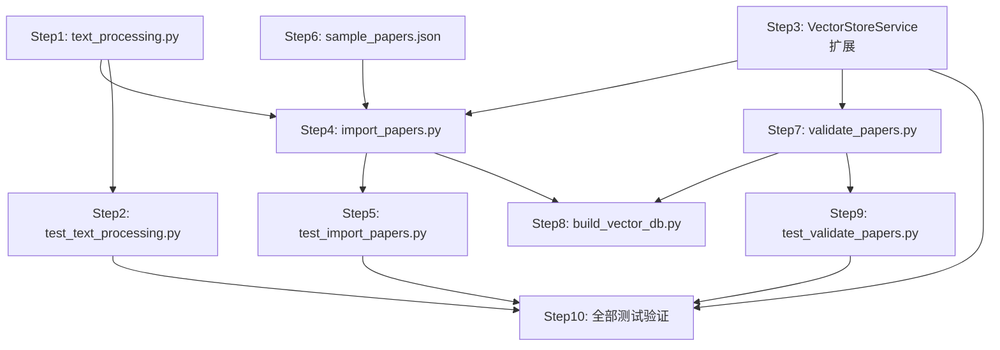

# 实施计划：Task10 论文向量化导入 + Task11 论文数据验证

> 课题：XH-202630 科研文献智能助手  
> 里程碑：M2 单Agent可用 / AM2 RAG检索与3-Agent基础可用  
> 执行人：Python Agent Architect  

---

## 1 任务概览

### Task10：论文向量化导入脚本
- 创建 `scripts/import_papers.py` — arXiv API下载 + 清洗 + 分块 + 向量化 + 批量入库
- 扩展 `vector_store_service.py` — 新增 `add_papers_batch` / `get_paper_by_id` / `update_paper_metadata`
- 创建 `app/utils/text_processing.py` — 文本分块/清洗/截断工具
- 创建 `tests/test_import_papers.py` + `tests/test_text_processing.py`

### Task11：论文数据验证
- 创建 `scripts/validate_papers.py` — 数据验证脚本（向量维度/元数据/去重/检索质量）
- 创建 `scripts/build_vector_db.py` — 向量数据库构建脚本（全量重建/增量更新）
- 创建 `tests/test_validate_papers.py`
- 创建 `data/papers/sample_papers.json` — 5篇样本论文

---

## 2 实施步骤

### Step 1：创建 `app/utils/text_processing.py`
**优先级：P0（被Task10和后续Agent依赖）**

实现3个函数：
- `chunk_text(text, chunk_size=800, overlap=100)` — 按字符数分块，块间overlap重叠，首块`title_abstract`后续`continuation`，最后一块不足20%合并到前一块
- `clean_text(text)` — 去除控制字符/多余空白/换行，保留中英文和基本标点
- `truncate_text(text, max_length)` — 优先在句号/换行处截断

### Step 2：创建 `tests/test_text_processing.py`
**优先级：P0**

覆盖测试：
- chunk_text：正常分块(3个chunk+重叠验证)、边界条件(空文本/短文本/恰好等于chunk_size/最后一块不足20%合并)
- clean_text：连续空白→单空格、控制字符去除、保留中英文和基本标点、strip、多换行→单换行
- truncate_text：短文本不截断、句号处截断、换行处截断、无句号换行硬截断、截断后strip

### Step 3：扩展 `vector_store_service.py` — 新增3个方法
**优先级：P0**

- `add_papers_batch(paper_ids, embeddings, metadatas, documents, batch_size=50)` — 分批写入，每批间sleep 0.5s，进度日志
- `get_paper_by_id(paper_id)` — 按ID查询，返回详情dict或None
- `update_paper_metadata(paper_id, metadata)` — 更新元数据，不存在时warning不抛异常

**约束**：不修改已有方法(add_papers/search/delete_papers/count/close)的签名和行为

### Step 4：创建 `scripts/import_papers.py`
**优先级：P0**

CLI入口(argparse)：
- `--count`(默认200)、`--category`(默认cs.AI)、`--source`(默认arxiv)、`--dry-run`、`--batch-size`(默认50)

核心函数：
- `fetch_papers_from_arxiv(category, count)` — 异步，arxiv库，重试3次间隔5s
- `fetch_papers_from_json(data_dir)` — 从data/papers/读取JSON
- `clean_papers(papers)` — 按title去重、strip、统一paper_id格式(arxiv_XXX去除版本号)
- `import_to_vector_db(papers, embedding_service, vector_store_service, batch_size)` — 分块→向量化→批量入库，单篇失败不阻塞

### Step 5：创建 `tests/test_import_papers.py`
**优先级：P0**

覆盖测试：
- fetch_papers_from_arxiv (mock arxiv库)
- clean_papers去重
- import_to_vector_db批量写入(单篇失败不阻塞)
- dry-run模式
- JSON源导入

### Step 6：创建 `data/papers/sample_papers.json`
**优先级：P1**

5篇AI/Agent领域样本论文，每篇含：paper_id/title/authors/abstract/year/venue/keywords

### Step 7：创建 `scripts/validate_papers.py`
**优先级：P0**

CLI入口(argparse)：`--chroma-path`/`--verbose`/`--fix`

核心函数：
- `validate_vector_dimensions(collection)` — 验证向量维度1024
- `validate_metadata_integrity(collection)` — 验证paper_id/title/year非空
- `validate_no_duplicates(collection)` — 验证paper_id无重复
- `validate_search_quality(embedding_service, vector_store_service, test_queries)` — Top1相似度>0.5
- `generate_validation_report(results)` — 生成JSON报告

### Step 8：创建 `scripts/build_vector_db.py`
**优先级：P0**

CLI入口(argparse)：`--mode`(rebuild/incremental)/`--count`/`--category`/`--chroma-path`/`--dry-run`

核心函数：
- `rebuild_vector_db(count, category, chroma_path, dry_run)` — 删除旧collection→重建→全量导入
- `incremental_update(count, category, chroma_path, dry_run)` — 获取已有paper_id→仅导入新论文

### Step 9：创建 `tests/test_validate_papers.py`
**优先级：P0**

覆盖测试：
- validate_vector_dimensions (mock collection)
- validate_metadata_integrity (mock collection)
- validate_no_duplicates (mock collection)
- generate_validation_report

### Step 10：运行全部测试验证
**优先级：P0**

```bash
cd Veritas/ai-service && python -m pytest tests/test_text_processing.py -v
cd Veritas/ai-service && python -m pytest tests/test_import_papers.py -v
cd Veritas/ai-service && python -m pytest tests/test_validate_papers.py -v
cd Veritas/ai-service && python -m pytest tests/test_vector_store.py -v -k "batch or get_paper or update"
```

---

## 3 文件变更清单

| 操作 | 文件路径 | 说明 |
|------|---------|------|
| **创建** | `Veritas/ai-service/app/utils/text_processing.py` | 文本处理工具(分块/清洗/截断) |
| **修改** | `Veritas/ai-service/app/services/vector_store_service.py` | 新增3个方法 |
| **创建** | `Veritas/ai-service/scripts/import_papers.py` | 论文导入脚本 |
| **创建** | `Veritas/ai-service/scripts/validate_papers.py` | 数据验证脚本 |
| **创建** | `Veritas/ai-service/scripts/build_vector_db.py` | 向量数据库构建脚本 |
| **创建** | `Veritas/ai-service/data/papers/sample_papers.json` | 5篇样本论文 |
| **创建** | `Veritas/ai-service/tests/test_text_processing.py` | text_processing测试 |
| **创建** | `Veritas/ai-service/tests/test_import_papers.py` | import_papers测试 |
| **创建** | `Veritas/ai-service/tests/test_validate_papers.py` | validate_papers测试 |

---

## 4 关键设计决策

### 4.1 分块策略
- chunk_size=800字符（在500-1000字范围内取中间值）
- overlap=100字符（在50-100字范围内取中间值）
- 首块chunk_type=`title_abstract`，后续`continuation`
- 最后一块不足chunk_size的20%时合并到前一块

### 4.2 批量入库策略
- 默认batch_size=50条/批
- 每批间sleep 0.5s避免API限流
- 单篇论文导入失败不阻塞后续，记录failed计数

### 4.3 验证脚本策略
- 默认只读模式，`--fix`才允许修复
- 验证失败exit(1)，通过exit(0)
- collection.get()分批处理(limit/offset)避免OOM

### 4.4 build_vector_db策略
- rebuild模式：先delete_collection再重建（避免旧数据残留）
- incremental模式：获取已有paper_id集合，仅导入新论文

---

## 5 依赖关系



---

## 6 风险与注意事项

1. **ChromaDB collection.get() 分页**：默认limit=100，200+篇论文需分批获取
2. **arXiv API限流**：需实现重试机制(3次，间隔5s)
3. **向量维度一致性**：必须确保EmbeddingService输出1024维与ChromaDB配置对齐
4. **已有方法不修改**：VectorStoreService的add_papers/search/delete_papers/count/close签名和行为不变
5. **import脚本路径**：需正确处理sys.path以导入app模块
6. **sample_papers.json**：禁止包含硬编码API Key
