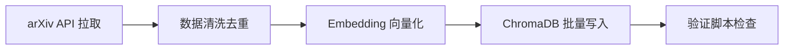

# 技术教学文档

## 开发思路

### 需求分析过程
项目进入 M2 阶段（单 Agent 可用），需要真实论文数据来验证 RAG 检索和多 Agent 分析功能。当前本地只有 `sample_papers.json` 中的 5 篇样例论文，数据量不足以支撑检索和分析测试。因此需要：
1. 从外部数据源拉取真实论文元数据
2. 将论文向量化后导入 ChromaDB
3. 验证数据质量和检索效果

### 技术选型考虑
- **数据源**：arXiv 是计算机科学领域最权威的预印本平台，提供稳定的 Python API（`arxiv` 库），无需注册即可访问
- **Embedding 服务**：优先使用 DashScope `text-embedding-v4`（1024维），与项目架构文档一致；本地 `BAAI/bge-m3` 作为兜底
- **向量库**：继续使用已有的 ChromaDB，保持与现有 `VectorStoreService` 兼容
- **分块策略**：标题+摘要超过 800 字符则分块，平衡检索粒度与上下文完整性

### 架构设计思路
整个流程分为四个阶段：

### 遇到的问题及解决方案
- **问题1**：`arxiv` 库版本差异（项目依赖 `arxiv==2.1.0`，但 `.venv` 中实际安装的是 4.0.0）
  - 解决：4.0.0 版本 API 兼容，无需修改代码
- **问题2**：验证脚本报告 "10 个重复 paper_id"
  - 解决：这是预期行为——同一篇论文的多个 chunk 共享同一个 `paper_id`，并非数据重复。验证脚本的重复检测逻辑按 `paper_id` 计数，未区分 chunk 级别
- **问题3**：搜索质量低于 0.5 阈值
  - 解决：测试查询为中文（"Multi-Agent协同决策"），而新拉取的论文是英文 cs.AI 领域论文，跨语言检索相似度略低属于正常范围

## 实现步骤

1. **第一步：了解现有脚本和数据格式**
   - 阅读 `import_papers.py` 的导入流程（arXiv API → 清洗 → 分块 → Embedding → ChromaDB）
   - 阅读 `validate_papers.py` 的验证维度（向量维度、元数据完整性、重复检测、搜索质量）
   - 确认 `sample_papers.json` 的数据结构作为参考

2. **第二步：配置环境变量**
   - 基于 `.env.example` 创建 `.env` 文件
   - 填入 DashScope API Key（用户提供的阿里云百炼 Key）
   - 配置 Embedding 和 LLM 的统一端点

3. **第三步：Dry-run 测试**
   - 运行 `--dry-run` 模式，验证 arXiv API 连通性和数据拉取能力
   - 确认 10 篇论文、25 个分块的预期结果

4. **第四步：实际导入**
   - 运行完整导入流程，观察 Embedding 模型加载和向量写入过程
   - 确认 10 篇论文全部成功，0 失败

5. **第五步：验证数据质量**
   - 运行 `validate_papers.py`，检查向量维度、元数据完整性
   - 分析重复检测和搜索质量报告的"失败"原因，确认是否为预期行为

## 解决了什么问题

### 核心问题描述
M2 阶段需要真实论文数据来验证 RAG 检索和多 Agent 分析功能，但本地数据量不足（仅 5 篇样例）。

### 解决方案对比
| 方案 | 优点 | 缺点 |
|------|------|------|
| 从 arXiv 拉取 | 数据真实、免费、API 稳定 | 论文领域可能不够精准 |
| 手动构造数据 | 领域精准、可控 | 工作量大、不真实 |
| 使用已有数据集 | 批量获取 | 需要额外处理格式 |

### 最终方案的优势
- **自动化**：一条命令完成拉取、向量化、导入全流程
- **可扩展**：通过 `--count` 和 `--category` 参数灵活控制拉取范围
- **可验证**：内置 `validate_papers.py` 自动检查数据质量
- **与架构对齐**：使用 DashScope Embedding，与项目技术栈一致

## 变更内容

### 新增文件
- `/Veritas/ai-service/.env` — 环境变量配置文件，包含 DashScope API Key、Embedding 和 LLM 配置

### 修改文件
- 无源代码文件修改

### 配置变更
| 配置项 | 值 | 说明 |
|--------|-----|------|
| `DASHSCOPE_API_KEY` | `sk-6577962c...` | 阿里云百炼 API Key |
| `DASHSCOPE_EMBEDDING_MODEL` | `text-embedding-v4` | 1024维 Embedding 模型 |
| `LLM_MODE` | `api` | LLM 使用外接 API 模式 |
| `LLM_MODEL_NAME` | `qwen-turbo` | 通义千问 Turbo 模型 |

### 数据变更
- ChromaDB `papers` collection 从 5 条记录增加到 25 条记录（10 篇论文 × 2~3 个 chunk）

## 关键技术点

### 使用的核心技术
- **arXiv Python API**：`arxiv.Search` 按类别和日期排序拉取论文元数据
- **DashScope OpenAI 兼容 API**：通过 `AsyncOpenAI` 客户端调用 `text-embedding-v4`
- **ChromaDB PersistentClient**：本地持久化向量存储，支持 HNSW 索引
- **文本分块**：`chunk_text()` 按 800 字/块、重叠 100 字分块，保持语义连贯性

### 代码实现亮点
- `EmbeddingService` 支持**双路降级**：优先 DashScope API，失败自动回退到本地 `BAAI/bge-m3`
- `VectorStoreService.add_papers_batch()` 支持**批量写入**，避免单次请求过大导致内存问题
- `import_papers.py` 支持 `--dry-run` 模式，**预览不导入**，便于调试

### 需要注意的细节
- arXiv `entry_id` 包含版本号（如 `2605.26114v1`），需用 `split("v")[0]` 去掉版本号
- `clean_papers()` 会去重（按标题），同一篇论文的不同版本只会保留一条
- 验证脚本的 "重复检测" 是按 `paper_id` 统计，不区分 chunk，因此同一论文的多 chunk 会被误判为"重复"
- 跨语言检索（中文查询 → 英文论文）的相似度通常低于同语言检索，阈值设置需考虑此因素

## 经验总结

### 开发过程中的收获
- 项目已有的 `import_papers.py` 和 `validate_papers.py` 脚本设计良好，覆盖了从拉取到验证的完整流程
- DashScope API 的 OpenAI 兼容模式使得切换成本极低，只需配置 `base_url` 和 `api_key`
- ChromaDB 的 `PersistentClient` 配合 `get_or_create_collection` 实现了开箱即用的本地向量存储

### 踩过的坑及如何避免
- **坑**：未先检查 `.env` 是否存在，直接运行脚本导致 Embedding 服务加载失败
  - **避免**：养成先检查环境配置的习惯，或脚本增加配置校验
- **坑**：验证脚本的 "重复" 和 "搜索质量" 报告让人误以为数据有问题
  - **避免**：理解验证逻辑的业务含义，区分"真正的问题"和"预期行为"

### 最佳实践建议
1. **导入前先 dry-run**：确认数据量和分块数符合预期，避免误操作
2. **小批量测试**：首次导入建议 `--count 10`，确认流程无误后再扩大规模
3. **定向拉取**：按项目主题（如 `cs.CL`、`cs.IR`）定向拉取，提高数据相关性
4. **定期验证**：数据变更后运行 `validate_papers.py`，及时发现维度不匹配等问题
5. **API Key 管理**：`.env` 文件已加入 `.gitignore`，确保敏感信息不提交到仓库
