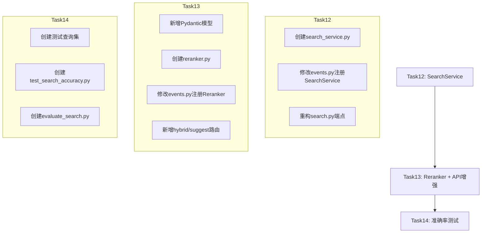

# Task12-14 实施计划：SearchService语义检索 + Reranker重排序 + 检索准确率测试

## 概述

依次实现三个任务，构建完整的RAG检索管道：
- **Task12**: SearchService语义检索服务（核心服务层抽象）
- **Task13**: Reranker规则重排序 + 检索API增强
- **Task14**: 检索准确率测试套件 + 参数调优框架

---

## Task12：SearchService语义检索服务

### 目标
封装语义检索全流程（查询向量化 → ChromaDB检索 → 结果格式化），为后续混合检索和重排序预留扩展点。

### 文件变更清单

| 操作 | 文件 | 说明 |
|------|------|------|
| **创建** | `app/services/search_service.py` | SearchService类 |
| **修改** | `app/core/events.py` | AppState注册SearchService |
| **修改** | `app/api/endpoints/search.py` | 重构为调用SearchService |

### 实施步骤

#### Step 1: 创建 `app/services/search_service.py`

```python
class SearchService:
    """检索服务 — 协调语义检索、关键词检索和RRF融合"""

    RRF_K = 60  # ADR-005规定值

    def __init__(self, vector_store_service, embedding_service, reranker=None):
        self.vector_store_service = vector_store_service
        self.embedding_service = embedding_service
        self.reranker = reranker

    async def search(self, query, top_k=10, filters=None) -> List[dict]:
        """语义检索全流程"""
        # 1. embedding_service.encode(query) → 查询向量
        # 2. vector_store_service.search(embedding, top_k, filters) → 原始结果
        # 3. 若reranker存在 → reranker.rerank(query, results)
        # 4. 返回格式化结果
        # 异常处理：try-except包裹，失败返回空列表+WARNING日志

    async def keyword_search(self, query, top_k=10, filters=None) -> List[dict]:
        """关键词检索 — ChromaDB where_document过滤"""
        # 1. 拆分查询为关键词列表
        # 2. 使用ChromaDB的where_document $contains过滤
        # 3. 合并去重结果
        # 返回格式与search()一致

    def _reciprocal_rank_fusion(self, list1, list2, k=60) -> List[dict]:
        """RRF融合算法 — RRF_score(d) = Σ 1/(k + rank_i(d))"""
        # 以paper_id为唯一标识去重合并
        # 按融合分数降序排列

    async def hybrid_search(self, query, top_k=10, filters=None) -> List[dict]:
        """混合检索 — 并行语义+关键词+RRF融合"""
        # 1. asyncio.gather并行执行search和keyword_search
        # 2. 各取top_k*2候选
        # 3. _reciprocal_rank_fusion融合
        # 4. 若reranker存在 → reranker.rerank(query, results)
        # 5. 截取top_k返回
```

**关键设计决策**：
- `keyword_search` 需要直接访问 ChromaDB collection，通过 `vector_store_service` 暴露 collection 引用或新增方法
- RRF融合以 `paper_id` 为去重标识（VectorStoreService.search返回的key是`paperId`，需统一）
- reranker扩展点：构造函数可选参数，search/hybrid_search返回前检查

#### Step 2: 修改 `app/core/events.py`

- AppState新增 `search_service = None` 属性
- on_startup中在embedding_service和vector_store_service初始化后创建SearchService实例
- on_shutdown无需特殊处理（SearchService无资源需释放）
- /health端点需新增search_service状态

#### Step 3: 重构 `app/api/endpoints/search.py`

- 从直接调用EmbeddingService+VectorStoreService改为调用`app_state.search_service.search()`
- 保持现有API契约不变（POST /api/search，请求/响应格式不变）
- 添加服务就绪检查：若search_service为None则返回503
- 日志：检索请求(query/top_k/filters)、检索结果数量、检索耗时(ms)

### 关键注意事项
- VectorStoreService.search()返回的key是`paperId`（camelCase），SearchService内部统一使用`paper_id`（snake_case），最终通过Pydantic alias转camelCase
- keyword_search需要ChromaDB collection的where_document能力，需在VectorStoreService中新增方法或暴露collection
- 日志禁止输出完整1024维向量，禁止输出完整abstract（仅前100字符）
- 检索异常时返回空结果列表+WARNING日志，不抛出异常

---

## Task13：检索API增强和规则重排序器

### 目标
1. 新建Reranker规则重排序器
2. 新增混合检索路由和检索建议路由
3. 新增Pydantic模型

### 文件变更清单

| 操作 | 文件 | 说明 |
|------|------|------|
| **创建** | `app/services/reranker.py` | Reranker类 |
| **修改** | `app/api/endpoints/search.py` | 新增hybrid和suggest路由 |
| **修改** | `app/models/schemas.py` | 新增HybridSearchRequest等模型 |
| **修改** | `app/core/events.py` | 注册Reranker并注入SearchService |

### 实施步骤

#### Step 1: 新增Pydantic模型 `app/models/schemas.py`

```python
class HybridSearchRequest(BaseModel):
    query: str = Field(..., min_length=1, max_length=500)
    top_k: int = Field(default=10, ge=1, le=50, alias="topK")
    filters: Optional[Dict[str, Any]] = None
    user_profile: Optional[UserProfile] = Field(default=None, alias="userProfile")

class SearchSuggestRequest(BaseModel):
    query: str = Field(..., min_length=1, max_length=100)

class SearchSuggestResponse(BaseModel):
    suggestions: List[str] = Field(default_factory=list)
    total: int = Field(default=0, ge=0)
```

#### Step 2: 创建 `app/services/reranker.py`

```python
class Reranker:
    """规则重排序器 — 多维度评分+个性化排序"""

    WEIGHT_RRF = 0.5       # score_rrf权重
    WEIGHT_FIELD = 0.3     # field_score权重
    WEIGHT_POPULARITY = 0.2  # popularity_score权重
    YEAR_DECAY_RATE = 0.05   # 年份衰减率
    RECENT_YEAR_THRESHOLD = 3  # 近3年不衰减

    async def rerank(self, query, results, user_profile=None) -> List[dict]:
        """重排序流程"""
        # 1. 对每个结果计算多维度分数
        # 2. 标题匹配加分：查询关键词出现在标题中+0.1
        # 3. 关键词密度加分：查询关键词在abstract中出现次数/abstract长度 × 0.05
        # 4. 引用数加分：min(citation/100, 1) × 0.1
        # 5. 年份衰减：exp(-0.05 × delta_year)，近3年不衰减
        # 6. 综合分数 = score_rrf×0.5 + field_score×0.3 + popularity_score×0.2
        # 7. 个性化：user_profile.research_field匹配venue/keywords时+0.05
        # 8. 按综合分数降序排列
        # 异常处理：try-except，失败返回原始结果+WARNING日志
```

**关键设计决策**：
- 权重作为类常量（非硬编码），便于后续调优
- citation_count需要从VectorStoreService的metadata中获取，当前VectorStoreService.search()未返回citation_count，需扩展
- 年份衰减使用当前年份计算（datetime.now().year）
- 个性化加分需检查user_profile.research_field与venue/keywords的匹配

#### Step 3: 修改 `app/core/events.py`

- AppState新增 `reranker = None` 属性
- on_startup中创建Reranker实例并注入SearchService
- /health端点新增reranker状态

#### Step 4: 修改 `app/api/endpoints/search.py`

新增两个路由：
1. `POST /hybrid` — 混合检索+重排序
2. `GET /suggest` — 检索建议（基于查询前缀的论文标题匹配）

保持现有 `POST /` 路由不变（FA-004约束）。

### 关键注意事项
- VectorStoreService.search()当前返回格式不包含citation_count，需在search结果中补充或扩展VectorStoreService
- suggest路由需要从ChromaDB检索标题包含query的论文，需新增VectorStoreService方法
- Reranker异常时返回原始未排序结果+WARNING日志，不阻断检索流程
- 不修改已有POST /api/search路由的请求/响应格式

---

## Task14：检索准确率测试套件和参数调优框架

### 目标
1. 检索准确率测试（MRR/NDCG/Precision/Recall指标）
2. RRF融合效果测试
3. 重排序效果对比测试
4. 评估脚本和参数网格搜索

### 文件变更清单

| 操作 | 文件 | 说明 |
|------|------|------|
| **创建** | `tests/test_search_accuracy.py` | 检索准确率测试套件 |
| **创建** | `scripts/evaluate_search.py` | 评估脚本 |
| **创建** | `tests/test_data/search_queries.json` | 测试查询集 |

### 实施步骤

#### Step 1: 创建测试查询集 `tests/test_data/search_queries.json`

至少20条查询，每条标注3-5篇相关论文paper_id：
- 单关键词查询（如"Transformer"）
- 短语查询（如"注意力机制"）
- 学术查询（如"Multi-Agent协同决策"）
- 跨领域查询（如"强化学习在NLP中的应用"）

相关论文从sample_papers.json中选取。

#### Step 2: 创建 `tests/test_search_accuracy.py`

```python
# 指标计算工具函数
def calc_mrr(results, relevant_ids) -> float
def calc_ndcg_at_k(results, relevant_ids, k=10) -> float
def calc_precision_at_k(results, relevant_ids, k=10) -> float
def calc_recall_at_k(results, relevant_ids, k=10) -> float

# 测试类
class TestMetricsCalculation:
    test_mrr_calculation
    test_ndcg_calculation
    test_precision_recall_calculation

class TestSemanticSearchAccuracy:
    test_semantic_search_accuracy  # mock环境下验证指标

class TestRRFFusionImprovement:
    test_rrf_fusion_improvement  # 融合≥单路

class TestRerankerImprovement:
    test_reranker_improvement  # 重排序后NDCG≥重排序前

class TestSearchPerformance:
    test_search_performance  # 响应时间阈值验证
```

#### Step 3: 创建 `scripts/evaluate_search.py`

```python
# argparse参数
--top-k: 候选值(5/10/20)
--rrf-k: 值(30/60/120)
--reranker-weights: 权重组合
--output: 输出路径

# 流程
1. 加载测试查询集
2. 对每条查询执行search/hybrid_search+rerank
3. 计算MRR/NDCG/Precision/Recall
4. 支持参数网格搜索
5. 输出评估报告JSON
```

### 关键注意事项
- 测试代码使用mock，不依赖真实LLM/Embedding API调用
- 评估脚本只读不写，不修改业务代码或数据库
- 测试中不使用print，使用pytest caplog或logger
- 不修改SearchService或Reranker的实现代码

---

## 依赖关系与执行顺序



---

## VectorStoreService需要的扩展

当前VectorStoreService.search()返回格式不包含`citation_count`，Reranker需要此字段。需要在Task12中扩展：

1. **VectorStoreService.search()** — 在返回结果中补充`citation_count`字段（从metadata中获取）
2. **VectorStoreService新增方法** — `search_by_keywords(query_text, top_k, filters)` 支持where_document过滤
3. **VectorStoreService新增方法** — `suggest_titles(query, top_k=5)` 支持标题前缀匹配

---

## 验证命令

```bash
# Task12验证
cd Veritas/ai-service && python -c "from app.services.search_service import SearchService; print('Import OK')"
cd Veritas/ai-service && python -m pytest tests/test_search_service.py -v

# Task13验证
cd Veritas/ai-service && python -c "from app.services.reranker import Reranker; print('Import OK')"
cd Veritas/ai-service && python -m pytest tests/test_reranker.py tests/test_search_endpoint.py -v

# Task14验证
cd Veritas/ai-service && python -m pytest tests/test_search_accuracy.py -v
cd Veritas/ai-service && python scripts/evaluate_search.py --help
```

---

## 风险与注意事项

1. **VectorStoreService扩展** — keyword_search和suggest需要ChromaDB的where_document能力，需在VectorStoreService中新增方法
2. **citation_count缺失** — 当前ChromaDB metadata中可能没有citation_count数据，Reranker需处理缺失情况（默认0）
3. **paperId vs paper_id** — VectorStoreService.search()返回`paperId`（camelCase），SearchService内部需统一为`paper_id`（snake_case）
4. **测试隔离** — Task14测试必须使用mock，不依赖真实API
5. **日志规范** — 禁止输出完整向量、完整abstract、API Key
