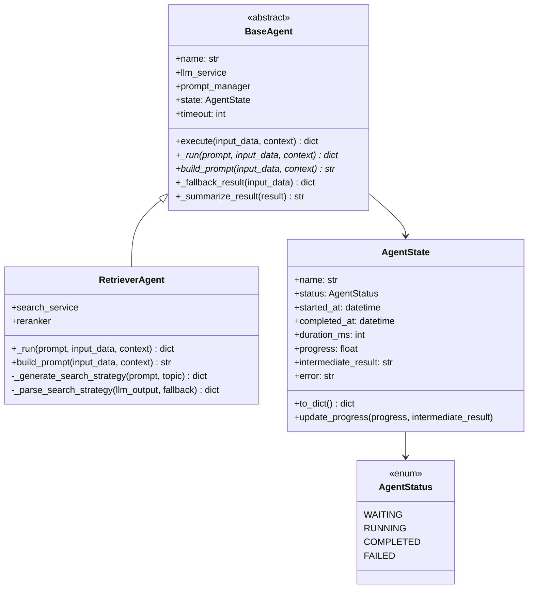

# 技术教学文档 — BaseAgent基类与RetrieverAgent

## 开发思路

### 需求分析过程

本次开发对应 AM2 里程碑的两个任务：
- **Task15**：实现Agent基类BaseAgent、AgentStatus枚举、AgentState数据类
- **Task16**：实现RetrieverAgent和tools.py工具模块

核心需求来自架构文档 Section 5.3 Agent基类设计：
1. 所有6个Agent需要统一的状态管理（WAITING→RUNNING→COMPLETED/FAILED）
2. 需要超时控制（单Agent 30s，全流程120s，ADR-002）
3. 需要降级机制（Agent失败不阻塞后续流程，ADR-003）
4. 需要SSE推送支持（AgentState所有字段需JSON序列化友好）
5. 需要进度追踪（progress + intermediate_result）

### 技术选型考虑

| 选型点 | 选择 | 备选 | 理由 |
|--------|------|------|------|
| AgentState类型 | @dataclass | TypedDict | prompt.json明确要求dataclass，可添加to_dict()方法 |
| AgentStatus | str+Enum | IntEnum | str+Enum确保JSON序列化输出字符串值，SSE推送格式一致 |
| 超时控制 | asyncio.wait_for | 手动信号量 | wait_for是Python原生异步超时方案，简洁可靠 |
| 工具封装 | 函数式+TOOL_REGISTRY | 类方法 | 函数式更灵活，Agent可动态调用不同工具 |
| 降级策略 | 内部消化+返回fallback | 向上层抛异常 | ADR-003规定Agent失败不阻塞后续Agent |

### 架构设计思路

采用**模板方法模式**设计BaseAgent：
- `execute()` 是模板方法，定义了固定的执行骨架（状态管理→构建Prompt→超时控制→核心逻辑→降级处理）
- `_run()` 和 `build_prompt()` 是抽象方法，由子类实现具体逻辑
- `_fallback_result()` 和 `_summarize_result()` 是钩子方法，提供默认实现



### 遇到的问题及解决方案

1. **asyncio.wait_for超时后任务取消问题**：wait_for在超时后会自动取消底层任务，这是正确行为——确保Agent不会在超时后继续消耗资源
2. **AgentState.to_dict()序列化兼容**：datetime必须转ISO格式字符串，AgentStatus必须转.value字符串值，否则json.dumps()报错
3. **LLM输出JSON解析的鲁棒性**：LLM可能返回```json代码块包裹的JSON，_parse_search_strategy需要处理多种格式

## 实现步骤

1. **第一步：创建agents/base.py**
   - 实现AgentStatus(str, Enum) — 4个状态值，继承str确保JSON序列化友好
   - 实现AgentState(@dataclass) — 8个字段 + to_dict() + update_progress()
   - 实现BaseAgent(ABC) — __init__ + execute + _run(abstract) + build_prompt(abstract) + _fallback_result + _summarize_result

2. **第二步：修改agents/__init__.py**
   - 导出AgentStatus、AgentState、BaseAgent

3. **第三步：编写test_base_agent.py**
   - 8个测试类：枚举测试、状态测试、实例化测试、成功执行测试、超时测试、异常测试、降级测试、摘要截断测试
   - 创建ConcreteAgent/SlowAgent/FailingAgent三个测试子类

4. **第四步：验证Task15**
   - 运行pytest：24个测试全部通过
   - 验证import：from app.agents.base import ... 和 from app.agents import ... 均OK

5. **第五步：创建agents/tools.py**
   - 实现4个异步工具函数：vector_search_tool、keyword_search_tool、hybrid_search_tool、rerank_tool
   - 每个工具函数捕获异常，返回空结果或原始结果
   - 定义TOOL_REGISTRY字典映射

6. **第六步：创建agents/retriever.py**
   - RetrieverAgent继承BaseAgent，注入search_service和reranker
   - build_prompt使用PromptManager渲染retriever.txt模板
   - _run实现LLM策略→hybrid_search→可选rerank流程
   - _parse_search_strategy解析LLM JSON输出，支持```json代码块格式

7. **第七步：编写test_retriever_agent.py**
   - 12个测试类覆盖Prompt渲染、正常流程、reranker流程、LLM降级、检索失败、JSON解析、4个工具函数、TOOL_REGISTRY

8. **第八步：验证Task16**
   - 运行pytest：26个测试全部通过
   - 验证import和TOOL_REGISTRY

## 解决了什么问题

### 核心问题描述

6-Agent协同引擎需要解决三个关键问题：
1. **统一状态管理**：6个Agent需要统一的状态枚举和状态数据类，支持SSE实时推送
2. **超时与降级**：单Agent超时30s后必须降级，不能阻塞整个工作流
3. **检索Agent实现**：第一个具体Agent需要实现完整的检索流程，包括LLM策略生成和混合检索

### 解决方案对比

| 方案 | 优点 | 缺点 | 最终选择 |
|------|------|------|---------|
| BaseAgent用ABC抽象基类 | 强制子类实现关键方法，编译期检查 | 增加少量代码复杂度 | ✅ 是 |
| BaseAgent用普通继承+鸭子类型 | 灵活 | 无编译期保障，容易遗漏方法 | ❌ 否 |
| AgentState用TypedDict | 类型提示友好 | 无法添加方法，SSE序列化需额外处理 | ❌ 否 |
| AgentState用@dataclass | 可添加to_dict()方法，字段默认值 | 需手动实现序列化 | ✅ 是 |
| 工具函数式封装 | 灵活、可动态调用 | 无状态管理 | ✅ 是 |
| 工具类方法封装 | 面向对象 | 与Agent耦合，不易复用 | ❌ 否 |

### 最终方案的优势

1. **编译期保障**：ABC + @abstractmethod确保子类必须实现_run和build_prompt
2. **序列化友好**：AgentStatus(str, Enum) + AgentState.to_dict()确保SSE推送零障碍
3. **降级安全**：execute()内部捕获所有异常，绝不向上层抛出
4. **双重降级**：RetrieverAgent在LLM失败时仍可通过直接检索提供结果

## 变更内容

### 新增文件
- `app/agents/base.py` — AgentStatus枚举(4值)、AgentState数据类(8字段+2方法)、BaseAgent抽象基类(6方法)
- `app/agents/retriever.py` — RetrieverAgent(4公开方法+2私有方法)
- `app/agents/tools.py` — 4个异步工具函数 + TOOL_REGISTRY注册表
- `tests/test_base_agent.py` — 8个测试类24个用例
- `tests/test_retriever_agent.py` — 12个测试类26个用例

### 修改文件
- `app/agents/__init__.py` — 从空文件改为导出5个公共符号

### 配置变更
- 无（使用已有settings.AGENT_TIMEOUT=30）

## 关键技术点

### 1. str+Enum实现JSON友好枚举

```python
class AgentStatus(str, Enum):
    WAITING = "waiting"
    RUNNING = "running"

# 效果：json.dumps(AgentStatus.RUNNING) → '"running"'
# 而非 IntEnum 的 json.dumps(AgentStatus.RUNNING) → '1'
```

### 2. asyncio.wait_for实现超时控制

```python
result = await asyncio.wait_for(
    self._run(prompt, input_data, context),
    timeout=self.timeout,  # 30s
)
# 超时自动抛出asyncio.TimeoutError，任务被取消
```

### 3. 模板方法模式实现统一执行流程

execute()定义骨架，子类只需关注_run()和build_prompt()，无需关心状态管理、超时控制、降级处理等横切关注点。

### 4. LLM输出JSON解析的鲁棒性处理

```python
# 处理LLM可能返回的三种格式：
# 1. 纯JSON: '{"core_keywords": [...]}'
# 2. ```json代码块: '```json\n{...}\n```'
# 3. 普通代码块: '```\n{...}\n```'
if "```json" in llm_output:
    json_str = llm_output.split("```json")[1].split("```")[0].strip()
elif "```" in llm_output:
    json_str = llm_output.split("```")[1].split("```")[0].strip()
```

### 5. 工具函数异常隔离

每个工具函数都捕获异常并返回安全默认值（空列表或原始结果），确保工具失败不会影响Agent整体执行。

## 经验总结

### 开发过程中的收获

1. **ABC抽象基类的威力**：通过@abstractmethod在编译期强制子类实现关键方法，避免了运行时才发现遗漏的问题
2. **dataclass + to_dict()模式**：比直接用dict更安全（有类型检查和默认值），比Pydantic model更轻量（不需要验证开销）
3. **异步测试的坑**：pytest需要`@pytest.mark.asyncio`装饰器才能正确运行async测试函数

### 踩过的坑及如何避免

1. **AgentStatus序列化问题**：如果用IntEnum，json.dumps()输出整数而非字符串，SSE推送格式不一致 → 使用str+Enum
2. **datetime序列化问题**：json.dumps(datetime对象)直接报TypeError → to_dict()中手动转ISO格式字符串
3. **asyncio.wait_for超时后的异常类型**：超时抛出asyncio.TimeoutError，不是自定义的AgentTimeoutException → 在execute()中分别捕获TimeoutError和通用Exception

### 最佳实践建议

1. **先写基类再写子类**：BaseAgent的execute()流程确定后，子类实现非常简单
2. **测试先行**：先写测试子类（ConcreteAgent/SlowAgent/FailingAgent），再写正式代码
3. **降级优先**：每个可能失败的点都要有降级方案，确保Agent不会崩溃
4. **日志分级**：启动用WARNING（不频繁）、完成用INFO、超时用WARNING、异常用ERROR
