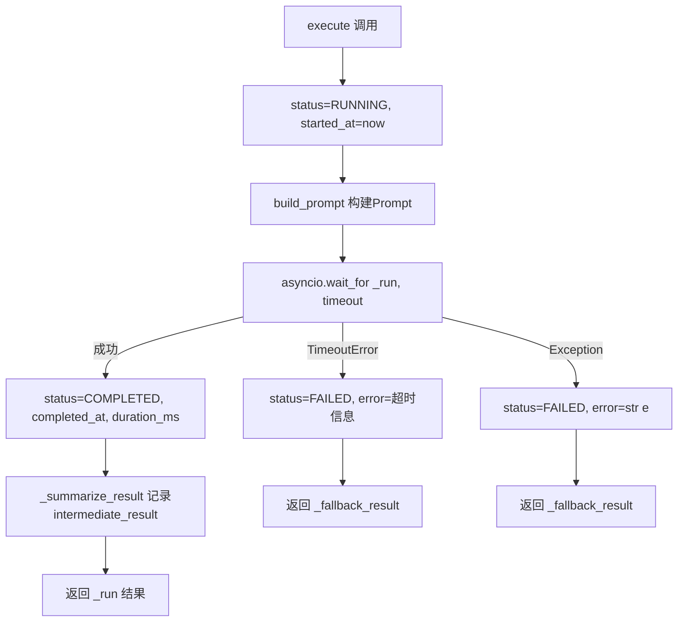
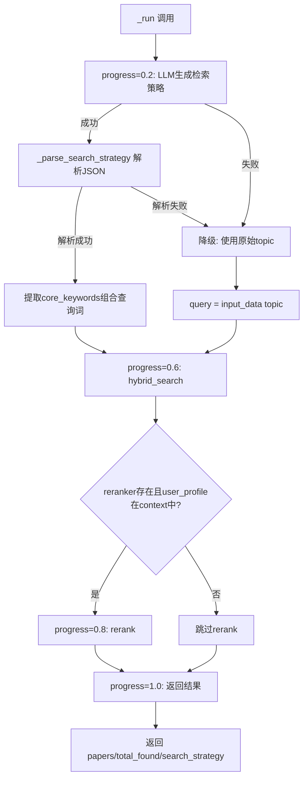

# Task15 + Task16 实施计划：BaseAgent基类 + RetrieverAgent与工具定义

## 概述

本计划覆盖两个连续任务的实施：
- **Task15**: 实现 Agent 基类 `BaseAgent`、状态枚举 `AgentStatus`、运行状态数据类 `AgentState`，产出 `agents/base.py`
- **Task16**: 实现检索Agent `RetrieverAgent` 和工具定义模块 `tools.py`，产出 `agents/retriever.py` + `agents/tools.py`

两个任务存在强依赖关系：Task16 的 `RetrieverAgent` 必须继承 Task15 的 `BaseAgent`，因此按顺序执行。

---

## 现有代码分析

### 已有模块（直接复用，不修改）

| 模块 | 关键接口 | 用途 |
|------|---------|------|
| `app/exception.py` | `AgentTimeoutException(code=408)` | BaseAgent超时异常 |
| `app/core/config.py` | `settings.AGENT_TIMEOUT=30`, `AGENT_FULL_TIMEOUT=120`, `AGENT_MAX_REGENERATE=1` | Agent配置 |
| `app/services/llm_service.py` | `LLMService.generate(prompt, max_tokens, temperature) -> str` | LLM推理 |
| `app/services/prompt_manager.py` | `PromptManager.get_prompt(agent_name, **kwargs) -> str` | Prompt渲染 |
| `app/services/search_service.py` | `SearchService.search()`, `keyword_search()`, `hybrid_search()` | 检索服务 |
| `app/services/reranker.py` | `Reranker.rerank(query, results, user_profile=None)` | 重排序 |
| `app/core/events.py` | `AppState` (llm_service, prompt_manager, search_service, reranker) | 全局服务实例 |
| `prompts/retriever.txt` | `$topic`, `$top_k` 变量模板 | 检索Prompt |

### 待修改文件

| 文件 | 操作 | 说明 |
|------|------|------|
| `app/agents/base.py` | **创建** | AgentStatus + AgentState + BaseAgent |
| `app/agents/retriever.py` | **创建** | RetrieverAgent |
| `app/agents/tools.py` | **创建** | 检索工具函数 + TOOL_REGISTRY |
| `app/agents/__init__.py` | **修改** | 导出所有公共类 |
| `tests/test_base_agent.py` | **创建** | BaseAgent单元测试 |
| `tests/test_retriever_agent.py` | **创建** | RetrieverAgent + tools单元测试 |

---

## Task15 详细设计：agents/base.py

### 1. AgentStatus 枚举

```python
class AgentStatus(str, Enum):
    WAITING = "waiting"
    RUNNING = "running"
    COMPLETED = "completed"
    FAILED = "failed"
```

- 继承 `str + Enum`，确保 `json.dumps(AgentStatus.RUNNING)` 输出 `"running"`
- 枚举值使用 `lower_case`（符合项目规范）

### 2. AgentState 数据类

```python
@dataclass
class AgentState:
    name: str
    status: AgentStatus = AgentStatus.WAITING
    started_at: Optional[datetime] = None
    completed_at: Optional[datetime] = None
    duration_ms: Optional[int] = None
    progress: float = 0.0
    intermediate_result: Optional[str] = None
    error: Optional[str] = None
```

关键方法：
- `to_dict() -> dict`：datetime转ISO字符串，AgentStatus转字符串值
- `update_progress(progress: float, intermediate_result: str = None)`：更新进度

### 3. BaseAgent 抽象基类

```python
class BaseAgent(ABC):
    def __init__(self, name: str, llm_service, prompt_manager, timeout: int = 30):
        self.name = name
        self.llm_service = llm_service
        self.prompt_manager = prompt_manager
        self.state = AgentState(name=name)
        self.timeout = timeout  # 默认从 settings.AGENT_TIMEOUT 读取
```

关键方法：
- `execute(input_data, context) -> dict`：统一执行入口（状态管理→构建Prompt→超时控制→核心逻辑→降级处理）
- `_run(prompt, input_data, context) -> dict`：@abstractmethod，子类实现
- `build_prompt(input_data, context) -> str`：@abstractmethod，子类实现
- `_fallback_result(input_data) -> dict`：返回 `{"degraded": True, "agent": self.name, "error": self.state.error}`
- `_summarize_result(result) -> str`：截断200字符

### execute() 流程



### 日志规范

| 事件 | 级别 | 格式 |
|------|------|------|
| Agent启动 | WARNING | `Agent {name} started` |
| Agent完成 | INFO | `Agent {name} completed, duration={ms}ms` |
| Agent超时 | WARNING | `Agent {name} timed out after {timeout}s` |
| Agent异常 | ERROR | `Agent {name} failed: {error}` |

---

## Task16 详细设计：agents/retriever.py + agents/tools.py

### 1. agents/tools.py — Agent工具定义

4个工具函数 + 1个注册表：

| 工具函数 | 封装服务 | 签名 | 异常处理 |
|---------|---------|------|---------|
| `vector_search_tool` | `SearchService.search()` | `(search_service, query, top_k=20, filters=None) -> list` | 异常返回 `[]` |
| `keyword_search_tool` | `SearchService.keyword_search()` | `(search_service, query, top_k=20, filters=None) -> list` | 异常返回 `[]` |
| `hybrid_search_tool` | `SearchService.hybrid_search()` | `(search_service, query, top_k=10, filters=None) -> list` | 异常返回 `[]` |
| `rerank_tool` | `Reranker.rerank()` | `(reranker, query, results, user_profile=None) -> list` | 异常返回原始results |

```python
TOOL_REGISTRY: dict[str, Callable] = {
    "vector_search": vector_search_tool,
    "keyword_search": keyword_search_tool,
    "hybrid_search": hybrid_search_tool,
    "rerank": rerank_tool,
}
```

### 2. agents/retriever.py — RetrieverAgent

```python
class RetrieverAgent(BaseAgent):
    def __init__(self, llm_service, prompt_manager, search_service, reranker=None, timeout=30):
        super().__init__(name="retriever", llm_service=llm_service,
                         prompt_manager=prompt_manager, timeout=timeout)
        self.search_service = search_service
        self.reranker = reranker
```

#### build_prompt 实现

```python
def build_prompt(self, input_data: dict, context: dict) -> str:
    return self.prompt_manager.get_prompt(
        'retriever',
        topic=input_data.get('topic', ''),
        top_k=str(input_data.get('top_k', 10))
    )
```

#### _run 执行流程



#### _parse_search_strategy 实现

- 尝试 `json.loads(llm_output)` 提取 `core_keywords`、`filters`
- JSON解析失败时降级为 `{"query": 原始topic, "filters": {}}`
- 组合 `core_keywords` 为空格分隔的查询字符串

#### 降级策略

| 失败场景 | 降级行为 |
|---------|---------|
| LLM生成策略失败 | 直接使用 `input_data['topic']` 调用 `hybrid_search` |
| hybrid_search失败 | 返回空papers列表 |
| Reranker失败 | 返回未重排序结果 |
| Agent整体超时30s | BaseAgent.execute() 返回 `_fallback_result` |

---

## 实施步骤

### Step 1: 创建 agents/base.py（Task15）

1. 实现 `AgentStatus(str, Enum)` — 4个状态值
2. 实现 `AgentState(@dataclass)` — 8个字段 + `to_dict()` + `update_progress()`
3. 实现 `BaseAgent(ABC)` — `__init__` + `execute` + `_run`(abstract) + `build_prompt`(abstract) + `_fallback_result` + `_summarize_result`
4. 导入依赖：`abc`, `enum`, `dataclasses`, `datetime`, `asyncio`, `loguru`, `app.core.config.settings`

### Step 2: 修改 agents/__init__.py（Task15）

导出 `AgentStatus`, `AgentState`, `BaseAgent`

### Step 3: 创建 tests/test_base_agent.py（Task15）

8个测试用例：
1. `test_agent_status_enum` — 枚举值正确、JSON序列化、str()输出
2. `test_agent_state_creation_and_to_dict` — 创建、默认值、to_dict()、datetime序列化
3. `test_base_agent_cannot_instantiate` — ABC不可实例化
4. `test_base_agent_execute_success` — 正常执行：WAITING→RUNNING→COMPLETED
5. `test_base_agent_execute_timeout` — 超时：FAILED + 降级结果
6. `test_base_agent_execute_exception` — 异常：FAILED + 降级结果
7. `test_fallback_result_format` — degraded=True + agent + error
8. `test_summarize_result_truncation` — 截断200字符

### Step 4: 验证 Task15

```bash
cd Veritas/ai-service && python -m pytest tests/test_base_agent.py -v
cd Veritas/ai-service && python -c "from app.agents.base import AgentStatus, AgentState, BaseAgent; print('Import OK')"
cd Veritas/ai-service && python -c "from app.agents import AgentStatus, AgentState, BaseAgent; print('Package import OK')"
```

### Step 5: 创建 agents/tools.py（Task16）

1. 实现 `vector_search_tool` — 封装 `SearchService.search()`
2. 实现 `keyword_search_tool` — 封装 `SearchService.keyword_search()`
3. 实现 `hybrid_search_tool` — 封装 `SearchService.hybrid_search()`
4. 实现 `rerank_tool` — 封装 `Reranker.rerank()`
5. 定义 `TOOL_REGISTRY` 字典

### Step 6: 创建 agents/retriever.py（Task16）

1. 实现 `RetrieverAgent(BaseAgent)` — `__init__` 注入 search_service + reranker
2. 实现 `build_prompt` — 使用 PromptManager 渲染 retriever.txt
3. 实现 `_run` — LLM策略→hybrid_search→可选rerank→返回结果
4. 实现 `_parse_search_strategy` — 解析LLM JSON输出 + 降级

### Step 7: 修改 agents/__init__.py（Task16）

增加导出 `RetrieverAgent` 和 `TOOL_REGISTRY`

### Step 8: 创建 tests/test_retriever_agent.py（Task16）

12个测试用例：
1. `test_retriever_agent_build_prompt` — Prompt渲染
2. `test_retriever_agent_run_success` — 正常流程
3. `test_retriever_agent_run_with_reranker` — 含reranker流程
4. `test_retriever_agent_llm_failure_degradation` — LLM失败降级
5. `test_retriever_agent_search_failure` — 检索返回空
6. `test_parse_search_strategy_valid_json` — 正常JSON解析
7. `test_parse_search_strategy_invalid_json` — 非法JSON降级
8. `test_vector_search_tool` — 正常+异常
9. `test_keyword_search_tool` — 正常+异常
10. `test_hybrid_search_tool` — 正常+异常
11. `test_rerank_tool` — 正常+异常
12. `test_tool_registry` — 4个工具映射

### Step 9: 验证 Task16

```bash
cd Veritas/ai-service && python -m pytest tests/test_retriever_agent.py -v
cd Veritas/ai-service && python -c "from app.agents.retriever import RetrieverAgent; from app.agents.tools import TOOL_REGISTRY; print('Import OK, tools:', list(TOOL_REGISTRY.keys()))"
```

---

## 关键设计决策

| 决策 | 选择 | 理由 |
|------|------|------|
| AgentState用@dataclass而非TypedDict | dataclass | prompt.json明确要求@dataclass，提供to_dict()方法 |
| BaseAgent.__init__接收llm_service+prompt_manager | 依赖注入 | 符合现有AppState管理模式，便于测试Mock |
| timeout默认从settings读取 | `settings.AGENT_TIMEOUT` | ADR-002规定30s，不硬编码 |
| tools.py工具函数接收service实例 | 函数式封装 | 比类方法更灵活，便于Agent动态调用 |
| RetrieverAgent中LLM策略失败降级为直接检索 | 双重降级 | 确保即使LLM不可用，检索功能仍可用 |
| _parse_search_strategy提取core_keywords组合查询 | 空格分隔 | 语义检索对短关键词组合效果最佳 |

---

## 风险与注意事项

1. **asyncio.wait_for 超时控制**：必须确保 `_run` 中的异步操作能被正确取消
2. **AgentState.to_dict() 序列化**：datetime必须转ISO字符串，AgentStatus必须转字符串
3. **tools.py异常隔离**：所有工具函数必须捕获异常，不向上层抛出
4. **PromptManager.get_prompt 参数**：retriever.txt 使用 `$topic` 和 `$top_k`（string.Template的safe_substitute）
5. **SearchService返回格式**：`_format_results` 返回 `paper_id`（snake_case），RetrieverAgent需适配
6. **不修改已有文件**：严格遵守FA-002，仅新增/修改 agents/ 目录下的文件
