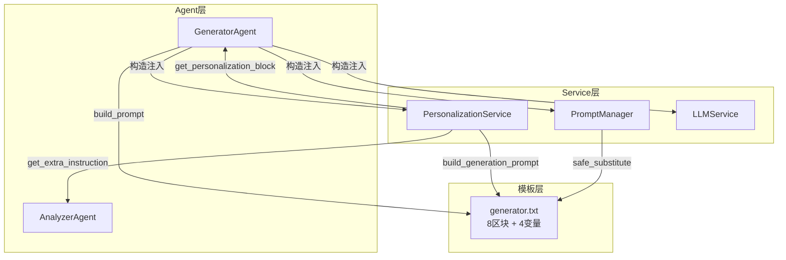

# 技术教学文档

## 开发思路

### 需求分析过程

本次开发涵盖两个紧密关联的任务：

1. **Task20 — GeneratorAgent核心逻辑**：系统需要根据 AnalyzerAgent 的5维度分析结果，自动生成结构化的文献综述。这是6-Agent工作流中的第5个Agent（Coordinator→Retriever→Analyzer→Comparer→**Generator**→Reviewer），是用户最终看到的核心输出。

2. **Task21 — Prompt个性化 + PersonalizationService**：项目四大创新点之一是"用户画像驱动的个性化生成"。需要将4维度用户画像（学历层次/知识水平/偏好风格/研究方向）映射为Prompt个性化片段，注入到Generator的Prompt模板中。同时创建PersonalizationService作为通用服务，供Analyzer/Generator等多个Agent调用。

### 技术选型考虑

| 决策点 | 选项 | 选择 | 理由 |
|--------|------|------|------|
| Prompt模板语法 | Jinja2 vs string.Template | string.Template | 与已有PromptManager保持一致，避免引入新依赖 |
| 个性化映射位置 | Agent内置 vs 独立Service | 独立PersonalizationService | 多Agent复用，关注点分离 |
| 降级策略 | 单级 vs 多级 | 三级降级 | Agent级/Service级/Method级分别处理 |
| STYLE_MAP结构 | 简单映射 vs 嵌套dict | 嵌套dict（tone/paragraph/structure） | FR-007要求每级含3个子维度 |

### 架构设计思路



**关键设计**：PersonalizationService 位于 services 层，不依赖 agents 层。Agent 通过构造函数注入 PersonalizationService，调用其公共方法获取个性化指令。

### 遇到的问题及解决方案

**问题1：education_level vs knowledge_level 枚举值混淆**

测试中用 `education_level="beginner"` 断言"通俗"，但 `EDUCATION_ADAPTATION` 只有 undergraduate/master/phd/faculty 四个键，"beginner" 是 knowledge_level 的枚举值。

解决：明确区分两个维度的枚举值——education_level（学历层次）和 knowledge_level（知识水平）是独立的4值枚举，不可混用。

**问题2：FIELD_EMPHASIS 值不含键名字面量**

`FIELD_EMPHASIS["NLP"]` 的值是"侧重自然语言处理相关方法和应用"，不含"NLP"字符串。测试 `assert "NLP" in block` 失败。

解决：断言改为 `assert "NLP" in block or "自然语言处理" in block`，同时覆盖键名和值内容。

**问题3：generator.txt 升级后新增 $user_profile_summary 变量**

升级后的模板有4个变量，但 generator.py 的 `build_prompt()` 只传3个。`string.Template.substitute()` 会因缺少变量而抛 KeyError。

解决：在 generator.py 中新增 `_build_user_profile_summary()` 方法，生成画像摘要字符串（如"硕士/NLP方向/中级知识水平/均衡风格"），并传递给 `prompt_manager.get_prompt()`。

## 实现步骤

1. **创建 GeneratorAgent**（Task20 Step1）：继承 BaseAgent，实现 `build_prompt()`、`_run()`、`_build_personalization_block()`、`_extract_citations()`、`_validate_report()`、`_calculate_term_density()`、`_generate_fallback_report()`、`_fallback_result()`、`_summarize_result()` 等方法

2. **更新 agents/__init__.py**（Task20 Step2）：导出 GeneratorAgent

3. **创建 test_generator_agent.py**（Task20 Step3）：19个测试用例，覆盖所有FR

4. **升级 prompts/generator.txt**（Task21 Step4）：从简单初稿升级为8区块结构（Role/Task/Input/Personalization/CoT/Output/Constraint/Fallback），增加 $user_profile_summary 变量

5. **创建 PersonalizationService**（Task21 Step5）：5个映射表 + 8个公共方法 + 4个内部方法

6. **更新 generator.py**（Task21 补充）：`build_prompt()` 增加 `user_profile_summary` 参数传递，新增 `_build_user_profile_summary()` 方法

7. **更新 services/__init__.py**（Task21 补充）：导出 PersonalizationService

8. **创建 test_personalization_service.py**（Task21 Step6）：14个测试用例

9. **运行 pytest 验证**：33个测试全部通过（19+14），模板渲染验证通过

## 解决了什么问题

### 核心问题

科研文献综述生成需要同时满足两个矛盾需求：
1. **结构化**：综述必须包含引言/研究现状/方法对比/研究趋势/参考文献5个章节
2. **个性化**：同一批论文，本科生和教授看到的综述内容深度、术语密度、写作风格应完全不同

### 解决方案对比

| 方案 | 优点 | 缺点 | 是否采用 |
|------|------|------|---------|
| A. 硬编码个性化逻辑在Agent中 | 简单直接 | 无法复用，Analyzer也需要个性化 | ❌ |
| B. 独立PersonalizationService | 多Agent复用，关注点分离 | 需要额外注入和降级处理 | ✅ |
| C. LLM自行判断个性化 | 无需映射表 | 不稳定，无法保证一致性 | ❌ |

### 最终方案的优势

1. **PersonalizationService 可复用**：Analyzer/Generator/未来Agent都可调用
2. **三级降级保证可用性**：Service异常→Agent内置映射→默认值，永不崩溃
3. **映射表可扩展**：新增研究方向只需在 FIELD_EMPHASIS 添加一条
4. **camelCase兼容**：Java后端传来的JSON无需转换即可使用

## 变更内容

### 新增文件

- `app/agents/generator.py` — GeneratorAgent核心实现（~620行）
  - 继承BaseAgent，实现综述生成完整流程
  - 内置5个映射表常量（TERM_DENSITY_TARGET/DIFFICULTY_MAP/STYLE_MAP/EDUCATION_ADAPTATION/FIELD_EMPHASIS）
  - 50个学术术语列表（ACADEMIC_TERMS）用于术语密度计算
  - AI声明常量（AI_DISCLAIMER）
  - 两种引用提取正则（Author-Year / 数字编号）

- `app/services/personalization_service.py` — PersonalizationService个性化引擎（~260行）
  - 5个映射表（DIFFICULTY_MAP/STYLE_MAP/EDUCATION_ADAPTATION/FIELD_EMPHASIS/TERM_DENSITY_TARGET）
  - 8个公共方法 + 4个内部方法
  - analyzer/generator双套指令映射
  - prompt_manager=None降级为文件读取

- `tests/test_generator_agent.py` — 19个GeneratorAgent测试
- `tests/test_personalization_service.py` — 14个PersonalizationService测试

### 修改文件

- `app/agents/__init__.py` — 添加 GeneratorAgent 导入和导出
- `app/services/__init__.py` — 添加 PersonalizationService 导入和导出
- `prompts/generator.txt` — 从简单初稿升级为8区块结构
  - 新增 $user_profile_summary 模板变量
  - 新增4步CoT推理链（Outline→Draft→Personalize→Self-Check）
  - 新增严格JSON Output Schema
  - 新增Constraint Block（8条约束）
  - 新增Fallback Block

### 配置变更

无配置文件变更。PersonalizationService 通过构造函数注入 PromptManager，无需额外配置。

## 关键技术点

### 1. string.Template 安全替换

```python
# PromptManager 使用 safe_substitute，未替换变量保留原样
template.safe_substitute(personalization="...", analysis_data="...")
# 而非 substitute，后者缺少变量会抛 KeyError
```

**注意**：generator.txt 的4个变量必须在 `get_prompt()` 调用时全部提供，否则未替换的 `$variable` 会残留在输出中。

### 2. 三级降级设计模式

```python
# Level 1: 优先使用 PersonalizationService
if self.personalization_service is not None:
    try:
        block = self.personalization_service.get_personalization_block(user_profile)
        if block: return block
    except Exception:
        logger.warning("Service failed, using built-in mapping")

# Level 2: 回退到 Agent 内置映射表
profile = self._normalize_profile(user_profile)
edu_adapt = EDUCATION_ADAPTATION.get(education_level, EDUCATION_ADAPTATION["master"])

# Level 3: 默认值（master/intermediate/balanced）
```

### 3. 引用提取双模式

```python
# 模式1: [Author et al., Year] → 精确匹配论文
_AUTHOR_YEAR_PATTERN = re.compile(r"\[([A-Z][a-z]+(?:\s+et\s+al\.)?,\s*\d{4})\]")

# 模式2: [N] 数字编号 → 按序号映射到 analysis_results
_NUMERIC_CITATION_PATTERN = re.compile(r"\[(\d+)\]")
```

### 4. 术语密度计算

```python
# 统计50个学术术语在报告中的出现次数 / 总词数
density = min(term_count / total_words, 1.0)
# 目标: beginner<5%, intermediate~20%, advanced~40%, expert>50%
```

### 5. camelCase/snake_case 兼容

```python
_CAMEL_TO_SNAKE_MAP = {
    "educationLevel": "education_level",
    "knowledgeLevel": "knowledge_level",
    "preferredStyle": "preferred_style",
    "researchField": "research_field",
}

def _normalize_profile(self, user_profile: dict) -> dict:
    normalized = {}
    for key, value in user_profile.items():
        if key in _CAMEL_TO_SNAKE_MAP:
            normalized[_CAMEL_TO_SNAKE_MAP[key]] = value
        else:
            normalized[key] = value
    return normalized
```

## 经验总结

### 开发过程中的收获

1. **映射表驱动设计**：将个性化逻辑从Agent代码中抽离为映射表+Service，使得新增画像维度或修改适配策略只需改映射表，无需改代码逻辑
2. **Prompt模板8区块结构**：Role/Task/Input/Personalization/CoT/Output/Constraint/Fallback 的分区结构让Prompt可维护性大幅提升，每个区块职责清晰
3. **CoT推理链的价值**：4步推理链（Outline→Draft→Personalize→Self-Check）让LLM的输出质量显著提升，尤其是Self-Check步骤能有效减少遗漏

### 踩过的坑及如何避免

1. **枚举值混淆**：education_level 和 knowledge_level 是两个独立的4值枚举，测试时容易混淆。建议在映射表旁添加注释说明枚举值域
2. **模板变量遗漏**：升级模板新增变量后，必须同步更新 `build_prompt()` 的参数传递。建议模板变量变更后立即运行 `string.Template.substitute()` 验证
3. **STYLE_MAP结构升级**：generator.py 的 STYLE_MAP 是简单映射（simple→casual），PersonalizationService 的 STYLE_MAP 是嵌套dict。两套映射并存，需注意调用方使用正确的结构

### 最佳实践建议

1. **先写测试再改代码**：修改 `build_prompt()` 增加 `user_profile_summary` 前，先确认 test_generator_agent.py 的 `test_build_prompt_renders_template` 会因缺少参数而失败，修改后再验证通过
2. **降级测试不可少**：每个降级路径都应有对应测试（PersonalizationService异常、prompt_manager=None、未知枚举值）
3. **Prompt模板变量命名规范**：变量名必须与 `prompt_manager.get_prompt()` 的 kwargs 键名完全一致，建议在模板文件顶部注释列出所有变量名
