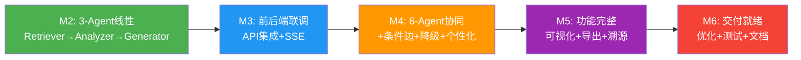

# Task 22 & 23 完成总结与下一步计划

## 已完成工作

### Task 22: LangGraph Workflow State Graph ✅

**文件**: `Veritas/ai-service/app/agents/graph.py`

- `WorkflowState` TypedDict — 18字段状态定义，对齐 AGENTS.md 3.2节
- 3-Agent线性工作流: retrieve → analyze → generate → END (M2阶段)
- `build_agent_graph(agent_instances)` — 闭包模式绑定Agent实例到节点函数
- `run_workflow(request, agent_instances)` — 120s全流程超时 + 两级降级策略
- `_serialize_agent_state()` — AgentState序列化辅助函数
- 16个单元测试全部通过

### Task 23: Agent API Endpoint ✅

**文件**: `Veritas/ai-service/app/api/endpoints/agent.py`

- `POST /api/agent/analyze` — 连接FastAPI路由到LangGraph工作流
- `_build_agent_instances()` — 从AppState构建3个Agent实例
- `_convert_agent_states()` — AgentState → AgentStateResponse 转换
- Pydantic camelCase别名 (`Field(alias="analysisId")`) + `response_model_by_alias=True`
- 10个端点测试全部通过

### 辅助变更

- `app/agents/__init__.py` — 新增导出 WorkflowState, build_agent_graph, run_workflow
- `app/models/schemas.py` — 新增 AgentStateResponse, 扩展 AnalyzeResponse
- `tests/test_graph.py` — 16个测试
- `tests/test_agent_endpoint.py` — 10个测试

### 测试结果

- **26个新测试全部通过**
- 7个预存LLM测试失败 (无API Key，非本次变更引起)
- 4个跳过

---

## 下一步建议

### 1. M4阶段: 扩展6-Agent完整工作流 (优先级: 高)

当前是3-Agent线性流程 (Retriever→Analyzer→Generator)，M4需要扩展为6-Agent:

```
Coordinator → Retriever → Analyzer → [Comparer] → Generator → Reviewer → END
                                    ↑ 论文数≥2       ↑ 审核不通过(最多1次)
```

**具体步骤**:
1. 实现 `coordinator.py` — 任务分解与调度Agent
2. 实现 `comparer.py` — 多论文对比Agent (条件执行)
3. 实现 `reviewer.py` — 质量审核Agent (含重试循环)
4. 修改 `graph.py` — 添加条件边 (`add_conditional_edges`)
5. 更新 `AnalyzeRequest` — 支持不同分析类型触发不同路径

### 2. SSE实时推送端点 (优先级: 高)

架构文档要求 `GET /api/analysis/{analysisId}/agent-stream` SSE推送:

```python
@router.get("/{analysis_id}/agent-stream")
async def agent_stream(analysis_id: str):
    async def event_generator():
        # 监听Redis中 agent:state:{analysisId} 变化
        # 生成 SSE event: agent_state_update
        yield f"data: {json.dumps(state)}\n\n"
    return StreamingResponse(event_generator(), media_type="text/event-stream")
```

### 3. 个性化引擎集成 (优先级: 中)

- 实现 `PersonalizationService` — 用户画像→Prompt个性化片段
- 在Analyzer/Generator节点注入个性化参数
- 4维度映射: education_level / research_field / knowledge_level / preferred_style

### 4. 修复预存测试失败 (优先级: 低)

- `test_llm.py` — 7个测试因无LLM API Key失败，需添加mock或skip标记
- `test_import_papers.py` — 缺少arxiv模块依赖

### 5. 工作流增强 (优先级: 中)

- 添加工作流中间状态持久化 (Redis)
- 支持工作流暂停/恢复
- 添加工作流执行日志记录

---

## 架构演进路线



当前状态: **M2 ✅ → 准备进入 M3**
