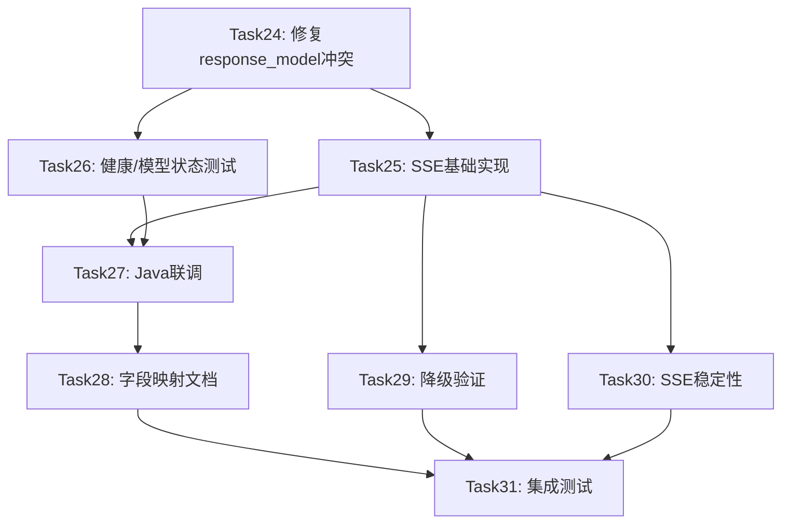

# AM3 API完善与Java对接 — 全量执行计划

> 里程碑：AM3（Week 5-6）| 任务范围：task24~task31 | 生成时间：2026-06-04

---

## 一、当前状态分析

### 1.1 已完成工作（前次会话产出）

| 文件 | 状态 | 说明 |
|------|------|------|
| `app/utils/response.py` | ✅ 已创建 | ok()/fail()/now_ts_ms() 工厂函数 |
| `app/models/enums.py` | ✅ 已创建 | 7 个 StrEnum（Python 3.10 兼容） |
| `app/exception.py` | ✅ 已修改 | 新增 ValidationException(422) + RateLimitException(429) |
| `app/models/schemas.py` | ✅ 已修改 | UserProfile/AnalyzeRequest Enum 升级 + extra="forbid" + ModelStatusResponse 扩展 |
| `app/main.py` | ✅ 已修改 | lifespan + /health critical_ok + 422 中文处理器 + AIServiceException handler |
| `app/api/endpoints/agent.py` | ✅ 已修改 | ok()/fail() 包装 |
| `app/api/endpoints/search.py` | ✅ 已修改 | ok()/fail() 包装 |
| `app/api/endpoints/model.py` | ✅ 已修改 | ok() 包装 + GPU/ChromaDB 安全查询 |
| `tests/test_request_validation_response.py` | ✅ 已创建 | 25 个测试（24 pass / 1 fail） |

### 1.2 阻塞问题：response_model 与 ok()/fail() 冲突

**根因**：所有端点装饰器声明了 `response_model=SomeModel`（如 `AnalyzeResponse`），但函数体返回 `ok(data=...)` 产生的 `{code, message, data, timestamp}` 字典。FastAPI 的 `response_model` 机制会对返回值做过滤/校验，与 ok() 包装后的结构不匹配。

**具体表现**：`GET /api/model/status` 当 `llm_service=None` 时，`fail()` 返回 `{code:503, data:None}`，FastAPI 校验发现缺少 `ModelStatusResponse` 的必填字段 `llm`/`embedding`/`chroma`/`prompts`，抛出 `ResponseValidationError`。

**影响范围**：所有使用 `response_model` + `ok()`/`fail()` 的端点：
- `POST /api/agent/analyze` — `response_model=AnalyzeResponse`
- `POST /api/search/` — `response_model=SearchResponse`
- `POST /api/search/hybrid` — `response_model=SearchResponse`
- `GET /api/search/suggest` — `response_model=SearchSuggestResponse`
- `GET /api/model/status` — `response_model=ModelStatusResponse`

**解决方案**：移除所有端点的 `response_model` 参数。因为：
1. `ok()`/`fail()` 已保证响应结构为 `{code, message, data, timestamp}`
2. `model_dump(by_alias=True)` 已保证 data 内字段为 camelCase
3. `response_model` 在此场景下不仅无用，还会阻碍 fail() 路径的正常返回
4. FastAPI 的 OpenAPI 文档可通过 `response_model` 在 decorator 外单独配置（如需要）

### 1.3 未实现模块

| 模块 | 状态 | 任务归属 |
|------|------|---------|
| SSE 流式端点 /analyze/stream | ❌ 不存在 | task25 |
| AgentOrchestrator 流式编排器 | ❌ 不存在 | task25 |
| graph.py 流式执行 | ❌ 不存在 | task25 |
| /health 独立测试 | ❌ 不存在 | task26 |
| /model/status 独立测试 | ❌ 不存在 | task26 |
| Java↔Python 联调测试 | ❌ 不存在 | task27 |
| 字段映射文档 | ❌ 不存在 | task28 |
| 降级机制验证测试 | ❌ 不存在 | task29 |
| SSE 稳定性 + 断线重连 | ❌ 不存在 | task30 |
| AM3 集成测试 | ❌ 不存在 | task31 |

---

## 二、任务执行计划

### Task 24：API请求校验完善 + 统一响应格式（修复收尾）

**目标**：修复 response_model 冲突，使 25/25 测试全部通过

#### 修改清单

| 文件 | 修改内容 | 原因 |
|------|---------|------|
| `app/api/endpoints/agent.py` | 移除 `response_model=AnalyzeResponse, response_model_by_alias=True` | 解决 ok()/fail() 与 response_model 冲突 |
| `app/api/endpoints/search.py` | 移除 3 个端点的 `response_model` 和 `response_model_by_alias` 参数 | 同上 |
| `app/api/endpoints/model.py` | 移除 `response_model=ModelStatusResponse, response_model_by_alias=True` | 同上 |

#### 具体修改

**agent.py L67**：
```python
# 修改前
@router.post("/analyze", response_model=AnalyzeResponse, response_model_by_alias=True)
# 修改后
@router.post("/analyze")
```

**search.py L19**：
```python
# 修改前
@router.post("/", response_model=SearchResponse, response_model_by_alias=True)
# 修改后
@router.post("/")
```

**search.py L52**：
```python
# 修改前
@router.post("/hybrid", response_model=SearchResponse, response_model_by_alias=True)
# 修改后
@router.post("/hybrid")
```

**search.py L105**：
```python
# 修改前
@router.get("/suggest", response_model=SearchSuggestResponse)
# 修改后
@router.get("/suggest")
```

**model.py L39**：
```python
# 修改前
@router.get("/status", response_model=ModelStatusResponse, response_model_by_alias=True)
# 修改后
@router.get("/status")
```

#### 验证

```bash
cd Veritas/ai-service && python3 -m pytest tests/test_request_validation_response.py -v
# 预期：25/25 PASS
```

---

### Task 25：SSE推送基础实现

**目标**：实现 `/api/agent/analyze/stream` SSE 端点，6 种事件类型

#### 修改清单

| 操作 | 文件 | 说明 |
|------|------|------|
| **create** | `app/agents/orchestrator.py` | AgentOrchestrator 流式编排器 |
| **modify** | `app/agents/graph.py` | 新增流式节点包装器 |
| **modify** | `app/api/endpoints/agent.py` | 新增 /analyze/stream 端点 |
| **create** | `tests/test_sse_basic_push.py` | SSE 基础推送测试 |

#### orchestrator.py 设计

```python
class AgentOrchestrator:
    """流式 Agent 编排器 — task25 产出"""

    def __init__(self, agent_instances: Dict, analysis_id: str):
        self.agent_instances = agent_instances
        self.analysis_id = analysis_id
        self._event_id = 0  # 单调递增事件 ID

    async def run_workflow_stream(
        self, request: AnalyzeRequest
    ) -> AsyncIterator[Dict[str, str]]:
        """yield {'event': event_name, 'data': json.dumps(payload)}"""
        # 事件序列：
        # 1. agent_started(retriever)
        # 2. agent_state_update(retriever, running)
        # 3. agent_completed(retriever)
        # 4. agent_started(analyzer) ... agent_completed(analyzer)
        # 5. agent_started(generator) ... agent_completed(generator)
        # 6. analysis_completed
```

**关键设计决策**：
- 不修改 LangGraph 的 `ainvoke()` 调用方式，而是在编排器层面包装每个 Agent 的执行过程
- 每个 Agent 执行前 yield `agent_started`，执行中 yield `agent_state_update`，执行后 yield `agent_completed`
- 异常时 yield `agent_failed` + `error` 事件，不中断流
- 总超时 120s 由 `asyncio.wait_for` 控制
- 事件 data 字段使用 camelCase（与 Java 端一致）

#### graph.py 修改

新增 `_run_node_stream()` 异步生成器包装器，将现有 `retrieve_node`/`analyze_node`/`generate_node` 包装为可 yield SSE 事件的形式。**不修改现有同步执行路径**。

#### agent.py 修改

新增 `analyze_stream` 端点：
```python
@router.post("/analyze/stream")
async def analyze_stream(request: AnalyzeRequest):
    """POST /api/agent/analyze/stream — SSE 流式推送"""
    # 使用 sse-starlette EventSourceResponse
    # 复用 _build_agent_instances() 构造逻辑
```

#### 测试覆盖

| 测试 | 验证内容 |
|------|---------|
| `test_sse_event_format` | EventSourceResponse 输出符合 `event:\ndata:\n\n` 格式 |
| `test_sse_camelcase_payload` | 事件 data JSON 解析后字段为 camelCase |
| `test_sse_event_sequence` | 正常流程事件序列完整 |
| `test_sse_agent_failure_event` | Agent 异常时 yield agent_failed + error，不中断流 |
| `test_sse_e2e_with_real_workflow` | 端到端流式测试（mock LLM） |

---

### Task 26：健康检查完善 + 模型状态API

**目标**：补充 /health 和 /model/status 的独立测试

**现状**：健康检查和模型状态端点的代码已在 task24 中完成实现（/health critical_ok 规则 + ModelStatusResponse 扩展字段），但缺少独立测试文件。

#### 修改清单

| 操作 | 文件 | 说明 |
|------|------|------|
| **create** | `tests/test_health_model_status.py` | 健康检查 + 模型状态测试 |

#### 测试覆盖

| 测试 | 验证内容 |
|------|---------|
| `test_health_critical_ok_returns_200` | 核心组件全 OK 时返回 200 + UP |
| `test_health_llm_not_loaded_returns_503` | LLM 未加载返回 503 + DEGRADED |
| `test_health_embedding_not_loaded_returns_503` | Embedding 未加载返回 503 |
| `test_health_chroma_not_connected_returns_503` | ChromaDB 未连接返回 503 |
| `test_health_has_6_components` | 响应含 6 个组件状态 |
| `test_model_status_returns_unified_format` | 返回 {code,message,data,timestamp} |
| `test_model_status_llm_not_loaded_503` | LLM 未就绪返回 503 |
| `test_model_status_gpu_memory_none_when_no_local` | 非 local 模式 GPU 为 None |
| `test_model_status_provider_candidates` | providerCandidates 来自 llm.providers |
| `test_model_status_chroma_paper_count` | chromaPaperCount 安全查询 |

---

### Task 27：Java→Python 通信联调

**目标**：Python 侧联调测试基础设施 + 字段一致性验证

**注意**：Java 测试类放在 backend 项目中（用户已确认），Python 侧只负责：
1. conftest.py 提供 mock fixture
2. test_java_calls_python.py 验证 camelCase 字段一致性
3. start_test_server.sh 启动脚本

#### 修改清单

| 操作 | 文件 | 说明 |
|------|------|------|
| **create** | `tests/integration/conftest.py` | mock LLM/Chroma/Embedding fixture |
| **create** | `tests/integration/test_java_calls_python.py` | Python 侧 5 种典型请求验证 |
| **create** | `scripts/start_test_server.sh` | 启动测试用 Python 服务 |

#### conftest.py 设计

```python
@pytest.fixture
def mock_llm_service():
    """Mock LLM 服务，返回固定文本"""

@pytest.fixture
def mock_chroma():
    """Mock ChromaDB，返回固定论文数据"""

@pytest.fixture
def mock_embedding():
    """Mock Embedding 服务，返回固定向量"""
```

#### test_java_calls_python.py 测试覆盖

| 测试 | 验证内容 |
|------|---------|
| `test_analyze_camelcase_request` | Java 风格 camelCase 请求正确解析 |
| `test_analyze_camelcase_response` | 响应 data 字段为 camelCase |
| `test_search_camelcase_roundtrip` | 搜索请求/响应 camelCase 一致 |
| `test_health_response_format` | /health 返回统一格式 |
| `test_model_status_camelcase` | /model/status 字段 camelCase |

---

### Task 28：请求/响应格式兼容性验证 + 字段映射文档

**目标**：产出 FIELD_MAPPING.md + 自动验证脚本

#### 修改清单

| 操作 | 文件 | 说明 |
|------|------|------|
| **create** | `docs/FIELD_MAPPING.md` | 字段映射与契约文档（≥300行） |
| **create** | `tests/test_field_mapping_consistency.py` | 20+ 字段名断言自动验证 |

#### FIELD_MAPPING.md 结构

1. 7 个端点完整契约（URL/方法/请求示例/响应示例/状态码/错误码/Headers）
2. 字段命名映射表（≥30 行，Java camelCase / Python snake_case / JSON camelCase 三列）
3. 枚举映射表（4 个 StrEnum 三端字符串值）
4. SSE 事件清单（6 个事件类型 + data 字段示例）
5. ChromaDB 字段映射（7 个 metadata 字段）
6. 错误码体系（6 个异常类 code 值和触发场景）
7. curl 示例（≥5 个可复制执行的命令）

---

### Task 29：错误处理联调 + 降级机制验证

**目标**：验证三级降级机制 + 错误码正确性

#### 修改清单

| 操作 | 文件 | 说明 |
|------|------|------|
| **create** | `tests/test_degradation.py` | 降级机制验证测试（8 个用例） |
| **create** | `tests/fixtures/mock_failing_providers.py` | Mock 失败 LLM Provider |
| **create** | `docs/DEGRADATION_TEST_REPORT.md` | 降级测试报告 |

#### 测试覆盖

| 测试 | 验证内容 |
|------|---------|
| `test_llm_provider_fallback_builtin_to_api` | builtin 失败 → api 降级 |
| `test_llm_all_providers_failed_throws_503` | 三路全失败 → LLMException(503) |
| `test_agent_timeout_skip_continue` | Analyzer 超时 → Generator 继续 |
| `test_workflow_multi_agent_failure_degraded` | 多 Agent 失败 → status='degraded' |
| `test_workflow_all_agents_failed_returns_500` | 全部失败 → 500 |
| `test_validation_error_422` | 参数错误 → 422 |
| `test_model_not_loaded_503` | 模型未就绪 → 503 |
| `test_agent_timeout_408` | Agent 超时 → 408 |

---

### Task 30：SSE推送稳定性测试 + 断线重连

**目标**：SSE keep-alive ping + Last-Event-ID 断点续传 + 客户端断开优雅处理

#### 修改清单

| 操作 | 文件 | 说明 |
|------|------|------|
| **modify** | `app/agents/orchestrator.py` | 新增 keep-alive ping + Last-Event-ID 支持 |
| **modify** | `app/api/endpoints/agent.py` | /analyze/stream 接收 Last-Event-ID Header |
| **create** | `tests/test_sse_stability.py` | SSE 稳定性测试 |
| **create** | `tests/test_sse_reconnect_frontend.py` | 模拟前端 useSSE 联调测试 |

#### 关键实现

1. **Keep-alive ping**：Orchestrator 每 15s yield `ping` 事件（仅总耗时 > 15s 时）
2. **Last-Event-ID**：客户端重连发送 `Last-Event-ID` Header，服务端从该 ID 后继续推送
3. **事件 ID**：单调递增整数，每个 SSE 事件附带 `id:` 字段
4. **客户端断开**：捕获 `asyncio.CancelledError`，优雅关闭流
5. **高并发**：10 个并发 SSE 连接无 OOM 无事件错乱

---

### Task 31：集成测试 + Bug修复

**目标**：AM3 全量集成测试 + 性能基线 + Bug 修复 + 测试报告

#### 修改清单

| 操作 | 文件 | 说明 |
|------|------|------|
| **create** | `tests/test_integration_am3.py` | AM3 集成测试主类（40+ 用例） |
| **create** | `tests/performance/test_perf_baseline.py` | 性能基线测试 |
| **create** | `docs/AM3_TEST_REPORT.md` | AM3 阶段测试报告 |
| **create** | `docs/AM3_BUGFIX_LOG.md` | AM3 阶段 Bug 修复日志 |

#### 性能基线指标

| 指标 | 目标值 |
|------|--------|
| health P95 | < 100ms |
| search P95 | < 3s |
| analyze P95 | < 60s |
| stream 首事件 | < 2s |

---

## 三、执行顺序与依赖关系



**关键依赖**：
- Task25 依赖 Task24（SSE 端点需要 ok() 包装正常工作）
- Task27 依赖 Task25+26（联调需要 SSE 端点和健康检查就绪）
- Task29 依赖 Task25（降级测试需要 SSE 流式降级场景）
- Task30 依赖 Task25（SSE 稳定性基于 SSE 基础实现）
- Task31 依赖 Task28+29+30（集成测试汇总所有前置任务）

---

## 四、假设与决策

| 编号 | 决策 | 理由 |
|------|------|------|
| D-01 | 移除端点 response_model 参数 | ok()/fail() 已保证响应结构，response_model 在此场景下造成冲突 |
| D-02 | SSE 事件 data 字段使用 camelCase | 与 Java 端 JSON 解析器一致，task prompt FR-004 明确要求 |
| D-03 | Orchestrator 不修改 LangGraph ainvoke | 保持现有同步路径不变，流式在编排器层面包装 |
| D-04 | Java 测试放在 backend 项目 | 用户已确认，Python 侧只提供 mock fixture 和配套测试 |
| D-05 | SSE 事件 ID 使用单调递增整数 | 简单可靠，与 Last-Event-ID 断点续传兼容 |
| D-06 | Last-Event-ID 续传使用内存缓存 | TTL=120s，无需 Redis（AM3 阶段简化实现） |

---

## 五、风险与缓解

| 风险 | 概率 | 影响 | 缓解措施 |
|------|------|------|---------|
| sse-starlette 版本兼容问题 | 中 | 高 | 已有 2.1.0 依赖，先验证基本用法 |
| mock LLM 服务不够真实 | 低 | 中 | 使用真实 LLMService 结构，仅 mock generate() 返回值 |
| 并发 SSE 测试不稳定 | 中 | 中 | 设置合理超时，使用 pytest-xdist 并行 |
| 降级测试超时 30s 太长 | 低 | 低 | 使用 mock 缩短超时阈值进行测试 |

---

## 六、验证检查点

每个 Task 完成后的验证命令：

| Task | 验证命令 | 预期结果 |
|------|---------|---------|
| 24 | `python3 -m pytest tests/test_request_validation_response.py -v` | 25/25 PASS |
| 25 | `python3 -m pytest tests/test_sse_basic_push.py -v` | 全部 PASS |
| 26 | `python3 -m pytest tests/test_health_model_status.py -v` | 全部 PASS |
| 27 | `python3 -m pytest tests/integration/test_java_calls_python.py -v` | 5/5 PASS |
| 28 | `python3 -m pytest tests/test_field_mapping_consistency.py -v` | 全部 PASS |
| 29 | `python3 -m pytest tests/test_degradation.py -v` | 8/8 PASS |
| 30 | `python3 -m pytest tests/test_sse_stability.py tests/test_sse_reconnect_frontend.py -v` | 全部 PASS |
| 31 | `python3 -m pytest tests/test_integration_am3.py -v` | 40+ PASS |
