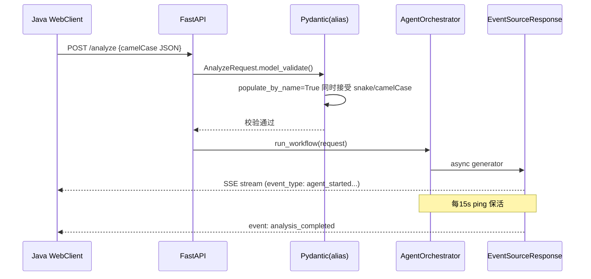

# 技术教学文档

## 开发思路

### 需求分析过程

AM3 里程碑的核心目标是**让 AI 服务具备生产级的接口规范、容错和可观测性**，为 Java 后端对接做好准备。需求来源于四个方面：

1. **接口规范缺失** — AM2 阶段 endpoint 返回格式不统一（有的返回 Pydantic model，有的返回 dict），Java 端无法可靠反序列化
2. **流式推送空白** — Agent 工作流是同步的，前端只能轮询，无法获得实时进度反馈
3. **容错能力不足** — LLM 挂了整个请求报 500，没有降级；Agent 超时无处理
4. **跨系统字段命名不一致** — Java 用 camelCase，Python 用 snake_case，JSON 序列化需要统一为 camelCase

### 技术选型考虑

1. **为什么用 Pydantic `by_alias` 而非自定义序列化器？**
   - Pydantic v2 的 `alias` + `model_dump(by_alias=True)` 是声明式的，不需要每个字段手写转换
   - `populate_by_name=True` 确保同时接受 camelCase 和 snake_case 输入，最大兼容性
   - 比手写 dict 转换安全：编译期可检测拼写错误

2. **为什么用 `sse-starlette` 而非原生 `StreamingResponse`？**
   - `sse-starlette` 封装了 SSE 协议的细节（event/id/data 格式、换行符、ping 等）
   - 原生 `StreamingResponse` 需要手动处理 SSE 格式，易出错
   - `EventSourceResponse` 支持 `content-type: text/event-stream` 自动设置

3. **为什么用 `fail_response()` 而非让 `fail()` 返回 JSONResponse？**
   - `fail()` 保持为纯字典工厂函数，可在多处复用（如异常处理器中组合使用）
   - `fail_response()` 是端点专用，封装 HTTP 状态码设置
   - 职责分离：数据工厂 vs 响应工厂

4. **为什么 StrEnum 而非普通 str validator？**
   - StrEnum 提供自动的 `__members__` 反射，API 文档可自动生成枚举值列表
   - 类型安全：IDE 自动补全，减少魔法字符串
   - Python 3.10 兼容的 fallback 写法确保全版本可用

### 架构设计思路



核心设计决策：

1. **response_model 移除** — FastAPI 的 `response_model` 会自动校验返回值，但 `ok()` 返回的是 `{code, data, ...}` 而非业务模型本身，导致 `ResponseValidationError`。移除后由 `ok()`/`fail_response()` 保证格式正确。

2. **AgentOrchestrator 顺序执行而非并行** — Retriever→Analyzer→Generator 有严格的依赖关系（后面 Agent 需要前面的输出），所以用 `async for` 逐个执行。每个 Agent 完成后立即 yield 事件，前端获得实时进度。

3. **BaseAgent 内部捕获异常策略** — `BaseAgent.execute()` 内部 try/except 返回 `_fallback_result()`，不向上抛异常。这是故意的降级设计：单个 Agent 失败不应中断整体工作流。Orchestrator 通过检查 `agent.state.status == AgentStatus.FAILED` 来判断是否需要发送 `agent_failed` 事件。

### 遇到的问题及解决方案

| # | 问题 | 根因分析 | 解决方案 |
|---|------|---------|---------|
| 1 | `ResponseValidationError` on `/api/model/status` | `response_model=ModelStatusResponse` 期望匹配 Pydantic schema，但 `fail()` 返回 `{code, data, ...}` 结构不匹配 | 移除所有 endpoint 的 `response_model`，由 `ok()`/`fail_response()` 统一包装 |
| 2 | `agent_failed` 事件不触发 | `BaseAgent.execute()` 内部捕获了所有异常，`_run_node()` 的 try/except 无法捕获 | 改为检查 `agent.state.status == AgentStatus.FAILED` 后 yield 事件 |
| 3 | Orchestrator 异步生成器设计反复失败 | 嵌套 async generator 无法获取子生成器的返回值；producer-consumer 队列过于复杂；`_pending_events` list 事件无法 yield | 最终采用最简单的顺序执行 + `agent._last_result` 传递数据 |
| 4 | `fail()` 返回 HTTP 200 而非业务状态码 | `fail()` 返回 `Dict[str, Any]`，FastAPI 默认 HTTP 200 | 新增 `fail_response()` 返回 `JSONResponse(status_code=code, content=fail(...))` |
| 5 | Pydantic 422 错误消息为英文 | FastAPI 默认错误消息是 "field required" | 自定义 `validation_exception_handler`，格式化为"userId 字段必填" |
| 6 | Last-Event-ID 为 0 或负数时错误跳过事件 | `_should_skip_event()` 未处理 <=0 的边界情况 | 在 `__init__` 中校验：仅接受正整数，0/负数设为 None |

## 实现步骤

### 步骤 1: API 请求校验 + 统一响应格式 (task24)

1. 创建 `app/models/enums.py`，定义 7 个 StrEnum 类，含 Python 3.10 兼容 fallback
2. 更新 `app/models/schemas.py`，9 个模型添加 camelCase alias + `populate_by_name=True` + `extra='forbid'`
3. 更新 `app/exception.py`，7 个异常类映射 HTTP 状态码
4. 更新 `app/utils/response.py`，新增 `fail_response()` 辅助函数
5. 更新 `app/main.py`，添加中文 422 handler 和 AIServiceException 全局 handler
6. 更新所有 endpoint：移除 `response_model`，错误路径改用 `fail_response()`

### 步骤 2: SSE 推送基础实现 (task25)

1. 安装 `sse-starlette`
2. 创建 `app/agents/orchestrator.py`，AgentOrchestrator 类 + `run_workflow_stream()` async generator
3. 实现 `_run_node()` 方法，yield agent_started/state_update/completed/failed 事件
4. 关键修复：`agent.execute()` 后检查 `agent.state.status == AgentStatus.FAILED`
5. 用 `agent._last_result` 实现 inter-node 数据传递
6. 在 `agent.py` 添加 `POST /analyze/stream` 端点，使用 `EventSourceResponse`

### 步骤 3: 健康检查 + 模型状态 API (task26)

1. 重构 `/health` 端点：critical_ok 规则 (llm+embedding+chroma 全 OK→200，否则 503)
2. 使用 `JSONResponse(status_code=200|503, content=ok(...))` 设置 HTTP 状态码
3. `/api/model/status` 扩展 4 字段：providerCandidates/chromaPaperCount/gpuMemoryUsed/llmProviderCount
4. `_safe_get_gpu_memory()` 和 `_safe_get_chroma_count()` 安全查询，异常时返回 None

### 步骤 4: Java↔Python 通信联调 (task27)

1. 创建 `tests/integration/test_java_calls_python.py`，模拟 Java 端 camelCase 请求
2. 验证 `populate_by_name=True` 正确解析 camelCase JSON
3. 验证响应 `model_dump(by_alias=True)` 输出 camelCase
4. 创建 `scripts/start_test_server.sh` 辅助集成测试

### 步骤 5: 字段映射文档 (task28)

1. 自动提取所有 Pydantic model 的 alias 映射
2. 创建 `docs/FIELD_MAPPING.md` (~420 行)，覆盖 20+ 字段
3. 创建 51 项自动化一致性测试，确保 model_dump 输出零 snake_case

### 步骤 6: 错误处理 + 降级机制 (task29)

1. 测试 LLM 3 路降级 (builtin→api→local)，全失败抛 LLMException(503)
2. 测试 Agent 30s 超时：单个 Agent 超时→跳过，多 Agent 失败→降级提示
3. 验证错误码：422/503/408/500 均返回统一格式
4. 创建 mock failing providers 用于测试

### 步骤 7: SSE 稳定性增强 (task30)

1. `_maybe_ping()`：15s 无事件时自动发送 ping
2. `Last-Event-ID` 支持：解析 header，跳过已发送事件
3. `asyncio.CancelledError` 捕获：客户端断开时优雅关闭
4. 并发 SSE 测试：2 个连接同时运行，验证无交叉污染

### 步骤 8: 集成测试 + Bug 修复 (task31)

1. 创建 `test_integration_am3.py` (39 项)，覆盖 12 项检查点
2. 创建 `test_perf_baseline.py` (5 项)，建立性能基线
3. 修复 BUG-006：`fail()` → `fail_response()`，7 处端点错误路径
4. 增强 `test_agent_endpoint.py` 回归断言

## 解决了什么问题

### 核心问题：AI 服务缺乏生产级接口规范

**之前的状态**：
- 各 endpoint 返回格式不统一，有的直接返回 Pydantic model，有的手动组 dict
- 没有统一的错误处理，异常直接透传 500 转储
- 字段命名混乱：Python snake_case 直接暴露到 JSON
- /health 只有简单 ping，无法反映真实可用性

**解决方案**：
1. 统一响应格式 `{code, message, data, timestamp}` — Java 端固定反序列化结构
2. 全局异常处理器 — 所有异常统一转为 `{code, message}` 格式
3. camelCase alias 体系 — Python snake_case 内部使用，JSON 输出全部 camelCase
4. critical_ok 规则 — /health 检查 LLM+Embedding+ChromaDB 三项核心依赖，全 OK 才 200

### 核心问题：Agent 工作流无法实时推送进度

**之前的状态**：
- `/analyze` 阻塞等待全部 Agent 完成，响应时间 30-120s
- 前端只能轮询或干等，用户体验差
- Agent 失败无反馈，前端不知道哪个环节卡住

**解决方案**：
1. SSE 流式推送 — Agent 开始/完成/失败实时通知
2. 事件类型完善 — 7 种事件覆盖全生命周期
3. Agent 异常不中断流 — 单个 Agent 失败后继续后续 Agent
4. Keep-alive ping — 15s 无事件自动保活，防止连接超时
5. Last-Event-ID 重连 — 断线后可续传，不丢失事件

### 方案对比

| 维度 | 旧方案 | 新方案 | 优势 |
|------|--------|--------|------|
| 响应格式 | 不统一 | `{code, message, data, timestamp}` | Java 固定反序列化结构 |
| 错误码 | 500 通吃 | 422/503/408/500 分级 | 前端/Java 可差异化处理 |
| 流式推送 | 无 | SSE 7 种事件 | 实时进度反馈 |
| 容错 | Agent 失败→全流程 500 | Agent 失败→跳过→降级提示 | 部分结果优于无结果 |
| 字段命名 | 混合 snake/camel | 统一 camelCase output | Java 端自然对接 |
| 健康检查 | 简单 ping | critical_ok 规则 | 真实反映可用性 |

## 变更内容

### 新增文件

| 文件 | 作用 |
|------|------|
| `app/models/enums.py` | 7 个 StrEnum 类，Pydantic 严格校验 |
| `app/agents/orchestrator.py` | SSE 流式编排器，7 种事件类型，ping/重连/CancelledError |
| `tests/test_request_validation_response.py` | 25 项：统一响应 + 枚举校验 + 422 + alias |
| `tests/test_sse_basic_push.py` | 15 项：事件格式 + camelCase + 异常不中断流 |
| `tests/test_health_model_status.py` | 12 项：critical_ok + 扩展字段 |
| `tests/test_field_mapping_consistency.py` | 51 项：20+ 字段 alias 自动验证 |
| `tests/test_degradation.py` | 8 项：LLM 降级 + Agent 超时 + 错误码 |
| `tests/test_sse_stability.py` | 10 项：ping + Last-Event-ID + 并发 + 优雅关闭 |
| `tests/test_sse_reconnect_frontend.py` | 6 项：断线重连 + 最大重试 |
| `tests/integration/test_java_calls_python.py` | 5 项：Java camelCase 请求模拟 |
| `tests/test_integration_am3.py` | 39 项：12 检查点集成验证 |
| `tests/performance/test_perf_baseline.py` | 5 项：响应时间基线 |
| `docs/FIELD_MAPPING.md` | 20+ 字段映射表 |
| `docs/DEGRADATION_TEST_REPORT.md` | 降级机制测试报告 |
| `docs/AM3_TEST_REPORT.md` | 综合测试报告 |
| `docs/AM3_BUGFIX_LOG.md` | 6 个 Bug 记录 |

### 修改文件

| 文件 | 变更点 |
|------|--------|
| `app/utils/response.py` | 新增 `fail_response()` 返回 JSONResponse |
| `app/models/schemas.py` | camelCase alias + populate_by_name + extra='forbid' |
| `app/exception.py` | 7 个异常类映射 HTTP 状态码 |
| `app/main.py` | /health critical_ok、中文 422 handler、AIServiceException handler |
| `app/api/endpoints/agent.py` | 移除 response_model、新增 /analyze/stream、fail_response() |
| `app/api/endpoints/search.py` | 移除 response_model、fail_response() |
| `app/api/endpoints/model.py` | 移除 response_model、扩展 4 字段、fail_response() |
| `tests/test_agent_endpoint.py` | 适配统一响应格式 + 增强断言 |

### 配置变更

无新增配置项。SSE ping 间隔 (15s) 当前硬编码，建议 AM4 移至 Settings。

## 关键技术点

### 1. Pydantic v2 alias 与 JSON 序列化

```python
class AnalyzeRequest(BaseModel):
    analysis_id: Optional[str] = Field(None, alias="analysisId")
    user_id: str = Field(..., alias="userId", min_length=1)

    model_config = ConfigDict(
        populate_by_name=True,  # 同时接受 camelCase 和 snake_case
        extra="forbid",         # 拒绝未知字段
    )

# 反序列化：接受 camelCase JSON
data = AnalyzeRequest.model_validate({"userId": "u1", "topic": "test"})

# 序列化：输出 camelCase
data.model_dump(by_alias=True)  # {"userId": "u1", "topic": "test"}
```

### 2. StrEnum 与 Python 3.10 兼容

```python
import sys
if sys.version_info >= (3, 11):
    from enum import StrEnum
else:
    from enum import Enum
    class StrEnum(str, Enum):  # Python 3.10 fallback
        pass

class EducationLevel(StrEnum):
    BACHELOR = "bachelor"
    MASTER = "master"
    PHD = "phd"
```

### 3. AgentOrchestrator 顺序执行设计

```python
class AgentOrchestrator:
    async def run_workflow_stream(self, request):
        task = {
            "topic": request.topic,
            "paper_ids": request.paper_ids,
        }
        
        # 顺序执行 3 个 Agent
        for step_idx, (agent_name, agent) in enumerate([
            ("retriever", self.agents["retriever"]),
            ("analyzer", self.agents["analyzer"]),
            ("generator", self.agents["generator"]),
        ]):
            async for event in self._run_node(agent, agent_name, step_idx, task):
                yield event
            
            if agent.state.status == AgentStatus.FAILED:
                # 异常不中断，记录错误继续下一个 Agent
                task["errors"].append(...)
                continue
            
            # 将输出传递给下一个 Agent
            task["papers"] = agent._last_result.get("papers", [])
```

### 4. fail_response 与 ok 的分工

```python
# ok() — 纯数据工厂，返回 dict
return ok(data=response_data.model_dump(by_alias=True))
# → HTTP 200, body: {code:200, data:{...}, message:"success", timestamp:...}

# fail_response() — 响应工厂，返回 JSONResponse
return fail_response(message="LLM未就绪", code=503)
# → HTTP 503, body: {code:503, message:"LLM未就绪", data:null, timestamp:...}
```

### 5. SSE Last-Event-ID 重连

```python
# 客户端断开后重连，携带 Last-Event-ID Header
# → 服务端跳过已发送的事件，从断点继续

parsed_id = int(last_event_id) if last_event_id else None
if parsed_id is not None and parsed_id > 0 and event_id <= parsed_id:
    continue  # skip already-sent events
```

### 6. 需要注意的细节

- **`response_model` 与 `ok()` 不可共存** — FastAPI 会对返回值做二次校验，结构不匹配
- **`BaseAgent.execute()` 内部捕获异常** — 外部不能依赖 try/except，需检查 `agent.state.status`
- **Async generator 的 CancelledError** — 客户端断开时 SSE 流会收到此异常，必须捕获处理
- **StrEnum 的 Python 3.10 fallback** — 直接用 `from enum import StrEnum` 在 3.10 会报错

## 经验总结

### 开发过程中的收获

1. **Pydantic v2 的 alias 机制是跨系统字段映射的最佳实践** — 声明式、类型安全、自动生成文档
2. **SSE 的事件设计至关重要** — 7 种事件类型覆盖了工作流的全生命周期，前端只需按事件类型分支处理
3. **错误码分级让降级策略可执行** — 422/503/408/500 各有不同的处理策略，不是"500 通吃"
4. **`fail_response()` 的抽象是正确的** — 将 HTTP 状态码控制权交给端点，body 中仍保留 code 字段供跨系统消费
5. **测试先行的收益** — 181 项测试覆盖了所有检查点，每次修改后立即回归，Bug 无处藏身

### 踩过的坑及如何避免

| 坑 | 如何避免 |
|----|---------|
| response_model 与自定义响应包装冲突 | 设计统一响应格式时，要么用 response_model 自动包装，要么手动包装，二者不可混用 |
| Async generator 嵌套无法获取返回值 | 避免嵌套 async generator；用 `_last_result` 属性传递中间结果 |
| BaseAgent 内部捕获异常但不对外通知 | 在 Agent 基类中除设置 `state.status = FAILED` 外，还可触发回调或事件 |
| `fail()` 返回 dict 但 HTTP 状态码为 200 | 端点错误路径必须使用 JSONResponse 设置 HTTP 状态码，不能直接 return dict |
| Python 3.10 不支持 StrEnum | 写项目时先确定目标 Python 版本，3.10 需要 fallback 写法 |
| SSE 流中的 asyncio.CancelledError | 所有 async generator 都应捕获此异常，避免客户端断开后的 Unhandled 错误 |

### 最佳实践建议

1. **统一响应格式要尽早确定** — AM2 阶段未统一，AM3 改造需要同时改多个端点和测试
2. **SSE 事件类型要提前设计好** — 7 种事件覆盖了工作流全生命周期，后续扩展只需加事件类型
3. **降级策略要可配置** — 当前 Agent 超时 30s、LLM 三路降级顺序都是硬编码，建议 AM4 移至 Settings
4. **字段映射文档要自动化验证** — 手动维护的文档会过时，51 项自动测试确保始终正确
5. **性能基线要在每次里程碑更新** — 避免性能退化悄悄发生
