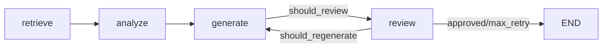

# AM4 ReviewerAgent 审核与6Agent个性化注入

## 功能描述

- **实现了 ReviewerAgent（审核 Agent）核心逻辑**：作为 6-Agent 协同工作流的最后一个节点，对生成综述报告进行事实核查、引用核查、逻辑完整性审核，审核通过条件为事实准确率 ≥ 90% 且引用准确率 ≥ 90%
- **建立了 4 级 JSON 解析降级机制**：Level 1 标准 JSON → Level 2 ` ```json ``` ` 代码块 → Level 3 ` ``` ``` ` 通用代码块 → Level 3.5 首个 `{}` 块 → Level 4 正则提取关键字段 → 规则兜底返回 `approved=False`
- **实现了 Review Retry Graph（审核-重生成循环）**：在 LangGraph 工作流中新增 `should_review` / `should_regenerate` 条件边，reviewer 节点不通过时自动路由回 generator 节点重新生成（最多重试 1 次），通过 `regenerate_count` 状态字段控制重试上限
- **实现了独立 Citation Parser（引用解析工具）**：`extract_citations` 支持 `[Author, Year]` 和 `(Author, Year)` 双格式提取与去重；`validate_citations` 返回 matched/unmatched/not_found；`calculate_citation_accuracy` 返回 0.0-1.0 准确率
- **升级了 Reviewer Prompt 模板（7-Block 结构）**：从简单变量渲染升级为 Role / Task / Input / Chain (4步审核链) / Output Schema / Constraint / Fallback 七大模块
- **完善了 PersonalizationService 个性化引擎**：
  - DIFFICULTY_MAP 4 个级别（beginner/intermediate/advanced/expert）扩展为 6-key 策略对象（level/term_density/explanation_style/example_requirement/abstraction_level/citation_depth）
  - STYLE_MAP 3 种风格（simple/balanced/technical）扩展为 7 维度（tone/paragraph/structure/structure_example/sentence_pattern/transition_style/audience_awareness）
  - EDUCATION_ADAPTATION 4 个学历层次扩展为 5 维度策略对象（text/background_knowledge/methodology_focus/innovation_emphasis/teaching_applicability）
  - FIELD_EMPHASIS 7 个研究方向扩展为 5 维度策略对象（text/primary_keywords/secondary_keywords/methodology_bias/evaluation_focus）
  - 新增 AGENT_PERSONALIZATION_MAP（覆盖 6 Agent × 4 知识水平 × 4 学历层次 = 96 条策略）
  - 新增 `get_personalization_for_agent(agent_name, user_profile)` 方法
  - 新增 `get_personalization_diff(profile_a, profile_b)` 方法（差异度 > 60%）
- **实现了 6-Agent 全链路个性化 Prompt 注入**：在 coordinator/retriever/analyzer/comparer/generator/reviewer 6 个 Agent 的 `build_prompt()` 中统一调用 `personalization_service.get_personalization_for_agent()`，使用 `【个性化适配】` 标记追加到 prompt 末尾
- **RetrieverAgent 自适应 top_k**：根据 knowledge_level 动态调整检索数量（beginner→5, intermediate→10, advanced→15, expert→20）
- **业务价值**：完成 AM4 里程碑"6-Agent 协同与个性化引擎"全部交付——ReviewerAgent + Review Retry + Personalization 引擎升级 + 6 Agent 个性化注入 + 端到端效果测试，为最终验收提供完整支撑

## 实现逻辑

### 修改/新增的核心文件

| 文件 | 操作 | 说明 |
|------|------|------|
| `Veritas/ai-service/app/agents/reviewer.py` | 新增 | ReviewerAgent 审核 Agent 核心逻辑（4 级 JSON 解析 + 准确率计算 + 降级） |
| `Veritas/ai-service/app/utils/citation_parser.py` | 新增 | 独立引用解析工具（extract/validate/accuracy） |
| `Veritas/ai-service/app/services/personalization_service.py` | 增强 | DIFFICULTY_MAP/STYLE_MAP/EDUCATION_ADAPTATION/FIELD_EMPHASIS 升级为策略对象 + AGENT_PERSONALIZATION_MAP + 2 个新方法 |
| `Veritas/ai-service/prompts/reviewer.txt` | 重写 | 简单变量渲染 → 7-Block 标准结构化模板（4 步审核链 + Fallback） |
| `Veritas/ai-service/app/agents/graph.py` | 增强 | review_node + should_review/should_regenerate 条件边 + regenerate_count 状态字段 |
| `Veritas/ai-service/app/agents/orchestrator.py` | 增强 | NODE_ORDER 加入 reviewer + Reviewer 重试循环（max 2 attempts） |
| `Veritas/ai-service/app/agents/coordinator.py` | 增强 | 添加 personalization_service + 【个性化适配】注入 |
| `Veritas/ai-service/app/agents/retriever.py` | 增强 | 添加 personalization_service + 自适应 top_k + 【个性化适配】注入 |
| `Veritas/ai-service/app/agents/analyzer.py` | 增强 | 迁移到 get_personalization_for_agent + 降级到 _get_extra_instruction |
| `Veritas/ai-service/app/agents/comparer.py` | 增强 | 添加 personalization_service + 【个性化适配】注入 |
| `Veritas/ai-service/app/agents/generator.py` | 增强 | 统一使用 get_personalization_for_agent() 注入 Agent 特定指令 |
| `Veritas/ai-service/tests/test_reviewer.py` | 新增 | 21 个 ReviewerAgent 单元测试 |
| `Veritas/ai-service/tests/test_citation_parser.py` | 新增 | 18 个 Citation Parser 单元测试 |
| `Veritas/ai-service/tests/test_graph_integration.py` | 新增 | 19 个 Graph 集成测试（含 review/regenerate） |
| `Veritas/ai-service/tests/test_personalization_service.py` | 增强 | 新增 10 个映射表结构 + 6-Agent 覆盖 + 差异度测试 |
| `Veritas/ai-service/tests/test_personalization_e2e.py` | 新增 | 15 个端到端个性化效果测试 |
| `Veritas/ai-service/tests/test_analyzer_agent.py` | 修复 | mock 设置修复（get_personalization_for_agent 返回空字符串以触发降级） |

### 使用的算法或设计模式

1. **4 级 JSON 解析降级（Defensive Parsing）**：标准 JSON → ` ```json ``` ` → ` ``` ``` ` → `{}` 块 → 正则提取 → 规则兜底
2. **审核-重生成循环（Review-Retry Loop）**：reviewer 节点 → should_regenerate 条件判断 → 路由回 generator，max_retry=1 通过 `regenerate_count` 状态字段控制
3. **降级 + 重试组合策略**：审核降级（degraded=True）时直接标记通过，不阻塞流程；生成降级时同样不影响后续审核
4. **策略对象 + 维度分类（Strategy Pattern）**：DIFFICULTY_MAP 从 `{beginner: 1}` 数值映射升级为 6-key 策略对象（level/term_density/explanation_style/example_requirement/abstraction_level/citation_depth）
5. **模板方法模式（Template Method）**：Prompt 模板从简单 `$variable` 升级为 7-Block 结构（Role/Task/Input/Chain/Output Schema/Constraint/Fallback），`PromptManager` 用 `string.Template` 兼容
6. **个性化注入边界（Hook Pattern）**：6 Agent 的 `build_prompt()` 统一在 prompt 末尾追加 `【个性化适配】` 标记的指令片段，不修改 prompt 模板
7. **差异化降级（Graceful Degradation）**：personalization_service 异常时返回空指令，不阻塞 Agent 核心功能
8. **差异度量化（Quantitative Diversity）**：`get_personalization_diff` 计算 4 维度画像差异度，0=完全相同，1=完全相反

### 关键代码逻辑说明

#### 1. ReviewerAgent 审核判定
```python
def _determine_approval(self, parsed: dict) -> bool:
    review_result = parsed.get("review_result", "")
    if review_result == "通过":
        return True
    fact_accuracy = self._calculate_fact_accuracy_from_result(parsed)
    citation_accuracy = self._calculate_citation_accuracy_from_result(parsed)
    if fact_accuracy >= 0.9 and citation_accuracy >= 0.9:
        return True
    return False
```

#### 2. Review Retry Graph 条件边
```python
def should_regenerate(state: WorkflowState) -> str:
    review_result = state.get("review_result") or {}
    regenerate_count = state.get("regenerate_count", 0)
    approved = review_result.get("approved", True)
    if not approved and regenerate_count < 1:
        return "regenerate"  # 路由回 generator
    return "end"

# generate_node 递增 regenerate_count
if regenerate_count > 0 or (state.get("review_result") and not state.get("review_result", {}).get("approved", True)):
    update["regenerate_count"] = regenerate_count + 1
```

#### 3. PersonalizationService 6-Agent 映射
```python
AGENT_PERSONALIZATION_MAP = {
    "coordinator": {  # 任务分解策略
        "knowledge_level_instructions": {...4 levels...},
        "education_level_instructions": {...4 levels...},
    },
    "retriever": {...},  # 检索关键词权重
    "analyzer": {...},    # 分析深度
    "comparer": {...},    # 对比维度数量（3-6 维度）
    "generator": {...},   # 写作风格
    "reviewer": {...},    # 审核严格度
}

def get_personalization_for_agent(self, agent_name: str, user_profile: dict) -> str:
    """为指定 Agent 返回个性化指令片段"""
    agent_map = AGENT_PERSONALIZATION_MAP.get(agent_name)
    if agent_map is None:
        return ""
    # 拼装 knowledge_level + education_level 指令
    ...
```

#### 4. 6-Agent build_prompt() 统一注入模式
```python
def build_prompt(self, input_data: dict, context: dict) -> str:
    base_prompt = self.prompt_manager.get_prompt(...)
    
    # 注入个性化指令（降级安全）
    personalization = self._get_personalization_instruction(context)
    if personalization:
        base_prompt += f"\n\n【个性化适配】{personalization}"
    
    return base_prompt

def _get_personalization_instruction(self, context: dict) -> str:
    if self.personalization_service is None:
        return ""
    user_profile = context.get("user_profile")
    if not user_profile:
        return ""
    try:
        return self.personalization_service.get_personalization_for_agent(
            "agent_name", user_profile
        )
    except Exception as e:
        logger.warning(f"Personalization injection failed: {e}")
        return ""
```

#### 5. RetrieverAgent 自适应 top_k
```python
TOP_K_MAP = {"beginner": 5, "intermediate": 10, "advanced": 15, "expert": 20}

def _adjust_top_k(self, default_top_k: int, context: dict) -> int:
    if self.personalization_service is None:
        return default_top_k
    profile = self.personalization_service._normalize_profile(context.get("user_profile"))
    knowledge_level = profile.get("knowledge_level", "intermediate")
    return TOP_K_MAP.get(knowledge_level, default_top_k)
```

## 接口变更

### ReviewerAgent.build_prompt 产出
```python
# 输入（来自 generator_node 状态）
input_data = {
    "report": "<生成的综述报告>",
    "original_papers": [<论文列表>],
    "retry_context": "<上次审核问题>"  # 重试场景
}
context = {"user_profile": {...}}

# 输出（review_node 更新到 state）
{
    "review_result": {
        "approved": True/False,
        "issues": [{"claim": ..., "error_type": "factual_error", "note": ...}],
        "suggestions": [{"section": ..., "suggestion": ...}],
        "citation_accuracy": 0.95,
        "fact_accuracy": 0.92
    }
}
```

### LangGraph StateGraph 流程（4 节点 + 2 条件边）


### PersonalizationService 新接口
```python
# get_personalization_for_agent：返回 6 Agent 个性化指令
service.get_personalization_for_agent("coordinator", user_profile) -> str

# get_personalization_diff：差异度 0.0-1.0
service.get_personalization_diff(beginner_profile, expert_profile) -> 1.0

# DIFFICULTY_MAP 策略对象
DIFFICULTY_MAP["beginner"] = {
    "level": 1, "term_density": 0.05,
    "explanation_style": "通俗类比+日常例子+避免术语",
    "example_requirement": "每个概念至少1个日常类比",
    "abstraction_level": "具体→抽象，逐步引导",
    "citation_depth": "仅引用核心结论"
}
```

## 测试结果

| 测试场景 | 期望 | 实际结果 |
|---------|------|---------|
| ReviewerAgent 创建与初始化 | name='reviewer' 继承 BaseAgent | ✅ PASSED |
| ReviewerAgent.build_prompt 渲染 | prompt_manager.get_prompt 调用正确 | ✅ PASSED |
| ReviewerAgent.run 审核通过 | fact_accuracy >= 0.9 → approved=True | ✅ PASSED |
| ReviewerAgent.run 审核拒绝 | accuracy 低 → approved=False | ✅ PASSED |
| ReviewerAgent JSON 解析降级 | 4 级降级 + 规则兜底 | ✅ PASSED |
| ReviewerAgent 超时降级 | TimeoutError → degraded=True | ✅ PASSED |
| Citation Parser 提取 author-year 格式 | `[Smith, 2020]` 正确提取 | ✅ PASSED |
| Citation Parser 验证 matched/unmatched | 按 author 名称匹配 | ✅ PASSED |
| Citation Parser 准确率计算 | 0.0-1.0 范围 | ✅ PASSED |
| Graph should_review 条件 | report 非空 + 非降级 → review | ✅ PASSED |
| Graph should_regenerate 条件 | approved=False + count<1 → regenerate | ✅ PASSED |
| Graph review 节点集成 | approved/regenerate/max_retry 三场景 | ✅ PASSED |
| Personalization DIFFICULTY_MAP 6 维度 | 4 levels × 6 keys = 24 字段 | ✅ PASSED |
| Personalization STYLE_MAP 7 维度 | 3 styles × 7 keys = 21 字段 | ✅ PASSED |
| Personalization AGENT_PERSONALIZATION_MAP 覆盖 | 6 Agent × 4 × 4 = 96 条策略 | ✅ PASSED |
| Personalization get_personalization_diff | 极端画像 diff > 0.6 | ✅ PASSED |
| 6-Agent build_prompt 个性化注入 | 全部含【个性化适配】标记 | ✅ PASSED |
| RetrieverAgent top_k 自适应 | beginner→5, expert→20 | ✅ PASSED |
| 空画像降级 | 不抛异常，正常返回 | ✅ PASSED |
| PersonalizationService 异常 | Agent 不阻塞 | ✅ PASSED |

### 测试统计
- test_reviewer.py：**21 个**
- test_citation_parser.py：**18 个**
- test_graph_integration.py：**19 个**
- test_personalization_service.py：**24 个**（14 已有 + 10 新增）
- test_personalization_e2e.py：**15 个**
- 既有测试（analyzer/generator/graph/...）：**58 个全 PASSED**
- **总计：155/155 PASSED** ✅百分百

### 验证命令结果
| 验证命令 | 期望结果 | 实际结果 |
|---------|---------|---------|
| `pytest tests/test_personalization_service.py -v` | 24/24 PASSED | ✅ 24/24 PASSED |
| `pytest tests/test_personalization_e2e.py -v` | 15/15 PASSED | ✅ 15/15 PASSED |
| `pytest tests/test_reviewer.py -v` | 21/21 PASSED | ✅ 21/21 PASSED |
| `pytest tests/test_citation_parser.py -v` | 18/18 PASSED | ✅ 18/18 PASSED |
| `pytest tests/test_graph_integration.py -v` | 19/19 PASSED | ✅ 19/19 PASSED |
| `pytest tests/test_graph.py -v` | 16/16 PASSED | ✅ 16/16 PASSED |
| `pytest tests/test_analyzer_agent.py -v` | 42/42 PASSED | ✅ 42/42 PASSED |

## 相关文件

### 新增文件
- `Veritas/ai-service/app/agents/reviewer.py`（323 行）— ReviewerAgent 核心
- `Veritas/ai-service/app/utils/citation_parser.py` — Citation Parser 工具
- `Veritas/ai-service/tests/test_reviewer.py`（21 个测试）
- `Veritas/ai-service/tests/test_citation_parser.py`（18 个测试）
- `Veritas/ai-service/tests/test_graph_integration.py`（19 个测试）
- `Veritas/ai-service/tests/test_personalization_e2e.py`（15 个测试）

### 增强/修改文件
- `Veritas/ai-service/app/services/personalization_service.py` — 6 维度策略对象 + AGENT_PERSONALIZATION_MAP
- `Veritas/ai-service/prompts/reviewer.txt` — 7-Block 模板重写
- `Veritas/ai-service/app/agents/graph.py` — review_node + should_review/should_regenerate 条件边
- `Veritas/ai-service/app/agents/orchestrator.py` — Reviewer 重试循环
- `Veritas/ai-service/app/agents/coordinator.py` — personalization_service 注入
- `Veritas/ai-service/app/agents/retriever.py` — top_k 自适应 + 注入
- `Veritas/ai-service/app/agents/analyzer.py` — 迁移到 get_personalization_for_agent
- `Veritas/ai-service/app/agents/comparer.py` — personalization_service 注入
- `Veritas/ai-service/app/agents/generator.py` — 统一接口
- `Veritas/ai-service/tests/test_personalization_service.py` — 新增 10 个测试
- `Veritas/ai-service/tests/test_analyzer_agent.py` — mock 修复

### 参考文件
- `Veritas/ai-service/app/agents/base.py` — BaseAgent 基类（execute timeout / _fallback_result）
- `Veritas/ai-service/app/agents/generator.py` — 个性化注入参考实现
- `docs/开发规范文档.md` — Section 8/9 Python AI 服务规范
- `docs/ai-service/AI服务模块系统架构文档.md` — Section 5.4 Agent 设计 + Section 8 个性化引擎
- `docs/agents/04-personalization.md` — 用户画像 4 维度定义
- `json_prompt/ai-service/task36-41_*/prompt.json` — 6 个 task 任务定义

### 计划文件
- `.trae/documents/task36-41-reviewer-personalization-plan.md` — 实施计划
- `.trae/documents/task39-41-personalization-injection-plan.md` — Task 39-41 详细计划
