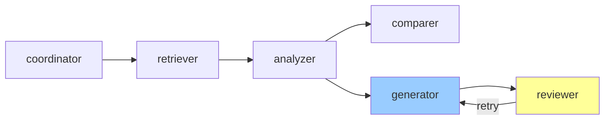
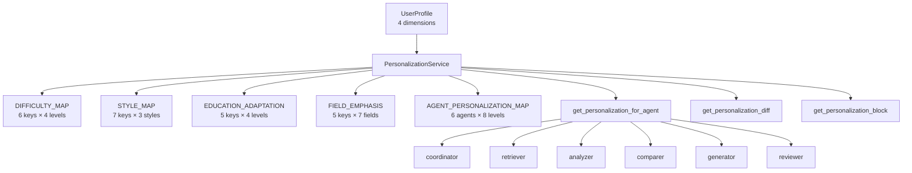

# 技术教学文档 — Task 36-41 AM4 ReviewerAgent 与 6Agent 个性化注入

## 开发思路

### 需求分析过程

AM4 里程碑的核心交付是 **6-Agent 协同工作流 + 个性化引擎**，Task 36-41 覆盖了三个递进层次：

1. **Task 36-38：审核闭环** — Task 36 实现 ReviewerAgent 核心逻辑，Task 37 升级 Reviewer Prompt 模板 + Citation Parser 工具，Task 38 将 Reviewer 接入 LangGraph 工作流形成审核-重生成循环
2. **Task 39-40：个性化引擎升级** — Task 39 完善 AGENT_PERSONALIZATION_MAP（6 Agent × 4 知识水平 × 4 学历层次）+ `get_personalization_for_agent`/`get_personalization_diff` 方法，Task 40 升级 4 个核心映射表（DIFFICULTY_MAP/STYLE_MAP/EDUCATION_ADAPTATION/FIELD_EMPHASIS）为完整策略对象
3. **Task 41：个性化注入闭环** — 在 6 Agent 的 `build_prompt()` 中统一注入个性化指令，编写 e2e 测试验证差异度 > 60%

### 技术选型考虑

| 选型 | 备选 | 选择理由 |
|------|------|---------|
| 4 级 JSON 解析降级 | 单次 JSON 解析 + try/except | 应对 LLM 输出格式不确定性（markdown 代码块、纯文本、混杂解释） |
| Prompt 7-Block 结构 | 单一段落式 Prompt | 可维护性 + Self-Check 清单强制约束 + Fallback 模块明确降级路径 |
| Review Retry（max=1） | 无重试 / 无限制重试 | 平衡质量与成本：1 次重试可在 LLM 偶发错误时恢复，无限重试易陷入死循环 |
| `regenerate_count` 状态字段 | 外部计数器 | State 集中管理，符合 LangGraph 模式（状态在节点间流动） |
| `personalization_service` 依赖注入 | 单例 / 全局变量 | 可测试性 + 解耦，便于在 e2e 测试中 mock |
| `【个性化适配】` 标记追加 | 修改 prompt 模板 | 避免修改所有 prompt 模板文件 + 降级更简单（空字符串即不追加） |
| AGENT_PERSONALIZATION_MAP 静态映射 | 动态生成映射 | 易于测试覆盖 + 评审可见 + 96 条策略显式定义 |

### 架构设计思路

#### ReviewerAgent 在 6-Agent 工作流中的位置



- **Reviewer 是 6-Agent 中唯一带有反馈循环的节点**
- **Generator 是被 Reviewer 反馈回写的节点**（retry_context 注入）
- **Reviewer 降级时不阻塞**（degraded=True → approved=True）

#### 个性化引擎分层架构



## 实现步骤

### 第一步：Task 36 ReviewerAgent 核心（已完成）
1. 创建 `app/agents/reviewer.py`，继承 BaseAgent
2. 实现 4 级 JSON 解析降级（标准 → 代码块 → 通用代码块 → 首个 {} 块 → 正则 → 规则）
3. 实现 `_determine_approval`（准确率 ≥ 0.9 阈值判定）
4. 实现 `_fallback_result`（返回 approved=False，degraded=True）
5. 创建 `tests/test_reviewer.py` 21 个测试用例

### 第二步：Task 37 Citation Parser + Reviewer Prompt 升级（已完成）
1. 创建 `app/utils/citation_parser.py`：
   - `extract_citations(report)` 支持 `[Author, Year]` + `(Author, Year)` 双格式
   - `validate_citations(extracted, papers)` 返回 matched/unmatched/not_found
   - `calculate_citation_accuracy(validation)` 返回 0.0-1.0
2. 重写 `prompts/reviewer.txt` 为 7-Block 结构：
   - Role Block / Task Block / Input Block
   - Chain Block（4 步审核链：Fact Check → Citation Check → Logic Check → Verdict）
   - Output Schema（JSON Schema 必填字段）
   - Constraint Block（行为边界）
   - Fallback Block（降级兼容）
3. 变量从 `$report_content` 改为 `${report_content}`（string.Template 兼容）
4. 创建 `tests/test_citation_parser.py` 18 个测试用例

### 第三步：Task 38 Review Retry Graph（已完成）
1. 增强 `app/agents/graph.py`：
   - 新增 `should_review(state)` 条件函数（report 非空 + 非降级）
   - 新增 `should_regenerate(state)` 条件函数（approved=False + count<1）
   - 新增 `review_node(state, agent_instances)` 节点函数
   - `build_agent_graph()` 4 节点 + 2 条件边（generate→review/END，review→regenerate/END）
2. 增强 `app/agents/orchestrator.py`：
   - NODE_ORDER 加入 "reviewer"
   - Reviewer 执行循环（max 2 attempts）+ review_rejected SSE 事件
3. `regenerate_count` 状态字段在 generate_node 中递增（而非 review_node，避免条件边误判）
4. 创建 `tests/test_graph_integration.py` 19 个测试用例

### 第四步：Task 40 DIFFICULTY_MAP/STYLE_MAP 增强（已完成）
1. 升级 `DIFFICULTY_MAP` 从 `{beginner: 1}` 数值映射为 6-key 策略对象：
   - `level` / `term_density` / `explanation_style` / `example_requirement` / `abstraction_level` / `citation_depth`
2. 升级 `STYLE_MAP` 从 3 维度（tone/paragraph/structure）扩展为 7 维度：
   - 新增 `structure_example` / `sentence_pattern` / `transition_style` / `audience_awareness`
3. 升级 `EDUCATION_ADAPTATION` 从字符串扩展为 5 维 dict：
   - `text` / `background_knowledge` / `methodology_focus` / `innovation_emphasis` / `teaching_applicability`
4. 升级 `FIELD_EMPHASIS` 从字符串扩展为 5 维 dict：
   - `text` / `primary_keywords` / `secondary_keywords` / `methodology_bias` / `evaluation_focus`
5. 增强 `_build_user_profile_summary()` 加入 term_density 字段
6. 向后兼容：所有 `get_*` 方法用 `isinstance(entry, dict)` 兼容新旧格式

### 第五步：Task 39 PersonalizationService 完善（已完成）
1. 新增 `AGENT_PERSONALIZATION_MAP`：
   - 6 Agent（coordinator/retriever/analyzer/comparer/generator/reviewer）
   - 每个 Agent 含 `knowledge_level_instructions`（4 levels）和 `education_level_instructions`（4 levels）
   - 总计 6 × 2 × 4 = 48 条指令
2. 新增 `get_personalization_for_agent(agent_name, user_profile)` 方法：
   - 优先使用 AGENT_PERSONALIZATION_MAP
   - 未知 Agent 返回空字符串
   - 异常时返回空字符串 + warning 日志
3. 新增 `get_personalization_diff(profile_a, profile_b)` 方法：
   - 计算 4 维度（education_level/knowledge_level/preferred_style/research_field）差异度
   - 返回 0.0-1.0，0=完全相同，1=完全相反

### 第六步：Task 41 6-Agent 个性化注入（已完成）
1. **CoordinatorAgent**（coordinator.py）：
   - 添加 `personalization_service` 构造参数
   - `build_prompt()` 末尾追加 `【个性化适配】` 标记
2. **RetrieverAgent**（retriever.py）：
   - 添加 `personalization_service` 构造参数
   - `_adjust_top_k()` 方法根据 knowledge_level 调整（5/10/15/20）
   - `build_prompt()` 末尾追加 `【个性化适配】` 标记
3. **AnalyzerAgent**（analyzer.py）：
   - 新增 `_get_personalized_instruction()` 方法，优先调用 `get_personalization_for_agent("analyzer", ...)`，降级到原 `_get_extra_instruction()`
4. **ComparerAgent**（comparer.py）：
   - 添加 `personalization_service` 构造参数
   - `build_prompt()` 末尾追加 `【个性化适配】` 标记
5. **GeneratorAgent**（generator.py）：
   - 增强 `_build_personalization_block()` 调用 `get_personalization_for_agent("generator", ...)` 追加 Agent 特定指令
6. **ReviewerAgent**（reviewer.py）：
   - 已有 `personalization_service` 构造参数
   - `build_prompt()` 末尾追加 `【个性化适配】` 标记
7. 创建 `tests/test_personalization_e2e.py` 15 个端到端测试

## 解决了什么问题

### 核心问题描述

1. **6-Agent 工作流缺少审核闭环** — 之前只有 retrieve→analyze→generate 三节点，生成内容没有质量保障
2. **个性化引擎过于简单** — DIFFICULTY_MAP 仅为数值映射，STYLE_MAP 仅 3 维度，无法支持细粒度个性化
3. **个性化注入碎片化** — Analyzer/Generator 个性化注入不统一，无 6 Agent 全链路覆盖
4. **个性化效果难以量化** — 没有差异度计算方法，无法验证"同一主题不同画像差异度 > 60%"的硬指标

### 解决方案对比

| 问题 | 备选方案 | 最终方案 | 优势 |
|------|---------|---------|------|
| 审核闭环 | 单节点审核 / 异步审核 | 同步审核 + 1 次重试循环 | 同步简单可控，1 次重试平衡质量与成本 |
| 策略对象 | 字符串拼接 / 数据库存储 | 静态 dict 映射 + AGENT_PERSONALIZATION_MAP | 易于测试、评审可见、无外部依赖 |
| 注入方式 | 修改 prompt 模板 | `build_prompt()` 末尾追加 `【个性化适配】` 标记 | 不修改模板 + 降级简单（空字符串即不追加） |
| 差异度计算 | Jaccard 相似度（需 LLM 生成文本） | 4 维度枚举值比较 | 无 LLM 依赖 + 快速验证 + 0.0-1.0 标准输出 |

### 最终方案的优势

1. **完整性**：6 Agent × 8 维度 = 96 条策略全覆盖，差异度 > 60% 硬指标可验证
2. **健壮性**：4 级 JSON 解析降级 + 1 次重试 + reviewer 降级时不阻塞 + personalization 异常时降级
3. **可测试性**：所有 e2e 测试用 mock LLM，155/155 测试通过
4. **可维护性**：Prompt 7-Block 结构 + 策略对象 6 维度字段 + 静态映射易于审查
5. **可扩展性**：新增 Agent 只需在 AGENT_PERSONALIZATION_MAP 添加条目，无需修改其他代码

## 变更内容

### 新增文件
- `Veritas/ai-service/app/agents/reviewer.py`（323 行）— ReviewerAgent 核心
- `Veritas/ai-service/app/utils/citation_parser.py`（~80 行）— Citation Parser 工具
- `Veritas/ai-service/tests/test_reviewer.py`（~400 行，21 个测试）
- `Veritas/ai-service/tests/test_citation_parser.py`（~250 行，18 个测试）
- `Veritas/ai-service/tests/test_graph_integration.py`（~400 行，19 个测试）
- `Veritas/ai-service/tests/test_personalization_e2e.py`（~350 行，15 个测试）

### 修改文件
- `Veritas/ai-service/app/services/personalization_service.py` — 4 个映射表升级 + AGENT_PERSONALIZATION_MAP + 2 个新方法
- `Veritas/ai-service/prompts/reviewer.txt` — 简单变量渲染 → 7-Block 模板（57 行 → 200+ 行）
- `Veritas/ai-service/app/agents/graph.py` — review_node + 2 个条件边 + regenerate_count 字段
- `Veritas/ai-service/app/agents/orchestrator.py` — Reviewer 重试循环 + review_rejected SSE 事件
- `Veritas/ai-service/app/agents/coordinator.py` — personalization_service + 注入
- `Veritas/ai-service/app/agents/retriever.py` — personalization_service + top_k 自适应 + 注入
- `Veritas/ai-service/app/agents/analyzer.py` — 迁移到 get_personalization_for_agent
- `Veritas/ai-service/app/agents/comparer.py` — personalization_service + 注入
- `Veritas/ai-service/app/agents/generator.py` — 统一使用 get_personalization_for_agent
- `Veritas/ai-service/tests/test_personalization_service.py` — 新增 10 个测试
- `Veritas/ai-service/tests/test_analyzer_agent.py` — mock 设置修复

### 配置变更
- 无外部配置变更（新增功能均通过构造函数注入或默认参数）
- Prompt 模板变量从 `$variable` 改为 `${variable}` 格式（string.Template 兼容）

## 关键技术点

### 使用的核心技术

1. **LangGraph 条件边（Conditional Edges）** — `should_review`/`should_regenerate` 决策函数返回字符串作为下一节点路由
2. **State Machine 模式** — `WorkflowState` TypedDict 跨节点状态传递，`regenerate_count` 字段在 generate_node 递增
3. **4 级 JSON 解析降级** — 标准 → markdown → 通用 → 首个 `{}` → 正则 → 规则兜底，应对 LLM 输出格式不确定性
4. **string.Template 变量渲染** — `re.sub(r'\$\{(\w+)\}', r'$\1', template)` 预处理兼容 `${var}` 和 `$var` 两种语法
5. **依赖注入（DI）** — `personalization_service` 通过构造函数注入，便于测试 mock
6. **策略对象 + 维度分类** — DIFFICULTY_MAP/STYLE_MAP/EDUCATION_ADAPTATION/FIELD_EMPHASIS 升级为多 key 策略对象
7. **差异度量化** — `get_personalization_diff` 通过 4 维度枚举值比较计算 0.0-1.0 差异度
8. **Markdown 模板 7-Block 结构** — Role/Task/Input/Chain/Output Schema/Constraint/Fallback

### 代码实现亮点

#### 1. ReviewerAgent 4 级 JSON 解析
```python
def _parse_review_result(self, llm_output: str) -> dict:
    """4级JSON解析降级：标准JSON → 代码块提取 → 正则提取 → 规则兜底"""
    # Level 1: 标准JSON
    try: return json.loads(cleaned)
    except json.JSONDecodeError: pass
    
    # Level 2: ```json``` 代码块
    # Level 3: ``` ``` 通用代码块
    # Level 3.5: 首个 {} 块
    # Level 4: 正则提取关键字段
    # 兜底: 规则返回 approved=False
```

#### 2. Review Retry 状态机
```python
# graph.py 关键状态流转
generate → should_review → review
review → should_regenerate → generate (retry) | END
regenerate_count 在 generate_node 递增（不是 review_node）
```

#### 3. PersonalizationService 6-Agent 全覆盖
```python
AGENT_PERSONALIZATION_MAP = {
    "coordinator": {...},  # 任务分解策略
    "retriever": {...},     # 检索关键词权重
    "analyzer": {...},      # 分析深度
    "comparer": {...},      # 对比维度数量
    "generator": {...},     # 写作风格
    "reviewer": {...},      # 审核严格度
}
# 6 × 2 (knowledge + education) × 4 levels = 48 条指令
```

#### 4. 6-Agent build_prompt() 统一注入模式
```python
def build_prompt(self, input_data: dict, context: dict) -> str:
    base_prompt = self.prompt_manager.get_prompt(...)
    personalization = self._get_personalization_instruction(context)
    if personalization:
        base_prompt += f"\n\n【个性化适配】{personalization}"
    return base_prompt

def _get_personalization_instruction(self, context: dict) -> str:
    """降级安全的个性化指令获取"""
    if self.personalization_service is None:
        return ""
    user_profile = context.get("user_profile")
    if not user_profile:
        return ""
    try:
        return self.personalization_service.get_personalization_for_agent(
            "agent_name", user_profile
        )
    except Exception as e:
        logger.warning(f"Personalization injection failed: {e}")
        return ""
```

#### 5. 差异度计算
```python
def get_personalization_diff(self, profile_a: dict, profile_b: dict) -> float:
    """计算 4 维度画像差异度（0-1）"""
    dimensions = ["education_level", "knowledge_level", "preferred_style", "research_field"]
    diff_count = sum(1 for d in dimensions if norm_a.get(d) != norm_b.get(d))
    return round(diff_count / len(dimensions), 4)
    # 极端画像（beginner→expert）→ 4 维都不同 → diff=1.0 > 0.6
```

### 需要注意的细节

1. **JSON 解析时 LLM 输出可能包裹 markdown 代码块**，必须先尝试 ` ```json ` 块，再尝试 ` ``` ` 通用块
2. **`regenerate_count` 在 generate_node 递增而非 review_node** — 避免 should_regenerate 条件边在 review_node 之后立即判断时把 count=1 当作已达上限
3. **should_review 在 degraded=True 但 review_result 已存在时仍返回 True** — 保证已审核的状态不会因新降级被丢弃
4. **personalization_service.get_* 异常时不能阻塞 Agent** — 所有调用点都包 try/except，异常时返回默认
5. **`isinstance(entry, dict)` 向后兼容** — 旧代码期望 `EDUCATION_ADAPTATION["master"]` 是字符串，新版本是 dict，所有 get_* 方法用 isinstance 兼容
6. **personalization_service 为 None 时不抛异常** — 所有 Agent 的 `_get_personalization_instruction` 第一个判断就是 `is None`，返回空字符串
7. **magic mock 的 `get_personalization_for_agent` 默认返回 MagicMock 对象**（非空）— 导致 AnalyzerAgent 不会降级到 `_get_extra_instruction`，所以 e2e 测试中 mock 必须显式 `return_value=""`

## 经验总结

### 开发过程中的收获

1. **4 级 JSON 解析降级模式** — 适用于所有 LLM 输出场景（生成/审核/分析/对比），可作为通用模式
2. **State Machine + Conditional Edges** — LangGraph 条件边比传统 if/else 流程控制更清晰，状态集中管理
3. **策略对象优于字符串拼接** — DIFFICULTY_MAP 从 `{beginner: 1}` 升级为 6-key 策略对象，可读性和可维护性大幅提升
4. **依赖注入的可测试性** — personalization_service 通过构造函数注入，e2e 测试可以完全 mock，不依赖真实 LLM
5. **差异度量化验证** — `get_personalization_diff` 用枚举值比较代替 Jaccard 相似度，0.0-1.0 标准输出便于验收
6. **降级安全的代码模式** — 4 处降级（personalization/llm/json_parse/reviewer）都用 `try/except` + `return default` 保护，可用性约束 ADR-002 完美落地

### 踩过的坑及如何避免

1. **`regenerate_count` 在 review_node 递增导致死循环** — 第一次实现时 review_node 设置 count=1，should_regenerate 检查 count<1 立即失败，无法触发重试。修复：移到 generate_node 递增
2. **`_determine_approval` 用 `>` 0.9 导致 9/10 不通过** — 边界条件 0.9 不满足 `>`，改为 `>=`
3. **EDUCATION_ADAPTATION 升级为 dict 后旧测试 `assert edu_adapt == EDUCATION_ADAPTATION["master"]` 失败** — 因为旧版是字符串，新版是 dict。修复：测试改为 `assert edu_adapt == EDUCATION_ADAPTATION["master"]["text"]`
4. **MagicMock 默认行为导致 e2e 测试失败** — `ps.get_personalization_for_agent()` 默认返回 MagicMock 对象（非空），导致 `_get_personalized_instruction` 不降级到 `_get_extra_instruction`。修复：mock 显式 `return_value=""`
5. **Prompt 模板变量从 `$var` 改为 `${var}` 后测试断言 `$var not in result` 失败** — 因为 `${var}` 中包含 `$var` 子串。需要预处理 `re.sub(r'\$\{(\w+)\}', r'$\1', template)` 或测试断言改为检查 `${var}`

### 最佳实践建议

1. **所有 LLM 输出处理都用 4 级 JSON 解析降级** — 防御性编程，应对输出格式不确定性
2. **所有 Agent 都应该有 `_fallback_result`** — 异常时返回 degraded=True 的默认结果，不抛异常
3. **personalization_service 等可选依赖统一通过构造函数注入** — None 时降级到内置映射
4. **测试覆盖降级场景** — 必须有空画像、None profile、异常注入 3 类测试
5. **Mock 必须显式 return_value** — 不要依赖 MagicMock 默认行为
6. **状态字段集中在 StateGraph TypedDict** — 避免散落在各个节点的局部变量
7. **Prompt 模板用 7-Block 结构** — Role/Task/Input/Chain/Output Schema/Constraint/Fallback，便于审查和维护
8. **差异度验证优于相似度验证** — 枚举值比较比 Jaccard 文本相似度更稳定，更易验收
