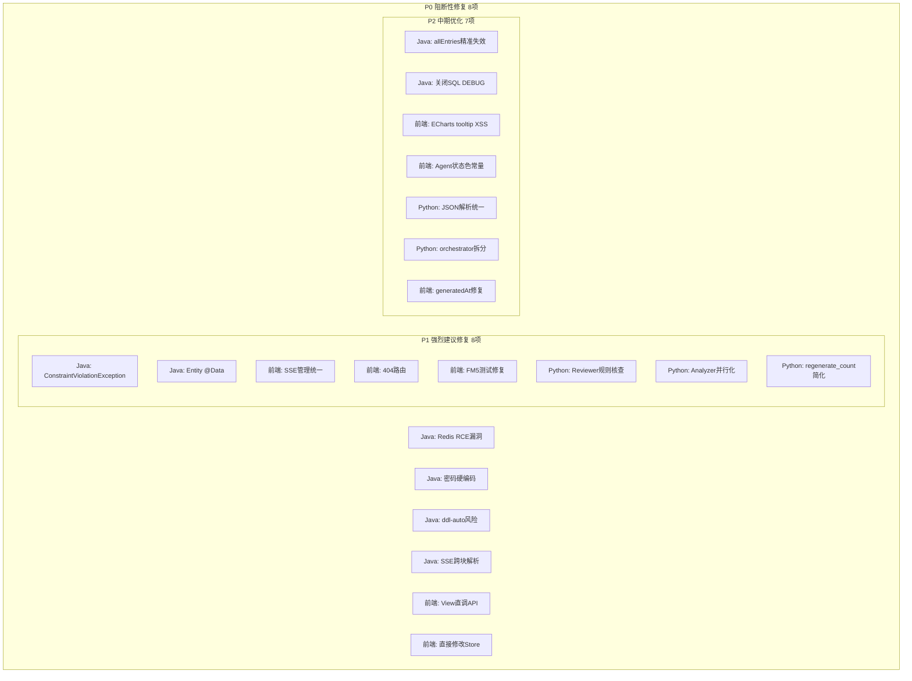

# XH-202630 全栈 P0-P2 问题修复计划

**基于**：`log/阶段审阅报告/三层全栈综合技术评估报告-2026-06-18.md`
**创建日期**：2026-06-18
**修复范围**：P0（8项）+ P1（8项）+ P2（7项），共 23 项

---

## 一、修复概览



---

## 二、P0 修复详情（阻断生产部署，必须立即修复）

### P0-1: Java Redis 反序列化 RCE 漏洞

**文件**：`backend/src/main/java/com/literatureassistant/config/RedisConfig.java`
**当前状态**（第35-38行）：
```java
om.activateDefaultTyping(
        LaissezFaireSubTypeValidator.instance,
        ObjectMapper.DefaultTyping.NON_FINAL,
        JsonTypeInfo.As.PROPERTY);
```

**修复方案**：替换为 `BasicPolymorphicTypeValidator` 白名单验证器，仅允许项目包和 JDK 基础类型。

**修改内容**：
```java
// 替换 activateDefaultTyping 调用
import com.fasterxml.jackson.databind.jsontype.BasicPolymorphicTypeValidator;

om.activateDefaultTyping(
        BasicPolymorphicTypeValidator.builder()
                .allowIfSubType("com.literatureassistant.")
                .allowIfSubType("java.util.")
                .allowIfSubType("java.time.")
                .allowIfSubType("java.lang.")
                .build(),
        ObjectMapper.DefaultTyping.NON_FINAL,
        JsonTypeInfo.As.PROPERTY);
```

---

### P0-2: Java application.yml 密码硬编码

**文件**：`backend/src/main/resources/application.yml`
**当前状态**（第13行）：
```yaml
password: ${MYSQL_PASSWORD:Aa2105268075.}
```

**修复方案**：移除真实密码默认值，改为无意义占位符。

**修改内容**：
```yaml
# 第13行
password: ${MYSQL_PASSWORD:CHANGE_ME}
```

---

### P0-3: Java application-test.yml 密码硬编码

**文件**：`backend/src/test/resources/application-test.yml`
**当前状态**（第5行）：
```yaml
password: Aa2105268075.
```

**修复方案**：使用环境变量覆盖机制。

**修改内容**：
```yaml
# 第5行
password: ${MYSQL_TEST_PASSWORD:test_password}
```

---

### P0-4: Java ddl-auto 生产风险

**文件**：`backend/src/main/resources/application.yml`
**当前状态**（第22行）：
```yaml
ddl-auto: update
```

**修复方案**：改为 `validate`（仅校验不修改），开发环境通过 Profile 覆盖。

**修改内容**：
```yaml
# 第22行
ddl-auto: validate
```

同时在 `application.yml` 末尾或独立 `application-dev.yml` 中添加：
```yaml
# application-dev.yml (新建)
spring:
  jpa:
    hibernate:
      ddl-auto: update
```

---

### P0-5: Java SSE 跨块事件解析

**文件**：`backend/src/main/java/com/literatureassistant/client/PythonAIClient.java`
**当前状态**（第196-204行）：
```java
private List<String> splitSseEvents(byte[] bytes) {
    // 假设 Mock 测试用完整事件块
    String chunk = new String(bytes, StandardCharsets.UTF_8);
    String[] parts = chunk.split("\\n\\n");
    return List.of(parts);
}
```

**修复方案**：在 `streamSse` 方法层级维护 `StringBuilder` 缓冲区，累积跨块的不完整尾部。

**修改内容**：
```java
// 在 streamSse 方法中，替换 bodyToFlux(byte[].class) 的处理方式
// 使用 bufferUntil + reduce 模式

private Flux<AgentSseEvent> streamSse(String endpoint, AgentRequest request, String lastEventId) {
    // ... 构建请求 ...
    return bodySpec
            .bodyValue(request)
            .retrieve()
            .bodyToFlux(String.class)  // 改用 String 而非 byte[]
            .bufferUntil(line -> line.isBlank())  // 按空行（事件分隔符）分组
            .filter(lines -> !lines.isEmpty())
            .map(this::parseSseEventFromLines)
            .onErrorContinue((e, obj) -> log.warn("SSE event parse error: {}", e.getMessage()));
}

private AgentSseEvent parseSseEventFromLines(List<String> lines) {
    // 解析 "event: xxx\ndata: {...}" 格式
    String eventType = null;
    String data = null;
    for (String line : lines) {
        if (line.startsWith("event: ")) {
            eventType = line.substring(7).trim();
        } else if (line.startsWith("data: ")) {
            data = line.substring(6).trim();
        }
    }
    // 转换为 AgentSseEvent
    return new AgentSseEvent(eventType, data);
}
```

**注意**：此修改需要同时调整 `parseSseEvent` 方法签名，从接收 `byte[]` 改为接收 `List<String>`。

---

### P0-6: Python 审核降级放行幻觉

**文件**：`ai-service/app/agents/graph.py`
**当前状态**（第410-413行）：
```python
# 降级时标记审核通过，不阻塞流程
review_result["approved"] = True
update["review_result"] = review_result
```

**修复方案**：降级时标记 `approved=True` 但新增 `review_skipped=True`，前端据此提示用户人工核查。

**修改内容**：
```python
# graph.py review_node 第405-413行
if result.get("degraded", False):
    update["degraded"] = True
    update["degraded_agents"] = state.get("degraded_agents", []) + ["reviewer"]
    update["degradation_level"] = "agent"
    update["errors"] = state.get("errors", []) + [{"agent": "reviewer", "error": "审核降级，跳过审核"}]
    # 降级时标记审核通过但标注 review_skipped，前端提示用户人工核查
    review_result["approved"] = True
    review_result["review_skipped"] = True  # 新增标记
    update["review_result"] = review_result
```

同样修改第416-425行的异常处理：
```python
except Exception as e:
    logger.error(f"review_node failed: {e}")
    return {
        "review_result": {
            "approved": True,
            "review_skipped": True,  # 新增
            "issues": [],
            "suggestions": [],
            "citation_accuracy": 0.0,
            "fact_accuracy": 0.0,
        },
        ...
    }
```

---

### P0-7: Python Token 爆炸 — 分析结果截断

**涉及文件**：
- `ai-service/app/agents/generator.py`（第138行）
- `ai-service/app/agents/comparer.py`（第153行）
- `ai-service/app/agents/reviewer.py`（第44行）

**修复方案**：在 `json.dumps` 前对分析结果进行截断/摘要化，限制注入 Prompt 的数据量。

**修改内容**：

**generator.py** — 新增 `_truncate_analysis_for_prompt` 方法，在 `build_prompt` 中调用：
```python
# generator.py 新增方法
MAX_ANALYSIS_CHARS = 8000  # 限制约 2000 tokens

def _truncate_analysis_for_prompt(self, analysis_results: List[dict]) -> str:
    """截断分析结果，避免 Prompt 过长"""
    full_json = json.dumps(analysis_results, ensure_ascii=False)
    if len(full_json) <= self.MAX_ANALYSIS_CHARS:
        return full_json
    
    # 截断每篇论文的分析结果，只保留关键维度
    truncated = []
    for ar in analysis_results:
        truncated_ar = {
            "paper_id": ar.get("paper_id"),
            "paper_title": ar.get("paper_title", ""),
            "research_problem": self._truncate_dimension(ar.get("research_problem")),
            "core_method": self._truncate_dimension(ar.get("core_method")),
            "core_conclusions": self._truncate_dimension(ar.get("core_conclusions")),
        }
        truncated.append(truncated_ar)
    return json.dumps(truncated, ensure_ascii=False)

def _truncate_dimension(self, dim_data) -> dict:
    """截断单个维度数据，保留 summary 前200字符"""
    if isinstance(dim_data, dict):
        summary = dim_data.get("summary", "")
        if isinstance(summary, str) and len(summary) > 200:
            return {"summary": summary[:200] + "...", "confidence": dim_data.get("confidence", 0.0)}
        return dim_data
    if isinstance(dim_data, str) and len(dim_data) > 200:
        return dim_data[:200] + "..."
    return dim_data

# build_prompt 第138行修改为：
analysis_data = self._truncate_analysis_for_prompt(analysis_results)
```

**comparer.py** — 同样新增截断方法：
```python
# comparer.py build_prompt 第153行修改为：
analysis_data_str = self._truncate_analysis_for_prompt(analysis_results)
```

**reviewer.py** — 新增论文数据截断：
```python
# reviewer.py 新增
MAX_PAPERS_CHARS = 6000  # 限制约 1500 tokens

def _truncate_papers_for_prompt(self, original_papers: List[dict]) -> str:
    """截断原始论文数据"""
    if not original_papers:
        return "无"
    full_json = json.dumps(original_papers, ensure_ascii=False)
    if len(full_json) <= self.MAX_PAPERS_CHARS:
        return full_json
    # 截断每篇论文的摘要
    truncated = []
    for p in original_papers:
        truncated_p = {
            "paper_id": p.get("paper_id"),
            "title": p.get("title", ""),
            "abstract": (p.get("abstract", "") or "")[:300],
            "year": p.get("year"),
        }
        truncated.append(truncated_p)
    return json.dumps(truncated, ensure_ascii=False)

# build_prompt 第44行修改为：
papers_json = self._truncate_papers_for_prompt(original_papers)
```

---

### P0-8: 前端 View 直接调用 API → Store Action

**涉及文件**：
- `frontend/src/views/CompareView.vue`
- `frontend/src/views/ReportView.vue`
- `frontend/src/stores/sessionStore.ts`

**修复方案**：在 `sessionStore` 中新增 `comparePapers`、`generateReport`、`saveReportContent` 三个 Action，View 层改为调用 Store Action。

**修改内容**：

**sessionStore.ts** — 新增 Action：
```typescript
// sessionStore.ts 新增
async function comparePapers(paperIds: string[]): Promise<any> {
  loading.value = true
  error.value = null
  try {
    const result = await analysisApi.comparePapers({ paperIds })
    return result
  } catch (e: any) {
    error.value = e.message || '对比失败'
    throw e
  } finally {
    loading.value = false
  }
}

async function generateReport(params: { topic: string; paperIds: string[]; profile: any }): Promise<any> {
  loading.value = true
  error.value = null
  try {
    const result = await analysisApi.generateReport(params)
    return result
  } catch (e: any) {
    error.value = e.message || '生成报告失败'
    throw e
  } finally {
    loading.value = false
  }
}

async function saveReportContent(analysisId: string, content: string): Promise<void> {
  try {
    await analysisApi.saveReportContent(analysisId, content)
  } catch (e: any) {
    error.value = e.message || '保存失败'
    throw e
  }
}

// 在 return 中暴露
return {
  // ... 现有暴露 ...
  comparePapers,
  generateReport,
  saveReportContent,
}
```

**CompareView.vue** — 修改 API 调用：
```typescript
// 第72行 修改前: await analysisApi.comparePapers(...)
// 修改后:
const result = await sessionStore.comparePapers(paperStore.selectedPaperIds)

// 第104行 修改前: await analysisApi.generateReport(...)
// 修改后:
const result = await sessionStore.generateReport({
  topic: topic.value,
  paperIds: paperStore.selectedPaperIds,
  profile: userStore.profile,
})
```

**ReportView.vue** — 修改 API 调用：
```typescript
// 第167行 修改前: await analysisApi.saveReportContent(...)
// 修改后:
await sessionStore.saveReportContent(analysisId.value, editableContent.value)
```

---

### P0-9: 前端直接修改 Store State → Action

**涉及文件**：
- `frontend/src/views/SearchView.vue`
- `frontend/src/stores/paperStore.ts`

**修复方案**：在 `paperStore` 中新增 `setSortBy` Action，SearchView 改为调用 Action。

**修改内容**：

**paperStore.ts** — 新增 Action：
```typescript
// paperStore.ts 新增
function setSortBy(sort: SortParams) {
  sortBy.value = sort
  if (currentQuery.value) {
    searchPapers(currentQuery.value, 1, sort)
  }
}

// 在 return 中暴露 setSortBy
```

**SearchView.vue** — 修改：
```typescript
// 第48行 修改前: paperStore.sortBy = sort
// 修改后:
function handleSortChange(sort: SortParams) {
  paperStore.setSortBy(sort)
}

// 第207行 模板中 v-model 修改为单向绑定 + 事件
// 修改前: v-model="paperStore.sortBy"
// 修改后:
<SortDropdown
  :model-value="paperStore.sortBy"
  @update:model-value="handleSortChange"
/>
```

---

## 三、P1 修复详情（强烈建议，下个迭代）

### P1-1: Java ConstraintViolationException 处理

**文件**：`backend/src/main/java/com/literatureassistant/exception/GlobalExceptionHandler.java`

**修改内容**：新增异常处理器
```java
@ExceptionHandler(jakarta.validation.ConstraintViolationException.class)
public ResponseEntity<ApiResponse<Void>> handleConstraintViolation(
        jakarta.validation.ConstraintViolationException e) {
    String message = e.getConstraintViolations().stream()
            .map(v -> v.getPropertyPath() + ": " + v.getMessage())
            .collect(Collectors.joining("; "));
    log.warn("参数校验失败: {}", message);
    return ResponseEntity.status(HttpStatus.BAD_REQUEST)
            .body(ApiResponse.error(400, message));
}
```

---

### P1-2: Java Entity @Data → @Getter/@Setter/@EqualsAndHashCode

**涉及文件**（4个）：
- `backend/src/main/java/com/literatureassistant/entity/Paper.java`
- `backend/src/main/java/com/literatureassistant/entity/Session.java`
- `backend/src/main/java/com/literatureassistant/entity/AnalysisResult.java`
- `backend/src/main/java/com/literatureassistant/entity/PaperFavorite.java`

**修改内容**（以 Paper.java 为例，其他三个同理）：
```java
// 修改前:
@Data
@NoArgsConstructor
@AllArgsConstructor
@Builder
@Entity
@Table(name = "papers")
public class Paper {
    @Id
    @GeneratedValue(strategy = GenerationType.IDENTITY)
    private Long id;
    // ...
}

// 修改后:
@Getter
@Setter
@NoArgsConstructor
@AllArgsConstructor
@Builder
@Entity
@Table(name = "papers")
@EqualsAndHashCode(onlyExplicitlyIncluded = true)
public class Paper {
    @Id
    @GeneratedValue(strategy = GenerationType.IDENTITY)
    @EqualsAndHashCode.Include
    private Long id;
    // ...
}
```

---

### P1-3: 前端 404 兜底路由

**文件**：`frontend/src/router/index.ts`

**修改内容**：在路由数组末尾添加 catch-all 路由
```typescript
{
  path: '/:pathMatch(.*)*',
  name: 'NotFound',
  component: () => import('@/views/NotFoundView.vue'),
  meta: { requiresAuth: false }
}
```

**新建文件**：`frontend/src/views/NotFoundView.vue`
```vue
<template>
  <div class="not-found">
    <el-result icon="warning" title="404" sub-title="页面不存在">
      <template #extra>
        <el-button type="primary" @click="$router.push('/')">返回首页</el-button>
      </template>
    </el-result>
  </div>
</template>
```

---

### P1-4: 前端 generatedAt 修复

**文件**：`frontend/src/views/ReportView.vue`
**当前状态**（第81-84行）：
```typescript
const generatedAt = computed<string | undefined>(() => {
  if (!result.value) return undefined
  return new Date().toISOString()  // BUG
})
```

**修改内容**：
```typescript
const generatedAt = computed<string | undefined>(() => {
  if (!result.value) return undefined
  return result.value.createdAt || result.value.completedAt || undefined
})
```

---

### P1-5: Python Reviewer 引入独立规则核查

**文件**：`ai-service/app/agents/reviewer.py`

**修改内容**：新增 `_rule_based_citation_check` 方法，不依赖 LLM 自评：
```python
def _rule_based_citation_check(self, report: str, original_papers: List[dict]) -> dict:
    """基于规则的引用核查，不依赖 LLM 自评"""
    # 统计报告中 [N] 引用数量
    numeric_citations = re.findall(r'\[(\d+)\]', report)
    total_citations = len(set(numeric_citations))
    
    # 检查引用编号是否在论文范围内
    paper_count = len(original_papers)
    accurate_citations = sum(1 for n in numeric_citations 
                            if 1 <= int(n) <= paper_count)
    
    accuracy_rate = accurate_citations / total_citations if total_citations > 0 else 0.0
    
    return {
        "total_citations": total_citations,
        "accurate_citations": accurate_citations,
        "accuracy_rate": round(accuracy_rate, 4),
        "method": "rule_based",
    }

# 在 _calculate_citation_accuracy_from_result 中增加规则核查兜底：
def _calculate_citation_accuracy_from_result(self, parsed: dict) -> float:
    citation_check = parsed.get("citation_check", {})
    if not citation_check:
        return 0.0
    accuracy_rate = citation_check.get("accuracy_rate", 0.0)
    try:
        return float(accuracy_rate)
    except (TypeError, ValueError):
        return 0.0
```

---

### P1-6: Python Analyzer 并行化 LLM 调用

**文件**：`ai-service/app/agents/analyzer.py`
**当前状态**（第74-99行）：逐篇串行调用 LLM

**修改内容**：使用 `asyncio.gather` 并行化：
```python
# analyzer.py _run 方法修改
async def _run(self, prompt: str, input_data: dict, context: dict) -> dict:
    papers: List[dict] = input_data.get("papers", [])
    if not papers:
        return {"analysis_results": [], ...}
    
    papers = papers[:self.max_papers]
    
    # 并行分析所有论文（限制并发数）
    semaphore = asyncio.Semaphore(3)  # 最多 3 个并发 LLM 调用
    
    async def analyze_with_semaphore(paper, idx):
        async with semaphore:
            paper_id = paper.get("paper_id", f"paper_{idx}")
            try:
                result = await self._analyze_single_paper(paper, context)
                result["paper_id"] = paper_id
                result["degraded"] = False
                return ("success", result)
            except Exception as e:
                logger.warning(f"LLM analysis failed for paper {paper_id}: {e}")
                try:
                    fallback = self._rule_based_extraction(paper)
                    fallback["paper_id"] = paper_id
                    fallback["degraded"] = True
                    fallback["degraded_reason"] = str(e)
                    return ("degraded", fallback)
                except Exception as fallback_err:
                    return ("failed", paper_id)
    
    tasks = [analyze_with_semaphore(paper, idx) for idx, paper in enumerate(papers)]
    results = await asyncio.gather(*tasks, return_exceptions=True)
    
    analysis_results = []
    degraded_papers = []
    for status, data in results:
        if status in ("success", "degraded"):
            analysis_results.append(data)
            if status == "degraded":
                degraded_papers.append(data.get("paper_id"))
        elif status == "failed":
            degraded_papers.append(data)
    
    # ... 后续逻辑不变
```

---

### P1-7: Python regenerate_count 逻辑简化

**文件**：`ai-service/app/agents/graph.py`
**当前状态**（第332-334行）：复杂的递增条件

**修改内容**：简化为明确的重试计数：
```python
# graph.py generate_node 第332-334行 修改为：
# 每次进入 generate_node 且 state 中有 review_result 且未通过时递增
review_result = state.get("review_result") or {}
if review_result and not review_result.get("approved", True):
    update["regenerate_count"] = state.get("regenerate_count", 0) + 1
```

---

## 四、P2 修复详情（中期优化）

### P2-1: Java @CacheEvict(allEntries=true) 精准失效

**文件**：`backend/src/main/java/com/literatureassistant/service/SessionService.java` 和 `FavoriteService.java`

**修改内容**：使用 RedisTemplate 按前缀精准删除：
```java
// SessionService.java
private void evictUserSessionListCache(String userId) {
    Set<String> keys = redisTemplate.keys("session:list:" + userId + ":*");
    if (keys != null && !keys.isEmpty()) {
        redisTemplate.delete(keys);
    }
}
```

### P2-2: Java 关闭生产 SQL DEBUG 日志

**文件**：`backend/src/main/resources/application.yml`
**当前状态**（第69行）：
```yaml
org.hibernate.SQL: DEBUG
```

**修改内容**：
```yaml
org.hibernate.SQL: WARN
```

### P2-3: 前端 ECharts tooltip HTML 转义

**文件**：`frontend/src/components/agent/AgentFlowChart.vue`
**当前状态**（第149-163行）：HTML 字符串拼接无转义

**修改内容**：新增 `escapeHtml` 函数并对 `intermediateResult` 转义：
```typescript
function escapeHtml(text: string): string {
  return text
    .replace(/&/g, '&amp;')
    .replace(/</g, '&lt;')
    .replace(/>/g, '&gt;')
    .replace(/"/g, '&quot;')
    .replace(/'/g, '&#39;')
}

// 在 tooltip formatter 中使用
if (v.intermediateResult) {
  lines.push(`结果：${escapeHtml(v.intermediateResult.slice(0, 80))}${v.intermediateResult.length > 80 ? '...' : ''}`)
}
```

### P2-4: 前端 Agent 状态色常量提取

**新建文件**：`frontend/src/constants/agent.ts`
```typescript
export const AGENT_STATUS_COLORS = {
  waiting:   '#C0C4CC',
  running:   '#409EFF',
  completed: '#67C23A',
  failed:    '#F56C6C'
} as const
```

**修改文件**：`AgentFlowChart.vue` 和 `AgentStatusPanel.vue` 改为 import 使用。

### P2-5: Python JSON 解析逻辑统一

**新建文件**：`ai-service/app/utils/json_parser.py`
```python
"""统一的 JSON 解析工具，4 级降级策略"""
import json
import re
from typing import Optional

def extract_json(text: str) -> Optional[dict]:
    """从 LLM 输出中提取 JSON，4 级降级"""
    if not text or not text.strip():
        return None
    cleaned = text.strip()
    
    # Level 1: 标准 JSON
    try:
        return json.loads(cleaned)
    except json.JSONDecodeError:
        pass
    
    # Level 2: ```json``` 代码块
    m = re.search(r"```json\s*(.*?)\s*```", cleaned, re.DOTALL)
    if m:
        try:
            return json.loads(m.group(1))
        except json.JSONDecodeError:
            pass
    
    # Level 3: ``` 代码块
    m = re.search(r"```\s*(.*?)\s*```", cleaned, re.DOTALL)
    if m:
        try:
            return json.loads(m.group(1))
        except json.JSONDecodeError:
            pass
    
    # Level 4: 首个 {} 块
    start = cleaned.find("{")
    end = cleaned.rfind("}")
    if start != -1 and end > start:
        try:
            return json.loads(cleaned[start:end+1])
        except json.JSONDecodeError:
            pass
    
    return None
```

**修改文件**：`analyzer.py`、`comparer.py`、`reviewer.py`、`coordinator.py` 改为 import 使用。

### P2-6: Python orchestrator.py 拆分

**文件**：`ai-service/app/agents/orchestrator.py`（714行）

**修改方案**：提取 `_run_node` 和 `_yield_final` 到独立模块 `ai-service/app/agents/node_runner.py`，orchestrator.py 仅保留 `run_workflow_stream` 主流程。

### P2-7: 前端 generatedAt 修复

已在 P1-4 中处理。

---

## 五、验证步骤

### 5.1 Java 后端验证

1. **安全验证**：确认 RedisConfig 不再使用 `LaissezFaireSubTypeValidator`
2. **配置验证**：确认 `application.yml` 和 `application-test.yml` 中无真实密码
3. **SSE 验证**：使用分片 TCP 包测试 SSE 事件解析正确性
4. **异常验证**：发送带无效参数的请求，确认返回 400 而非 500
5. **运行测试**：`mvn test` 确认所有测试通过

### 5.2 Python AI 验证

1. **降级验证**：模拟 Reviewer 降级，确认 `review_skipped` 标记出现在响应中
2. **Token 验证**：使用 10 篇论文测试，确认 Prompt 长度在安全范围内
3. **并行化验证**：确认 Analyzer 并行执行后总耗时显著降低
4. **运行测试**：`pytest tests/ -x` 确认所有测试通过

### 5.3 前端验证

1. **架构验证**：确认 CompareView/ReportView 不再直接 import analysisApi
2. **状态验证**：确认 SearchView 通过 `setSortBy` Action 修改排序
3. **路由验证**：访问 `/nonexistent` 确认显示 404 页面
4. **XSS 验证**：确认 ECharts tooltip 使用 `escapeHtml` 转义
5. **运行测试**：`npm run test` 确认 397 测试通过（含 FM5 修复）

---

## 六、假设与决策

1. **修复顺序**：先修 P0（阻断性），再修 P1（强烈建议），最后修 P2（优化）
2. **向后兼容**：所有修改保持 API 契约不变，前端 `review_skipped` 为新增字段不影响现有逻辑
3. **并发限制**：Analyzer 并行化使用 `Semaphore(3)` 限制并发 LLM 调用，避免 API 限流
4. **截断策略**：分析结果截断优先保留 `research_problem`、`core_method`、`core_conclusions` 三个关键维度
5. **Profile 区分**：ddl-auto 通过 Spring Profile 区分环境，开发环境保持 `update`
