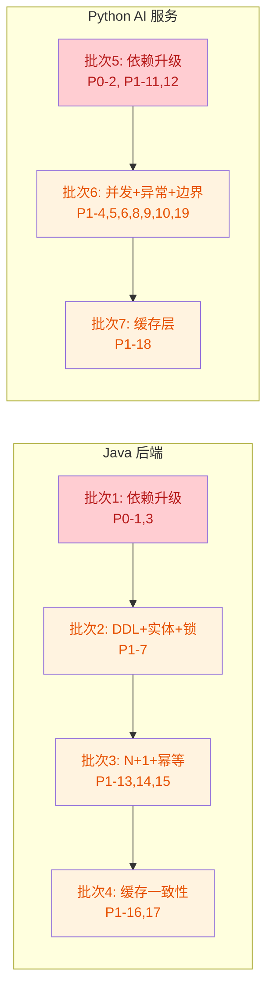

# P0-P1 紧急问题修复计划

> **来源**: 修复清单-1-紧急(P0-P1).md 中的 19 个问题
> **决策**: Spring Boot → 3.2.12(最小改动);Python 依赖 → 向后兼容升级(langgraph 0.2.50+, chromadb 0.5.20+)

---

## 总览

19 个问题按修复依赖关系分为 7 个批次,Java 后端 4 批,Python AI 服务 3 批。



---

## 批次 1: Java 依赖升级 (P0-1, P0-3)

### 1.1 升级 Spring Boot 3.2.5 → 3.2.12

**文件**: `backend/pom.xml` (第 10 行)

**修改**: `<version>3.2.5</version>` → `<version>3.2.12</version>`

**理由**: 3.2.12 是 3.2.x 最后一个安全补丁版本,修复 CVE-2024-38816(Spring Framework 路径遍历)、CVE-2024-34750(Tomcat OOM)、CVE-2024-38819(Spring Security 授权绕过)。最小改动,不跨小版本,API 兼容。

**验证**: `mvn dependency:tree -Dincludes=org.springframework:spring-core,org.apache.tomcat.embed:tomcat-embed-core,org.springframework.security:spring-security-core` 确认版本 ≥ 6.1.13 / 10.1.24 / 6.2.8

### 1.2 升级 Apache POI 5.2.3 → 5.2.5

**文件**: `backend/pom.xml` (第 104 行)

**修改**: `<version>5.2.3</version>` → `<version>5.2.5</version>`

**理由**: 5.2.5 升级了 commons-compress,修复 CVE-2024-25710(ZIP 无限循环 DoS)和 CVE-2024-26308(OOM)。同小版本升级,API 兼容。

**验证**: `mvn dependency:tree -Dincludes=org.apache.commons:commons-compress` 确认版本升级

### 1.3 测试

- 运行 `mvn clean compile` 确认编译通过
- 运行 `mvn test` 确认现有测试不回退
- 重点检查 PdfExporterTest、WordExporterTest(POI 相关)

---

## 批次 2: DDL + 实体 + 锁机制 (P1-7)

### 2.1 DDL: users 表添加 UNIQUE 约束

**文件**: `backend/src/main/resources/db/01_create_tables.sql` (第 19-26 行)

**修改**: 在 users 表 CREATE 语句中添加:
```sql
username VARCHAR(100) NOT NULL COMMENT '用户名',
email VARCHAR(200) COMMENT '邮箱地址',
```
改为:
```sql
username VARCHAR(100) NOT NULL COMMENT '用户名',
email VARCHAR(200) COMMENT '邮箱地址',
```
并在表定义末尾的约束区添加:
```sql
UNIQUE KEY uk_username (username),
UNIQUE KEY uk_email (email),
```

**同时新增迁移脚本**: `backend/src/main/resources/db/04_add_unique_constraints.sql`
```sql
-- P1-7 修复: users 表添加 username/email 唯一约束
ALTER TABLE users ADD UNIQUE KEY uk_username (username);
ALTER TABLE users ADD UNIQUE KEY uk_email (email);
```

### 2.2 DDL: analysis_results 表添加 version 列

**文件**: `backend/src/main/resources/db/01_create_tables.sql` (analysis_results 表)

**修改**: 在 analysis_results 表 CREATE 语句中添加:
```sql
version INT NOT NULL DEFAULT 0 COMMENT '乐观锁版本号',
```

**同时新增迁移脚本**: `backend/src/main/resources/db/05_add_version_column.sql`
```sql
-- P1-7 修复: analysis_results 表添加乐观锁 version 列
ALTER TABLE analysis_results ADD COLUMN version INT NOT NULL DEFAULT 0 COMMENT '乐观锁版本号';
```

### 2.3 AnalysisResult 实体添加 @Version

**文件**: `backend/src/main/java/com/literatureassistant/entity/AnalysisResult.java` (第 32-61 行)

**修改**: 在实体类中添加:
```java
@Version
@Column(name = "version", nullable = false)
private Long version = 0L;
```

**理由**: JPA `@Version` 实现乐观锁,当 `AnalysisTransactionService.completeAnalysis` 并发执行时,后提交者会抛出 `OptimisticLockException`,防止丢失更新。

### 2.4 AnalysisTransactionService 捕获 OptimisticLockException

**文件**: `backend/src/main/java/com/literatureassistant/service/AnalysisTransactionService.java` (completeAnalysis 方法,第 56-74 行)

**修改**: 在 `completeAnalysis` 方法中,捕获 `OptimisticLockException` 转为 `BusinessException`:
```java
try {
    AnalysisResult saved = analysisResultRepository.save(entity);
    // ...
} catch (org.springframework.orm.ObjectOptimisticLockingFailureException e) {
    log.warn("Optimistic lock conflict on AnalysisResult id={}, retrying", id);
    throw new BusinessException(409, "分析结果正在被并发更新,请重试", "CONFLICT");
}
```

### 2.5 SessionService.updateStatus 悲观锁

**文件**: `backend/src/main/java/com/literatureassistant/service/SessionService.java` (第 137-153 行)

**修改**: 在 `SessionRepository` 中添加 `@Lock` 注解的方法:
```java
// SessionRepository.java 新增
@Lock(LockModeType.PESSIMISTIC_WRITE)
@Query("SELECT s FROM Session s WHERE s.sessionId = :sessionId")
Optional<Session> findBySessionIdForUpdate(@Param("sessionId") String sessionId);
```

**修改** `SessionService.updateStatus`: 将 `findBySessionId` 改为 `findBySessionIdForUpdate`:
```java
Session session = sessionRepository.findBySessionIdForUpdate(sessionId)
        .orElseThrow(() -> new ResourceNotFoundException("Session", sessionId));
```

**同样修改** `markAsCompleted`(第 155-169 行)、`markAsExpired`(第 171-185 行)、`deleteSession`(第 187-198 行)中的 `findBySessionId` 调用。

### 2.6 UserService.register 捕获唯一约束冲突

**文件**: `backend/src/main/java/com/literatureassistant/service/UserService.java` (register 方法,第 48-72 行)

**修改**: 在 `userRepository.save(user)` 处捕获 `DataIntegrityViolationException`:
```java
try {
    userRepository.save(user);
} catch (org.springframework.dao.DataIntegrityViolationException e) {
    String msg = e.getMostSpecificCause().getMessage();
    if (msg.contains("uk_username")) {
        throw new BusinessException(409, "用户名已存在", "USERNAME_DUPLICATE");
    } else if (msg.contains("uk_email")) {
        throw new BusinessException(409, "邮箱已被注册", "EMAIL_DUPLICATE");
    }
    throw e;
}
```

### 2.7 测试

- 新增 `AnalysisTransactionServiceOptimisticLockTest`: 模拟两个线程同时 completeAnalysis,验证第二个抛出 409
- 新增 `SessionServicePessimisticLockTest`: 验证 `findBySessionIdForUpdate` 使用了 SELECT FOR UPDATE
- 新增 `UserServiceUniqueConstraintTest`: 并发注册相同用户名,验证 DB 拒绝重复
- 扩展 `SessionStateMachineTest`: 验证并发状态转换的正确性

---

## 批次 3: N+1 查询 + 幂等性 (P1-13, P1-14, P1-15)

### 3.1 AnalysisService 提取批量校验方法

**文件**: `backend/src/main/java/com/literatureassistant/service/AnalysisService.java`

**新增私有方法** (参考 FavoriteService.listFavorites 第 143-148 行模式):
```java
private void validatePapersExist(List<String> paperIds) {
    List<Paper> papers = paperRepository.findByPaperIdIn(paperIds);
    if (papers.size() != paperIds.size()) {
        Set<String> found = papers.stream().map(Paper::getPaperId).collect(Collectors.toSet());
        List<String> missing = paperIds.stream().filter(id -> !found.contains(id)).toList();
        throw new ResourceNotFoundException("Paper", String.join(", ", missing));
    }
}
```

**修改 comparePapers** (第 139-142 行): 替换 for 循环为:
```java
validatePapersExist(request.getPaperIds());
```

**修改 generateReport** (第 189-192 行): 同样替换。

**注意**: 需注入 `PaperRepository`。当前 AnalysisService 注入的是 `PaperService`,需额外注入 `PaperRepository` 或在 PaperService 中暴露 `findAllByPaperIdIn` 方法。

**决策**: 在 `PaperService` 中新增 `validatePapersExist(List<String> paperIds)` 公开方法,内部调用 `paperRepository.findByPaperIdIn`,AnalysisService 调用 PaperService 该方法,保持分层。

### 3.2 幂等性: Idempotency-Key 机制

**新增工具类**: `backend/src/main/java/com/literatureassistant/util/IdempotencyUtil.java`
```java
@Component
public class IdempotencyUtil {
    private final StringRedisTemplate redisTemplate;

    /**
     * 尝试获取幂等锁。返回 true 表示首次请求,可继续执行;false 表示重复请求。
     * @param key 幂等键
     * @param ttl 锁过期时间
     * @return 是否首次请求
     */
    public boolean tryAcquire(String key, Duration ttl) {
        Boolean acquired = redisTemplate.opsForValue()
                .setIfAbsent("idempotency:" + key, "1", ttl);
        return Boolean.TRUE.equals(acquired);
    }

    /**
     * 存储结果,供重复请求返回
     */
    public void storeResult(String key, Object result, Duration ttl) {
        redisTemplate.opsForValue()
                .set("idempotency:result:" + key, serialize(result), ttl);
    }

    /**
     * 获取已存储的结果
     */
    public String getStoredResult(String key) {
        return redisTemplate.opsForValue().get("idempotency:result:" + key);
    }
}
```

**修改 AnalysisController** (3 个端点):
```java
@PostMapping("/paper")
public ApiResponse<AnalysisTaskResponse> analyzePaper(
        @RequestHeader(value = "Idempotency-Key", required = false) String idempotencyKey,
        @AuthenticationPrincipal UserDetails userDetails,
        @Valid @RequestBody PaperAnalysisRequest request) {
    String userId = getUserId(userDetails);
    String effectiveKey = idempotencyKey != null ? idempotencyKey
            : DigestUtils.md5Hex(userId + ":" + request.getPaperId() + ":" + request.getTopic());
    if (!idempotencyUtil.tryAcquire(effectiveKey, Duration.ofMinutes(5))) {
        String cached = idempotencyUtil.getStoredResult(effectiveKey);
        if (cached != null) {
            return ApiResponse.success(objectMapper.readValue(cached, AnalysisTaskResponse.class));
        }
        throw new BusinessException(409, "相同的分析请求正在处理中,请稍后重试", "IDEMPOTENT_IN_PROGRESS");
    }
    AnalysisTaskResponse response = analysisService.analyzePaper(userId, request);
    idempotencyUtil.storeResult(effectiveKey, response, Duration.ofMinutes(5));
    return ApiResponse.success(response);
}
```

**comparePapers 和 generateReport 端点同理**。effectiveKey 计算需包含 paperIds 列表的 hash:
```java
String effectiveKey = idempotencyKey != null ? idempotencyKey
        : DigestUtils.md5Hex(userId + ":" + request.getPaperIds().hashCode() + ":" + request.getTopic());
```

### 3.3 测试

- 扩展 `AnalysisServiceQueryTest` / `AnalysisServiceReportTest`: 传入多个 paperId,使用 `@Sql` 统计验证查询次数为 1
- 新增 `AnalysisIdempotencyTest`: 连续发送两个相同请求,验证只创建一个 AnalysisResult
- 新增 `IdempotencyUtilTest`: tryAcquire/storeResult/getStoredResult 单元测试

---

## 批次 4: 缓存一致性修复 (P1-16, P1-17)

### 4.1 syncProfileToRedis 失败时删除旧 Key

**文件**: `backend/src/main/java/com/literatureassistant/service/UserService.java` (syncProfileToRedis 方法,第 255-263 行)

**修改**:
```java
private void syncProfileToRedis(String userId, ProfileResponse profile) {
    String key = RedisKeyUtil.userProfileJsonKey(userId);
    try {
        String json = objectMapper.writeValueAsString(profile);
        redisTemplate.opsForValue().set(key, json, Duration.ofHours(1));
    } catch (Exception e) {
        log.warn("Failed to sync profile to Redis, deleting stale key: userId={}", userId);
        redisTemplate.delete(key);  // 删除旧值,避免读到过期数据
    }
}
```

### 4.2 UserService 移除 @CacheEvict,改用 CacheEvictionHelper

**文件**: `backend/src/main/java/com/literatureassistant/service/UserService.java`

**修改 createProfile** (第 170-171 行):
- 移除 `@CacheEvict(value = {"userProfile", "userProfileJson", "userInfo"}, key = "#userId")`
- 在方法体内 DB 写入后添加:
```java
cacheEvictionHelper.evictByPatternAfterCommit("userProfile::" + userId);
cacheEvictionHelper.evictByPatternAfterCommit("userInfo::" + userId);
// 手动删除 syncProfileToRedis 写入的 Key
// (在 afterCommit 回调中执行,确保事务提交后才删)
```

**需要扩展 CacheEvictionHelper**: 新增 `evictKeysAfterCommit(String... keys)` 方法,支持精确删除非 pattern 的 Key:
```java
public void evictKeysAfterCommit(String... keys) {
    if (TransactionSynchronizationManager.isSynchronizationActive()) {
        TransactionSynchronizationManager.registerSynchronization(new TransactionSynchronization() {
            @Override
            public void afterCommit() {
                for (String key : keys) {
                    redisTemplate.delete(key);
                }
            }
        });
    } else {
        for (String key : keys) {
            redisTemplate.delete(key);
        }
    }
}
```

**修改 createProfile / updateProfile**:
```java
@Transactional
public ProfileResponse updateProfile(String userId, ProfileUpdateRequest request) {
    // ... DB 写入 ...
    ProfileResponse response = userMapper.toProfileResponse(entity);
    syncProfileToRedis(userId, response);  // 先写新值
    // 事务提交后删除 Spring Cache 中的旧值
    cacheEvictionHelper.evictKeysAfterCommit(
        "userProfile::" + userId,
        "userInfo::" + userId
    );
    return response;
}
```

**同样修改** `createProfile`(第 170-198 行)和 `updateUser`(第 106-134 行)。

### 4.3 测试

- 扩展 `UserServiceCacheTest`: Mock redisTemplate.set() 抛异常,验证 delete() 被调用
- 扩展 `UserServiceCacheTest`: 验证 evictKeysAfterCommit 在事务提交后执行
- 扩展 `UserServiceProfileTest`: 验证 createProfile/updateProfile 后缓存一致性

---

## 批次 5: Python 依赖升级 (P0-2, P1-11, P1-12)

### 5.1 升级 python-multipart 和 httpx

**文件**: `ai-service/requirements.txt`

**修改**:
- `python-multipart==0.0.12` → `python-multipart==0.0.13`
- `httpx==0.27.0` → `httpx==0.28.1`

### 5.2 升级 langgraph

**文件**: `ai-service/requirements.txt`

**修改**:
- `langgraph==0.2.28` → `langgraph==0.2.50`

**理由**: 0.2.50 正式声明对 langchain-core 0.3.x 的完整支持,同 0.2.x 系列内升级,API 兼容性风险最低。

### 5.3 升级 chromadb + numpy

**文件**: `ai-service/requirements.txt`

**修改**:
- `chromadb==0.5.0` → `chromadb==0.5.20`
- `numpy>=1.26.0,<2.0.0` → `numpy==1.26.4`

**理由**: chromadb 0.5.20 支持 Python 3.13 且不再强制 numpy < 2.0.0。但为最小化变动,numpy 暂固定为 1.26.4(当前范围内最后一个稳定版),后续可单独升级到 2.x。

### 5.4 验证

- `pip install -r requirements.txt` 成功安装
- 运行 `pytest tests/` 全量测试
- 重点运行 `test_6agent_e2e.py`(langgraph 兼容性)、`test_vector_store.py`、`test_embedding.py`(chromadb 兼容性)

---

## 批次 6: Python 并发/异常/边界修复 (P1-4,5,6,8,9,10,19)

### 6.1 LLMService 引入 asyncio.Lock (P1-5)

**文件**: `ai-service/app/services/llm_service.py`

**修改 __init__** (第 286-298 行): 添加 `self._state_lock = asyncio.Lock()`

**修改 _fallback** (第 357-377 行):
```python
async def _fallback(self) -> None:
    async with self._state_lock:
        # 原有 _fallback 逻辑,修改 active_provider 和 _degradation_state
```

**修改 _recovery_loop** (第 379-405 行): 恢复 provider 时获取锁:
```python
async with self._state_lock:
    self.active_provider = provider
    self._degradation_state["current_provider"] = provider_name
```

**修改 generate / generate_stream** (第 433-436, 444-448, 484-487 行): 递增 consecutive_failures 时获取锁:
```python
async with self._state_lock:
    self._degradation_state["consecutive_failures"][provider_name] = (
        self._degradation_state["consecutive_failures"].get(provider_name, 0) + 1
    )
```

### 6.2 generate_stream 流失败不重发 (P1-8)

**文件**: `ai-service/app/services/llm_service.py` (generate_stream 方法,第 481-504 行)

**修改 except 块**:
```python
except Exception as e:
    logger.error(f"LLM stream failed: {e}")
    provider_name = self.active_provider.mode
    async with self._state_lock:
        self._degradation_state["consecutive_failures"][provider_name] = (
            self._degradation_state["consecutive_failures"].get(provider_name, 0) + 1
        )
    # 如果已经 yield 过 token,不重发完整响应,仅通知中断
    if first_token_yielded:
        yield "\n\n[生成中断,已显示部分内容]"
        return
    # 仅在未 yield 过 token 时才降级为非流式
    try:
        await self._fallback()
        logger.info("LLM stream degraded to non-stream generate()")
        full_response = await asyncio.wait_for(
            self.active_provider.generate(prompt, max_tokens, temperature),
            timeout=30,
        )
        first_token_latency_ms = (time.perf_counter() - stream_start) * 1000
        logger.info(f"first_token_latency_ms={first_token_latency_ms:.1f} "
                     f"provider={self.active_provider.mode} (degraded)")
        yield full_response
    except Exception as fallback_err:
        raise LLMException(str(fallback_err)) from fallback_err
```

### 6.3 VectorStoreService 所有 ChromaDB 操作包装为异步 (P1-6)

**文件**: `ai-service/app/services/vector_store_service.py`

**修改**: 为所有直接调用 ChromaDB 同步 API 的方法添加 `asyncio.to_thread()` 包装。

涉及方法及行号:
- `add_papers` (第 75 行): `self.collection.add(...)` → `await asyncio.to_thread(self.collection.add, ...)`
- `search` (第 104 行): `self.collection.query(...)` → `await asyncio.to_thread(self.collection.query, ...)`
- `delete_papers` (第 135 行): `self.collection.delete(...)` → `await asyncio.to_thread(self.collection.delete, ...)`
- `count` (第 141 行): `self.collection.count()` → `await asyncio.to_thread(self.collection.count)`
- `add_papers_batch` (第 183 行): 循环内 `self.collection.add(...)` → `await asyncio.to_thread(...)`
- `get_paper_by_id` (第 203 行): `self.collection.get(...)` → `await asyncio.to_thread(self.collection.get, ...)`
- `update_paper_metadata` (第 231 行): `self.collection.update(...)` → `await asyncio.to_thread(self.collection.update, ...)`
- `search_by_keywords` (第 328, 387 行): `self.collection.query(...)` → `await asyncio.to_thread(...)`
- `suggest_titles` (第 425 行): `self.collection.query(...)` → `await asyncio.to_thread(...)`

**注意**: `to_thread` 不支持 kwargs 传递,需要用 `functools.partial` 或 lambda 包装含关键字参数的调用:
```python
results = await asyncio.to_thread(
    lambda: self.collection.query(query_embeddings=[embedding], n_results=top_k, where=where, include=["metadatas", "distances", "documents"])
)
```

### 6.4 orchestrator.py 添加顶层 except Exception (P1-9)

**文件**: `ai-service/app/agents/orchestrator.py` (第 496-499 行)

**修改**:
```python
except asyncio.CancelledError:
    logger.debug(f"SSE stream cancelled for analysis_id={self.analysis_id}")
    return
except Exception as e:
    logger.error(f"SSE stream error: analysis_id={self.analysis_id}, error={e}", exc_info=True)
    yield self._make_event("error", {"message": f"工作流执行异常: {str(e)}"})
```

### 6.5 text_processing.py 添加参数校验 (P1-10)

**文件**: `ai-service/app/utils/text_processing.py` (chunk_text 函数,第 5-61 行)

**修改**: 在函数开头添加:
```python
def chunk_text(text: str, chunk_size: int = 800, overlap: int = 100) -> List[dict]:
    if overlap >= chunk_size:
        raise ValueError(
            f"overlap ({overlap}) must be less than chunk_size ({chunk_size})"
        )
    if not text or not text.strip():
        return []
    # ... 原有逻辑
```

### 6.6 embedding_service.py HTTP 客户端持久化 (P1-19)

**文件**: `ai-service/app/services/embedding_service.py`

**修改 JinaProvider** (第 116-166 行):
- `__init__` 中创建持久化客户端:
```python
def __init__(self, settings):
    super().__init__(name="jina", dimension=1024)
    self.settings = settings
    self._api_key = settings.JINA_API_KEY if hasattr(settings, "JINA_API_KEY") else ""
    self._client: Optional[httpx.AsyncClient] = None
    if self._api_key:
        self._client = httpx.AsyncClient(timeout=30.0)
```
- `_embed_via_api` 中复用客户端:
```python
async def _embed_via_api(self, texts: List[str]) -> np.ndarray:
    if self._client is None:
        raise ModelNotLoadedException("Jina client not initialized")
    response = await self._client.post(
        self.JINA_API_URL, headers={...}, json={...}
    )
    # ... 解析逻辑不变
```
- 新增 `close` 方法:
```python
async def close(self):
    if self._client:
        await self._client.aclose()
```

**修改 OpenAIProvider** (第 174-234 行): 同上模式。

**修改 EmbeddingService**: 在 `unload_model` / shutdown 时调用所有 provider 的 `close()`。

### 6.7 comparer.py 聚类分组优化 (P1-4)

**文件**: `ai-service/app/agents/comparer.py` (_rule_based_comparison 方法,第 417-496 行)

**修改**: 在 C(N,2) 循环前添加聚类逻辑:
```python
def _rule_based_comparison(self, analysis_results: list) -> dict:
    n = len(analysis_results)
    # P1-4: 当论文数较多时,先聚类分组减少对比对数
    if n > 10:
        groups = self._cluster_papers(analysis_results, max_group_size=10)
        pairs = []
        for group in groups:
            pairs.extend(combinations(group, 2))
    else:
        pairs = combinations(analysis_results, 2)

    for paper_i, paper_j in pairs:
        # ... 原有两两对比逻辑
```

**新增 `_cluster_papers` 方法**:
```python
def _cluster_papers(self, papers: list, max_group_size: int = 10) -> list:
    """简单聚类:基于标题关键词重叠度分组,避免 O(N²) 全量对比"""
    # 使用标题前 N 个词作为聚类 key
    # 同组内论文做两两对比,跨组不对比
    groups = []
    used = set()
    for i, p in enumerate(papers):
        if i in used:
            continue
        group = [p]
        used.add(i)
        title_i = set(p.get("title", "").lower().split())
        for j in range(i + 1, len(papers)):
            if j in used:
                continue
            title_j = set(papers[j].get("title", "").lower().split())
            if len(title_i & title_j) > 0:  # 至少1个共同词
                group.append(papers[j])
                used.add(j)
                if len(group) >= max_group_size:
                    break
        groups.append(group)
    return groups
```

### 6.8 测试

- 新增 `test_llm_service_lock.py`: 10 个协程并发触发 generate 超时,验证 active_provider 状态一致
- 新增 `test_llm_stream_no_duplicate.py`: 模拟 generate_stream 在第 3 个 token 后抛异常,验证客户端不收到重复内容
- 新增 `test_vector_store_async.py`: 在 search() 执行期间发起 /health 请求,验证不阻塞
- 扩展 `test_text_processing.py`: 测试 `chunk_text("test", chunk_size=100, overlap=200)` 抛 ValueError
- 新增 `test_orchestrator_error_handling.py`: 注入 _yield_final 抛 KeyError,验证客户端收到 error 事件
- 新增 `test_embedding_client_reuse.py`: 验证 JinaProvider/OpenAIProvider 复用 httpx.AsyncClient
- 扩展 `test_comparer_agent.py`: N=20 测试数据,验证聚类分组后对比对数减少

---

## 批次 7: Python AI 服务缓存层 (P1-18)

### 7.1 新建缓存工具模块

**新增文件**: `ai-service/app/core/cache.py`
```python
"""短期内存缓存,基于 cachetools TTLCache"""
from cachetools import TTLCache
from functools import wraps
import hashlib
import json
from typing import Callable, Any

# Embedding 缓存: TTL=5min, maxsize=2000
_embedding_cache = TTLCache(maxsize=2000, ttl=300)

# 搜索结果缓存: TTL=2min, maxsize=500
_search_cache = TTLCache(maxsize=500, ttl=120)

def _make_cache_key(*args) -> str:
    """生成缓存 Key"""
    raw = json.dumps(args, sort_keys=True, default=str)
    return hashlib.md5(raw.encode()).hexdigest()

def get_embedding_cache():
    return _embedding_cache

def get_search_cache():
    return _search_cache
```

**注意**: 需在 requirements.txt 中添加 `cachetools==5.5.0`。

### 7.2 EmbeddingService 添加缓存

**文件**: `ai-service/app/services/embedding_service.py` (encode 方法,第 359-396 行)

**修改**: 在 encode 方法中添加缓存检查:
```python
async def encode(self, text: Union[str, list]) -> np.ndarray:
    if isinstance(text, str):
        cache_key = _make_cache_key("embed", text)
        cached = get_embedding_cache().get(cache_key)
        if cached is not None:
            logger.debug(f"Embedding cache hit")
            return cached

    result = await self._encode_internal(text)

    if isinstance(text, str):
        cache_key = _make_cache_key("embed", text)
        get_embedding_cache()[cache_key] = result

    return result
```

### 7.3 SearchService 添加搜索结果缓存

**文件**: `ai-service/app/services/search_service.py` (search 方法,第 83-147 行)

**修改**: 在 search 方法开头添加缓存检查:
```python
async def search(self, query: str, top_k: int = 10, filters: dict = None) -> list:
    cache_key = _make_cache_key("search", query, top_k, str(filters))
    cached = get_search_cache().get(cache_key)
    if cached is not None:
        logger.debug(f"Search cache hit: query='{query[:50]}'")
        return cached

    # ... 原有搜索逻辑 ...

    get_search_cache()[cache_key] = results
    return results
```

**同样修改** `keyword_search` 方法和 `hybrid_search` 方法。

### 7.4 测试

- 新增 `test_cache.py`: 验证 TTLCache 的 set/get/expire 行为
- 扩展 `test_embedding.py`: 连续两次相同文本 encode,验证第二次命中缓存
- 扩展 `test_search_service.py`: 连续两次相同查询,验证第二次命中缓存

---

## 测试验证总结

### Java 后端验证

| 验证项 | 命令 |
|--------|------|
| 编译 | `mvn clean compile` |
| 全量测试 | `mvn test` |
| 依赖树验证 | `mvn dependency:tree -Dincludes=...` |
| N+1 验证 | 开启 `spring.jpa.show-sql=true`,传入 20 个 paperId,统计 SQL 条数 |
| 幂等性验证 | 连续发送两个相同请求,验证只创建一个 AnalysisResult |
| 锁验证 | 并发测试 2 线程同时注册相同用户名 |
| 缓存一致性 | Redis MONITOR 观察 Key 读写时序 |

### Python AI 服务验证

| 验证项 | 命令 |
|--------|------|
| 依赖安装 | `pip install -r requirements.txt` |
| 全量测试 | `pytest tests/` |
| LLM 锁验证 | 10 协程并发触发 generate 超时 |
| 流不重发 | 模拟 stream 第 3 token 后异常 |
| 事件循环不阻塞 | search() 期间发起 /health |
| 死循环防护 | chunk_text("test", 100, 200) 抛 ValueError |
| SSE 兜底 | 注入 _yield_final KeyError |
| HTTP 客户端复用 | 对比优化前后 embedding 延迟 |
| 缓存命中 | 连续两次相同查询,验证缓存命中日志 |

---

## 修复清单状态更新

完成所有修复后,在 `修复清单-1-紧急(P0-P1).md` 中每个问题标题后添加状态标记:
- `[已修复]` — 已完成代码修改和测试
- `[验证中]` — 代码已修改,测试进行中

---

## 假设与决策

1. **Spring Boot 3.2.12**: 用户选择最小改动方案,保留现有 `--add-opens` 配置(Java 25 兼容性问题不在本次范围)
2. **Python 向后兼容**: langgraph 升至 0.2.50(不跨大版本),chromadb 升至 0.5.20(不升 0.6.x),numpy 固定 1.26.4
3. **N+1 修复分层**: 在 PaperService 中新增 `validatePapersExist` 方法,AnalysisService 调用,保持 Controller → Service → Repository 分层
4. **幂等性方案**: Redis SETNX 实现,5 分钟窗口,支持 Idempotency-Key header 和自动生成 key 两种模式
5. **乐观锁方案**: AnalysisResult 添加 `@Version` Long 字段,DB 添加 version 列,不使用悲观锁(避免长事务持锁)
6. **Session 锁方案**: 使用 JPA `@Lock(PESSIMISTIC_WRITE)` 悲观锁,因为状态转换是短事务,持锁时间短
7. **缓存层方案**: 使用 `cachetools.TTLCache` 内存缓存(非 Redis),因为 AI 服务当前无 Redis 依赖,且缓存需求为短期热点缓存,内存方案足够
8. **comparer.py 聚类**: 使用简单标题关键词重叠聚类(非 ML 聚类),仅当 N > 10 时触发,不影响默认 N ≤ 5 的行为
