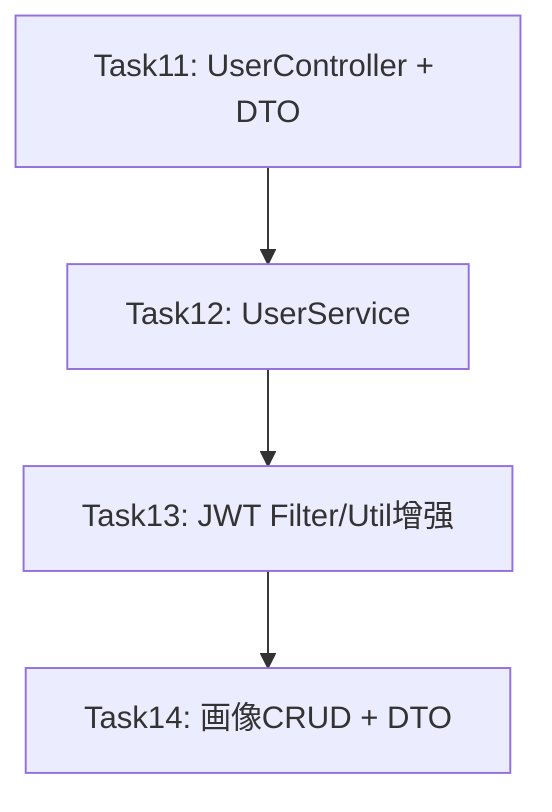

# 实施计划：Task11-14 用户管理模块完整实现

## 概述

按顺序执行4个后端任务，实现用户管理模块的完整功能链：Controller+DTO → Service → JWT安全增强 → 画像CRUD。

## 依赖关系

Task11创建Controller骨架（接口层），Task12实现Service业务逻辑（Controller依赖Service），Task13增强JWT安全组件（Service依赖JwtUtil），Task14扩展Service和Controller添加画像功能。

---

## Task11: UserController + DTO

### 创建文件（5个）

#### 1. RegisterRequest.java
- 路径: `dto/request/RegisterRequest.java`
- 注解: `@Data @NoArgsConstructor @AllArgsConstructor @Builder`
- 字段:
  - `@NotBlank(message="用户名不能为空") @Size(min=3, max=50, message="用户名长度3-50") private String username`
  - `@NotBlank(message="邮箱不能为空") @Email(message="邮箱格式不正确") private String email`
  - `@NotBlank(message="密码不能为空") @Size(min=8, max=100, message="密码长度8-100") private String password`

#### 2. LoginRequest.java
- 路径: `dto/request/LoginRequest.java`
- 注解: `@Data @NoArgsConstructor @AllArgsConstructor @Builder`
- 字段:
  - `@NotBlank(message="用户名不能为空") private String username`
  - `@NotBlank(message="密码不能为空") private String password`

#### 3. UserResponse.java
- 路径: `dto/response/UserResponse.java`
- 注解: `@Data @NoArgsConstructor @AllArgsConstructor @Builder`
- 字段:
  - `private String userId`
  - `private String username`
  - `private String email`
  - `private LocalDateTime createdAt`
  - `@JsonProperty("has_profile") private boolean hasProfile`
- **不含passwordHash**

#### 4. LoginResponse.java
- 路径: `dto/response/LoginResponse.java`
- 注解: `@Data @NoArgsConstructor @AllArgsConstructor @Builder`
- 字段:
  - `private String token`（无@JsonProperty，JSON中直接为token）
  - `@JsonProperty("user_id") private String userId`
  - `private String username`
  - `@JsonProperty("has_profile") private boolean hasProfile`

#### 5. UserController.java
- 路径: `controller/UserController.java`
- 注解: `@RestController @RequestMapping("/api/users") @Slf4j`
- 构造器注入: `UserService userService`（Task12创建，先声明接口）
- 4个端点:
  - `@PostMapping("/register") register(@Valid @RequestBody RegisterRequest) → ApiResponse<UserResponse>`
  - `@PostMapping("/login") login(@Valid @RequestBody LoginRequest) → ApiResponse<LoginResponse>`
  - `@GetMapping("/{userId}") getUserInfo(@PathVariable String userId) → ApiResponse<UserResponse>`
  - `@PostMapping("/logout") logout(@RequestHeader("Authorization") String token) → ApiResponse<Void>`
- logout方法提取Bearer Token: `token.replace("Bearer ", "")`
- **Controller不含业务逻辑，仅调用Service方法**

### 验证
- `mvn compile` 编译通过（UserService暂未创建，需先创建空接口/类）

> **注意**: Task11的Controller依赖UserService，而UserService在Task12创建。为保证编译通过，Task11和Task12需合并实施：先创建UserService空壳（方法签名+throw new UnsupportedOperationException），再创建Controller，最后在Task12中填充Service实现。

---

## Task12: UserService

### 创建文件（1个）+ 修改文件（1个）

#### 1. UserService.java（创建）
- 路径: `service/UserService.java`
- 注解: `@Service @Slf4j`
- 构造器注入5个依赖:
  - `UserRepository userRepository`
  - `UserProfileRepository userProfileRepository`
  - `JwtUtil jwtUtil`
  - `PasswordEncoder passwordEncoder`
  - `RedisTemplate<String, String> redisTemplate`

**4个方法实现**:

##### register(RegisterRequest) → UserResponse
1. 检查用户名唯一性: `existsByUsername` → 抛 `BusinessException(409, "用户名已存在", "USERNAME_DUPLICATE")`
2. 检查邮箱唯一性: `existsByEmail` → 抛 `BusinessException(409, "邮箱已被注册", "EMAIL_DUPLICATE")`
3. BCrypt加密: `passwordEncoder.encode(request.getPassword())`
4. 生成userId: `"usr_" + UUID.randomUUID().toString().replace("-", "").substring(0, 8)`
5. 构建User实体并保存
6. 检查画像: `userProfileRepository.existsByUserId(userId)`
7. 返回UserResponse（不含passwordHash）
8. 日志: `log.info("User registered: userId={}, username={}", userId, user.getUsername())`

##### login(LoginRequest) → LoginResponse
1. 查询用户: `findByUsername` → 不存在抛 `AuthenticationException("用户名或密码错误")`
2. BCrypt校验: `passwordEncoder.matches()` → 失败抛 `AuthenticationException("用户名或密码错误")`
3. 生成JWT: `jwtUtil.generateToken(userId, username)`
4. 检查画像
5. 返回LoginResponse
6. 日志: `log.info("User logged in: userId={}, username={}", ...)`

##### getUserInfo(String userId) → UserResponse
1. 查询用户: `findByUserId` → 不存在抛 `BusinessException(404, "用户不存在", "USER_NOT_FOUND")`
2. 检查画像
3. 返回UserResponse
4. `@Cacheable(value = "userInfo", key = "#userId")`

##### logout(String token) → void
1. 提取jti: `jwtUtil.getTokenJti(token)` → null则return
2. 获取剩余有效期: `jwtUtil.getTokenRemainingTime(token)` → <=0则return
3. 加入Redis黑名单: `redisTemplate.opsForValue().set(key, "1", Duration.ofMillis(remainingTime))`
4. 日志: `log.info("User logged out: jti={}", jti)`

#### 2. SecurityConfig.java（修改）
- 新增 `@Bean PasswordEncoder passwordEncoder()` → `new BCryptPasswordEncoder(10)`

### 单元测试: UserServiceTest
- 使用 `@ExtendWith(MockitoExtension.class)`
- `@Mock`: UserRepository, UserProfileRepository, JwtUtil, RedisTemplate
- `@InjectMocks`: UserService
- PasswordEncoder使用真实BCryptPasswordEncoder实例
- 测试场景:
  - register: 正常注册 / 重复用户名409 / 重复邮箱409
  - login: 正常登录 / 密码错误401 / 用户不存在401
  - getUserInfo: 正常查询 / 用户不存在404 / 缓存命中
  - logout: 正常退出 / Token无效静默返回 / Token已过期不加入黑名单

---

## Task13: JWT Filter/Util增强

### 修改文件（2个）+ 扩展测试（2个）

#### 1. JwtAuthFilter.java（修改）

**新增内容**:
- `private static final List<String> WHITELIST_PATHS` 白名单路径列表
- `private static final String MDC_USER_ID_KEY = "userId"`
- `private final AntPathMatcher pathMatcher = new AntPathMatcher()`

**重写 shouldNotFilter(HttpServletRequest)**:
- 判断请求URI是否匹配白名单路径（使用AntPathMatcher支持通配符）
- 白名单: `/api/users/register`, `/api/users/login`, `/health`, `/actuator/**`, `/error`

**重构 doFilterInternal**:
1. 入口添加 `log.debug("处理请求: {}", request.getRequestURI())`
2. 白名单路径由shouldNotFilter处理，doFilterInternal不再判断
3. Token提取边界情况处理:
   - `authHeader = "Bearer "` → 空Token，跳过验证
   - Authorization不以Bearer开头 → 跳过验证
   - `authHeader = "Bearer"` → 无空格后缀，跳过验证
4. Token验证成功后 `MDC.put(MDC_USER_ID_KEY, userId)`
5. 使用try-finally包裹:
   - `chain.doFilter(request, response)` 在try中
   - finally中: `SecurityContextHolder.clearContext()` + `MDC.remove(MDC_USER_ID_KEY)`

#### 2. JwtUtil.java（修改）

**新增方法**:

##### blacklistToken(String token) → boolean
1. 提取jti → null返回false
2. 获取剩余有效期 → <=0返回false
3. `redisTemplate.opsForValue().set(key, "1", Duration.ofMillis(remainingTime))`
4. 返回true
5. 日志: `log.debug("Token加入黑名单: jti={}, remainingTime={}ms", maskJti(jti), remainingTime)`

##### isTokenExpired(String token) → boolean
1. token为null/空 → 返回true
2. parseToken → Claims为null → 返回true
3. 检查Expiration是否在当前时间之前
4. 不抛异常，所有异常情况返回true

**修改现有方法**:

##### generateToken - 增加token_type声明
- 添加 `.claim("token_type", "access")`
- 新增常量 `private static final String TOKEN_TYPE_ACCESS = "access"`

##### parseToken - 错误日志增强
- ExpiredJwtException → "JWT token已过期"
- MalformedJwtException → "JWT token格式错误"
- SecurityException → "JWT签名无效"
- UnsupportedJwtException → "不支持的JWT token"
- IllegalArgumentException → "JWT token为空"

#### 3. JwtAuthFilterTest.java（扩展）
- 新增测试: 白名单路径跳过、MDC userId设置/清理、SecurityContext清理、空Token、畸形Header、过期Token

#### 4. JwtUtilTest.java（扩展）
- 新增测试: blacklistToken成功/无效Token/已过期Token、isTokenExpired各场景、token_type声明验证、parseToken错误类型区分

---

## Task14: 画像CRUD + DTO

### 创建文件（2个）+ 修改文件（2个）

#### 1. ProfileUpdateRequest.java（创建）
- 路径: `dto/request/ProfileUpdateRequest.java`
- 注解: `@Data @NoArgsConstructor @AllArgsConstructor @Builder`
- 字段:
  - `@NotNull(message="学历层次不能为空") @JsonProperty("education_level") private EducationLevel educationLevel`
  - `@NotBlank(message="研究方向不能为空") @JsonProperty("research_field") private String researchField`
  - `@NotNull(message="知识水平不能为空") @JsonProperty("knowledge_level") private KnowledgeLevel knowledgeLevel`
  - `@NotNull(message="偏好风格不能为空") @JsonProperty("preferred_style") private PreferredStyle preferredStyle`

#### 2. ProfileResponse.java（创建）
- 路径: `dto/response/ProfileResponse.java`
- 注解: `@Data @NoArgsConstructor @AllArgsConstructor @Builder`
- 字段（枚举字段使用String类型输出dbValue）:
  - `@JsonProperty("user_id") private String userId`
  - `@JsonProperty("education_level") private String educationLevel`
  - `@JsonProperty("research_field") private String researchField`
  - `@JsonProperty("knowledge_level") private String knowledgeLevel`
  - `@JsonProperty("preferred_style") private String preferredStyle`
  - `@JsonProperty("updated_at") private LocalDateTime updatedAt`

#### 3. UserService.java（修改 - 扩展3个画像方法）

**新增依赖注入**: `ObjectMapper objectMapper`

##### getProfile(String userId) → ProfileResponse
1. 数据隔离校验: 验证userId与SecurityContext当前用户一致，不一致抛 `BusinessException(403, "无权限访问他人画像", "FORBIDDEN_ACCESS")`
2. `userProfileRepository.findByUserId(userId)` → 不存在抛 `ResourceNotFoundException("UserProfile", userId)`
3. 转换为ProfileResponse（枚举字段使用getDbValue()）
4. `@Cacheable(value="userProfile", key="#userId", unless="#result == null")`

##### createProfile(String userId, ProfileUpdateRequest) → ProfileResponse
1. 数据隔离校验
2. 校验用户存在 → 不存在抛 `ResourceNotFoundException("User", userId)`
3. 校验画像不存在 → 已存在抛 `BusinessException(409, "用户画像已存在", "PROFILE_ALREADY_EXISTS")`
4. Request→Entity转换并保存
5. 同步Redis画像JSON: `redisTemplate.opsForValue().set(key, json, Duration.ofHours(1))`
6. `@Transactional @CacheEvict(value="userProfile", key="#userId")`

##### updateProfile(String userId, ProfileUpdateRequest) → ProfileResponse
1. 数据隔离校验
2. 查找已有画像 → 不存在抛 `ResourceNotFoundException("UserProfile", userId)`
3. 合并字段并保存
4. 同步Redis画像JSON
5. `@Transactional @CacheEvict(value={"userProfile", "userProfileJson"}, key="#userId")`

**私有辅助方法**:
- `convertToProfileResponse(UserProfile entity)` → ProfileResponse
- `getCurrentUserId()` → 从SecurityContext获取当前认证用户userId
- `syncProfileToRedis(String userId, ProfileResponse profile)` → 同步画像JSON到Redis

#### 4. UserController.java（修改 - 扩展3个画像端点）
- `@GetMapping("/{userId}/profile") getProfile(@PathVariable String userId) → ApiResponse<ProfileResponse>`
- `@PostMapping("/{userId}/profile") createProfile(@PathVariable String userId, @Valid @RequestBody ProfileUpdateRequest) → ApiResponse<ProfileResponse>`
- `@PutMapping("/{userId}/profile") updateProfile(@PathVariable String userId, @Valid @RequestBody ProfileUpdateRequest) → ApiResponse<ProfileResponse>`

### 单元测试
- ProfileUpdateRequestTest: @Valid校验测试
- UserServiceProfileTest: 10个场景（getProfile正常/404/缓存命中、createProfile正常/409/404、updateProfile正常/404/双重缓存失效、403数据隔离）

---

## 执行顺序与编译策略

由于Task11的Controller依赖Task12的UserService，采用合并编译策略：

1. **先创建UserService空壳**（方法签名+throw），确保Controller编译通过
2. **创建所有DTO**（RegisterRequest, LoginRequest, UserResponse, LoginResponse）
3. **创建UserController**（4个端点）
4. **填充UserService实现**（register/login/getUserInfo/logout）
5. **修改SecurityConfig**（添加PasswordEncoder Bean）
6. **增强JwtAuthFilter**（白名单/MDC/清理/边界处理）
7. **增强JwtUtil**（blacklistToken/isTokenExpired/token_type/parseToken日志）
8. **创建ProfileUpdateRequest/ProfileResponse**
9. **扩展UserService**（3个画像方法）
10. **扩展UserController**（3个画像端点）
11. **编写所有单元测试**
12. **mvn compile + mvn test 验证**

## 文件清单

| 操作 | 文件路径 | Task |
|------|---------|------|
| 创建 | dto/request/RegisterRequest.java | 11 |
| 创建 | dto/request/LoginRequest.java | 11 |
| 创建 | dto/response/UserResponse.java | 11 |
| 创建 | dto/response/LoginResponse.java | 11 |
| 创建 | controller/UserController.java | 11 |
| 创建 | service/UserService.java | 12 |
| 修改 | config/SecurityConfig.java | 12 |
| 修改 | filter/JwtAuthFilter.java | 13 |
| 修改 | util/JwtUtil.java | 13 |
| 创建 | dto/request/ProfileUpdateRequest.java | 14 |
| 创建 | dto/response/ProfileResponse.java | 14 |
| 修改 | service/UserService.java | 14 |
| 修改 | controller/UserController.java | 14 |
| 创建 | test/.../UserControllerTest.java | 11 |
| 创建 | test/.../UserServiceTest.java | 12 |
| 修改 | test/.../JwtAuthFilterTest.java | 13 |
| 修改 | test/.../JwtUtilTest.java | 13 |
| 创建 | test/.../ProfileUpdateRequestTest.java | 14 |
| 创建 | test/.../UserServiceProfileTest.java | 14 |
