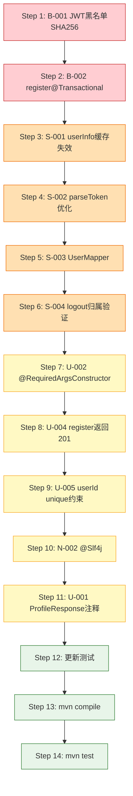

# F2.1 用户管理模块审阅问题修复计划

> 基于审阅报告发现的 2个Block + 4个Strong Suggestion + 5个Suggestion + 3个Nit 问题

---

## 修复范围总览

| 编号 | 级别 | 问题 | 优先级 |
|------|------|------|--------|
| B-001 | 🔴 Block | JWT黑名单Key使用jti明文而非SHA256哈希 | P0 |
| B-002 | 🔴 Block | register()缺少@Transactional注解 | P0 |
| S-001 | 🟠 Strong | getUserInfo缓存与数据库不一致（画像操作后userInfo缓存未失效） | P1 |
| S-002 | 🟠 Strong | JwtUtil.parseToken被重复调用4次（性能浪费） | P1 |
| S-003 | 🟠 Strong | 缺少UserMapper (MapStruct) | P1 |
| S-004 | 🟠 Strong | logout接口缺少Token归属验证（越权风险） | P1 |
| U-001 | 🟡 Suggestion | ProfileResponse枚举字段注释说明 | P2 |
| U-002 | 🟡 Suggestion | UserService改用@RequiredArgsConstructor | P2 |
| U-003 | 🟡 Suggestion | JwtAuthFilter白名单OPTIONS预检 | P2 |
| U-004 | 🟡 Suggestion | register接口返回HTTP 201 | P2 |
| U-005 | 🟡 Suggestion | UserProfile.userId添加unique约束 | P2 |
| N-001 | 🟢 Nit | logout token提取逻辑复用 | P3 |
| N-002 | 🟢 Nit | JwtUtil改用@Slf4j | P3 |
| N-003 | 🟢 Nit | RedisKeyUtil.authBlacklistKey参数名不匹配 | P3 |

---

## 变更文件清单

```
变更清单：
├── 修改: util/JwtUtil.java                    (B-001, S-002, N-002)
├── 修改: service/UserService.java              (B-002, S-001, U-002, N-001)
├── 修改: controller/UserController.java        (S-004, U-004, N-001)
├── 修改: filter/JwtAuthFilter.java             (S-002)
├── 修改: entity/UserProfile.java               (U-005)
├── 修改: dto/response/ProfileResponse.java     (U-001)
├── 新增: mapper/UserMapper.java                (S-003)
├── 新增: test/mapper/UserMapperTest.java       (S-003)
├── 修改: test/service/UserServiceTest.java     (B-002, S-004)
├── 修改: test/service/UserServiceProfileTest.java (S-001)
├── 修改: test/util/JwtUtilTest.java            (B-001)
├── 修改: test/filter/JwtAuthFilterTest.java    (S-002)
├── 修改: test/controller/UserControllerTest.java (U-004, S-004)
└── 修改: resources/db/01_create_tables.sql     (U-005)
```

---

## Step 1: B-001 — JWT黑名单Key改用SHA256哈希

### 修改文件: `util/JwtUtil.java`

**设计思路**: 使用JDK内置 `java.security.MessageDigest` 计算SHA256，不引入新依赖。

**具体变更**:

1. 新增私有方法 `sha256(String input)`:
```java
import java.security.MessageDigest;
import java.security.NoSuchAlgorithmException;

private String sha256(String input) {
    try {
        MessageDigest digest = MessageDigest.getInstance("SHA-256");
        byte[] hash = digest.digest(input.getBytes(StandardCharsets.UTF_8));
        StringBuilder hexString = new StringBuilder();
        for (byte b : hash) {
            String hex = Integer.toHexString(0xff & b);
            if (hex.length() == 1) hexString.append('0');
            hexString.append(hex);
        }
        return hexString.toString();
    } catch (NoSuchAlgorithmException e) {
        throw new IllegalStateException("SHA-256 algorithm not available", e);
    }
}
```

2. 修改 `isTokenBlacklisted` 方法:
```java
public boolean isTokenBlacklisted(String token) {
    String jti = getTokenJti(token);
    if (jti == null) {
        return true;
    }
    String hash = sha256(jti);
    String key = RedisKeyUtil.authBlacklistKey(hash);
    return Boolean.TRUE.equals(redisTemplate.hasKey(key));
}
```

3. 修改 `blacklistToken` 方法:
```java
public boolean blacklistToken(String token) {
    String jti = getTokenJti(token);
    if (jti == null) {
        return false;
    }
    long remainingTime = getTokenRemainingTime(token);
    if (remainingTime <= 0) {
        return false;
    }
    String hash = sha256(jti);
    String key = RedisKeyUtil.authBlacklistKey(hash);
    redisTemplate.opsForValue().set(key, "1", Duration.ofMillis(remainingTime));
    log.debug("Token加入黑名单: jtiHash={}, remainingTime={}ms", maskJti(hash), remainingTime);
    return true;
}
```

4. 同步修改 `UserService.logout()` 方法（也直接使用了jti构建黑名单Key）:
```java
public void logout(String token) {
    String jti = jwtUtil.getTokenJti(token);
    if (jti == null) {
        return;
    }
    long remainingTime = jwtUtil.getTokenRemainingTime(token);
    if (remainingTime <= 0) {
        return;
    }
    jwtUtil.blacklistToken(token);
    log.info("User logged out: jti={}", jti);
}
```

**注意**: `UserService.logout()` 当前直接操作Redis写入黑名单，应改为调用 `jwtUtil.blacklistToken(token)`，避免重复逻辑。

### 修改文件: `test/util/JwtUtilTest.java`

更新黑名单相关测试，验证Key使用SHA256哈希而非明文jti。

---

## Step 2: B-002 — register()添加@Transactional注解

### 修改文件: `service/UserService.java`

在 `register()` 方法上添加 `@Transactional` 注解:

```java
@Transactional
public UserResponse register(RegisterRequest request) {
    // ... 现有逻辑不变
}
```

### 修改文件: `test/service/UserServiceTest.java`

确保 `register_normal_returnsUserResponse` 测试在事务上下文中验证。

---

## Step 3: S-001 — 画像操作后userInfo缓存失效

### 修改文件: `service/UserService.java`

1. `createProfile` 方法的 `@CacheEvict` 增加 `userInfo`:
```java
@Transactional
@CacheEvict(value = {"userProfile", "userProfileJson", "userInfo"}, key = "#userId")
public ProfileResponse createProfile(String userId, ProfileUpdateRequest request) {
```

2. `updateProfile` 方法的 `@CacheEvict` 增加 `userInfo`:
```java
@Transactional
@CacheEvict(value = {"userProfile", "userProfileJson", "userInfo"}, key = "#userId")
public ProfileResponse updateProfile(String userId, ProfileUpdateRequest request) {
```

### 修改文件: `test/service/UserServiceProfileTest.java`

新增测试验证画像创建/更新后userInfo缓存被清除。

---

## Step 4: S-002 — JwtAuthFilter优化parseToken重复调用

### 修改文件: `filter/JwtAuthFilter.java`

重构 `doFilterInternal`，一次parseToken，多次读取Claims:

```java
@Override
protected void doFilterInternal(HttpServletRequest request,
        HttpServletResponse response, FilterChain chain)
        throws ServletException, IOException {

    String authHeader = request.getHeader(AUTHORIZATION_HEADER);

    if (authHeader != null && authHeader.startsWith(BEARER_PREFIX)) {
        String token = authHeader.substring(BEARER_PREFIX.length());

        if (!token.isBlank()) {
            Claims claims = jwtUtil.parseToken(token);
            if (claims != null && !jwtUtil.isJtiBlacklisted(claims.getId())) {
                String userId = claims.getSubject();
                String username = claims.get("username", String.class);

                UsernamePasswordAuthenticationToken authentication =
                        new UsernamePasswordAuthenticationToken(userId, null, List.of());
                SecurityContextHolder.getContext().setAuthentication(authentication);
                MDC.put(MDC_USER_ID_KEY, userId);

                log.debug("JWT认证成功: userId={}, username={}", userId, username);
            }
        }
    }

    try {
        chain.doFilter(request, response);
    } finally {
        SecurityContextHolder.clearContext();
        MDC.remove(MDC_USER_ID_KEY);
    }
}
```

### 修改文件: `util/JwtUtil.java`

新增 `isJtiBlacklisted(String jti)` 方法（接收已解析的jti，避免重复parseToken）:

```java
public boolean isJtiBlacklisted(String jti) {
    if (jti == null) {
        return true;
    }
    String hash = sha256(jti);
    String key = RedisKeyUtil.authBlacklistKey(hash);
    return Boolean.TRUE.equals(redisTemplate.hasKey(key));
}
```

### 修改文件: `test/filter/JwtAuthFilterTest.java`

更新测试以适配新的filter逻辑。

---

## Step 5: S-003 — 创建UserMapper (MapStruct)

### 新增文件: `mapper/UserMapper.java`

```java
package com.literatureassistant.mapper;

import com.literatureassistant.dto.response.ProfileResponse;
import com.literatureassistant.dto.response.UserResponse;
import com.literatureassistant.entity.User;
import com.literatureassistant.entity.UserProfile;
import org.mapstruct.Mapper;
import org.mapstruct.Mapping;

@Mapper(componentModel = "spring")
public interface UserMapper {

    @Mapping(target = "hasProfile", source = "hasProfile")
    @Mapping(target = "createdAt", source = "user.createdAt")
    UserResponse toUserResponse(User user, boolean hasProfile);

    @Mapping(target = "userId", source = "profile.userId")
    @Mapping(target = "educationLevel", expression = "java(profile.getEducationLevel().getDbValue())")
    @Mapping(target = "knowledgeLevel", expression = "java(profile.getKnowledgeLevel().getDbValue())")
    @Mapping(target = "preferredStyle", expression = "java(profile.getPreferredStyle().getDbValue())")
    @Mapping(target = "updatedAt", source = "profile.updatedAt")
    ProfileResponse toProfileResponse(UserProfile profile);
}
```

### 修改文件: `service/UserService.java`

1. 注入 `UserMapper`:
```java
@Service
@Slf4j
@RequiredArgsConstructor
public class UserService {
    private final UserRepository userRepository;
    private final UserProfileRepository userProfileRepository;
    private final JwtUtil jwtUtil;
    private final PasswordEncoder passwordEncoder;
    private final RedisTemplate<String, String> redisTemplate;
    private final ObjectMapper objectMapper;
    private final UserMapper userMapper;
```

2. 替换手动Builder为Mapper调用:
```java
// register方法中
return userMapper.toUserResponse(user, hasProfile);

// getUserInfo方法中
return userMapper.toUserResponse(user, hasProfile);

// convertToProfileResponse方法
private ProfileResponse convertToProfileResponse(UserProfile entity) {
    return userMapper.toProfileResponse(entity);
}
```

### 新增文件: `test/mapper/UserMapperTest.java`

验证MapStruct映射正确性。

---

## Step 6: S-004 — logout接口Token归属验证

### 修改文件: `controller/UserController.java`

1. 注入JwtUtil:
```java
@RestController
@RequestMapping("/api/users")
@RequiredArgsConstructor
@Slf4j
public class UserController {
    private final UserService userService;
    private final JwtUtil jwtUtil;
```

2. 修改logout方法:
```java
@PostMapping("/logout")
public ApiResponse<Void> logout(@RequestHeader("Authorization") String authHeader) {
    String rawToken = jwtUtil.extractBearerToken(authHeader);
    String tokenUserId = jwtUtil.getUserIdFromToken(rawToken);
    String currentUserId = SecurityContextHolder.getContext().getAuthentication().getPrincipal().toString();
    if (!tokenUserId.equals(currentUserId)) {
        throw new BusinessException(403, "无权操作他人Token", "FORBIDDEN_TOKEN_OPERATION");
    }
    userService.logout(rawToken);
    return ApiResponse.success(null);
}
```

### 修改文件: `util/JwtUtil.java`

新增 `extractBearerToken` 方法（统一Token提取逻辑，解决N-001）:
```java
public String extractBearerToken(String authHeader) {
    if (authHeader != null && authHeader.startsWith("Bearer ")) {
        return authHeader.substring(7);
    }
    return null;
}
```

### 修改文件: `test/controller/UserControllerTest.java`

新增logout越权测试。

---

## Step 7: U-002 — UserService改用@RequiredArgsConstructor

### 修改文件: `service/UserService.java`

1. 移除手动构造器
2. 添加 `@RequiredArgsConstructor`
3. 所有依赖字段加 `final`

（此步骤与Step 5合并执行）

---

## Step 8: U-004 — register接口返回HTTP 201

### 修改文件: `controller/UserController.java`

```java
@PostMapping("/register")
public ResponseEntity<ApiResponse<UserResponse>> register(@Valid @RequestBody RegisterRequest request) {
    UserResponse response = userService.register(request);
    return ResponseEntity.status(HttpStatus.CREATED).body(ApiResponse.success(response));
}
```

需要引入:
```java
import org.springframework.http.HttpStatus;
import org.springframework.http.ResponseEntity;
```

### 修改文件: `test/controller/UserControllerTest.java`

更新register测试的断言: `status().isCreated()` 替代 `status().isOk()`

---

## Step 9: U-005 — UserProfile.userId添加unique约束

### 修改文件: `entity/UserProfile.java`

```java
@Column(name = "user_id", nullable = false, unique = true, length = 100)
private String userId;
```

### 修改文件: `resources/db/01_create_tables.sql`

在 `user_profiles` 表的 `user_id` 列添加 UNIQUE 约束。

---

## Step 10: N-002 — JwtUtil改用@Slf4j

### 修改文件: `util/JwtUtil.java`

1. 移除手动Logger声明
2. 添加 `@Slf4j` 注解
3. 将所有 `log.debug(...)` / `log.error(...)` 替换为使用 `@Slf4j` 生成的 `log`

---

## Step 11: U-001 — ProfileResponse枚举字段注释

### 修改文件: `dto/response/ProfileResponse.java`

为枚举字段添加Javadoc注释说明返回的是dbValue。

---

## Step 12: 更新测试

### 修改文件汇总:

| 测试文件 | 修改原因 |
|---------|---------|
| `JwtUtilTest.java` | B-001: 黑名单Key改用SHA256 |
| `UserServiceTest.java` | B-002: register事务; S-004: logout归属验证 |
| `UserServiceProfileTest.java` | S-001: userInfo缓存失效 |
| `JwtAuthFilterTest.java` | S-002: parseToken优化 |
| `UserControllerTest.java` | U-004: HTTP 201; S-004: logout越权 |

---

## Step 13: 编译验证

```bash
cd Veritas/backend && mvn compile
```

## Step 14: 测试验证

```bash
cd Veritas/backend && mvn test
```

---

## 执行顺序



---

## 风险评估

| 风险 | 影响 | 缓解 |
|------|------|------|
| MapStruct与Lombok冲突 | 编译失败 | pom.xml已配置lombok-mapstruct-binding |
| SHA256哈希后黑名单Key变更 | 已登出用户Token失效 | 开发阶段可接受，生产部署前清空Redis |
| register返回201影响前端 | 前端需适配 | 前端尚未开发，无影响 |
| UserProfile.userId加unique | JPA ddl-auto=update可能不自动加约束 | 需手动执行SQL或recreate表 |
