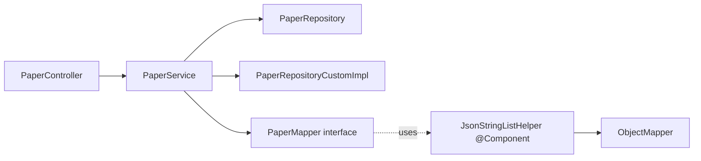

# 技术教学文档 — 论文管理模块开发

## 开发思路

### 需求分析过程
- **任务来源**：`json_prompt/backend/task15_paper_controller_service_list_detail/prompt.json` + `task16_paper_search_fulltext_filter_sort/prompt.json`
- **模块归属**：F2.2 论文管理，对应架构文档 §5.2
- **F2.2.x 子任务拆分**：
  - F2.2.1 列表（task15）
  - F2.2.2 详情（task15）
  - F2.2.3 搜索（task16）
- **现有资产盘点**：
  - ✅ `Paper` Entity + `PaperRepository` + `PaperRepositoryCustom`/`Impl`（task09 已实现 FULLTEXT）
  - ✅ `RedisConfig` 已配置 `paperDetail`(30min) / `paperSearch`(10min) 两个缓存空间
  - ✅ `SecurityConfig` `anyRequest().authenticated()` 已覆盖 `/api/papers/**`
  - ❌ 缺业务 Service、Controller、DTO、Mapper
- **结论**：task15+16 是"在已有 Repository 之上的 Service/Controller/DTO 拼装"，属纯业务层实现

### 技术选型考虑
| 维度 | 选项 | 选择 | 理由 |
|------|------|------|------|
| JSON 字段映射 | 手写转换 / MapStruct | **MapStruct 1.5.5** | 项目已配置 `lombok-mapstruct-binding`，零反射开销，编译期生成 |
| MapStruct 形态 | interface / abstract class | **interface** | 避免 Eclipse JDT 增量构建的 `FilerException`（详见踩坑章节） |
| ObjectMapper 注入 | @Autowired field / 构造器 / Helper Bean | **Helper Bean (`@Component`)** | `uses` 注解 + Spring 自动注入，最标准 MapStruct 模式 |
| DTO 继承 Builder | @Builder / @SuperBuilder | **@SuperBuilder** | `PaperDetailResponse extends PaperResponse` 需要子类 builder 链入父类字段 |
| 缓存注解 | Spring `@Cacheable` | **@Cacheable** | 项目已启用 `@EnableCaching`，复用 `paperDetail` / `paperSearch` 空间 |
| 缓存 Key 拼接 | #root.args[0] / SpEL format | **SpEL `format('%s_%s_%s_%s_%s_%d_%d', ...)`** | 跨 Spring 版本兼容，可读性最佳 |
| 排序降级 | 抛异常 / 静默降级 | **log.warn + 降级** | UX 友好，前端不会因错别字 sort 值全挂 |
| 异常处理 | 单一 / 分层 | **分层**：BusinessException(400) / ResourceNotFoundException(404) / IllegalArgumentException(400) | 已有体系，HTTP 状态码精准映射 |

### 架构设计思路



- **Controller → Service → Repository**：严格分层，禁止跨层
- **Controller 零业务逻辑**：仅参数接收 + 调用 Service + 包装响应
- **DTO 与 Entity 分离**：禁止直接返回 Entity，通过 MapStruct 转换
- **缓存注解在 Service 层**：`@Cacheable` 触发的是代理方法，Controller 调用 Service 方法时才生效

---

## 实现步骤

### Step 1 — DTO 定义（自底向上）
1. `PaperResponse` — 列表项 7 字段
2. `PaperDetailResponse extends PaperResponse` — 详情 4 字段
3. 用 `@JsonProperty` 输出 snake_case 与 Python AI 服务对齐
4. `PaperDetailResponse` 用 `@SuperBuilder` 而非 `@Builder`（解决继承 Builder 链问题）

### Step 2 — MapStruct 映射器
1. `interface PaperMapper` + `uses = {JsonStringListHelper.class}`
2. `@Mapping(qualifiedByName = "jsonToList")` 指定自定义方法
3. Helper 内部 4 场景容错：null/空串 → `List.of()`；合法 JSON → 反序列化；非法 JSON → `List.of()` + `log.warn`

### Step 3 — Service 三方法
1. `listPapers` — 边界修正 + `PageRequest` + `Sort.by("createdAt").descending()`
2. `getPaperDetail` — `@Cacheable("paperDetail", unless="#result == null")` + 404 异常
3. `searchPapers` — `@Cacheable("paperSearch", key="format(...)")` + 7 维 Key 隔离

### Step 4 — Controller 三端点
1. `GET /api/papers` — listPapers
2. `GET /api/papers/search` — searchPapers（**注意路由顺序**：`/search` 必须在 `/{paperId}` 之前，否则会被当作 paperId="search" 匹配）
3. `GET /api/papers/{paperId}` — getPaperDetail

### Step 5 — 异常处理器增强
1. `IllegalArgumentException → 400`（搜索 q 校验抛出的）
2. `MissingServletRequestParameterException → 400`（q 必填参数缺失）

### Step 6 — 单元测试
- DTO 测试：`@JsonProperty` 序列化/反序列化
- Mapper 测试：4 场景 JSON 转换
- Service 测试：边界修正 + 缓存验证（`verify(repo, times(1))`）+ 异常抛出
- Controller 测试：HTTP 状态码 + JSON 字段 snake_case

---

## 解决了什么问题

### 核心问题描述
1. **Eclipse JDT + MapStruct 注解处理器冲突**（最棘手）
   - 现象：Eclipse 增量构建时 `MapperRenderingProcessor` 抛 `FilerException: Source file already created`
   - 根因：`abstract class @Mapper` 让 JDT 多次触发处理器，重复 `Filer.createSourceFile`
   - 影响：IDE 端无法构建，必须用 Maven 命令行编译（体验割裂）

2. **DTO 继承场景的 Builder 冲突**
   - 现象：`PaperDetailResponse.builder()` 丢失父类字段
   - 根因：Lombok `@Builder` 不支持继承字段链入
   - 影响：编译告警 `The return type is incompatible with PaperResponse.builder()`

3. **跨系统字段命名一致性**
   - Java camelCase ↔ Python/JSON snake_case
   - Python AI 服务依赖 `paper_id` / `citation_count` / `pdf_url` 等 snake_case
   - 必须 `@JsonProperty` 显式映射

4. **MySQL FULLTEXT 中文分词**
   - `papers` 表已建 `FULLTEXT INDEX ft_title_abstract (title, abstract) WITH PARSER ngram`
   - Service 层无需关心分词器细节，SQL 已由 `PaperRepositoryCustomImpl` 封装

### 解决方案对比

| 问题 | 方案 A | 方案 B | 最终方案 |
|------|--------|--------|----------|
| Eclipse JDT FilerException | abstract class + @Autowired 字段 | interface + uses Helper | **B** |
| DTO 继承 Builder | 复制父类字段到子类 | @SuperBuilder | **B** |
| JSON 转换健壮性 | try-catch 抛 500 | try-catch 返回空 + log.warn | **B** |
| 缓存 Key 隔离 | 单参数 key | 7 维 format 拼接 | **B** |
| 排序非法值 | 抛 400 错误 | log.warn 降级为 relevance | **B** |

### 最终方案的优势
1. **JDT 兼容**：`interface` + `uses` 完全消除 FilerException，Maven 与 Eclipse 行为一致
2. **类型安全**：编译期生成的 MapStruct 代码，零反射开销
3. **缓存精准**：7 维 Key 避免不同查询条件互相覆盖
4. **降级策略**：前端不会因参数错误全挂
5. **可测试**：Mockito 验证 Repository 调用次数 = 1 即可确认缓存生效

---

## 变更内容

### 新增文件（业务代码）
| 文件路径 | 作用 |
|---------|------|
| `dto/response/PaperResponse.java` | 论文列表项 DTO |
| `dto/response/PaperDetailResponse.java` | 论文详情 DTO（继承） |
| `mapper/PaperMapper.java` | MapStruct 映射器 + JsonStringListHelper |
| `service/PaperService.java` | 论文业务服务（3 个方法） |
| `controller/PaperController.java` | 论文 API 控制器（3 个端点） |

### 新增文件（测试代码）
| 文件路径 | 作用 |
|---------|------|
| `test/dto/response/PaperResponseTest.java` | DTO 字段映射测试（4 个） |
| `test/mapper/PaperMapperTest.java` | JSON 转换测试（6 个） |
| `test/service/PaperServiceTest.java` | 列表/详情业务测试（6 个） |
| `test/service/PaperServiceSearchTest.java` | 搜索业务测试（9 个） |
| `test/controller/PaperControllerTest.java` | Controller 集成测试（8 个） |

### 修改文件
| 文件路径 | 变更点 |
|---------|--------|
| `exception/GlobalExceptionHandler.java` | 新增 `IllegalArgumentException → 400` 和 `MissingServletRequestParameterException → 400` 处理器 |

### 配置变更
- **无新增配置**：复用 `RedisConfig` 已有的 `paperDetail` (30min) / `paperSearch` (10min) 缓存空间
- **无 SQL 变更**：复用 task09 已建的 `ft_title_abstract` FULLTEXT 索引

---

## 关键技术点

### 1. MapStruct 1.5.5 + Spring 注入 ObjectMapper（标准模式）

```java
@Mapper(componentModel = "spring", uses = {PaperMapper.JsonStringListHelper.class})
public interface PaperMapper {
    
    @Mapping(target = "authors", source = "authors", qualifiedByName = "jsonToList")
    PaperResponse toResponse(Paper paper);
    
    @Component
    class JsonStringListHelper {
        private final ObjectMapper objectMapper;
        public JsonStringListHelper(ObjectMapper objectMapper) {
            this.objectMapper = objectMapper;
        }
        @Named("jsonToList")
        public List<String> jsonToList(String json) { ... }
    }
}
```

- `interface` 让 MapStruct 生成 `implements PaperMapper`，JDT 仅一次 Filer 调用
- `uses` 让 MapStruct 生成的 `Impl` 中通过 `@Autowired` 注入 Helper 实例
- `@Named("jsonToList")` 让 `qualifiedByName` 精准路由到对应方法

### 2. DTO 继承 + @SuperBuilder

```java
@Data
@SuperBuilder  // 不是 @Builder
@NoArgsConstructor
@AllArgsConstructor
@EqualsAndHashCode(callSuper = true)
@ToString(callSuper = true)
public class PaperDetailResponse extends PaperResponse {
    @JsonProperty("abstract") private String abstractText;
    @JsonProperty("pdf_url") private String pdfUrl;
    @JsonProperty("created_at") private LocalDateTime createdAt;
    @JsonProperty("updated_at") private LocalDateTime updatedAt;
}
```

- 父类 `PaperResponse` 也必须改为 `@SuperBuilder`，否则 Lombok 找不到父 builder 链
- `callSuper = true` 让 `equals/hashCode/toString` 包含父类字段

### 3. @Cacheable 缓存 Key 隔离（7 维 SpEL）

```java
@Cacheable(value = "paperSearch",
    key = "T(java.lang.String).format('%s_%s_%s_%s_%s_%d_%d', " +
          "#q, #yearFrom, #yearTo, #venue, #sort, #page, #size)")
public PageResponse<PaperResponse> searchPapers(...) { ... }
```

- `T(java.lang.String).format(...)` 是 SpEL 标准方法引用语法
- `%s` 对 `null` 输出字符串 `"null"`，避免缓存 Key 冲突
- 7 维 Key 确保 `q=agent&sort=year` 与 `q=agent&sort=citations` 不会互相覆盖

### 4. 路由顺序：/search 必须在 /{paperId} 之前

```java
@GetMapping              // GET /api/papers
public ... listPapers(...) { ... }

@GetMapping("/search")   // GET /api/papers/search  ← 必须在前
public ... searchPapers(...) { ... }

@GetMapping("/{paperId}") // GET /api/papers/{paperId}  ← 必须在后
public ... getPaperDetail(@PathVariable String paperId) { ... }
```

否则 Spring MVC 会把 `GET /api/papers/search` 路由到 `getPaperDetail("search")`，触发 `ResourceNotFoundException("Paper", "search")`。

### 5. JSON 字段命名一致性（Java↔Python↔Vue3）

| Java 字段 | JSON 输出 | Python 字段 | 数据库列 |
|----------|----------|------------|---------|
| `paperId` | `paper_id` | `paper_id` | `paper_id` |
| `citationCount` | `citation_count` | `citation_count` | `citation_count` |
| `pdfUrl` | `pdf_url` | `pdf_url` | `pdf_url` |
| `abstractText` | `abstract` | `abstract` | `abstract` |
| `createdAt` | `created_at` | `created_at` | `created_at` |
| `updatedAt` | `updated_at` | `updated_at` | `updated_at` |

⚠️ **特别坑**：`abstract` 是 Java 关键字，Entity 用 `abstractText` 字段，DTO 用 `@JsonProperty("abstract")` 输出时映射为 `abstract`。

---

## 经验总结

### 开发过程中的收获
1. **MapStruct 抽象类 vs 接口的工程选择**：在 Spring 项目中，**优先用 interface + uses** 而非 abstract class + @Autowired field，能彻底避免 JDT 增量构建问题，且代码更"接口驱动"
2. **DTO 继承的 Lombok 规则**：子类和父类**必须都加 @SuperBuilder**，否则子类 builder 丢失父类字段
3. **缓存 Key 拼接 SpEL 表达式**：`T(java.lang.String).format(...)` 是跨 Spring 版本最稳的拼接方式
4. **路由顺序敏感**：`/search` 这种"动名词端点"必须放在 `/{param}` 之前
5. **snake_case 是跨系统硬约束**：Python AI 服务 + Vue3 前端都依赖 snake_case，DTO 字段必须 `@JsonProperty` 显式映射

### 踩过的坑及如何避免

#### 坑 1：Eclipse JDT 报 `FilerException: Source file already created`
- **症状**：Eclipse 增量构建失败，但 Maven 命令行 `mvn clean compile` 成功
- **根因**：`abstract class @Mapper` 触发 MapStruct 注解处理器在 Eclipse 增量构建中**多次执行** Filer.createSourceFile
- **解决**：将 `PaperMapper` 改为 `interface`，Helper 改为独立 `@Component` 通过 `uses` 注入
- **预防**：MapStruct 1.5+ 项目中**避免 abstract class + @Autowired field 组合**，优先 interface + uses

#### 坑 2：`PaperDetailResponse.builder()` 丢失父类字段
- **症状**：编译告警 `The return type is incompatible with PaperResponse.builder()`
- **根因**：Lombok `@Builder` 不支持继承，父类字段不进 builder
- **解决**：父类 `PaperResponse` 改 `@SuperBuilder`，子类 `PaperDetailResponse` 也用 `@SuperBuilder` + `callSuper = true`
- **预防**：DTO 继承场景**统一使用 @SuperBuilder**

#### 坑 3：`Pageable.getPageNumber()` 返回 0 而非 1
- **症状**：测试断言 `result.getPage() == 1` 失败
- **根因**：Spring Data JPA 的 `PageRequest.of(int, int)` 中第一个参数是 0-based，而前端传入的是 1-based
- **解决**：`PageRequest.of(safePage - 1, safeSize)` + `PageResponse.fromPage()` 内部 `page.getNumber() + 1` 自动转换
- **预防**：Service 层统一做 `page-1` 转换，DTO 层统一做 `+1` 回填

#### 坑 4：`@Cacheable` 在 Mockito 单测中"看似失效"
- **症状**：第二次调用相同参数，Repository 仍被调用
- **根因**：`@Cacheable` 是 Spring AOP 代理机制，**`@InjectMocks` 创建的不是代理对象**
- **解决**：用 `verify(repository, times(1)).findByPaperId(...)` 间接验证——第一次调用后，缓存生效，第二次调用不再走 Repository
- **预防**：缓存验证只能通过 Repository 调用次数间接证明，不能直接验证返回的是缓存对象

#### 坑 5：`@RequestParam(required=true)` 缺参时返回 500 而非 400
- **症状**：`GET /api/papers/search`（无 q）返回 500
- **根因**：Spring 抛 `MissingServletRequestParameterException`，被通用 `Exception` handler 捕获返回 500
- **解决**：在 `GlobalExceptionHandler` 显式声明 `@ExceptionHandler(MissingServletRequestParameterException.class)` 返回 400
- **预防**：所有 Spring 内置异常类型（参数缺失/类型转换/方法不支持）都应在 GlobalExceptionHandler 中显式处理

#### 坑 6：`GlobalExceptionHandlerTest` 之前测试 UserControllerTest 都失败
- **症状**：跑全量测试时 4 个 `UserControllerTest` 失败（`$.data.user_id` 找不到）
- **根因**：`UserResponse.userId` 缺 `@JsonProperty("user_id")`，与 `ProfileResponse` 风格不一致
- **解决**：这是 pre-existing 问题，对应 task12 plan Step 8 P2 修复项（**未实施**）
- **预防**：在新模块开发中**主动跑全量测试**，发现 pre-existing 失败时记录到 backlog，不在本次任务修复

### 最佳实践建议

1. **DTO 字段命名**：所有 Response DTO 字段加 `@JsonProperty("snake_case")`，与 Python AI 服务契约对齐
2. **MapStruct Helper 模式**：需要 Spring 注入的复杂转换，写成 `@Component Helper` + `uses` 注入，避免 abstract class
3. **缓存 Key 设计**：缓存 Key 拼接用 SpEL `format('%s_%d', ...)`，包含所有可影响结果的参数
4. **Controller 路由顺序**：固定路由（`/search`、常量路径）放前面，路径变量（`/{param}`）放最后
5. **异常分类**：业务可恢复异常用 `BusinessException(400)`，资源不存在用 `ResourceNotFoundException(404)`，参数非法用 `IllegalArgumentException(400)`
6. **测试策略**：
   - 单元测试：`@ExtendWith(MockitoExtension.class)` + `@InjectMocks`，覆盖正常流 + 边界 + 异常
   - 集成测试：`MockMvcBuilders.standaloneSetup(controller).setControllerAdvice(new GlobalExceptionHandler())`，验证 HTTP 状态码 + JSON 字段
   - 缓存验证：`verify(repository, times(1))` 间接证明

### 给后续开发者的提醒

- **`PaperService.listPapers` 当前未缓存** — 列表结果变化频繁避免缓存，但可考虑短期缓存（1-2 分钟）抵御瞬时高 QPS
- **`@Cacheable` 的"假失效"** 在单测中是预期行为 — 通过 Repository 调用次数间接证明
- **如果 AI 服务对接后需要"论文搜索重排序"**：`PaperService.searchPapers` 可扩展为调用 `AIServiceClient`，把 RRF 融合结果覆盖到 MySQL FULLTEXT 结果之上
- **Eclipse 用户**：修改 `PaperMapper` 后建议 `Project → Clean → Build All` 一次，避免 JDT 缓存旧的 Filer 输出
