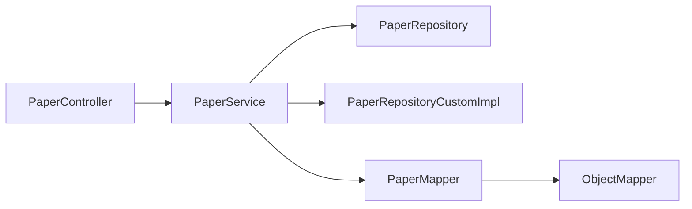

# 论文管理模块（F2.2）— Task15 列表/详情 + Task16 搜索 实施计划

> 基于 `log/backend` 现状（JM2 已完成 F2.1 用户管理 + PaperRepositoryCustomImpl 底层全文检索 + RedisConfig 6 缓存空间），
> 依次实现 task15_paper_controller_service_list_detail（F2.2.1 + F2.2.2）与
> task16_paper_search_fulltext_filter_sort（F2.2.3）。

---

## 1 目标与范围

| 任务 | 范围 | 涉及 F2.2.x |
|------|------|-------------|
| **task15** | 论文列表（分页） + 论文详情 | F2.2.1、F2.2.2 |
| **task16** | 论文搜索（全文+过滤+排序+分页+缓存） | F2.2.3 |

### 1.1 task15 交付清单

| 类型 | 路径 | 备注 |
|------|------|------|
| 新增 | `dto/response/PaperResponse.java` | 列表项 DTO（7 字段） |
| 新增 | `dto/response/PaperDetailResponse.java` | 详情 DTO（继承 + 4 字段） |
| 新增 | `mapper/PaperMapper.java` | MapStruct 映射器（JSON↔List<String>） |
| 新增 | `service/PaperService.java` | 列表 + 详情业务 |
| 新增 | `controller/PaperController.java` | 2 个 GET 端点 |
| 新增 | `test/dto/response/PaperResponseTest.java` | 字段映射单测 |
| 新增 | `test/mapper/PaperMapperTest.java` | 转换单测 |
| 新增 | `test/service/PaperServiceTest.java` | 业务单测 |
| 新增 | `test/controller/PaperControllerTest.java` | 集成测试 |

### 1.2 task16 交付清单

| 类型 | 路径 | 备注 |
|------|------|------|
| 修改 | `service/PaperService.java` | 新增 `searchPapers` + `@Cacheable("paperSearch")` |
| 修改 | `controller/PaperController.java` | 新增 `GET /api/papers/search` 端点 |
| 新增 | `test/service/PaperServiceSearchTest.java` | 搜索业务单测 |

> ⚠️ **禁止修改**：`PaperRepositoryCustomImpl`（task09 已完成底层实现，仅做调用）、`PaperRepository`、`Paper` Entity、
> `RedisConfig`（paperSearch 缓存空间已配）、`SecurityConfig`（`anyRequest().authenticated()` 已覆盖）。

---

## 2 设计要点

### 2.1 分层与依赖



### 2.2 缓存策略

| 缓存区 | 注解 | Key | TTL | 命中条件 |
|--------|------|-----|-----|----------|
| `paperDetail` | `@Cacheable(value="paperDetail", key="#paperId", unless="#result == null")` | `paper:detail:{paperId}` | 30min | 单篇详情 |
| `paperSearch` | `@Cacheable(value="paperSearch", key="format('%s_%s_%s_%s_%s_%d_%d', #q, #yearFrom, #yearTo, #venue, #sort, #page, #size)")` | `paper:search:{queryHash}` | 10min | 全搜索结果 |

注：`@Cacheable` 由 Spring AOP 拦截，**必须通过 Spring 注入的 Bean 调用**才能生效，因此测试中 `PaperService` 必须用 `@InjectMocks` + Mockito，且 `@Cacheable` 缓存效果在单测中通过 `Mockito.verify(repository, times(1))` 验证。

### 2.3 JSON 字段转换（authors/keywords）

`Paper` Entity 中 `authors`/`keywords` 是 JSON 字符串，DTO 是 `List<String>`。
MapStruct 需注入 `ObjectMapper`，使用 `@Named("jsonToList")` 自定义方法处理：
- null/空串 → `List.of()`
- 合法 JSON → 反序列化
- 非法 JSON → `List.of()` + `log.warn`，不中断

### 2.4 参数校验与边界

| 参数 | 规则 | 失败行为 |
|------|------|---------|
| `page` | `<1` → 1 | 静默修正 |
| `size` | `<1` → 10；`>100` → 100 | 静默修正 |
| `yearFrom/yearTo` | 都不为 null 时 `yearFrom>yearTo` | `BusinessException(400, "yearFrom不能大于yearTo")` |
| `sort` | 必须为 `relevance`/`year`/`citations` | 降级为 `relevance` + `log.warn` |
| `q` (搜索) | trim 后不能为空 | `IllegalArgumentException`（→ 400 via GlobalExceptionHandler） |

---

## 3 执行步骤

### Step 1 — 新增 PaperResponse DTO

**文件**：`Veritas/backend/src/main/java/com/literatureassistant/dto/response/PaperResponse.java`

```java
@Data @Builder @NoArgsConstructor @AllArgsConstructor
public class PaperResponse {
    @JsonProperty("paper_id") private String paperId;
    private String title;
    private List<String> authors;
    private Integer year;
    private String venue;
    private List<String> keywords;
    @JsonProperty("citation_count") private Integer citationCount;
}
```

### Step 2 — 新增 PaperDetailResponse DTO

**文件**：`Veritas/backend/src/main/java/com/literatureassistant/dto/response/PaperDetailResponse.java`

继承 `PaperResponse`，新增：
- `@JsonProperty("abstract") String abstractText`
- `@JsonProperty("pdf_url") String pdfUrl`
- `@JsonProperty("created_at") LocalDateTime createdAt`
- `@JsonProperty("updated_at") LocalDateTime updatedAt`

### Step 3 — 新增 PaperMapper（MapStruct）

**文件**：`Veritas/backend/src/main/java/com/literatureassistant/mapper/PaperMapper.java`

要点：
- `@Mapper(componentModel = "spring", uses = {ObjectMapper.class})`（或 `injectionStrategy = InjectionStrategy.CONSTRUCTOR` + 构造器注入 ObjectMapper）
- 两个方法：`toResponse(Paper)→PaperResponse`、`toDetailResponse(Paper)→PaperDetailResponse`
- `@Named("jsonToList") default List<String> jsonToList(String json)` 抛 `JsonProcessingException`
- 配套 `@Named("listToJson") default String listToJson(List<String> list)`（保持对称，未来更新可能用到）
- toResponse 中：`@Mapping(target="authors", source="authors", qualifiedByName="jsonToList")`、`@Mapping(target="keywords", source="keywords", qualifiedByName="jsonToList")`
- toDetailResponse：复用 toResponse 字段 + `@Mapping(target="abstractText", source="abstractText")` 等

### Step 4 — 新增 PaperService

**文件**：`Veritas/backend/src/main/java/com/literatureassistant/service/PaperService.java`

方法：
1. `listPapers(int page, int size)` — 边界修正 + `PageRequest.of(page-1, size, Sort.by(...))` + `paperRepository.findAll(pageable)` + 映射
2. `@Cacheable(value="paperDetail", key="#paperId", unless="#result == null") getPaperDetail(String paperId)` — 查不到抛 `ResourceNotFoundException`
3. `searchPapers(...)` — **task16 实施**

注：`@Slf4j` 记录 `log.info("Paper list: page={}, size={}", page, size)`（仅入口一次性，不在 stream 内）。

### Step 5 — 新增 PaperController

**文件**：`Veritas/backend/src/main/java/com/literatureassistant/controller/PaperController.java`

端点：
- `GET /api/papers` → listPapers
- `GET /api/papers/{paperId}` → getPaperDetail
- `GET /api/papers/search` → searchPapers（task16）

### Step 6 — 实现 searchPapers（task16）

**修改**：`PaperService.java`

```java
@Cacheable(value = "paperSearch",
    key = "T(java.lang.String).format('%s_%s_%s_%s_%s_%d_%d', #q, #yearFrom, #yearTo, #venue, #sort, #page, #size)")
public PageResponse<PaperResponse> searchPapers(
        String q, Integer yearFrom, Integer yearTo,
        String venue, String sort, int page, int size) {
    // 1. q 校验：null/blank → IllegalArgumentException
    // 2. yearFrom<=yearTo 校验
    // 3. sort 白名单 + 降级
    // 4. page/size 边界
    // 5. PageRequest.of(page-1, size) — 不传 Sort
    // 6. paperRepository.searchByKeyword(q, yearFrom, yearTo, venue, sort, pageable)
    // 7. paperPage.getContent().stream().map(paperMapper::toResponse).toList()
    // 8. PageResponse.fromPage(paperPage, mappedList)
}
```

**修改**：`PaperController.java`

```java
@GetMapping("/search")
public ApiResponse<PageResponse<PaperResponse>> searchPapers(
        @RequestParam String q,
        @RequestParam(required = false) Integer yearFrom,
        @RequestParam(required = false) Integer yearTo,
        @RequestParam(required = false) String venue,
        @RequestParam(defaultValue = "relevance") String sort,
        @RequestParam(defaultValue = "1") int page,
        @RequestParam(defaultValue = "10") int size) {
    return ApiResponse.success(paperService.searchPapers(q, yearFrom, yearTo, venue, sort, page, size));
}
```

### Step 7 — 单元测试

| 测试类 | 覆盖 |
|--------|------|
| `PaperResponseTest` | `@JsonProperty` 序列化 snake_case；反序列化映射 |
| `PaperMapperTest` | JSON 字符串 ↔ List 转换（4 场景：正常/null/空/非法） |
| `PaperServiceTest` | 列表边界修正、详情缓存命中（`verify(repo, times(1))`）、详情 404 |
| `PaperServiceSearchTest` | 搜索参数校验 + 缓存命中 + 排序降级 + 空结果 |
| `PaperControllerTest` | 端到端 HTTP 状态码 + JSON 字段 + 401 |

### Step 8 — 编译与测试

```bash
cd Veritas/backend && mvn compile
cd Veritas/backend && mvn test
```

---

## 4 风险与决策

| 风险 | 决策 |
|------|------|
| MapStruct + ObjectMapper 注入版本兼容 | 用 `uses = JsonMapperConfig.class` 或构造器注入；优先构造器注入避免循环依赖 |
| `@Cacheable` 失效 | 测试用 `@InjectMocks` + 调用真实 bean；`PaperService` 必须是 Spring 代理（CGLIB），故测试中验证 `verify` 调用次数而非反射判断 |
| `IllegalArgumentException` 无统一处理 | 现有 `GlobalExceptionHandler` 兜底 `Exception` → 500。需在 handler 中新增 `IllegalArgumentException → 400` |
| sort 非法值 SQL 注入 | `SORT_MAPPING` 是白名单 `Map.of`，非法走 `DEFAULT_ORDER`，安全 |
| MySQL ngram 全文索引中文支持 | 已建索引，service 不涉及 DDL |

---

## 5 变更文件总览

| # | 文件 | 操作 | 任务 |
|---|------|------|------|
| 1 | `dto/response/PaperResponse.java` | 新增 | task15 |
| 2 | `dto/response/PaperDetailResponse.java` | 新增 | task15 |
| 3 | `mapper/PaperMapper.java` | 新增 | task15 |
| 4 | `service/PaperService.java` | 新增 | task15 |
| 5 | `controller/PaperController.java` | 新增 | task15 |
| 6 | `service/PaperService.java` | 修改 | task16 |
| 7 | `controller/PaperController.java` | 修改 | task16 |
| 8 | `exception/GlobalExceptionHandler.java` | 修改 | 增强（`IllegalArgumentException → 400`） |
| 9 | `test/dto/response/PaperResponseTest.java` | 新增 | task15 |
| 10 | `test/mapper/PaperMapperTest.java` | 新增 | task15 |
| 11 | `test/service/PaperServiceTest.java` | 新增 | task15 |
| 12 | `test/service/PaperServiceSearchTest.java` | 新增 | task16 |
| 13 | `test/controller/PaperControllerTest.java` | 新增 | task15+16 |

---

## 6 验收清单

- [ ] AC-001 `GET /api/papers?page=1&size=10` 返回分页 JSON
- [ ] AC-002 `GET /api/papers/{paperId}` 返回详情 JSON
- [ ] AC-003 论文不存在返回 404
- [ ] AC-004 JSON 字段为 snake_case（`paper_id`、`citation_count`、`pdf_url`、`abstract`、`created_at`、`updated_at`）
- [ ] AC-005 `authors/keywords` 为 `List<String>`
- [ ] AC-006 详情 `@Cacheable("paperDetail")` 30min
- [ ] AC-007 列表按 `createdAt DESC`，page 从 1 开始
- [ ] AC-008 搜索 6 参数（`q` 必填 + 5 可选）正确工作
- [ ] AC-009 搜索缓存命中
- [ ] AC-010 三种排序均正确
- [ ] AC-011 sort 非法值降级为 relevance
- [ ] AC-012 `yearFrom>yearTo` 返回 400
- [ ] AC-013 未携带 Token 返回 401
- [ ] AC-014 Controller 不含业务逻辑
- [ ] AC-015 `mvn compile` & `mvn test` 全部通过

---

## 7 下一步建议（交付后）

1. 启动 docker-compose 中的 mysql + redis，初始化 paper 种子数据，手动 curl 验证端点
2. 后续 F2.2.4 收藏功能可复用 `PaperFavoriteRepository` + `PaperFavorite` Entity
3. 与前端 F1.2 联调，对接 `/api/papers/search` 的 URL
4. JM3 任务 17/18/19：会话管理 F2.3 + 分析服务 F2.4
