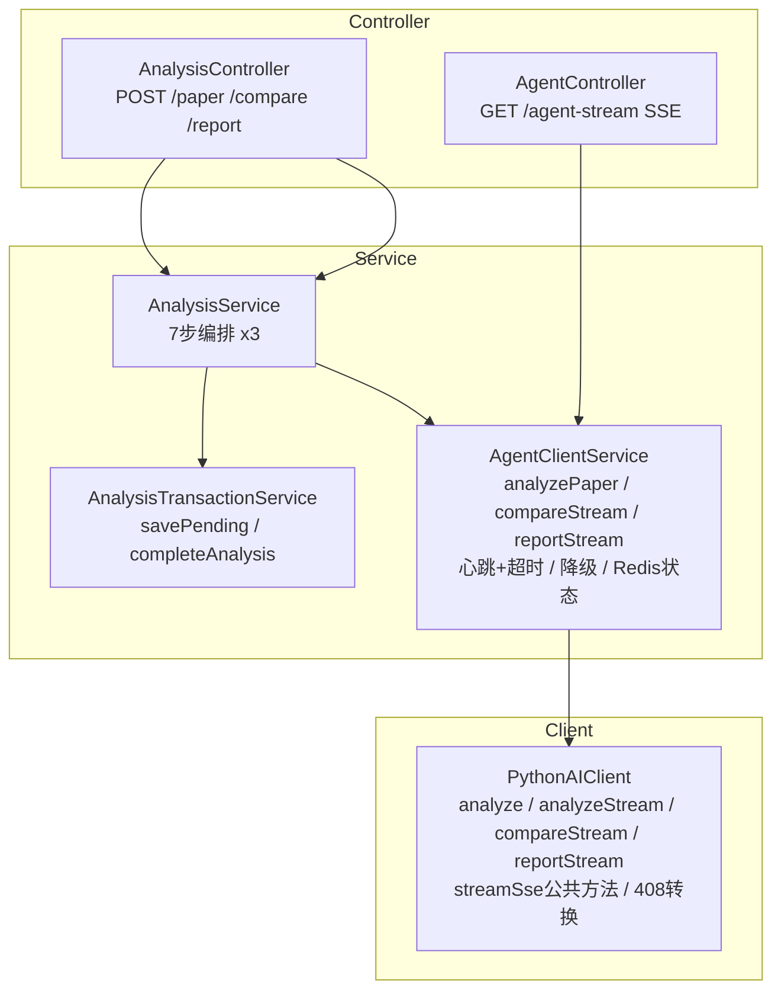

# 技术教学文档 — JM4 多Agent协同与SSE推送

## 开发思路

### 需求分析过程

本次开发覆盖 8 个 Prompt（task24-31），核心目标是补齐 M4 多Agent协同里程碑的全部后端能力。分析现有代码后得出差异清单：

| 现有实现 | 缺失能力 |
|---------|---------|
| `AnalysisService.analyzePaper` 7步编排 | comparePapers、generateReport未实现 |
| `@Autowired @Lazy self` 自注入 | 需提取AnalysisTransactionService |
| `PythonAIClient.analyzeStream` 仅论文分析SSE | 缺compareStream、reportStream、408处理 |
| `AgentClientService.handleFallback` 仅PAPER_ANALYSIS | 缺COMPARE/REPORT降级 |
| `AnalysisController` 含agentStream | 需拆出AgentController专管SSE |
| SSE无心跳/超时/CORS Last-Event-ID | 需补全标准化 |

### 技术选型考虑

- **自注入消除**：选择提取独立 Service 类而非使用 `AopContext.currentProxy()`，因为独立类更清晰可测
- **SSE解析**：Spring WebClient默认Jackson decoder不解析SSE文本流，选择 `bodyToFlux(byte[].class)` + 手动 `\n\n` 切分事件 + Jackson解析data JSON，比引入额外SSE库更可控
- **心跳实现**：`Flux.interval(30s).map(pingEvent)` 与数据流 `Flux.merge`，ping不写Redis
- **降级工厂**：`compareDegraded`/`reportDegraded` 返回包含占位框架的降级DTO，前端可展现代替空白

### 架构设计思路



### 遇到的问题及解决方案

| 问题 | 方案 |
|------|------|
| Spring WebClient `bodyToFlux(AgentSseEvent.class)` 不解析SSE | 改用 `bodyToFlux(byte[].class)` + 手动SSE行解析 → `\n\n` 切分事件，逐行解析id/event/data |
| `isHealthy` 测试mock body格式与代码不匹配 | 修改mock返回嵌套格式 `{"data":{"status":"UP"}}` 对齐Python API |
| AnalysisController与AgentController共用 `/{id}/agent-stream` 路径 | 删除AnalysisController中的旧实现，仅保留AgentController中的新版 |
| task24重构后测试类需要适配 | `@Mock AnalysisTransactionService` 替代 `self` 反射+字段注入 |

---

## 实现步骤

### 1. Phase 1: 重构消除自注入（task24）

1. 新建 `AnalysisTransactionService.java`，从 `AnalysisService` 原样迁移 `savePending` + `completeAnalysis` 两个 `@Transactional` 方法
2. 修改 `AnalysisService`：
   - 删除 `@Autowired @Lazy private AnalysisService self` 字段
   - 新增 `private final AnalysisTransactionService analysisTransactionService` 构造器注入
   - `self.savePending/completeAnalysis` → `analysisTransactionService.savePending/completeAnalysis`
   - 新增 `comparePapers(CompareRequest)` + `generateReport(ReportRequest)` 骨架（抛UnsupportedOperationException）

### 2. Phase 1: 对比分析+综述生成API（task25-26）

1. 新建 `CompareRequest.java`：`@NotBlank topic` + `@NotNull @Size(min=2,max=5) paperIds` + `sessionId`
2. 新建 `ReportRequest.java`：`@NotBlank topic` + `@NotEmpty @Size(max=20) paperIds` + `sessionId`
3. `AnalysisService.comparePapers` 替换骨架为完整8步编排（遍历验证所有paperIds→savePending(COMPARE)→callAI→completeAnalysis）
4. `AnalysisService.generateReport` 替换骨架为完整7步编排+日志citations校验
5. 提取 `resolveOrCreateSession(userId, sessionId, topic)` 公共方法（3种分析类型复用）
6. `AnalysisController` 新增 `POST /compare` + `POST /report` 端点
7. 删除 `AgentClientService.generateReport(AgentRequest)` Mono占位方法

### 3. Phase 2: SSE扩展（task27-29）

1. `PythonAIClient`：
   - 提取 `streamSse(endpoint, request, lastEventId)` 私有方法
   - 新增 `compareStream` → `/api/agent/compare/stream`
   - 新增 `reportStream` → `/api/agent/report/stream`
   - `transformTimeoutEvents` 处理 event=error + data.type=timeout → 前端标准降级事件
2. 新建 `AgentController`：SSE端点 + `toStandardizedSseEvent` 标准化
3. `AgentClientService`：
   - `generateReportStreamWithHeartbeat`：`Flux.merge(数据流, heartbeatFlux)` + `timeout(120s)`
   - `compareStream`/`reportStream` 包装方法（调PythonAIClient + doOnNext写Redis）
4. `WebClientConfig`：responseTimeout + ReadTimeoutHandler 150s→120s
5. `SecurityConfig`：allowedHeaders + `Last-Event-ID`

### 4. Phase 3: 降级机制（task30）

1. `AnalysisResultDTO`：新增 `compareDegraded`（含对比框架占位markdown）/ `reportDegraded`（含综述大纲占位markdown）
2. `AgentClientService.handleFallback`：区分 `request.analysisType`，COMPARE→compareDegraded、REPORT→reportDegraded
3. `AgentClientService.handleStreamFallback`：Flux依次发出 event:error(type:degradation) + event:analysis_completed(degraded:true)

---

## 解决了什么问题

| 核心问题 | 解决方案 |
|---------|---------|
| S-003反模式：@Autowired @Lazy自注入 | 提取AnalysisTransactionService，构造器注入 |
| 对比/综述编排缺失 | 7步编排模板方法模式复用于3种分析类型 |
| SSE无心跳超时 | Flux.interval(30s) ping + timeout(120s) |
| 408超时事件 | Python error事件→前端标准降级事件转换 |
| COMPARE/REPORT无降级 | 专用降级工厂+handleFallback类型区分 |
| CORS缺Last-Event-ID | SecurityConfig补充allowedHeaders |
| SSE文本流反序列化 | byte[]→手动SSE行解析 |

---

## 变更内容

### 新增文件（10个）

| 文件 | 作用 |
|------|------|
| `service/AnalysisTransactionService.java` | 事务服务（savePending+completeAnalysis with @Transactional） |
| `dto/request/CompareRequest.java` | 对比分析请求DTO（@Size(min=2,max=5) paperIds） |
| `dto/request/ReportRequest.java` | 综述生成请求DTO（@Size(max=20) paperIds） |
| `controller/AgentController.java` | Agent SSE控制器+事件标准化 |
| `service/AnalysisTransactionServiceTest.java` | 6个事务服务单元测试 |
| `dto/request/CompareRequestValidationTest.java` | 8个Bean Validation测试 |
| `service/AnalysisServiceReportTest.java` | 6个综述生成测试 |
| `sse/SseEventFormatTest.java` | 11个SSE事件格式测试 |
| `sse/SseHeartbeatTimeoutTest.java` | 5个心跳/超时/CORS测试 |

### 修改文件（10个）

| 文件 | 变更要点 |
|------|---------|
| `service/AnalysisService.java` | 消除self注入；新增comparePapers/generateReport完整编排；抽取resolveOrCreateSession公共方法 |
| `service/AgentClientService.java` | 删除Mono占位；新增心跳/超时/降级/compareStream/reportStream/7种事件映射 |
| `client/PythonAIClient.java` | 提取streamSse公共方法；新增compareStream/reportStream；408转换；byte[] SSE解析 |
| `dto/response/AnalysisResultDTO.java` | 新增compareDegraded/reportDegraded静态工厂 |
| `controller/AnalysisController.java` | 新增POST /compare、POST /report；移除agentStream |
| `config/WebClientConfig.java` | sseWebClient超时150s→120s |
| `config/SecurityConfig.java` | CORS allowedHeaders增加Last-Event-ID |
| 4个测试类 | 适配重构（Mock替代self反射；扩展SSE+降级测试） |

---

## 关键技术点

### 1. SSE字节流手动解析
```java
// bodyToFlux(byte[].class) → 按\n\n切分 → parseSseEvent逐行解析id:/event:/data:
private Flux<AgentSseEvent> streamSse(String endpoint, AgentRequest request, String lastEventId) {
    return bodySpec.bodyValue(request).retrieve()
        .bodyToFlux(byte[].class)          // ← 关键改动
        .timeout(120s)
        .flatMapIterable(this::splitSseEvents)
        .map(this::parseSseEvent)           // 手动解析SSE行格式
        .flatMap(this::transformTimeoutEvents);
}
```

### 2. 心跳+超时合并
```java
Flux<AgentSseEvent> dataFlux = pythonAIClient.analyzeStream(request, lastEventId);
Flux<AgentSseEvent> heartbeatFlux = Flux.interval(30s).map(tick -> pingEvent);
Flux<AgentSseEvent> timeoutDetection = dataFlux.timeout(120s, fallbackErrorFlux);
return Flux.merge(timeoutDetection, heartbeatFlux).onErrorResume(handleStreamFallback);
```

### 3. 三级降级区分类型
```java
if (type == AnalysisType.COMPARE) return AnalysisResultDTO.compareDegraded(analysisId, reason);
else if (type == AnalysisType.REPORT) return AnalysisResultDTO.reportDegraded(analysisId, reason);
else return AnalysisResultDTO.degraded(analysisId, reason);
```

---

## 经验总结

### 开发过程中的收获

1. **自注入消除是渐进安全的**：提取独立Service类并保持方法签名一致，测试通过反射→Mock的迁移简单可靠
2. **SSE在Spring WebClient中的限制**：虽然Spring 6.x+内置text/event-stream解码器，但`bodyToFlux(AgentSseEvent.class)`默认走Jackson不解析SSE行格式。手动byte[]解析是最可控的方案
3. **模板方法模式的价值**：3种分析类型共用7步编排+同一个resolveOrCreateSession和generateAnalysisId，代码量远小于分别实现

### 踩过的坑

1. **`bodyToFlux(AgentSseEvent.class)` 不工作** — 事件字段全部为null。根因：Jackson序列化器把整个SSE文本当JSON解析失败。修复：`byte[].class` + 手动行解析
2. **isHealthy测试格式不匹配** — mock body为`{"status":"UP"}`但代码读`data.status`。修复：对齐为`{"data":{"status":"UP"}}`
3. **AnalysisController/AgentController路由冲突** — 两个Controller都有`@GetMapping("/{analysisId}/agent-stream")`。修复：删除AnalysisController旧实现
4. **AssertJ Long/Integer类型严格** — `data.get("durationMs")` 返回Integer，`isEqualTo(3200)` 类型不匹配。修复：`((Number) data.get("durationMs")).longValue()`

### 最佳实践建议

1. SSE解析优先考虑 `bodyToFlux(byte[].class)` + 手动行解析，可控且跨版本兼容
2. 心跳/超时使用 `Flux.merge` + `timeout(Duration, fallbackFlux)` 组合而非自定义调度器
3. 降级DTO使用静态工厂模式，包含占位内容（对比框架/综述大纲）而非空response
4. 事务与AI调用分离：AI调用永远不加 `@Transactional`，避免30s长事务
