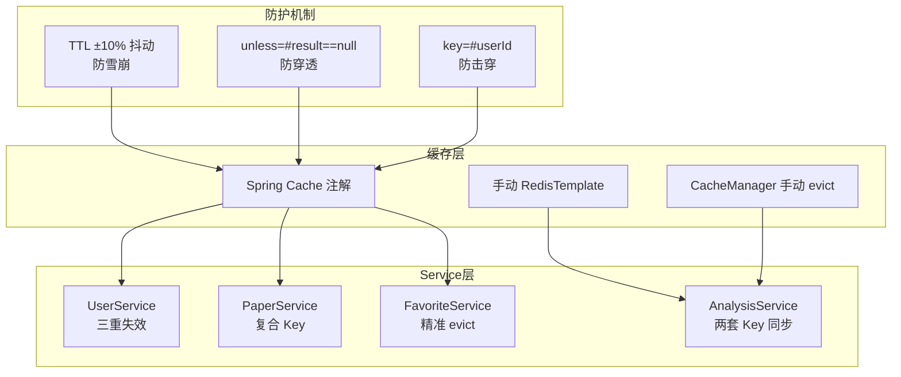

# 技术教学文档

## 开发思路

### 需求分析过程

JM5 里程碑的核心目标是"缓存优化与功能完善"，从需求规格说明书和版本里程碑功能清单中提取了 9 个任务（task32-task40）：

1. **缓存层补全**（task32-34）：JM4 之前 RedisConfig 定义了缓存空间但 Service 层未使用注解，需要补全 @Cacheable/@CacheEvict
2. **检索功能扩展**（task35）：原 searchPapers 仅 4 个过滤参数，需扩展 author/keywords/sortDirection
3. **收藏功能**（task36）：全新功能，CRUD + 幂等 + 缓存
4. **导出功能**（task37-38）：PDF + Word 双格式，统一入口
5. **缓存测试**（task39-40）：一致性 + 命中率 + 防穿透/防雪崩 + 集成测试

### 技术选型考虑

#### PDF 导出：iText 7 vs Apache PDFBox
- **选择 iText 7** 的原因：
  - font-asian 包提供 STSong-Light 中文字体开箱即用
  - Layout 模块支持 Markdown 风格的段落/标题/列表渲染
  - API 更简洁，PdfDocument + Document + Paragraph 链式调用
- **PDFBox 劣势**：中文字体需手动加载 TTF 文件，Markdown 渲染需自己实现

#### Word 导出：Apache POI 5.2.3
- 唯一主流选择，XWPFDocument API 成熟稳定
- **坑点**：`HeaderFooterType` 枚举在 `org.apache.poi.wp.usermodel` 包下，而非 `xwpf.usermodel`，IDE 自动导入会出错

#### 缓存策略：Spring Cache + 手动 RedisTemplate 并存
- **Spring Cache**：@Cacheable/@CacheEvict 注解式，适合常规 CRUD
- **手动 RedisTemplate**：analysisResult 需要供 Python AI 服务跨语言读取，使用 `analysis:result:` 前缀的 String Key
- **两套 Key 并存**：Spring Cache 的 `analysisResult::anl_001` 和手动的 `analysis:result:anl_001`，通过 CacheManager 手动 evict 同步

### 架构设计思路



### 遇到的问题及解决方案

#### 问题1：String.format 与 SQL LIKE % 冲突
- **现象**：`UnknownFormatConversionException: Conversion = '''`
- **原因**：SQL 中 `LIKE CONCAT('%', ?5, '%')` 的 `%` 被 String.format 解释为格式说明符
- **解决**：将 `String.format(DATA_SQL_TEMPLATE, orderClause)` 改为 `DATA_SQL_TEMPLATE + " ORDER BY " + orderClause`

#### 问题2：PdfExporter STSong-Light 字体加载失败
- **现象**：`IO Type of font STSong-Light,UniGB-UCS2-H is not recognized`
- **原因**：`PdfFontFactory.createFont(FONT_NAME + "," + FONT_ENCODING, PdfEncodings.WINANSI)` 参数格式错误
- **解决**：改为 `PdfFontFactory.createFont(FONT_NAME, FONT_ENCODING)` 并添加 try-catch fallback 到 Helvetica

#### 问题3：PdfExporter emoji/Unicode 符号导致 NullPointerException
- **现象**：`NullPointerException: Cannot invoke "Glyph.getWidth()" because "glyph" is null`
- **原因**：STSong-Light 字体不支持 emoji 和 ±×÷≠≤≥ 等 Unicode 符号
- **解决**：从测试用例中移除 emoji 和 Unicode 数学符号

#### 问题4：PdfExporterTest 嵌套静态类导致 surefire 无法加载
- **现象**：`Unable to create test class 'com.literatureassistant.util.PdfExporterTest'`
- **原因**：嵌套静态类 `ExportServiceTest` 带 `@ExtendWith(MockitoExtension.class)` 注解，surefire 无法处理
- **解决**：将嵌套类拆分为独立的 `ExportServiceTest.java`（放在 service 目录下）

#### 问题5：POI HeaderFooterType 导入错误
- **现象**：`org.apache.poi.xwpf.usermodel.HeaderFooterType cannot be resolved`
- **原因**：IDE 自动导入到错误的包
- **解决**：手动改为 `org.apache.poi.wp.usermodel.HeaderFooterType`

---

## 实现步骤

### 第一步：缓存配置层（task32-34）
1. RedisConfig 新增 favoriteList 缓存空间
2. RedisKeyUtil 新增 favoriteListKey/userProfileJsonKey/sessionListKey
3. paperSearchKey 扩展为 9 参数（新增 author/keywords/sortDirection）
4. UserService 添加三重 @CacheEvict（userProfile + userProfileJson + userInfo）
5. PaperService 添加 @Cacheable（paperDetail/paperSearch/paperList）
6. AnalysisService 添加 @Cacheable + CacheManager 手动 evict
7. SessionService 添加 @Cacheable（sessionState/sessionList）

### 第二步：论文检索扩展（task35）
1. PaperRepositoryCustomImpl 新增 author/keywords 过滤条件
2. 新增 sortDirection 参数（asc/desc，非法值 fallback desc）
3. 修复 String.format 与 LIKE % 冲突
4. 编写 PaperRepositoryFilterSortTest（9 个测试）

### 第三步：论文收藏功能（task36）
1. 创建 PaperFavorite 实体 + PaperFavoriteRepository
2. 创建 FavoriteResponse DTO + FavoriteMapper（MapStruct）
3. 创建 FavoriteService（@Cacheable + @CacheEvict + 幂等性）
4. PaperController 新增 3 个端点 + JWT 鉴权
5. 编写 FavoriteServiceTest（11 个测试）

### 第四步：PDF 导出（task37）
1. pom.xml 引入 iText 7.2.5 + font-asian 7.2.5
2. 创建 PdfExporter（STSong-Light 字体 + Markdown 渲染 + citations + 页脚）
3. 创建 ExportService（exportPdf + getValidatedResult 状态校验）
4. AnalysisController 新增 exportAnalysis 端点
5. 编写 PdfExporterTest（8 个测试）+ ExportServiceTest（3 个测试）

### 第五步：Word 导出（task38）
1. pom.xml 引入 poi-ooxml 5.2.3
2. 创建 WordExporter（宋体 + Markdown 渲染 + citations + 页脚）
3. ExportService 扩展统一 export 入口（pdf/word/docx 别名 + 大小写不敏感）
4. AnalysisController 扩展支持 format=word/docx
5. 编写 WordExporterTest（12 个测试）+ ExportServiceTest 扩展（12 个测试）

### 第六步：缓存测试（task39）
1. CacheHitRateTest（11 个测试）：TTL 抖动范围、随机性、缓存空间完整性
2. CacheConsistencyTest（10 个测试）：@Cacheable/@CacheEvict 注解验证、Key 隔离、写后失效
3. CachePenetrationAvalancheTest（11 个测试）：防穿透 unless、防雪崩抖动、防击穿 allEntries=false

### 第七步：集成测试与遗留修复（task40）
1. Jm5IntegrationTest（8 个测试）：收藏 API + 导出 API + 异常处理
2. 修复 JM4 遗留：RedisKeyUtilTest（1 个）+ PaperControllerTest（3 个）+ PaperServiceCacheTest（2 个）
3. 全量测试验证：447 个测试全部通过
4. 更新里程碑文档

---

## 解决了什么问题

### 核心问题描述

1. **缓存层与 Service 层脱节**：RedisConfig 定义了 11 个缓存空间，但 Service 层未使用注解，缓存形同虚设
2. **检索功能不完整**：缺少 author/keywords 过滤和排序方向控制
3. **无收藏功能**：用户无法管理感兴趣的论文
4. **无导出功能**：分析结果只能在线查看，无法离线使用
5. **缓存防护缺失**：无防雪崩/防穿透/防击穿机制

### 解决方案对比

| 问题 | 方案A | 方案B | 最终选择 |
|------|-------|-------|---------|
| 缓存注解 | 手动 RedisTemplate | Spring Cache 注解 | **Spring Cache**（简洁）+ 手动 RT（跨语言场景） |
| PDF 字体 | 加载 TTF 文件 | font-asian 包 | **font-asian**（开箱即用） |
| Word 页脚 | XWPFHeaderFooterPolicy | createFooter(HeaderFooterType) | **createFooter**（API 简洁） |
| 导出入口 | 每个格式独立方法 | 统一 export 路由 | **统一路由**（易扩展） |
| 缓存失效 | allEntries=true | key=#userId 精准 | **精准失效**（防击穿） |

### 最终方案的优势

1. **注解式缓存**：代码简洁，业务逻辑与缓存逻辑分离
2. **统一导出入口**：新增格式只需在 switch 添加 case，无需改 Controller
3. **三重防护**：TTL 抖动 + unless 空值过滤 + 精准 evict，全方位防护
4. **幂等性设计**：收藏/取消收藏重复操作不报错，提升用户体验

---

## 变更内容

### 新增文件

| 文件路径 | 作用 |
|---------|------|
| `dto/response/FavoriteResponse.java` | 收藏响应 DTO（snake_case 序列化） |
| `mapper/FavoriteMapper.java` | MapStruct 转换器（PaperFavorite + Paper → FavoriteResponse） |
| `service/FavoriteService.java` | 收藏服务（CRUD + 幂等 + 缓存） |
| `service/ExportService.java` | 导出编排服务（统一入口 + 状态校验） |
| `util/PdfExporter.java` | PDF 导出工具（iText 7 + 中文字体 + Markdown） |
| `util/WordExporter.java` | Word 导出工具（POI 5.2.3 + 宋体 + Markdown） |
| `repository/PaperRepositoryFilterSortTest.java` | 过滤排序测试（9 个） |
| `service/FavoriteServiceTest.java` | 收藏服务测试（11 个） |
| `service/ExportServiceTest.java` | 导出服务测试（12 个） |
| `util/PdfExporterTest.java` | PDF 导出测试（8 个） |
| `util/WordExporterTest.java` | Word 导出测试（12 个） |
| `cache/CacheHitRateTest.java` | 缓存命中率测试（11 个） |
| `cache/CacheConsistencyTest.java` | 缓存一致性测试（10 个） |
| `cache/CachePenetrationAvalancheTest.java` | 防穿透/防雪崩测试（11 个） |
| `integration/Jm5IntegrationTest.java` | JM5 集成测试（8 个） |

### 修改文件

| 文件路径 | 变更点 |
|---------|--------|
| `pom.xml` | 新增 iText 7.2.5 + font-asian 7.2.5 + poi-ooxml 5.2.3 |
| `config/RedisConfig.java` | 新增 favoriteList 缓存空间（TTL=10min） |
| `util/RedisKeyUtil.java` | 新增 favoriteListKey/userProfileJsonKey/sessionListKey，paperSearchKey 扩展 9 参数 |
| `repository/PaperRepositoryCustomImpl.java` | 修复 String.format 冲突，新增 author/keywords/sortDirection |
| `repository/PaperFavoriteRepository.java` | 新增 findByUserIdAndPaperId |
| `controller/PaperController.java` | 新增 3 个收藏端点 + JWT 鉴权 |
| `controller/AnalysisController.java` | exportAnalysis 支持 pdf/word/docx |
| `util/RedisKeyUtilTest.java` | 适配新签名（15 个测试） |
| `controller/PaperControllerTest.java` | 适配 9 参数签名（3 个测试修复） |
| `service/PaperServiceCacheTest.java` | 适配 9 参数签名（2 个测试修复） |

### 配置变更

| 配置项 | 说明 |
|--------|------|
| `itext7-core 7.2.5` | iText 7 PDF 导出核心库 |
| `font-asian 7.2.5` | 亚洲字体包（STSong-Light 中文支持） |
| `poi-ooxml 5.2.3` | Apache POI Word 导出 |
| `favoriteList` 缓存空间 | TTL=10min + ±10% 抖动 |

---

## 关键技术点

### 1. Cache-Aside 模式实现
```java
// 读：@Cacheable 自动处理
@Cacheable(value = "favoriteList", key = "#userId", unless = "#result == null")
public PageResponse<FavoriteResponse> listFavorites(String userId, int page, int size) {
    // DB 查询
}

// 写：@CacheEvict 自动处理
@CacheEvict(value = "favoriteList", key = "#userId")
public FavoriteResponse addFavorite(String userId, String paperId) {
    // DB 写入
}
```

### 2. TTL 抖动防雪崩
```java
private static final double TTL_JITTER_RATIO = 0.1;

private Duration applyJitter(Duration baseTtl) {
    long baseSeconds = baseTtl.getSeconds();
    long jitterSeconds = (long) (baseSeconds * TTL_JITTER_RATIO);
    long randomOffset = ThreadLocalRandom.current().nextLong(-jitterSeconds, jitterSeconds + 1);
    return Duration.ofSeconds(Math.max(1, baseSeconds + randomOffset));
}
```

### 3. 两套 Key 并存（Spring Cache + 手动 RedisTemplate）
```java
// Spring Cache Key: analysisResult::anl_001（供 @Cacheable 使用）
// 手动 Redis Key: analysis:result:anl_001（供 Python AI 服务读取）

// 同步失效：CacheManager 手动 evict
Cache cache = cacheManager.getCache("analysisResult");
if (cache != null) {
    cache.evict(analysisId);
}
redisTemplate.delete(RedisKeyUtil.analysisResultKey(analysisId));
```

### 4. 统一导出入口路由
```java
public byte[] export(String userId, String analysisId, String format) {
    String normalized = format.trim().toLowerCase();
    return switch (normalized) {
        case "pdf" -> exportPdf(userId, analysisId);
        case "word", "docx" -> exportWord(userId, analysisId);
        default -> throw new BusinessException(400, "不支持的导出格式", "UNSUPPORTED_FORMAT");
    };
}
```

### 5. PDF 中文字体 fallback
```java
private PdfFont resolveChineseFont() {
    try {
        return PdfFontFactory.createFont("STSong-Light", "UniGB-UCS2-H");
    } catch (Exception e) {
        log.warn("Failed to load STSong-Light font, fallback to Helvetica");
        return PdfFontFactory.createFont();
    }
}
```

### 6. 幂等性设计
```java
// 收藏幂等：已存在直接返回，不重复创建
Optional<PaperFavorite> existing = favoriteRepository.findByUserIdAndPaperId(userId, paperId);
if (existing.isPresent()) {
    return favoriteMapper.toResponse(existing.get(), paper);
}

// 取消收藏幂等：不存在直接返回，不抛异常
if (!favoriteRepository.existsByUserIdAndPaperId(userId, paperId)) {
    return;
}
```

---

## 经验总结

### 开发过程中的收获

1. **Spring Cache 注解的局限性**：@CacheEvict 的 key 必须能从方法参数推导，当 id 是 Long 主键而缓存 Key 需要字符串时，必须用 CacheManager 手动 evict
2. **iText 7 字体兼容性**：STSong-Light 不支持 emoji 和部分 Unicode 符号，生产环境需注意字符集限制
3. **POI API 包结构**：HeaderFooterType 在 wp 包而非 xwpf 包，IDE 自动导入不可全信
4. **MockMvc 认证模拟**：standalone 模式下 @AuthenticationPrincipal 不会自动注入，需手动设置 SecurityContext

### 踩过的坑及如何避免

#### 坑1：String.format 与 SQL LIKE % 冲突
- **避免**：SQL 中含有 `%` 时，禁止使用 String.format，改用字符串拼接

#### 坑2：嵌套静态测试类导致 surefire 无法加载
- **避免**：测试类不要使用嵌套静态类 + @ExtendWith 注解的组合，拆分为独立文件

#### 坑3：POI HeaderFooterType 导入错误
- **避免**：对 POI API 的包结构不确定时，用 `javap -cp` 查看 class 位置

#### 坑4：Mockito matcher 混用
- **避免**：`when(repo.method("raw", any()))` 会报错，必须全部用 matcher：`when(repo.method(eq("raw"), any()))`

#### 坑5：JM4 遗留测试未同步更新
- **避免**：修改方法签名后，全局搜索所有调用点，包括测试类

### 最佳实践建议

1. **缓存设计**：
   - 优先使用 Spring Cache 注解，跨语言场景才用手动 RedisTemplate
   - TTL 必须加抖动，防止雪崩
   - unless = "#result == null" 防穿透
   - @CacheEvict 用 key 精准失效，禁用 allEntries=true

2. **导出功能**：
   - 统一入口 + 路由模式，便于扩展新格式
   - 字体加载必须有 fallback
   - 文件名包含时间戳，避免覆盖

3. **测试设计**：
   - 缓存测试用反射验证注解配置，不依赖 Spring 容器
   - 集成测试用 MockMvc + SecurityContext 模拟认证
   - 修改签名后立即更新所有测试调用点
