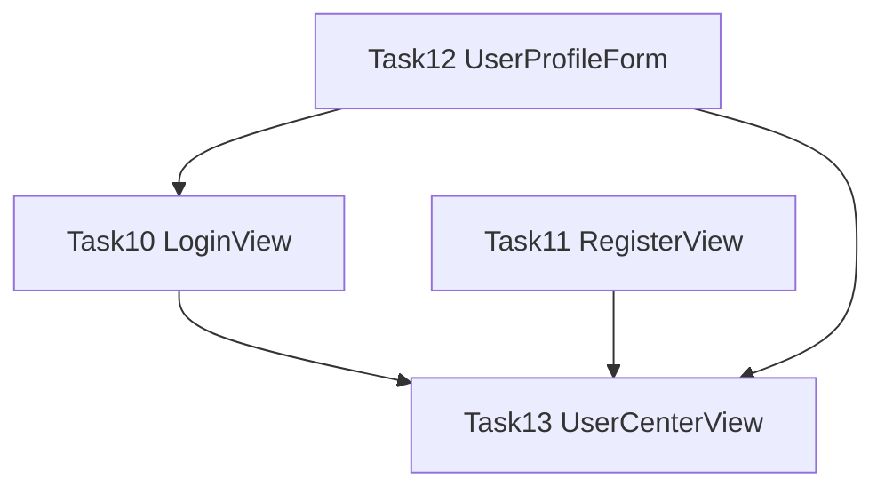

# FM2 前端任务实施计划 — Task10~13 用户界面模块

> 里程碑: FM2 用户+检索页面 | 模块: F1.1 用户界面

## 任务概览

4个任务按依赖关系自底向上执行：



| Task | 文件 | 操作 | 依赖 |
|------|------|------|------|
| Task10 | `LoginView.vue` | 替换占位骨架 | userStore(已有) |
| Task11 | `RegisterView.vue` | 替换占位骨架 | userApi(已有) |
| Task12 | `UserProfileForm.vue` | 新建组件 | userStore(已有) |
| Task13 | `UserCenterView.vue` + `userStore.ts` + `types/user.ts` | 替换+扩展 | Task12产出 |

## 现有代码状态分析

| 文件 | 当前状态 | 需要变更 |
|------|---------|---------|
| `LoginView.vue` | 占位骨架 `<h2>登录页</h2>` | 替换为完整登录表单 |
| `RegisterView.vue` | 占位骨架 `<h2>注册页</h2>` | 替换为完整注册表单 |
| `UserCenterView.vue` | 占位骨架 `<h2>用户中心页</h2>` | 替换为3区块用户中心 |
| `userStore.ts` | 已有login/logout/fetchProfile/saveProfile | 新增userInfo/getUserInfo/register |
| `types/user.ts` | 已有UserProfile/LoginResponse/ProfileResponse | 新增UserInfo接口 |
| `api/user.ts` | 已有register/getUserInfo等6个方法 | 无需修改(直接复用) |
| `api/session.ts` | 已有list/getDetail等4个方法 | 无需修改(直接复用) |
| `components/common/` | 仅有.gitkeep | Task12新建UserProfileForm.vue |

---

## Task10: LoginView.vue — 登录页面

### 变更文件
- `Veritas/frontend/src/views/LoginView.vue` — 替换占位骨架

### 实现要点

1. **表单结构**: el-form + 2个el-form-item(用户名/密码)
2. **校验规则**: 用户名3-50字符(required+min:3+max:50)，密码8-100字符(required+min:8+max:100)，trigger:'blur'
3. **登录逻辑**: validate → userStore.login() → ElMessage.success → router.push(redirect||'/')
4. **Loading状态**: loginLoading ref，按钮:loading，finally恢复
5. **布局**: 居中卡片式，max-width:400px，系统标题+副标题
6. **导航**: router-link to='/register' "还没有账号？去注册"
7. **回车提交**: 密码框@keyup.enter
8. **分层**: View→Store→API，LoginView只调userStore.login()

### 关键约束
- 禁止直接调userApi(FA-001)
- 禁止手动操作localStorage(FA-002)
- 必须有loading状态(FA-003)
- 使用CSS变量，8px间距系统
- 组件≤300行

---

## Task11: RegisterView.vue — 注册页面

### 变更文件
- `Veritas/frontend/src/views/RegisterView.vue` — 替换占位骨架

### 实现要点

1. **表单结构**: el-form + 4个el-form-item(用户名/邮箱/密码/确认密码)
2. **校验规则**: 用户名3-50字符、邮箱格式(type:email)、密码8-100字符、确认密码自定义validator
3. **确认密码校验器**: value !== registerForm.password → Error('两次输入密码不一致')
4. **注册逻辑**: validate → userApi.register() → ElMessage.success('注册成功，请登录') → router.push('/login')
5. **Loading状态**: registerLoading ref
6. **布局**: 与LoginView一致的居中卡片式，max-width:400px
7. **导航**: router-link to='/login' "已有账号？去登录"
8. **密码联动**: watch registerForm.password → 若confirmPassword非空则重新校验
9. **分层**: View→API(注册无需Store，成功不建立登录态)

### 关键约束
- 注册成功不自动登录(FA-001)
- 必须有loading状态(FA-002)
- 确认密码一致性校验(FA-003)
- 与LoginView风格一致(FA-008)

---

## Task12: UserProfileForm.vue — 用户画像表单组件

### 变更文件
- `Veritas/frontend/src/components/common/UserProfileForm.vue` — 新建

### 实现要点

1. **4维度表单**: 学历层次(el-select,4选项) + 研究方向(el-input) + 知识水平(el-select,4选项) + 偏好风格(el-select,3选项)
2. **枚举选项**:
   - 学历: undergraduate→本科生, master→硕士研究生, phd→博士研究生, faculty→教师/研究者
   - 知识水平: beginner→初级, intermediate→中级, advanced→高级, expert→专家
   - 偏好风格: simple→通俗, balanced→均衡, technical→专业
3. **Props**: `defineProps<{initialData?: UserProfile}>()`
4. **Emits**: `defineEmits<{(e:'saved'): void}>()`
5. **保存逻辑**: validate → userStore.saveProfile(form) → ElMessage.success → emit('saved')
6. **编辑模式**: watch props.initialData → 赋值form
7. **默认值**: {educationLevel:'master', researchField:'', knowledgeLevel:'intermediate', preferredStyle:'balanced'}
8. **Loading**: saving ref

### 关键约束
- 禁止直接调userApi(FA-001)
- 枚举value必须与types/user.ts一致(FA-003)
- 必须有loading状态(FA-002)
- 组件不管理userId(FA-008)

---

## Task13: UserCenterView + userStore扩展 + UserInfo类型

### 变更文件
1. `Veritas/frontend/src/types/user.ts` — 新增UserInfo接口
2. `Veritas/frontend/src/stores/userStore.ts` — 新增userInfo/getUserInfo/register
3. `Veritas/frontend/src/views/UserCenterView.vue` — 替换占位骨架

### 实现要点

#### types/user.ts 扩展
```typescript
export interface UserInfo {
  username: string
  email: string
  createdAt: string
}
```

#### userStore.ts 扩展
1. 新增 `userInfo = ref<UserInfo | null>(null)`
2. 新增 `async getUserInfo()`: 调用userApi.getUserInfo(userId.value) → 赋值userInfo
3. 新增 `async register(username, email, password)`: 调用userApi.register()，不建立登录态
4. 修改 `logout()`: 增加清除userInfo

#### UserCenterView.vue 3大区块
1. **用户信息展示区**: el-descriptions展示username/email/createdAt，数据来自userStore.userInfo
2. **用户画像编辑区**: 复用UserProfileForm，:initial-data="userStore.profile"，@saved刷新画像
3. **历史记录区**: el-timeline展示sessionApi.list({page:1,size:10})，空状态el-empty
4. **页面加载**: v-loading，Promise.all([getUserInfo, fetchProfile, sessionList])
5. **布局**: 3个el-card垂直排列，max-width: var(--content-max-width)居中

### 关键约束
- 禁止View直接调userApi获取用户信息(FA-001)
- 必须有loading状态(FA-002)
- 历史记录必须有空状态(FA-003)
- 必须复用UserProfileForm(FA-008)
- 会话列表直接调sessionApi(无Store，符合分层规则)

---

## 执行顺序

```
Step 1: Task10 — LoginView.vue (无前置依赖)
Step 2: Task11 — RegisterView.vue (无前置依赖，可与Step1并行但建议串行保持风格一致)
Step 3: Task12 — UserProfileForm.vue (无前置依赖)
Step 4: Task13 — types/user.ts → userStore.ts → UserCenterView.vue (依赖Task12)
Step 5: TypeScript类型检查验证
Step 6: 测试验证
```

## 验证命令

```bash
cd Veritas/frontend && npx vue-tsc --noEmit
cd Veritas/frontend && npx vitest run
```

## 风险点

| 风险 | 缓解措施 |
|------|---------|
| LoginView/RegisterView风格不一致 | 先实现LoginView，RegisterView复用相同CSS结构 |
| UserProfileForm枚举值与types不一致 | 直接引用UserProfile类型，选项value硬编码与类型字面量一致 |
| userStore扩展影响已有功能 | logout增加userInfo清理，不修改已有方法签名 |
| UserCenterView超过300行 | 3区块逻辑简单，预估约200行 |
