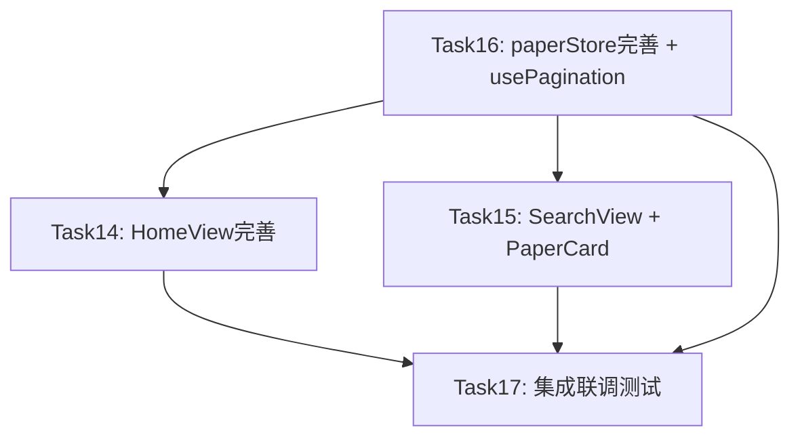

# 前端 FM2 任务实施计划 (Task14-17)

> 里程碑：FM2 — 用户界面与论文检索页面可用
> 范围：4个前端任务，按依赖顺序执行

---

## 一、任务依赖分析



**最优执行顺序：Task16 → Task14 → Task15 → Task17**

理由：
- Task16 是基础层（paperStore + usePagination），Task14/15 均依赖它
- Task14 和 Task15 无相互依赖，但 Task14 较简单先做
- Task17 是集成验证，必须等所有功能完成后再做

---

## 二、当前代码状态评估

| 文件 | 当前状态 | 需变更 |
|------|---------|--------|
| `paperStore.ts` | 骨架已实现，缺 loading/error/新 actions/移除 filteredResults | **extend** |
| `usePagination.ts` | 不存在 | **create** |
| `HomeView.vue` | 基础搜索已实现，缺 loading/el-input append整合/CSS变量/注释 | **extend** |
| `SearchView.vue` | 仅骨架占位符 | **重写** |
| `PaperCard.vue` | 不存在 | **create** |

---

## 三、Task16 — paperStore完善 + usePagination创建

### 3.1 修改 `paperStore.ts`

**新增 State：**
- `loading: ref<boolean>(false)` — 搜索加载状态
- `error: ref<string | null>(null)` — 搜索错误信息

**新增 Getters：**
- `hasResults: computed(() => searchResults.value.length > 0)`
- `totalPages: computed(() => Math.ceil(totalResults.value / pageSize.value) || 1)`

**移除：**
- `filteredResults` computed（服务端已过滤，客户端二次过滤数据不一致）

**新增 Actions：**
- `clearSelection()` — 清空 selectedPapers
- `fetchFavorites()` — 占位实现（空数组），预留 API 对接
- `updateFilters(newFilters: FilterParams)` — 合并筛选参数 + 触发重新搜索回到第1页
- `resetSearch()` — 重置搜索状态（不清空 selectedPapers/favorites）

**完善 searchPapers：**
- 增加 try-catch-finally 管理 loading/error
- loading=true → try中执行API调用 → catch中error赋值 → finally中loading=false

**完善 toggleFavorite：**
- 增加 try-catch 回滚逻辑：API失败时 favorites 状态回滚

**Return 导出：**
- 10个 state + 3个 getter + 7个 action

### 3.2 创建 `usePagination.ts`

```typescript
usePagination(total: Ref<number>, defaultPageSize?: number)
  → { currentPage, pageSize, totalPages, handleCurrentChange, handleSizeChange, resetPage }
```

- 纯逻辑 composable，不依赖任何 Store
- handleCurrentChange/handleSizeChange 通过 callback 参数解耦数据加载
- callback 签名：`(page: number) => Promise<void>`

---

## 四、Task14 — HomeView首页完善

### 4.1 当前 HomeView.vue 问题清单

1. ❌ 检索按钮与输入框未视觉整合（应使用 el-input append 插槽）
2. ❌ 缺少 isSearching loading 状态
3. ❌ 未调用 paperStore.searchPapers()（直接 router.push，SearchView 无法读取查询关键词对应的搜索结果）
4. ❌ 硬编码颜色 `#303133`（应使用 `var(--el-text-color-primary)`）
5. ❌ 标题文字含 emoji `🔍`（prompt 未要求 emoji）
6. ❌ max-width: 640px（prompt 要求 600px）
7. ❌ 缺少副标题描述文字
8. ⚠️ 样式使用 `var(--spacing-*)` 和 `var(--font-size-*)` 自定义变量（项目 variables.scss 有定义，可保留）

### 4.2 实施方案

**el-input append 插槽整合检索按钮：**
```html
<el-input v-model="searchQuery" size="large" clearable :disabled="isSearching"
  placeholder="输入研究主题，如Multi-Agent协同决策" @keyup.enter="handleSearch">
  <template #append>
    <el-button type="primary" :loading="isSearching" @click="handleSearch">检索</el-button>
  </template>
</el-input>
```

**handleSearch 逻辑完善：**
1. 校验 searchQuery.trim() 非空
2. saveRecentSearch(query) + 刷新 recentSearches
3. 检查 userStore.isLoggedIn，未登录 → ElMessage.warning + router.push('/login') 返回
4. 已登录 → isSearching=true → paperStore.searchPapers(query) → router.push → finally isSearching=false
5. searchPapers 失败 → ElMessage.error

**样式修复：**
- 标题颜色：`#303133` → `var(--el-text-color-primary)`
- max-width：640px → 600px
- 添加副标题 `font-size:14px; color:var(--el-color-info)`
- 搜索框上方 48px 留白，下方 24px 间距
- 历史区域 margin-top:24px, flex-wrap:wrap, gap:8px
- 所有间距遵循 8px 网格

**BEM 类名规范化（已有的基本正确，微调）：**
- home-view / home-view__content / home-view__search-box / home-view__title / home-view__subtitle / home-view__recent

---

## 五、Task15 — SearchView + PaperCard

### 5.1 创建 `PaperCard.vue`

**Props：** `{ paper: Paper; selectable?: boolean; selected?: boolean; isFavorited?: boolean }`

**Emits：** `select(paperId)`, `analyze(paperId)`, `favorite(paperId)`

**结构：**
```
el-card(shadow=hover) → paper-card
├── header区: h3.title(可点击→select) + el-tag.score(相关度%)
├── meta区: 作者·年份·会议
├── abstract区: truncateText(200字)
├── keywords区: v-for 最多3个 el-tag
├── recommend区: 推荐理由(可选)
└── actions区: [分析]按钮 + [收藏]按钮(右对齐flex)
```

**工具函数：** `truncateText(text: string, maxLength: number): string`

**BEM 类名：** paper-card / paper-card__title / paper-card__meta / paper-card__abstract / paper-card__keywords / paper-card__recommend / paper-card__actions / paper-card__score

### 5.2 重写 `SearchView.vue`

**结构：**
```
search-view(max-width:1200px, margin:0 auto, padding:24px)
├── search-view__header: el-input + el-button 搜索栏
├── search-view__stats: "找到 N 篇相关论文" (仅 totalResults>0)
├── search-view__results: PaperCard列表 + v-loading
│   ├── v-if error → el-result(icon=error) + 重试按钮
│   ├── v-else-if !hasSearched || loading → (loading时v-loading处理)
│   ├── v-else-if !searchResults.length → el-empty(未找到相关论文)
│   └── v-else → v-for PaperCard
├── search-view__pagination: el-pagination(仅 totalResults>pageSize)
```

**关键逻辑：**
- onMounted: 从 route.query.q 读取查询词，有则自动填充 searchQuery 并调用 handleSearch
- watch route.query.q: 查询词变化时重新搜索
- handleSearch: paperStore.searchPapers(query, 1) + hasSearched=true
- handlePageChange: paperStore.searchPapers(currentQuery, page) + scrollTo top
- handleFavorite: paperStore.toggleFavorite + ElMessage 反馈
- handleAnalyze: router.push({ name: 'PaperDetail', params: { paperId } })
- 收藏状态: isFavorited 通过 paperStore.favorites.includes(paperId) 计算

---

## 六、Task17 — 集成联调测试

### 6.1 补充缺失组件（如前面任务未完成则在此补齐）

### 6.2 联调验证点

1. **首页检索流程**：输入→检索→跳转→paperStore.searchPapers→URL /search?q=xxx
2. **未登录引导**：检索→ElMessage.warning→跳转/login
3. **SearchView搜索**：route.query.q→paperStore.searchPapers→Loading→结果展示
4. **PaperCard渲染**：标题/作者/摘要/关键词/相关度/推荐理由/操作按钮
5. **分页**：el-pagination→handlePageChange→重新请求
6. **收藏**：toggleFavorite→图标状态→API失败回滚
7. **三态**：Loading/Empty/Error 互斥显示
8. **历史搜索**：saveRecentSearch→标签刷新→清除
9. **TypeScript编译**：vue-tsc --noEmit 无错误
10. **Vite构建**：npm run build 成功

### 6.3 测试文件

更新/创建以下测试：
- `__tests__/stores/paperStore.spec.ts`
- `__tests__/composables/usePagination.spec.ts`
- `__tests__/components/paper/PaperCard.spec.ts`
- `__tests__/views/SearchView.spec.ts`
- 更新 `__tests__/views/HomeView.spec.ts`

---

## 七、编码规范要点

| 规范 | 要求 |
|------|------|
| 组件语法 | `<script setup lang="ts">` + Composition API |
| 样式 | `<style scoped lang="scss">` + BEM 命名 |
| 颜色 | 仅使用 CSS 变量（`var(--el-color-*)`, `var(--el-text-color-*)`） |
| 间距 | 8px 网格（4/8/12/16/24/32/48px），使用 `var(--spacing-*)` 变量 |
| 分层 | View → Store → API，组件不直接调 API |
| 类型 | 全量 TypeScript，Props/Emits 使用泛型类型声明 |
| 体积 | 单组件 ≤ 300 行 |
| 注释 | 不添加注释（项目规则要求） |
| 事件名 | 子组件 emit 上行，父组件处理 |

---

## 八、验证命令

每个任务完成后执行：
1. `cd Veritas/frontend && npx vue-tsc --noEmit` — TypeScript 类型检查
2. `cd Veritas/frontend && npm run build` — Vite 构建验证
3. `cd Veritas/frontend && npx vitest run` — 单元测试

---

## 九、风险与注意事项

1. **paperStore.searchPapers 的调用时机**：HomeView 应在跳转前调用 searchPapers（确保 SearchView 有数据可展示），而非跳转后由 SearchView 触发
2. **toggleFavorite 回滚**：采用乐观更新模式，先更新 favorites，API 失败时回滚
3. **usePagination callback 模式**：handleCurrentChange/handleSizeChange 接受 callback 参数，composable 不硬编码数据加载逻辑
4. **CSS 变量体系**：项目已定义 `--spacing-*` 和 `--font-size-*` 变量，优先使用这些变量而非硬编码数值
5. **el-input append 插槽**：append 插槽中的 el-button type=primary 需要自定义样式覆盖 Element Plus 默认的 append 区域样式
