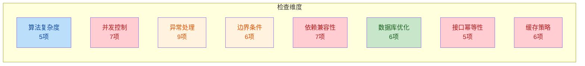
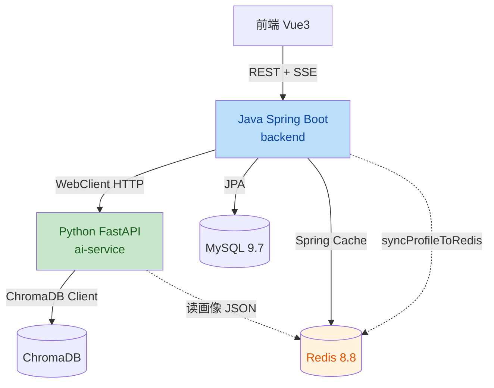
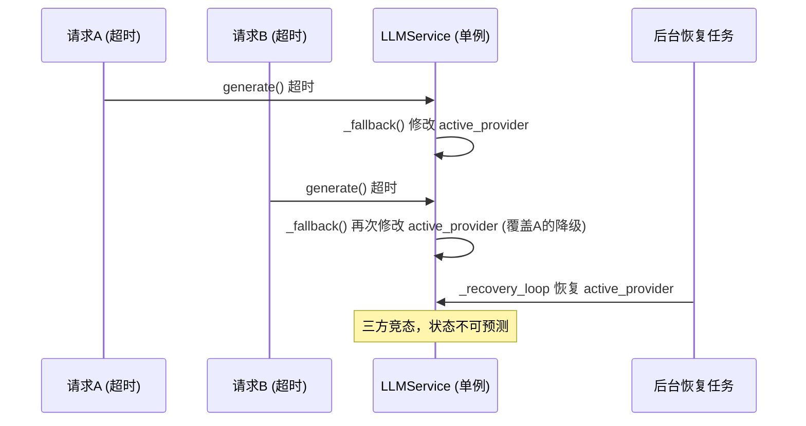
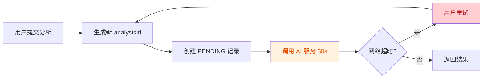
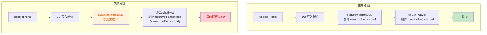
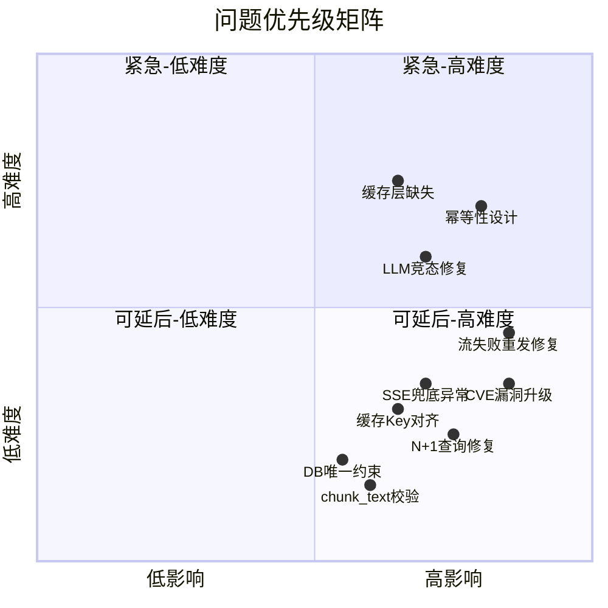

# 代码质量与性能检查报告

> **项目**: XH-202630 科研文献智能助手  
> **检查范围**: `Veritas/ai-service` (Python FastAPI + LangGraph) + `Veritas/backend` (Java Spring Boot)  
> **检查日期**: 2026-06-25  
> **检查维度**: 算法复杂度 / 并发控制 / 异常处理 / 边界条件 / 依赖兼容性 / 数据库优化 / 接口幂等性 / 缓存策略  

---

## 总览

### 问题统计

| 严重程度 | 数量 | 说明 |
|---------|------|------|
| **致命 (P0)** | 5 | 安全漏洞或可导致系统不可用的缺陷 |
| **严重 (P1)** | 12 | 数据一致性风险、性能瓶颈、竞态条件 |
| **中等 (P2)** | 16 | 可优化的设计缺陷、降级路径缺陷 |
| **轻微 (P3)** | 8 | 代码质量与可维护性改进点 |
| **合计** | **41** | |

### 问题分布



### 架构全景



---

## 一、算法时间/空间复杂度分析

### 1.1 [P1] `comparer.py` 两两对比复杂度 O(N²·D·L)

| 属性 | 值 |
|------|---|
| **文件** | [comparer.py](file:///Users/achieve/Library/Mobile%20Documents/com~apple~CloudDocs/Documents/AchiEVE_MacBook_Air/Veritas(求真)/Veritas/ai-service/app/agents/comparer.py#L417-L496) |
| **复杂度** | O(C(N,2) · D · L) = O(N²·D·L) |
| **触发条件** | LLM 不可用时降级路径 |

**问题描述**: `_rule_based_comparison` 使用 `combinations(analysis_results, 2)` 对 N 篇论文做 C(N,2) 两两对比，每对在 4 个维度上做文本相似度计算（内含 O(L) 的 2-gram tokenization）和冲突检测（多次 `re.findall`）。当前 `MAX_PAPERS=5`（最多 10 对），但若上限被调大，复杂度按平方增长。

**优化建议**: 当 N > 10 时，考虑先对论文做聚类分组，仅在同组内做两两对比，将复杂度降至 O(N·K²)。

**验证方法**: 构造 N=20 的测试数据，测量降级路径执行时间，确认是否呈二次增长趋势。

---

### 1.2 [P2] `search_service.py` `_tokenize_query` 使用 List 去重导致 O(T²)

| 属性 | 值 |
|------|---|
| **文件** | [search_service.py](file:///Users/achieve/Library/Mobile%20Documents/com~apple~CloudDocs/Documents/AchiEVE_MacBook_Air/Veritas(求真)/Veritas/ai-service/app/services/search_service.py#L79-L100) |
| **复杂度** | O(T²)，T 为 token 数 |

**问题描述**: `STOP_WORDS` 是 `frozenset`（O(1) 查找），但 `tokens` 是 `List`，`not in tokens` 是 O(n) 线性查找。在分词循环中每次都做线性去重，整体复杂度为 O(T²)。当查询含大量中文 bigram 时性能下降。

**优化建议**: 增加 `seen = set()` 辅助去重，或使用 `dict.fromkeys()` 保序去重。

```python
# 优化前
if token_lower not in STOP_WORDS and token_lower not in tokens:
    tokens.append(token_lower)

# 优化后
if token_lower not in STOP_WORDS and token_lower not in seen:
    seen.add(token_lower)
    tokens.append(token_lower)
```

**验证方法**: 构造含 200+ token 的长查询，对比优化前后耗时。

---

### 1.3 [P2] `vector_store_service.py` 旧关键词检索路径 N+1 查询

| 属性 | 值 |
|------|---|
| **文件** | [vector_store_service.py](file:///Users/achieve/Library/Mobile%20Documents/com~apple~CloudDocs/Documents/AchiEVE_MacBook_Air/Veritas(求真)/Veritas/ai-service/app/services/vector_store_service.py#L375-L414) |
| **复杂度** | O(K) 次 ChromaDB 往返，K 为关键词数 |

**问题描述**: 向后兼容路径对每个关键词发起一次独立的 ChromaDB 查询，共 K 次数据库往返。新路径（293-373 行）已用 `$or` 组合为单次查询，但旧路径仍保留。

**优化建议**: 删除旧路径或在入口处统一转向新路径的 `$or` 查询。

**验证方法**: 调用 `search_by_keywords` 传入 5+ 个关键词（不传 tokens/phrases 参数），确认是否触发旧路径并测量耗时。

---

### 1.4 [P3] `citation_parser.py` 冗余二次遍历 O(C·P)

| 属性 | 值 |
|------|---|
| **文件** | [citation_parser.py](file:///Users/achieve/Library/Mobile%20Documents/com~apple~CloudDocs/Documents/AchiEVE_MacBook_Air/Veritas(求真)/Veritas/ai-service/app/utils/citation_parser.py#L100-L130) |
| **复杂度** | 2 × O(C·P)，可合并为 1 × O(C·P) |

**问题描述**: `validate_citations` 先做一次 O(C·P) 的引用-论文匹配遍历，紧接着又做一次 O(P·C) 的 `not_found` 推导式遍历，对同样的数据遍历两遍。

**优化建议**: 合并为单次遍历，同时计算 matched/unmatched/not_found。

**验证方法**: 对含 30+ 引用的综述论文调用 `validate_citations`，确认无功能回退。

---

### 1.5 [P3] `reranker.py` 子串扫描 O(R·Q·L)

| 属性 | 值 |
|------|---|
| **文件** | [reranker.py](file:///Users/achieve/Library/Mobile%20Documents/com~apple~CloudDocs/Documents/AchiEVE_MacBook_Air/Veritas(求真)/Veritas/ai-service/app/services/reranker.py#L70-L119) |
| **复杂度** | O(R·Q·L) |

**问题描述**: 每个结果对每个查询关键词在 title/abstract 上做 `in` 子串扫描。当 results 较多且查询关键词较多时开销上升。

**优化建议**: 对短文本（title）预分词为 `set` 加速查找；对长文本（abstract）可接受当前实现。

**验证方法**: 对 top_k=50 的结果集做 rerank，对比优化前后耗时。

---

## 二、并发控制与锁机制

### 2.1 [P0] Spring Boot 3.2.5 存在多个 CVE 安全漏洞

| 属性 | 值 |
|------|---|
| **文件** | [pom.xml](file:///Users/achieve/Library/Mobile%20Documents/com~apple~CloudDocs/Documents/AchiEVE_MacBook_Air/Veritas(求真)/Veritas/backend/pom.xml) |
| **CVE** | CVE-2024-38816, CVE-2024-34750, CVE-2024-38819 |

**问题描述**: Spring Boot 3.2.5 的 OSS 支持已于 2024 年 11 月终止，存在以下未修复漏洞：
- **CVE-2024-38816** (Spring Framework): 静态资源路径遍历，可读取任意文件
- **CVE-2024-34750** (Tomcat): 恶意 multipart 请求导致 OOM 拒绝服务
- **CVE-2024-38819** (Spring Security): 授权绕过

**优化建议**: 升级至 Spring Boot **3.2.12**（3.2.x 最后安全补丁版本）或 **3.3.7** / **3.4.1**。

**验证方法**: 升级后运行 `mvn dependency:tree` 确认 Spring Framework ≥ 6.1.13、Tomcat ≥ 10.1.24、Spring Security ≥ 6.2.8。

---

### 2.2 [P0] Python `python-multipart` 0.0.12 和 `httpx` 0.27.0 安全漏洞

| 属性 | 值 |
|------|---|
| **文件** | [requirements.txt](file:///Users/achieve/Library/Mobile%20Documents/com~apple~CloudDocs/Documents/AchiEVE_MacBook_Air/Veritas(求真)/Veritas/ai-service/requirements.txt) |
| **CVE** | CVE-2024-53981, CVE-2024-35195 |

**问题描述**:
- `python-multipart` 0.0.12: CVE-2024-53981，恶意 multipart 请求触发超大内存分配导致 DoS
- `httpx` 0.27.0: CVE-2024-35195，使用 HTTP 代理时 TLS 证书验证可被绕过

**优化建议**: `python-multipart` 升级至 `0.0.13`+；`httpx` 升级至 `0.27.2`+（推荐 `0.28.1`）。

**验证方法**: `pip install --dry-run --upgrade python-multipart httpx` 确认可升级版本。

---

### 2.3 [P1] LLMService 共享状态在异步环境下无锁竞态

| 属性 | 值 |
|------|---|
| **文件** | [llm_service.py](file:///Users/achieve/Library/Mobile%20Documents/com~apple~CloudDocs/Documents/AchiEVE_MacBook_Air/Veritas(求真)/Veritas/ai-service/app/services/llm_service.py#L419-L456) |
| **风险** | 数据竞态、降级逻辑失效 |

**问题描述**: `LLMService` 作为全局单例，`self.active_provider` 和 `self._degradation_state` 是可变共享状态，被三条并发路径同时读写且无 `asyncio.Lock` 保护：



**优化建议**: 引入 `asyncio.Lock` 保护 `_fallback()` 和 `_recovery_loop()` 中的状态修改：

```python
class LLMService:
    def __init__(self, ...):
        self._state_lock = asyncio.Lock()

    async def _fallback(self):
        async with self._state_lock:
            # 修改 active_provider 和 _degradation_state
```

**验证方法**: 编写并发测试，10 个协程同时触发 `generate()` 超时，验证 `active_provider` 最终状态一致。

---

### 2.4 [P1] VectorStoreService 在 async 方法中直接调用同步 ChromaDB 操作

| 属性 | 值 |
|------|---|
| **文件** | [vector_store_service.py](file:///Users/achieve/Library/Mobile%20Documents/com~apple~CloudDocs/Documents/AchiEVE_MacBook_Air/Veritas(求真)/Veritas/ai-service/app/services/vector_store_service.py#L75-L141) |
| **风险** | 事件循环阻塞 |

**问题描述**: `initialize()` 方法正确使用了 `run_in_executor`（行 23-44），但所有其他 async 方法（`add_papers`、`search`、`delete_papers`、`search_by_keywords` 等）直接在事件循环中调用同步的 ChromaDB 操作，阻塞整个事件循环。`search_by_keywords` 尤其严重，包含多轮 `self.collection.query()` 调用。

**优化建议**: 所有 ChromaDB 操作统一使用 `asyncio.to_thread()` 或 `run_in_executor` 包装：

```python
# 优化前
results = self.collection.query(query_embeddings=[embedding], ...)

# 优化后
results = await asyncio.to_thread(
    self.collection.query, query_embeddings=[embedding], ...
)
```

**验证方法**: 在 `search()` 执行期间发起另一个独立请求（如 `/health`），确认不被阻塞。

---

### 2.5 [P1] Java 后端全项目无任何显式锁机制

| 属性 | 值 |
|------|---|
| **文件** | backend 全部 Service 层 |
| **风险** | 并发写覆盖、状态不一致 |

**问题描述**: 全量搜索 `synchronized|ReentrantLock|@Version|SETNX|setIfAbsent|Redisson|tryLock`，**零匹配**。全部并发安全完全依赖 `@Transactional` 的默认隔离级别和数据库唯一约束。以下场景存在竞态：

- **用户注册** (UserService.register): `existsByUsername` → `save` 的 TOCTOU 竞态
- **会话状态转换** (SessionService.updateStatus): read-modify-write 无锁
- **分析结果完成** (AnalysisTransactionService.completeAnalysis): 无乐观锁

**优化建议**:
1. `users` 表添加 `username`/`email` 的 UNIQUE 约束（DB 兜底）
2. `AnalysisResult` 实体添加 `@Version` 字段实现乐观锁
3. 关键状态转换使用 `SELECT ... FOR UPDATE` 悲观锁

**验证方法**: 编写并发测试，2 个线程同时注册相同用户名，验证 DB 是否拒绝重复。

---

### 2.6 [P2] LocalLLMProvider 流式生成线程泄漏风险

| 属性 | 值 |
|------|---|
| **文件** | [llm_service.py](file:///Users/achieve/Library/Mobile%20Documents/com~apple~CloudDocs/Documents/AchiEVE_MacBook_Air/Veritas(求真)/Veritas/ai-service/app/services/llm_service.py#L229-L255) |
| **风险** | 线程泄漏 |

**问题描述**: `LocalLLMProvider.generate_stream` 创建两个非守护线程（`thread` 和 `enqueue_thread`），`thread.join()` 和 `enqueue_thread.join()` 未放入 `finally` 块。若异步生成器在消费完成前被取消（客户端断开 SSE），线程不会被 join，导致线程泄漏。非守护线程会阻止进程退出。

**优化建议**: 将线程创建为守护线程 (`daemon=True`)，并将 `join()` 放入 `finally` 块：

```python
thread = threading.Thread(target=..., daemon=True)
try:
    # ... 消费循环 ...
finally:
    thread.join(timeout=5)
    enqueue_thread.join(timeout=5)
```

**验证方法**: 模拟 SSE 客户端提前断开，检查线程数是否回落。

---

### 2.7 [P2] `asyncio.gather` 缺少 `return_exceptions` 参数

| 属性 | 值 |
|------|---|
| **文件** | [search_service.py](file:///Users/achieve/Library/Mobile%20Documents/com~apple~CloudDocs/Documents/AchiEVE_MacBook_Air/Veritas(求真)/Veritas/ai-service/app/services/search_service.py#L244-L247), [analyzer.py](file:///Users/achieve/Library/Mobile%20Documents/com~apple~CloudDocs/Documents/AchiEVE_MacBook_Air/Veritas(求真)/Veritas/ai-service/app/agents/analyzer.py#L85) |
| **风险** | 任务级联取消 |

**问题描述**: `asyncio.gather` 未设置 `return_exceptions=True`，一个任务抛出未预期异常（如 `CancelledError`）会导致另一个任务被取消。

**优化建议**: 添加 `return_exceptions=True` 并在后续处理中过滤异常结果。

**验证方法**: 注入一个 `search()` 抛出 `RuntimeError` 的 mock，验证 `keyword_search` 是否仍能正常返回。

---

## 三、异常处理路径完整性

### 3.1 [P1] `llm_service.generate_stream` 流式失败后重发完整响应导致内容重复

| 属性 | 值 |
|------|---|
| **文件** | [llm_service.py](file:///Users/achieve/Library/Mobile%20Documents/com~apple~CloudDocs/Documents/AchiEVE_MacBook_Air/Veritas(求真)/Veritas/ai-service/app/services/llm_service.py#L481-L504) |
| **影响** | 前端显示重复/错乱内容 |

**问题描述**: 流式中途失败时，前面已 yield 的部分 token 已发送给客户端。降级后又把**完整**响应作为单个 token yield（行 503 `yield full_response`），客户端收到 "部分内容 + 完整内容" = 重复文本。

```python
# 行 469-480: 已 yield 部分 token
async for token in self.active_provider.generate_stream(...):
    yield token  # ← 部分内容已发送

# 行 488-503: 降级后 yield 完整响应
full_response = await asyncio.wait_for(
    self.active_provider.generate(prompt, ...), timeout=30)
yield full_response  # ← 完整内容再次发送 = 重复
```

**优化建议**: 流失败后，若已 yield 过 token，应仅发送错误事件或终止流，而非重发完整响应：

```python
except Exception as e:
    if first_token_yielded:
        yield f"\n\n[生成中断，已显示部分内容]"
        return
    # 仅在未 yield 过 token 时才降级为非流式
    ...
```

**验证方法**: 模拟 `generate_stream` 在第 3 个 token 后抛异常，验证客户端收到的内容是否重复。

---

### 3.2 [P1] `orchestrator.run_workflow_stream` 缺少顶层 `except Exception`

| 属性 | 值 |
|------|---|
| **文件** | [orchestrator.py](file:///Users/achieve/Library/Mobile%20Documents/com~apple~CloudDocs/Documents/AchiEVE_MacBook_Air/Veritas(求真)/Veritas/ai-service/app/agents/orchestrator.py#L496-L499) |
| **影响** | SSE 流异常中断无错误事件 |

**问题描述**: 顶层 `try` 只捕获 `asyncio.CancelledError`（行 496），若节点间编排代码（`_yield_final`、`_make_event`、`_get_last_result`、JSON 序列化等）抛出其他异常，SSE 流异常终止且客户端收不到 `error` 事件。

**优化建议**: 添加 `except Exception as e` 兜底，yield 一个 error 事件后优雅退出：

```python
except asyncio.CancelledError:
    logger.debug(f"SSE stream cancelled for analysis_id={self.analysis_id}")
    return
except Exception as e:
    logger.error(f"SSE stream error: analysis_id={self.analysis_id}, error={e}")
    yield self._make_event("error", {"message": str(e)}, ...)
```

**验证方法**: 注入一个 `_yield_final` 抛 `KeyError` 的场景，验证客户端是否收到 error 事件。

---

### 3.3 [P2] `search_service` 级联降级导致双重静默失败

| 属性 | 值 |
|------|---|
| **文件** | [search_service.py](file:///Users/achieve/Library/Mobile%20Documents/com~apple~CloudDocs/Documents/AchiEVE_MacBook_Air/Veritas(求真)/Veritas/ai-service/app/services/search_service.py#L141-L147, L182-L190) |
| **影响** | 底层故障被掩盖 |

**问题描述**: `search()` 和 `hybrid_search()` 用 `except Exception` 捕获后返回 `[]`。`keyword_search` 失败后降级调用 `self.search()`，而 `self.search()` 自身也用 `except Exception` 返回 `[]`。当语义检索与关键词检索同时失败时，最终静默返回 `[]`，调用方无法区分"无结果"与"出错"。

**优化建议**: 降级路径返回 `([], error_metadata)` 元组，或在异常计数器中记录降级事件，供上层判断是否需要告警。

**验证方法**: 关闭 ChromaDB 后调用 `hybrid_search()`，验证返回值和日志是否包含错误信息。

---

### 3.4 [P2] `vector_store_service.update_paper_metadata` 吞掉写异常

| 属性 | 值 |
|------|---|
| **文件** | [vector_store_service.py](file:///Users/achieve/Library/Mobile%20Documents/com~apple~CloudDocs/Documents/AchiEVE_MacBook_Air/Veritas(求真)/Veritas/ai-service/app/services/vector_store_service.py#L227-L239) |
| **影响** | 数据不一致 |

**问题描述**: 更新失败仅记 warning，不重新抛出。调用方认为更新成功，实际元数据可能未持久化。

**优化建议**: 写路径应 re-raise 异常，让调用方决定降级策略。

**验证方法**: 模拟 `self.collection.update` 抛异常，验证调用方是否收到异常。

---

### 3.5 [P2] `embedding_service.encode` 降级异常信息用错

| 属性 | 值 |
|------|---|
| **文件** | [embedding_service.py](file:///Users/achieve/Library/Mobile%20Documents/com~apple~CloudDocs/Documents/AchiEVE_MacBook_Air/Veritas(求真)/Veritas/ai-service/app/services/embedding_service.py#L382-L396) |
| **影响** | 排查困难 |

**问题描述**: 所有 fallback 都失败后，抛出的异常消息用的是 active provider 的原始错误 `e`，而非最后一个 fallback 的错误 `fb_err`。

**优化建议**: 在循环中保留 `last_error = fb_err`，最终抛出 `raise ModelNotLoadedException(f"All embedding providers failed, last error: {last_error}")`。

**验证方法**: 模拟所有 provider 失败，验证异常消息是否包含最后一个 provider 的错误。

---

### 3.6 [P2] Java `JwtUtil.parseToken` 安全事件仅 debug 级别日志

| 属性 | 值 |
|------|---|
| **文件** | [JwtUtil.java](file:///Users/achieve/Library/Mobile%20Documents/com~apple~CloudDocs/Documents/AchiEVE_MacBook_Air/Veritas(求真)/Veritas/backend/src/main/java/com/literatureassistant/util/JwtUtil.java#L65-L84) |
| **影响** | 安全事件被静默 |

**问题描述**: `SecurityException`（签名无效，可能是 token 篡改/伪造攻击）仅以 `debug` 级别记录。生产环境（通常 INFO 级别）此类安全事件会被完全静默。

**优化建议**: `SecurityException` 至少使用 `warn` 级别记录。

**验证方法**: 发送一个篡改签名的 JWT 请求，验证日志中是否出现 warn 级别记录。

---

### 3.7 [P3] Java `PythonAIClient.mapToSearchResults` 静默返回空列表

| 属性 | 值 |
|------|---|
| **文件** | [PythonAIClient.java](file:///Users/achieve/Library/Mobile%20Documents/com~apple~CloudDocs/Documents/AchiEVE_MacBook_Air/Veritas(求真)/Veritas/backend/src/main/java/com/literatureassistant/client/PythonAIClient.java#L408-L417) |
| **影响** | 用户看到"无结果"而非错误提示 |

**问题描述**: AI 服务返回的搜索结果映射失败时返回空列表，`log.warn` 仅记录 `e.getMessage()` 不含堆栈。

**优化建议**: 映射失败时应抛出异常或返回错误标识，而非静默空列表；日志应包含完整堆栈 `log.warn("...", e)`。

**验证方法**: 注入格式错误的搜索结果 JSON，验证用户是否收到错误提示。

---

### 3.8 [P3] Java `AnalysisService.deserializeResult` 反序列化失败缓存 null 结果

| 属性 | 值 |
|------|---|
| **文件** | [AnalysisService.java](file:///Users/achieve/Library/Mobile%20Documents/com~apple~CloudDocs/Documents/AchiEVE_MacBook_Air/Veritas(求真)/Veritas/backend/src/main/java/com/literatureassistant/service/AnalysisService.java#L362-L372) |
| **影响** | 用户持续收到损坏结果直到缓存过期 |

**问题描述**: DB 中 `result` JSON 损坏时，反序列化失败返回 `null`。`getAnalysisResult` 返回的 `AnalysisResponse` 对象非 null（只是其 `result` 字段为 null），因此会被 `@Cacheable` 缓存。用户持续收到损坏结果直到缓存过期。

**优化建议**: 反序列化失败时应 evict 缓存或标记为不可用，而非缓存 null result。

**验证方法**: 手动损坏 DB 中的 result JSON，调用 `getAnalysisResult` 后检查 Redis 缓存内容。

---

### 3.9 [P3] Java `PdfExporter` 字体加载抛 RuntimeException 未被 ExportService 捕获

| 属性 | 值 |
|------|---|
| **文件** | [PdfExporter.java](file:///Users/achieve/Library/Mobile%20Documents/com~apple~CloudDocs/Documents/AchiEVE_MacBook_Air/Veritas(求真)/Veritas/backend/src/main/java/com/literatureassistant/util/PdfExporter.java#L80-L91), [ExportService.java](file:///Users/achieve/Library/Mobile%20Documents/com~apple~CloudDocs/Documents/AchiEVE_MacBook_Air/Veritas(求真)/Veritas/backend/src/main/java/com/literatureassistant/service/ExportService.java#L62-L69) |
| **影响** | 返回通用 500 错误而非 "PDF导出失败" |

**问题描述**: `resolveChineseFont` 抛出 `RuntimeException`，而 `ExportService.exportPdf` 仅捕获 `IOException`，RuntimeException 冒泡到 GlobalExceptionHandler 的 catch-all。

**优化建议**: `ExportService` 增加对 `RuntimeException` 的捕获，或 `PdfExporter` 统一包装为 `IOException`/`BusinessException`。

**验证方法**: 删除字体文件后调用导出 PDF 接口，验证返回的错误消息。

---

## 四、边界条件覆盖

### 4.1 [P1] `text_processing.chunk_text` 参数无校验导致死循环

| 属性 | 值 |
|------|---|
| **文件** | [text_processing.py](file:///Users/achieve/Library/Mobile%20Documents/com~apple~CloudDocs/Documents/AchiEVE_MacBook_Air/Veritas(求真)/Veritas/ai-service/app/utils/text_processing.py#L29-L59) |
| **影响** | 进程挂起 |

**问题描述**: 步进公式 `start = end - overlap = start + chunk_size - overlap`。当 `overlap >= chunk_size` 时，`start` 不增加甚至后退，`while start < text_len` 永远成立 → 死循环。默认值（chunk_size=800, overlap=100）安全，但函数未校验参数关系。

**优化建议**: 添加参数校验：

```python
def chunk_text(text, chunk_size=800, overlap=100):
    if overlap >= chunk_size:
        raise ValueError(f"overlap ({overlap}) must be less than chunk_size ({chunk_size})")
```

**验证方法**: 调用 `chunk_text("test", chunk_size=100, overlap=200)`，验证是否抛出 ValueError 而非挂起。

---

### 4.2 [P2] `reranker.py` year/citation_count 类型假设导致 TypeError

| 属性 | 值 |
|------|---|
| **文件** | [reranker.py](file:///Users/achieve/Library/Mobile%20Documents/com~apple~CloudDocs/Documents/AchiEVE_MacBook_Air/Veritas(求真)/Veritas/ai-service/app/services/reranker.py#L74-L90) |
| **影响** | 重排序静默失效 |

**问题描述**: ChromaDB metadata 的 `year`/`citation_count` 可能是字符串。`or 0`/`or current_year` 只处理 None/空字符串，未处理非数值字符串。若为 `"42"` 或 `"2023"`，除法与减法抛 TypeError，被外层 except 捕获后返回未排序列表。

**优化建议**: 添加类型转换守卫：

```python
try:
    citation_count = int(result.get("citation_count", 0) or 0)
    paper_year = int(result.get("year", current_year) or current_year)
except (ValueError, TypeError):
    citation_count = 0
    paper_year = current_year
```

**验证方法**: 构造 metadata 中 year="2023a" 的测试数据，验证 rerank 不崩溃。

---

### 4.3 [P2] `reviewer.py` 假设 fact_check 元素为 dict

| 属性 | 值 |
|------|---|
| **文件** | [reviewer.py](file:///Users/achieve/Library/Mobile%20Documents/com~apple~CloudDocs/Documents/AchiEVE_MacBook_Air/Veritas(求真)/Veritas/ai-service/app/agents/reviewer.py#L245-L273) |
| **影响** | 整次审核被降级 |

**问题描述**: `fact_check` 来自 LLM 输出的 JSON 解析，LLM 可能返回非 dict 元素。对非 dict 调用 `.get()` 抛 AttributeError。

**优化建议**: 添加 `isinstance(item, dict)` 守卫，跳过非 dict 元素。

**验证方法**: 构造 `fact_check = ["string", null, {"accurate": true}]` 的测试数据，验证不崩溃。

---

### 4.4 [P2] `vector_store_service.search` 假设 ChromaDB 返回并行数组

| 属性 | 值 |
|------|---|
| **文件** | [vector_store_service.py](file:///Users/achieve/Library/Mobile%20Documents/com~apple~CloudDocs/Documents/AchiEVE_MacBook_Air/Veritas(求真)/Veritas/ai-service/app/services/vector_store_service.py#L112-L130) |
| **影响** | KeyError/IndexError |

**问题描述**: 只检查 `results["ids"]`，随后直接用相同下标访问 `distances`、`metadatas`、`documents`。若 ChromaDB 返回不等长/缺失数组，抛 KeyError 或 IndexError。

**优化建议**: 添加防御性校验：

```python
ids = results.get("ids", [[]])
if not ids or not ids[0]:
    return []
# 确保所有数组等长
count = len(ids[0])
```

**验证方法**: Mock ChromaDB 返回缺失 `documents` 字段的结果，验证不崩溃。

---

### 4.5 [P3] `graph.py` 直接索引 `state["query"]` 键访问

| 属性 | 值 |
|------|---|
| **文件** | [graph.py](file:///Users/achieve/Library/Mobile%20Documents/com~apple~CloudDocs/Documents/AchiEVE_MacBook_Air/Veritas(求真)/Veritas/ai-service/app/agents/graph.py#L97, L150) |
| **影响** | KeyError（仅非标准入口时） |

**问题描述**: `coordinator_node` 和 `retrieve_node` 直接用 `state["query"]` 取值，而文件其他地方使用 `state.get()`。当前 `run_workflow` 总是初始化 `query`，但未来新入口可能遗漏。

**优化建议**: 统一使用 `state.get("query", "")` 或在入口处做 schema 校验。

**验证方法**: 构造不包含 `query` 键的 state，验证不抛 KeyError。

---

### 4.6 [P3] `reranker.py` keyword_density_boost 语义错误

| 属性 | 值 |
|------|---|
| **文件** | [reranker.py](file:///Users/achieve/Library/Mobile%20Documents/com~apple~CloudDocs/Documents/AchiEVE_MacBook_Air/Veritas(求真)/Veritas/ai-service/app/services/reranker.py#L84-L86) |
| **影响** | 该 boost 因子实际失效 |

**问题描述**: `keyword_count`（命中数，0-10）除以 `abstract_len`（字符数，500-2000），得到极小值（如 0.002），乘以 `KEYWORD_DENSITY_WEIGHT=0.05` 后几乎为 0，使该 boost 因子形同虚设。

**优化建议**: 改为 `keyword_count / max(len(query_keywords), 1)`（命中率）或 `keyword_count / word_count`（词级密度）。

**验证方法**: 打印 rerank 前后各 boost 分量，确认 keyword_density_boost 的实际贡献。

---

## 五、第三方依赖版本兼容性

### 5.1 [P0] Spring Boot 3.2.5 多个 CVE（见 2.1）

> 已在 §2.1 详述，此处不重复。

---

### 5.2 [P0] Python 依赖安全漏洞（见 2.2）

> 已在 §2.2 详述，此处不重复。

---

### 5.3 [P0] Apache POI 5.2.3 传递依赖存在 CVE

| 属性 | 值 |
|------|---|
| **文件** | [pom.xml](file:///Users/achieve/Library/Mobile%20Documents/com~apple~CloudDocs/Documents/AchiEVE_MacBook_Air/Veritas(求真)/Veritas/backend/pom.xml) |
| **CVE** | CVE-2024-25710, CVE-2024-26308 |

**问题描述**: POI 5.2.3 依赖的 `commons-compress` 存在 CVE-2024-25710（特制 ZIP 文件导致无限循环 DoS）和 CVE-2024-26308（OOM）。

**优化建议**: 升级至 `5.2.5`+ 或 `5.3.0`。

**验证方法**: `mvn dependency:tree | grep commons-compress` 确认版本升级。

---

### 5.4 [P1] `langgraph` 0.2.28 与 `langchain` 0.3.0 API 兼容性风险

| 属性 | 值 |
|------|---|
| **文件** | [requirements.txt](file:///Users/achieve/Library/Mobile%20Documents/com~apple~CloudDocs/Documents/AchiEVE_MacBook_Air/Veritas(求真)/Veritas/ai-service/requirements.txt) |

**问题描述**: langgraph 0.2.28 发布于 langchain 0.2.x 时代；langchain 0.3.0 引入了 langchain-core 0.3.x，其中 `RunnableConfig`、`BaseCallbackHandler` 等核心接口有签名变更。langgraph 0.2.28 在 0.3.x 环境下可能出现 `AttributeError` 或 `ImportError`（尤其涉及 `StateGraph` 的 `add_node` 回调时）。

**优化建议**: langgraph 升级至 `0.2.50`+（正式声明对 langchain-core 0.3.x 的完整支持），或使用 `0.3.x` 系列。

**验证方法**: 运行 6-Agent E2E 测试套件，确认无 `AttributeError`/`ImportError`。

---

### 5.5 [P1] `chromadb` 0.5.0 与 Python 3.13 兼容性问题

| 属性 | 值 |
|------|---|
| **文件** | [requirements.txt](file:///Users/achieve/Library/Mobile%20Documents/com~apple~CloudDocs/Documents/AchiEVE_MacBook_Air/Veritas(求真)/Veritas/ai-service/requirements.txt) |

**问题描述**: chromadb 0.5.0 发布于 2024 年 5 月，早于 Python 3.13 正式版（2024 年 10 月），很可能没有 Python 3.13 的预编译 wheel。安装时尝试源码编译可能失败。此外 chromadb 0.5.0 强制 `numpy < 2.0.0`，导致整个项目无法使用 numpy 2.x。

**优化建议**: 升级 chromadb 至 `0.5.20`+（支持 Python 3.13 + numpy 2.x），或使用 Python 3.11/3.12。

**验证方法**: 在 Python 3.13 环境执行 `pip install chromadb==0.5.0`，验证是否成功。

---

### 5.6 [P2] Java 25 运行 Spring Boot 3.2.5 超出官方支持

| 属性 | 值 |
|------|---|
| **文件** | [pom.xml](file:///Users/achieve/Library/Mobile%20Documents/com~apple~CloudDocs/Documents/AchiEVE_MacBook_Air/Veritas(求真)/Veritas/backend/pom.xml) |

**问题描述**: 编译目标为 Java 17 字节码，本机实际 JDK 为 Temurin OpenJDK 25.0.3。Spring Boot 3.2.5 官方仅支持 Java 17-22。pom.xml 中已添加大量 `--add-opens` 参数和 `-Dnet.bytebuddy.experimental=true`（行 159-168），说明已遇到兼容问题。

**优化建议**: 升级 Spring Boot 至 3.4.x（官方支持 Java 23+），或安装 JDK 17/21 用于此项目。

**验证方法**: 升级后移除 `--add-opens` 参数，验证编译和测试通过。

---

### 5.7 [P2] numpy 未固定版本 + 缺少 redis-py 依赖

| 属性 | 值 |
|------|---|
| **文件** | [requirements.txt](file:///Users/achieve/Library/Mobile%20Documents/com~apple~CloudDocs/Documents/AchiEVE_MacBook_Air/Veritas(求真)/Veritas/ai-service/requirements.txt) |

**问题描述**:
- `numpy>=1.26.0,<2.0.0` 使用范围约束而非精确版本，pip 安装时可能解析为不同版本，无法保证可复现构建
- 缺少 `redis` (redis-py) 依赖。架构图显示 AI 服务与 Redis 有交互，当前可能依赖 Java 后端代理所有 Redis 操作

**优化建议**: 固定为 `numpy==1.26.4`（或升级 chromadb 后改用 `numpy==2.0.2`）；按需添加 `redis==5.0.0`+。

**验证方法**: 在新环境执行 `pip install -r requirements.txt`，验证版本一致性。

---

## 六、数据库查询优化（N+1 问题）

### 6.1 [P1] `AnalysisService.generateReport` 循环内逐条查询论文（最多 20 次）

| 属性 | 值 |
|------|---|
| **文件** | [AnalysisService.java](file:///Users/achieve/Library/Mobile%20Documents/com~apple~CloudDocs/Documents/AchiEVE_MacBook_Air/Veritas(求真)/Veritas/backend/src/main/java/com/literatureassistant/service/AnalysisService.java#L189-L192) |
| **影响** | 最坏 20 次独立 DB 查询 |

**问题描述**: `generateReport` 在 for 循环内逐个调用 `paperService.getPaperDetail(paperId)`。`ReportRequest` 允许最多 20 篇论文，缓存全未命中时产生 20 次独立 DB 查询。

**对比**: `PaperRepository` 已声明批量方法 `findByPaperIdIn(List<String>)`，且 `FavoriteService.listFavorites`（第 143-148 行）已正确使用。

**优化建议**: 改为批量查询：

```java
// 优化前
for (String paperId : request.getPaperIds()) {
    paperService.getPaperDetail(paperId);
}

// 优化后
List<Paper> papers = paperRepository.findByPaperIdIn(request.getPaperIds());
if (papers.size() != request.getPaperIds().size()) {
    throw new ResourceNotFoundException("Paper", "部分 paperId 不存在");
}
```

**验证方法**: 传入 20 个 paperId 调用 generateReport，开启 SQL 日志，确认查询次数从 20 降为 1。

---

### 6.2 [P1] `AnalysisService.comparePapers` 循环内逐条查询论文（2-5 次）

| 属性 | 值 |
|------|---|
| **文件** | [AnalysisService.java](file:///Users/achieve/Library/Mobile%20Documents/com~apple~CloudDocs/Documents/AchiEVE_MacBook_Air/Veritas(求真)/Veritas/backend/src/main/java/com/literatureassistant/service/AnalysisService.java#L139-L142) |
| **影响** | 2-5 次独立 DB 查询 |

**问题描述**: 与 6.1 相同模式，`CompareRequest` 允许 2-5 篇论文。

**优化建议**: 同 6.1，使用批量查询。

**验证方法**: 同 6.1。

---

### 6.3 [P2] `getAnalysisResult` 流程重复查询 AnalysisResult

| 属性 | 值 |
|------|---|
| **文件** | [AnalysisController.java](file:///Users/achieve/Library/Mobile%20Documents/com~apple~CloudDocs/Documents/AchiEVE_MacBook_Air/Veritas(求真)/Veritas/backend/src/main/java/com/literatureassistant/controller/AnalysisController.java#L139-L140), [AnalysisService.java](file:///Users/achieve/Library/Mobile%20Documents/com~apple~CloudDocs/Documents/AchiEVE_MacBook_Air/Veritas(求真)/Veritas/backend/src/main/java/com/literatureassistant/service/AnalysisService.java#L379-L394) |

**问题描述**: `validateAnalysisAccess` 和 `getAnalysisResult` 都查询了同一个 `analysisResultRepository.findByAnalysisId(analysisId)`。缓存未命中时产生 3 次查询（AnalysisResult + Session + AnalysisResult 重复）。

**优化建议**: `validateAnalysisAccess` 返回查询到的实体，`getAnalysisResult` 复用该实体，或合并为一个方法。

**验证方法**: 开启 SQL 日志，调用 `GET /api/analysis/{analysisId}`，确认查询次数。

---

### 6.4 [P2] `PaperRepositoryCustomImpl` 搜索使用 SELECT * 和 JSON LIKE 全表扫描

| 属性 | 值 |
|------|---|
| **文件** | [PaperRepositoryCustomImpl.java](file:///Users/achieve/Library/Mobile%20Documents/com~apple~CloudDocs/Documents/AchiEVE_MacBook_Air/Veritas(求真)/Veritas/backend/src/main/java/com/literatureassistant/repository/PaperRepositoryCustomImpl.java#L46-L53) |
| **影响** | 不必要的 IO + 全表扫描 |

**问题描述**:
- `SELECT *` 加载所有列（包括 TEXT 类型的 `abstract`），但搜索结果只需 `paperId, title, authors, year, venue, keywords, citationCount`
- `authors LIKE CONCAT('%', ?5, '%')` 对 JSON 列做双侧通配符匹配，无法使用索引

**优化建议**:
1. 替换为 `SELECT paper_id, title, authors, year, venue, keywords, citation_count FROM papers`
2. 对 JSON 数组中的作者搜索使用 `JSON_CONTAINS(authors, JSON_QUOTE(?5))` 或添加虚拟列 + 索引

**验证方法**: `EXPLAIN` 查看优化前后的查询计划，确认 `type` 从 `ALL` 变为 `ref`/`range`。

---

### 6.5 [P3] 缺少复合索引

| 属性 | 值 |
|------|---|
| **文件** | DDL (01_create_tables.sql) + Repository |

**问题描述**:
- `sessions` 表：`findByUserIdOrderByCreatedAtDesc` 查询只有单列索引 `idx_user_id`，需要 filesort
- `analysis_results` 表：`findBySessionIdAndStatus` 查询只有独立单列索引

**优化建议**:
```sql
ALTER TABLE sessions ADD INDEX idx_user_created (user_id, created_at DESC);
ALTER TABLE analysis_results ADD INDEX idx_session_status (session_id, status);
```

**验证方法**: `EXPLAIN` 确认 `Extra` 列不再出现 `Using filesort`。

---

### 6.6 [P3] `users` 表缺少 username/email 唯一约束和索引

| 属性 | 值 |
|------|---|
| **文件** | DDL (01_create_tables.sql 第 19-26 行) |

**问题描述**: `username` 和 `email` 在 DB 层无 UNIQUE 约束，`existsByUsername`/`existsByEmail` 每次全表扫描。

**优化建议**:
```sql
ALTER TABLE users ADD UNIQUE KEY uk_username (username);
ALTER TABLE users ADD UNIQUE KEY uk_email (email);
```

**验证方法**: 尝试插入重复 username，验证 DB 拒绝。

---

## 七、接口幂等性验证

### 7.1 [P1] POST `/api/analysis/paper` `/compare` `/report` 均无幂等性设计

| 属性 | 值 |
|------|---|
| **文件** | [AnalysisController.java](file:///Users/achieve/Library/Mobile%20Documents/com%7Eapple%7ECloudDocs/Documents/AchiEVE_MacBook_Air/Veritas(求真)/Veritas/backend/src/main/java/com/literatureassistant/controller/AnalysisController.java#L56-L115), [AnalysisService.java](file:///Users/achieve/Library/Mobile%20Documents/com%7Eapple%7ECloudDocs/Documents/AchiEVE_MacBook_Air/Veritas(求真)/Veritas/backend/src/main/java/com/literatureassistant/service/AnalysisService.java#L83-L229) |
| **影响** | 重复创建资源 + 重复 AI 调用 |

**问题描述**: 三个分析接口每次调用生成新 `analysisId`（UUID），创建新 `AnalysisResult(PENDING)` 记录，触发昂贵的 AI 服务调用（可能 30 秒）。无幂等 key、无唯一约束防重、无状态机检查。用户网络超时后重试 = 重复创建资源 + 重复 AI 调用。



**优化建议**: 实现 Idempotency-Key 机制：

```java
@PostMapping("/paper")
public ApiResponse<AnalysisTaskResponse> analyzePaper(
        @RequestHeader(value = "Idempotency-Key", required = false) String idempotencyKey,
        @Valid @RequestBody PaperAnalysisRequest request) {
    String effectiveKey = idempotencyKey != null ? idempotencyKey :
        DigestUtils.md5Hex(currentUserId + request.getPaperId() + request.getTopic());
    // Redis SETNX 去重窗口 5 分钟
    Boolean isNew = redisTemplate.opsForValue().setIfAbsent(
        "idempotency:" + effectiveKey, "1", Duration.ofMinutes(5));
    if (Boolean.FALSE.equals(isNew)) {
        // 返回已有结果或提示"处理中"
    }
}
```

**验证方法**: 连续发送两个相同请求（不带 Idempotency-Key），验证是否只创建一个 AnalysisResult。

---

### 7.2 [P2] POST `/api/sessions` 无幂等性设计

| 属性 | 值 |
|------|---|
| **文件** | [SessionController.java](file:///Users/achieve/Library/Mobile%20Documents/com%7Eapple%7ECloudDocs/Documents/AchiEVE_MacBook_Air/Veritas(求真)/Veritas/backend/src/main/java/com/literatureassistant/controller/SessionController.java#L35-L42), [SessionService.java](file:///Users/achieve/Library/Mobile%20Documents/com%7Eapple%7ECloudDocs/Documents/AchiEVE_MacBook_Air/Veritas(求真)/Veritas/backend/src/main/java/com/literatureassistant/service/SessionService.java#L57-L80) |

**问题描述**: 每次创建会话生成新 UUID `sessionId`，无去重机制。用户快速连续点击"创建会话"会产生多个重复会话。

**优化建议**: 支持客户端传入 `clientToken`，基于 `(userId, clientToken)` 做去重。

**验证方法**: 连续发送两个相同创建会话请求，验证是否只创建一个会话。

---

### 7.3 [P2] 用户注册 TOCTOU 竞态（见 2.5）

> 已在 §2.5 详述。`users` 表 `username`/`email` 缺少 UNIQUE 约束，应用层 `existsByUsername`/`existsByEmail` 检查存在 TOCTOU 竞态。

---

### 7.4 [正面] POST `/api/papers/{paperId}/favorite` 具有完整幂等性

| 属性 | 值 |
|------|---|
| **文件** | [FavoriteService.java](file:///Users/achieve/Library/Mobile%20Documents/com%7Eapple%7ECloudDocs/Documents/AchiEVE_MacBook_Air/Veritas(求真)/Veritas/backend/src/main/java/com/literatureassistant/service/FavoriteService.java#L66-L94) |

**评价**: 同时具备应用层检查（`findByUserIdAndPaperId`）和 DB 层唯一约束（`uk_user_paper`），幂等性设计完善。应作为其他接口的参考模板。

---

### 7.5 [正面] Session 状态更新具有状态机保护

| 属性 | 值 |
|------|---|
| **文件** | [SessionService.java](file:///Users/achieve/Library/Mobile%20Documents/com%7Eapple%7ECloudDocs/Documents/AchiEVE_MacBook_Air/Veritas(求真)/Veritas/backend/src/main/java/com/literatureassistant/service/SessionService.java#L42-L46) |

**评价**: `ALLOWED_TRANSITIONS` 状态转换矩阵防止非法状态转换。但 `updateStatus` 自身无幂等性，重复调用相同状态会抛 `SAME_STATUS_NOOP` 异常而非返回成功。

---

## 八、缓存策略有效性

### 8.1 [P1] UserService 手动 Redis Key 与 @CacheEvict Key 不匹配

| 属性 | 值 |
|------|---|
| **文件** | [UserService.java](file:///Users/achieve/Library/Mobile%20Documents/com%7Eapple%7ECloudDocs/Documents/AchiEVE_MacBook_Air/Veritas(求真)/Veritas/backend/src/main/java/com/literatureassistant/service/UserService.java#L255-L263, L171, L201) |
| **影响** | syncProfileToRedis 失败时画像过期数据滞留 |

**问题描述**: `syncProfileToRedis` 写入手动 Key `user:profile:json:{userId}`（供 Python 读取），而 `@CacheEvict(value="userProfileJson")` 失效的是 Spring Cache Key `userProfileJson::{userId}`。两者是完全不同的 Redis Key。

- **正常路径**: `syncProfileToRedis` 覆写新值，一致性不受影响
- **失败路径**（Redis 写入失败，行 260-261 catch 吞异常）: 旧画像 JSON 滞留 `user:profile:json:{userId}` 最长 1 小时（TTL），`@CacheEvict` 无法清理此 Key



**优化建议**: `syncProfileToRedis` 失败时，手动删除旧 Key：

```java
private void syncProfileToRedis(String userId, ProfileResponse profile) {
    String key = RedisKeyUtil.userProfileJsonKey(userId);
    try {
        String json = objectMapper.writeValueAsString(profile);
        redisTemplate.opsForValue().set(key, json, Duration.ofHours(1));
    } catch (Exception e) {
        log.warn("Failed to sync profile to Redis, deleting stale key: userId={}", userId);
        redisTemplate.delete(key);  // 删除旧值，避免读到过期数据
    }
}
```

**验证方法**: Mock `redisTemplate.opsForValue().set()` 抛异常，验证 `user:profile:json:{userId}` 是否被删除。

---

### 8.2 [P1] UserService @CacheEvict 在事务提交前执行

| 属性 | 值 |
|------|---|
| **文件** | [UserService.java](file:///Users/achieve/Library/Mobile%20Documents/com%7Eapple%7ECloudDocs/Documents/AchiEVE_MacBook_Air/Veritas(求真)/Veritas/backend/src/main/java/com/literatureassistant/service/UserService.java#L106-L107, L170-L171, L200-L201) |
| **影响** | 缓存与 DB 短暂不一致 |

**问题描述**: `@Transactional` + `@CacheEvict(beforeInvocation=false)` 的执行顺序为：`BEGIN TX → 方法体(DB 写入) → @CacheEvict 删除缓存 → COMMIT TX`。缓存在事务提交**之前**被删除。并发读请求可能：
1. 缓存已删（miss）
2. 查 DB → MVCC 返回旧值
3. 回填缓存为旧值
4. 事务提交（新值落库）
5. 缓存残留旧值直到 TTL 过期

**对比**: `SessionService` 和 `FavoriteService` 正确使用了 `CacheEvictionHelper.evictByPatternAfterCommit()`（通过 `TransactionSynchronization.afterCommit()` 回调）。

**优化建议**: `UserService` 改用 `CacheEvictionHelper.evictByPatternAfterCommit()`：

```java
@Transactional
public ProfileResponse updateProfile(String userId, ProfileUpdateRequest request) {
    // ... DB 写入 ...
    cacheEvictionHelper.evictByPatternAfterCommit("userProfile", "userInfo", userId);
    return response;
}
```

**验证方法**: 在 `updateProfile` 执行期间并发调用 `getProfile`，验证不会读到旧值。

---

### 8.3 [P1] Python AI 服务完全缺乏缓存层

| 属性 | 值 |
|------|---|
| **文件** | ai-service/app/ 全部 |
| **影响** | 每次请求都产生完整外部 I/O 开销 |

**问题描述**: 整个 `app/` 目录下**没有任何缓存机制**（无 `lru_cache`、无 `TTLCache`、无 Redis 缓存、无字典缓存）。以下高频操作每次都产生完整外部调用：

| 操作 | 文件 | 影响 |
|------|------|------|
| Embedding 计算 | `embedding_service.py:359-396` | 每次调用 DashScope/Jina/OpenAI API |
| LLM 生成 | `llm_service.py:419-456` | 每次调用 LLM API（无响应缓存） |
| ChromaDB 查询 | `vector_store_service.py:83-132` | 每次执行完整向量检索 |
| 关键词检索 | `vector_store_service.py:241-414` | 每次执行完整 ChromaDB 文本查询 |

**优化建议**: 对热点查询实现短期缓存：
- Embedding 结果：基于 `hash(text)` 的 LRU 缓存（TTL 5 分钟）
- 搜索结果：基于 `hash(query + top_k + filters)` 的 Redis 缓存（TTL 2 分钟）
- LLM 生成：对相同 prompt 的响应缓存（仅限非流式、温度=0 的场景）

**验证方法**: 连续发送两个相同查询，验证第二次是否命中缓存（通过日志或耗时对比）。

---

### 8.4 [P1] Jina/OpenAI Provider 每次调用创建新 HTTP 客户端

| 属性 | 值 |
|------|---|
| **文件** | [embedding_service.py](file:///Users/achieve/Library/Mobile%20Documents/com%7Eapple%7ECloudDocs/Documents/AchiEVE_MacBook_Air/Veritas(求真)/Veritas/ai-service/app/services/embedding_service.py#L145-L147, L204-L206) |
| **影响** | 每次调用增加 50-200ms 连接建立延迟 |

**问题描述**: `JinaProvider` 和 `OpenAIProvider` 每次调用都创建新的 `httpx.AsyncClient` 并在 `async with` 退出时销毁，无连接池复用。

**对比**: `DashScopeProvider` 正确地在构造器中创建持久化客户端。

**优化建议**: 在 Provider 构造器中创建持久化 `httpx.AsyncClient`：

```python
class JinaProvider:
    def __init__(self, ...):
        self._client = httpx.AsyncClient(timeout=30.0)

    async def _embed_via_api(self, texts):
        response = await self._client.post(...)  # 复用连接
```

**验证方法**: 对比优化前后 embedding 调用延迟，确认减少 50-200ms。

---

### 8.5 [P2] 缓存穿透未防护

| 属性 | 值 |
|------|---|
| **文件** | 所有 `@Cacheable` 方法（AnalysisService, SessionService, PaperService, UserService, FavoriteService） |

**问题描述**: 所有 `@Cacheable` 方法均使用 `unless = "#result == null"`，null 结果不缓存。查询不存在的 ID 时每次穿透到 DB。未实现空值缓存或布隆过滤器。

**优化建议**: 对高频查询的不存在 ID 做短 TTL 空值缓存：

```java
@Cacheable(value = "paperDetail", key = "#paperId", unless = "#result == null",
           sync = true)
// 可考虑自定义 CacheInterceptor 对 null 结果缓存 30 秒
```

**验证方法**: 连续查询不存在的 paperId 100 次，监控 DB 查询次数。

---

### 8.6 [P2] 缓存击穿防护不完整

| 属性 | 值 |
|------|---|
| **文件** | SessionService, UserService, FavoriteService, AnalysisService |

**问题描述**: 仅 `PaperService` 的三个方法使用 `sync = true`，其余 `@Cacheable` 方法在热点 Key 过期瞬间可能被大量并发请求同时击穿到 DB。

**优化建议**: 对所有热点 `@Cacheable` 方法添加 `sync = true`。

**验证方法**: 在缓存过期瞬间发起 50 个并发请求，监控 DB 查询次数是否仅为 1。

---

### 正面实践

| 项目 | 评价 |
|------|------|
| **缓存雪崩防护** | [RedisConfig.java](file:///Users/achieve/Library/Mobile%20Documents/com%7Eapple%7ECloudDocs/Documents/AchiEVE_MacBook_Air/Veritas(求真)/Veritas/backend/src/main/java/com/literatureassistant/config/RedisConfig.java#L95-L100) 通过 `applyJitter` 添加 ±10% TTL 随机抖动 |
| **序列化安全** | [RedisConfig.java](file:///Users/achieve/Library/Mobile%20Documents/com%7Eapple%7ECloudDocs/Documents/AchiEVE_MacBook_Air/Veritas(求真)/Veritas/backend/src/main/java/com/literatureassistant/config/RedisConfig.java#L31-L44) 使用 `BasicPolymorphicTypeValidator` 白名单 |
| **Cache Key 设计** | [RedisKeyUtil.java](file:///Users/achieve/Library/Mobile%20Documents/com%7Eapple%7ECloudDocs/Documents/AchiEVE_MacBook_Air/Veritas(求真)/Veritas/backend/src/main/java/com/literatureassistant/util/RedisKeyUtil.java) 包含完整业务参数，null 统一处理 |
| **CacheEvictionHelper** | SessionService/FavoriteService 正确使用 `afterCommit` 回调确保事务提交后删缓存 |
| **统一异常处理** | [GlobalExceptionHandler.java](file:///Users/achieve/Library/Mobile%20Documents/com%7Eapple%7ECloudDocs/Documents/AchiEVE_MacBook_Air/Veritas(求真)/Veritas/backend/src/main/java/com/literatureassistant/exception/GlobalExceptionHandler.java) 覆盖 8 类异常 |
| **try-with-resources** | PdfExporter, CacheEvictionHelper, HealthController, WordExporter 均正确使用 |
| **InterruptedException** | [PythonAIClient.java](file:///Users/achieve/Library/Mobile%20Documents/com%7Eapple%7ECloudDocs/Documents/AchiEVE_MacBook_Air/Veritas(求真)/Veritas/backend/src/main/java/com/literatureassistant/client/PythonAIClient.java#L355-L361) 正确恢复中断标志 |
| **AI 调用长事务规避** | AnalysisService 显式在事务外执行 30s AI 调用，仅 DB 写入用短事务 |
| **BaseAgent 三级降级** | AI 服务降级与容错意识较强 |

---

## 修复优先级矩阵



### 第一优先级（P0 致命 — 安全漏洞，应立即处理）

| # | 问题 | 文件 | 建议 |
|---|------|------|------|
| 1 | Spring Boot 3.2.5 CVE | pom.xml | 升级至 3.2.12+ |
| 2 | python-multipart/httpx CVE | requirements.txt | 升级版本 |
| 3 | Apache POI CVE | pom.xml | 升级至 5.2.5+ |

### 第二优先级（P1 严重 — 数据一致性/性能/竞态）

| # | 问题 | 文件 | 建议 |
|---|------|------|------|
| 4 | LLM 流失败重发完整响应 | llm_service.py:503 | 已 yield 时不重发 |
| 5 | chunk_text 死循环 | text_processing.py:29 | 添加参数校验 |
| 6 | N+1 查询 (generateReport) | AnalysisService.java:189 | 改用批量查询 |
| 7 | N+1 查询 (comparePapers) | AnalysisService.java:139 | 改用批量查询 |
| 8 | 分析接口无幂等性 | AnalysisController.java | 实现幂等 Key |
| 9 | LLMService 共享状态无锁 | llm_service.py:419 | 引入 asyncio.Lock |
| 10 | VectorStore 同步阻塞 | vector_store_service.py:75 | 使用 to_thread |
| 11 | Java 无锁机制 | Service 层 | 添加乐观锁/唯一约束 |
| 12 | 缓存 Key 不匹配 | UserService.java:258 | 失败时删旧 Key |
| 13 | @CacheEvict 时序错误 | UserService.java:107 | 改用 afterCommit |
| 14 | AI 服务无缓存层 | ai-service/app/ | 添加短期缓存 |
| 15 | HTTP 客户端无复用 | embedding_service.py:145 | 持久化客户端 |
| 16 | SSE 缺顶层 except | orchestrator.py:496 | 添加兜底异常 |
| 17 | langgraph 兼容性 | requirements.txt | 升级至 0.2.50+ |

### 第三优先级（P2 中等 — 可优化缺陷）

| # | 问题 | 文件 | 建议 |
|---|------|------|------|
| 18 | 级联降级双重静默 | search_service.py:182 | 返回错误元数据 |
| 19 | update 吞异常 | vector_store_service.py:227 | re-raise |
| 20 | embedding 降级异常用错 | embedding_service.py:382 | 保留 last_error |
| 21 | JWT 安全事件静默 | JwtUtil.java:68 | 改为 warn 级别 |
| 22 | 类型假设 TypeError | reranker.py:74 | 添加类型转换 |
| 23 | fact_check 非 dict | reviewer.py:245 | 添加 isinstance 守卫 |
| 24 | ChromaDB 返回校验 | vector_store_service.py:112 | 防御性校验 |
| 25 | 重复查询 AnalysisResult | AnalysisController.java:139 | 合并查询 |
| 26 | SELECT * + LIKE 全表扫描 | PaperRepositoryCustomImpl.java:46 | 指定列+JSON函数 |
| 27 | 缓存穿透/击穿 | @Cacheable 方法 | sync=true + 空值缓存 |
| 28 | 线程泄漏 | llm_service.py:229 | daemon + finally join |
| 29 | gather 缺 return_exceptions | search_service.py:244 | 添加参数 |
| 30 | Java 25 兼容 | pom.xml | 升级 SB 或降级 JDK |
| 31 | numpy 未固定 | requirements.txt | 固定版本 |
| 32 | 缺复合索引 | DDL | 添加复合索引 |
| 33 | 会话创建无幂等 | SessionController.java:35 | clientToken 去重 |

---

## 验证方法汇总

| 验证类别 | 方法 |
|---------|------|
| **N+1 查询** | 开启 `spring.jpa.show-sql=true`，统计 SQL 条数 |
| **缓存一致性** | Redis CLI `MONITOR` 命令观察 Key 读写时序 |
| **竞态条件** | 编写并发测试（`asyncio.gather` / `CountDownLatch`） |
| **死循环** | 设置超时（`asyncio.wait_for` / `@Timeout` 注解）运行测试 |
| **安全漏洞** | `mvn dependency:tree` + `pip-audit` / `mvn org.owasp:dependency-check` |
| **幂等性** | 连续发送两个相同请求，验证资源数量 |
| **缓存穿透** | 查询不存在的 ID 100 次，监控 DB 查询次数 |
| **事件循环阻塞** | 在 ChromaDB 操作期间发起独立请求，确认不被阻塞 |
| **类型假设** | 构造边界类型数据（字符串数字、null 元素、缺失字段） |
| **异常处理** | Mock 各层抛异常，验证客户端收到的错误事件 |

---

> **报告生成时间**: 2026-06-25  
> **检查方法**: 5 路并行代码搜索代理 + 关键文件交叉验证  
> **覆盖文件**: ai-service/app/ 全部 services/agents/utils + backend/src/main/java/ 全部 controller/service/repository/config/util
