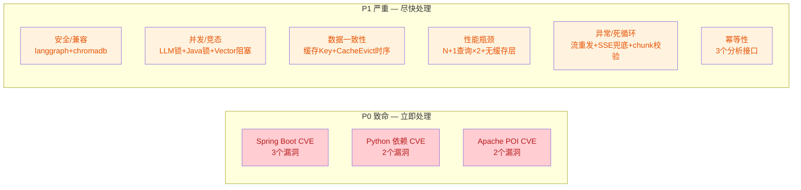
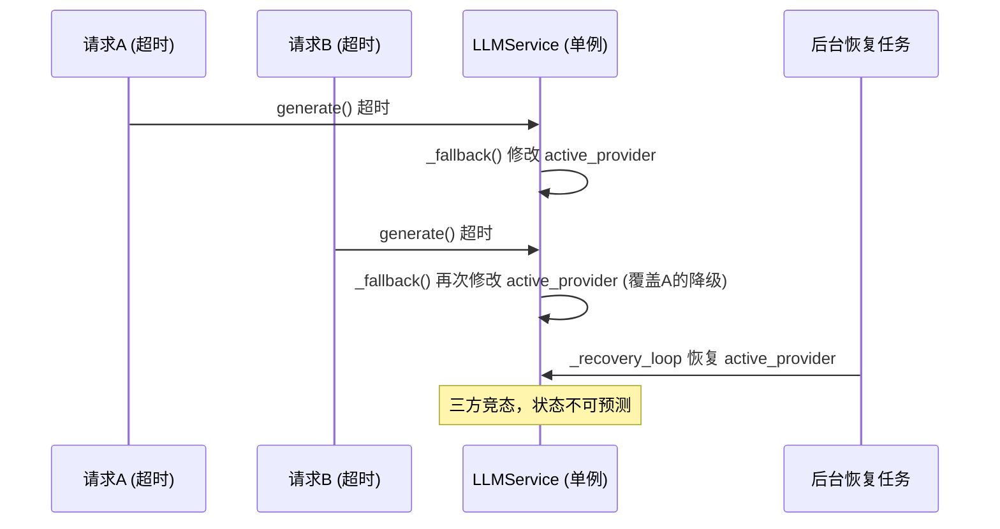
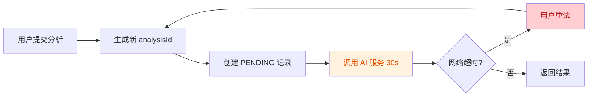
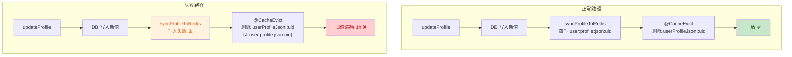

# 修复清单 1 — 紧急 (P0 致命 + P1 严重)

> **项目**: XH-202630 科研文献智能助手
> **来源**: [代码质量与性能检查报告.md](file:///Users/achieve/Library/Mobile%20Documents/com%7Eapple%7ECloudDocs/Documents/AchiEVE_MacBook_Air/Veritas(求真)/Veritas/代码质量与性能检查报告.md)
> **范围**: P0 安全漏洞 + P1 数据一致性/性能瓶颈/竞态条件
> **条目数**: 19 项（P0 × 3 + P1 × 16）

---

## 概览



---

## P0 — 致命（安全漏洞，应立即处理）

### 1. [P0] Spring Boot 3.2.5 存在多个 CVE 安全漏洞 [已修复]

| 属性 | 值 |
|------|---|
| **文件** | [pom.xml](file:///Users/achieve/Library/Mobile%20Documents/com~apple~CloudDocs/Documents/AchiEVE_MacBook_Air/Veritas(求真)/Veritas/backend/pom.xml) |
| **CVE** | CVE-2024-38816, CVE-2024-34750, CVE-2024-38819 |

**问题描述**: Spring Boot 3.2.5 的 OSS 支持已于 2024 年 11 月终止，存在以下未修复漏洞：
- **CVE-2024-38816** (Spring Framework): 静态资源路径遍历，可读取任意文件
- **CVE-2024-34750** (Tomcat): 恶意 multipart 请求导致 OOM 拒绝服务
- **CVE-2024-38819** (Spring Security): 授权绕过

**优化建议**: 升级至 Spring Boot **3.2.12**（3.2.x 最后安全补丁版本）或 **3.3.7** / **3.4.1**。

**验证方法**: 升级后运行 `mvn dependency:tree` 确认 Spring Framework ≥ 6.1.13、Tomcat ≥ 10.1.24、Spring Security ≥ 6.2.8。

---

### 2. [P0] Python `python-multipart` 0.0.12 和 `httpx` 0.27.0 安全漏洞 [已修复]

| 属性 | 值 |
|------|---|
| **文件** | [requirements.txt](file:///Users/achieve/Library/Mobile%20Documents/com%7Eapple%7ECloudDocs/Documents/AchiEVE_MacBook_Air/Veritas(求真)/Veritas/ai-service/requirements.txt) |
| **CVE** | CVE-2024-53981, CVE-2024-35195 |

**问题描述**:
- `python-multipart` 0.0.12: CVE-2024-53981，恶意 multipart 请求触发超大内存分配导致 DoS
- `httpx` 0.27.0: CVE-2024-35195，使用 HTTP 代理时 TLS 证书验证可被绕过

**优化建议**: `python-multipart` 升级至 `0.0.13`+；`httpx` 升级至 `0.27.2`+（推荐 `0.28.1`）。

**验证方法**: `pip install --dry-run --upgrade python-multipart httpx` 确认可升级版本。

---

### 3. [P0] Apache POI 5.2.3 传递依赖存在 CVE [已修复]

| 属性 | 值 |
|------|---|
| **文件** | [pom.xml](file:///Users/achieve/Library/Mobile%20Documents/com%7Eapple%7ECloudDocs/Documents/AchiEVE_MacBook_Air/Veritas(求真)/Veritas/backend/pom.xml) |
| **CVE** | CVE-2024-25710, CVE-2024-26308 |

**问题描述**: POI 5.2.3 依赖的 `commons-compress` 存在 CVE-2024-25710（特制 ZIP 文件导致无限循环 DoS）和 CVE-2024-26308（OOM）。

**优化建议**: 升级至 `5.2.5`+ 或 `5.3.0`。

**验证方法**: `mvn dependency:tree | grep commons-compress` 确认版本升级。

---

## P1 — 严重（数据一致性/性能/竞态）

### 4. [P1] `comparer.py` 两两对比复杂度 O(N²·D·L) [已修复]

| 属性 | 值 |
|------|---|
| **文件** | [comparer.py](file:///Users/achieve/Library/Mobile%20Documents/com%7Eapple%7ECloudDocs/Documents/AchiEVE_MacBook_Air/Veritas(求真)/Veritas/ai-service/app/agents/comparer.py#L417-L496) |
| **复杂度** | O(C(N,2) · D · L) = O(N²·D·L) |
| **触发条件** | LLM 不可用时降级路径 |

**问题描述**: `_rule_based_comparison` 使用 `combinations(analysis_results, 2)` 对 N 篇论文做 C(N,2) 两两对比，每对在 4 个维度上做文本相似度计算（内含 O(L) 的 2-gram tokenization）和冲突检测（多次 `re.findall`）。当前 `MAX_PAPERS=5`（最多 10 对），但若上限被调大，复杂度按平方增长。

**优化建议**: 当 N > 10 时，考虑先对论文做聚类分组，仅在同组内做两两对比，将复杂度降至 O(N·K²)。

**验证方法**: 构造 N=20 的测试数据，测量降级路径执行时间，确认是否呈二次增长趋势。

---

### 5. [P1] LLMService 共享状态在异步环境下无锁竞态 [已修复]

| 属性 | 值 |
|------|---|
| **文件** | [llm_service.py](file:///Users/achieve/Library/Mobile%20Documents/com%7Eapple%7ECloudDocs/Documents/AchiEVE_MacBook_Air/Veritas(求真)/Veritas/ai-service/app/services/llm_service.py#L419-L456) |
| **风险** | 数据竞态、降级逻辑失效 |

**问题描述**: `LLMService` 作为全局单例，`self.active_provider` 和 `self._degradation_state` 是可变共享状态，被三条并发路径同时读写且无 `asyncio.Lock` 保护：



**优化建议**: 引入 `asyncio.Lock` 保护 `_fallback()` 和 `_recovery_loop()` 中的状态修改：

```python
class LLMService:
    def __init__(self, ...):
        self._state_lock = asyncio.Lock()

    async def _fallback(self):
        async with self._state_lock:
            # 修改 active_provider 和 _degradation_state
```

**验证方法**: 编写并发测试，10 个协程同时触发 `generate()` 超时，验证 `active_provider` 最终状态一致。

---

### 6. [P1] VectorStoreService 在 async 方法中直接调用同步 ChromaDB 操作 [已修复]

| 属性 | 值 |
|------|---|
| **文件** | [vector_store_service.py](file:///Users/achieve/Library/Mobile%20Documents/com%7Eapple%7ECloudDocs/Documents/AchiEVE_MacBook_Air/Veritas(求真)/Veritas/ai-service/app/services/vector_store_service.py#L75-L141) |
| **风险** | 事件循环阻塞 |

**问题描述**: `initialize()` 方法正确使用了 `run_in_executor`（行 23-44），但所有其他 async 方法（`add_papers`、`search`、`delete_papers`、`search_by_keywords` 等）直接在事件循环中调用同步的 ChromaDB 操作，阻塞整个事件循环。`search_by_keywords` 尤其严重，包含多轮 `self.collection.query()` 调用。

**优化建议**: 所有 ChromaDB 操作统一使用 `asyncio.to_thread()` 或 `run_in_executor` 包装：

```python
# 优化前
results = self.collection.query(query_embeddings=[embedding], ...)

# 优化后
results = await asyncio.to_thread(
    self.collection.query, query_embeddings=[embedding], ...
)
```

**验证方法**: 在 `search()` 执行期间发起另一个独立请求（如 `/health`），确认不被阻塞。

---

### 7. [P1] Java 后端全项目无任何显式锁机制 [已修复]

| 属性 | 值 |
|------|---|
| **文件** | backend 全部 Service 层 |
| **风险** | 并发写覆盖、状态不一致 |

**问题描述**: 全量搜索 `synchronized|ReentrantLock|@Version|SETNX|setIfAbsent|Redisson|tryLock`，**零匹配**。全部并发安全完全依赖 `@Transactional` 的默认隔离级别和数据库唯一约束。以下场景存在竞态：

- **用户注册** (UserService.register): `existsByUsername` → `save` 的 TOCTOU 竞态
- **会话状态转换** (SessionService.updateStatus): read-modify-write 无锁
- **分析结果完成** (AnalysisTransactionService.completeAnalysis): 无乐观锁

**优化建议**:
1. `users` 表添加 `username`/`email` 的 UNIQUE 约束（DB 兜底）
2. `AnalysisResult` 实体添加 `@Version` 字段实现乐观锁
3. 关键状态转换使用 `SELECT ... FOR UPDATE` 悲观锁

**验证方法**: 编写并发测试，2 个线程同时注册相同用户名，验证 DB 是否拒绝重复。

---

### 8. [P1] `llm_service.generate_stream` 流式失败后重发完整响应导致内容重复 [已修复]

| 属性 | 值 |
|------|---|
| **文件** | [llm_service.py](file:///Users/achieve/Library/Mobile%20Documents/com%7Eapple%7ECloudDocs/Documents/AchiEVE_MacBook_Air/Veritas(求真)/Veritas/ai-service/app/services/llm_service.py#L481-L504) |
| **影响** | 前端显示重复/错乱内容 |

**问题描述**: 流式中途失败时，前面已 yield 的部分 token 已发送给客户端。降级后又把**完整**响应作为单个 token yield（行 503 `yield full_response`），客户端收到 "部分内容 + 完整内容" = 重复文本。

```python
# 行 469-480: 已 yield 部分 token
async for token in self.active_provider.generate_stream(...):
    yield token  # ← 部分内容已发送

# 行 488-503: 降级后 yield 完整响应
full_response = await asyncio.wait_for(
    self.active_provider.generate(prompt, ...), timeout=30)
yield full_response  # ← 完整内容再次发送 = 重复
```

**优化建议**: 流失败后，若已 yield 过 token，应仅发送错误事件或终止流，而非重发完整响应：

```python
except Exception as e:
    if first_token_yielded:
        yield f"\n\n[生成中断，已显示部分内容]"
        return
    # 仅在未 yield 过 token 时才降级为非流式
    ...
```

**验证方法**: 模拟 `generate_stream` 在第 3 个 token 后抛异常，验证客户端收到的内容是否重复。

---

### 9. [P1] `orchestrator.run_workflow_stream` 缺少顶层 `except Exception` [已修复]

| 属性 | 值 |
|------|---|
| **文件** | [orchestrator.py](file:///Users/achieve/Library/Mobile%20Documents/com%7Eapple%7ECloudDocs/Documents/AchiEVE_MacBook_Air/Veritas(求真)/Veritas/ai-service/app/agents/orchestrator.py#L496-L499) |
| **影响** | SSE 流异常中断无错误事件 |

**问题描述**: 顶层 `try` 只捕获 `asyncio.CancelledError`（行 496），若节点间编排代码（`_yield_final`、`_make_event`、`_get_last_result`、JSON 序列化等）抛出其他异常，SSE 流异常终止且客户端收不到 `error` 事件。

**优化建议**: 添加 `except Exception as e` 兜底，yield 一个 error 事件后优雅退出：

```python
except asyncio.CancelledError:
    logger.debug(f"SSE stream cancelled for analysis_id={self.analysis_id}")
    return
except Exception as e:
    logger.error(f"SSE stream error: analysis_id={self.analysis_id}, error={e}")
    yield self._make_event("error", {"message": str(e)}, ...)
```

**验证方法**: 注入一个 `_yield_final` 抛 `KeyError` 的场景，验证客户端是否收到 error 事件。

---

### 10. [P1] `text_processing.chunk_text` 参数无校验导致死循环 [已修复]

| 属性 | 值 |
|------|---|
| **文件** | [text_processing.py](file:///Users/achieve/Library/Mobile%20Documents/com%7Eapple%7ECloudDocs/Documents/AchiEVE_MacBook_Air/Veritas(求真)/Veritas/ai-service/app/utils/text_processing.py#L29-L59) |
| **影响** | 进程挂起 |

**问题描述**: 步进公式 `start = end - overlap = start + chunk_size - overlap`。当 `overlap >= chunk_size` 时，`start` 不增加甚至后退，`while start < text_len` 永远成立 → 死循环。默认值（chunk_size=800, overlap=100）安全，但函数未校验参数关系。

**优化建议**: 添加参数校验：

```python
def chunk_text(text, chunk_size=800, overlap=100):
    if overlap >= chunk_size:
        raise ValueError(f"overlap ({overlap}) must be less than chunk_size ({chunk_size})")
```

**验证方法**: 调用 `chunk_text("test", chunk_size=100, overlap=200)`，验证是否抛出 ValueError 而非挂起。

---

### 11. [P1] `langgraph` 0.2.28 与 `langchain` 0.3.0 API 兼容性风险 [已修复]

| 属性 | 值 |
|------|---|
| **文件** | [requirements.txt](file:///Users/achieve/Library/Mobile%20Documents/com%7Eapple%7ECloudDocs/Documents/AchiEVE_MacBook_Air/Veritas(求真)/Veritas/ai-service/requirements.txt) |

**问题描述**: langgraph 0.2.28 发布于 langchain 0.2.x 时代；langchain 0.3.0 引入了 langchain-core 0.3.x，其中 `RunnableConfig`、`BaseCallbackHandler` 等核心接口有签名变更。langgraph 0.2.28 在 0.3.x 环境下可能出现 `AttributeError` 或 `ImportError`（尤其涉及 `StateGraph` 的 `add_node` 回调时）。

**优化建议**: langgraph 升级至 `0.2.50`+（正式声明对 langchain-core 0.3.x 的完整支持），或使用 `0.3.x` 系列。

**验证方法**: 运行 6-Agent E2E 测试套件，确认无 `AttributeError`/`ImportError`。

---

### 12. [P1] `chromadb` 0.5.0 与 Python 3.13 兼容性问题 [已修复]

| 属性 | 值 |
|------|---|
| **文件** | [requirements.txt](file:///Users/achieve/Library/Mobile%20Documents/com%7Eapple%7ECloudDocs/Documents/AchiEVE_MacBook_Air/Veritas(求真)/Veritas/ai-service/requirements.txt) |

**问题描述**: chromadb 0.5.0 发布于 2024 年 5 月，早于 Python 3.13 正式版（2024 年 10 月），很可能没有 Python 3.13 的预编译 wheel。安装时尝试源码编译可能失败。此外 chromadb 0.5.0 强制 `numpy < 2.0.0`，导致整个项目无法使用 numpy 2.x。

**优化建议**: 升级 chromadb 至 `0.5.20`+（支持 Python 3.13 + numpy 2.x），或使用 Python 3.11/3.12。

**验证方法**: 在 Python 3.13 环境执行 `pip install chromadb==0.5.0`，验证是否成功。

---

### 13. [P1] `AnalysisService.generateReport` 循环内逐条查询论文（最多 20 次） [已修复]

| 属性 | 值 |
|------|---|
| **文件** | [AnalysisService.java](file:///Users/achieve/Library/Mobile%20Documents/com%7Eapple%7ECloudDocs/Documents/AchiEVE_MacBook_Air/Veritas(求真)/Veritas/backend/src/main/java/com/literatureassistant/service/AnalysisService.java#L189-L192) |
| **影响** | 最坏 20 次独立 DB 查询 |

**问题描述**: `generateReport` 在 for 循环内逐个调用 `paperService.getPaperDetail(paperId)`。`ReportRequest` 允许最多 20 篇论文，缓存全未命中时产生 20 次独立 DB 查询。

**对比**: `PaperRepository` 已声明批量方法 `findByPaperIdIn(List<String>)`，且 `FavoriteService.listFavorites`（第 143-148 行）已正确使用。

**优化建议**: 改为批量查询：

```java
// 优化前
for (String paperId : request.getPaperIds()) {
    paperService.getPaperDetail(paperId);
}

// 优化后
List<Paper> papers = paperRepository.findByPaperIdIn(request.getPaperIds());
if (papers.size() != request.getPaperIds().size()) {
    throw new ResourceNotFoundException("Paper", "部分 paperId 不存在");
}
```

**验证方法**: 传入 20 个 paperId 调用 generateReport，开启 SQL 日志，确认查询次数从 20 降为 1。

---

### 14. [P1] `AnalysisService.comparePapers` 循环内逐条查询论文（2-5 次） [已修复]

| 属性 | 值 |
|------|---|
| **文件** | [AnalysisService.java](file:///Users/achieve/Library/Mobile%20Documents/com%7Eapple%7ECloudDocs/Documents/AchiEVE_MacBook_Air/Veritas(求真)/Veritas/backend/src/main/java/com/literatureassistant/service/AnalysisService.java#L139-L142) |
| **影响** | 2-5 次独立 DB 查询 |

**问题描述**: 与 6.1 相同模式，`CompareRequest` 允许 2-5 篇论文。

**优化建议**: 同上，使用批量查询 `findByPaperIdIn`。

**验证方法**: 同上。

---

### 15. [P1] POST `/api/analysis/paper` `/compare` `/report` 均无幂等性设计 [已修复]

| 属性 | 值 |
|------|---|
| **文件** | [AnalysisController.java](file:///Users/achieve/Library/Mobile%20Documents/com%7Eapple%7ECloudDocs/Documents/AchiEVE_MacBook_Air/Veritas(求真)/Veritas/backend/src/main/java/com/literatureassistant/controller/AnalysisController.java#L56-L115), [AnalysisService.java](file:///Users/achieve/Library/Mobile%20Documents/com%7Eapple%7ECloudDocs/Documents/AchiEVE_MacBook_Air/Veritas(求真)/Veritas/backend/src/main/java/com/literatureassistant/service/AnalysisService.java#L83-L229) |
| **影响** | 重复创建资源 + 重复 AI 调用 |

**问题描述**: 三个分析接口每次调用生成新 `analysisId`（UUID），创建新 `AnalysisResult(PENDING)` 记录，触发昂贵的 AI 服务调用（可能 30 秒）。无幂等 key、无唯一约束防重、无状态机检查。用户网络超时后重试 = 重复创建资源 + 重复 AI 调用。



**优化建议**: 实现 Idempotency-Key 机制：

```java
@PostMapping("/paper")
public ApiResponse<AnalysisTaskResponse> analyzePaper(
        @RequestHeader(value = "Idempotency-Key", required = false) String idempotencyKey,
        @Valid @RequestBody PaperAnalysisRequest request) {
    String effectiveKey = idempotencyKey != null ? idempotencyKey :
        DigestUtils.md5Hex(currentUserId + request.getPaperId() + request.getTopic());
    // Redis SETNX 去重窗口 5 分钟
    Boolean isNew = redisTemplate.opsForValue().setIfAbsent(
        "idempotency:" + effectiveKey, "1", Duration.ofMinutes(5));
    if (Boolean.FALSE.equals(isNew)) {
        // 返回已有结果或提示"处理中"
    }
}
```

**验证方法**: 连续发送两个相同请求（不带 Idempotency-Key），验证是否只创建一个 AnalysisResult。

---

### 16. [P1] UserService 手动 Redis Key 与 @CacheEvict Key 不匹配 [已修复]

| 属性 | 值 |
|------|---|
| **文件** | [UserService.java](file:///Users/achieve/Library/Mobile%20Documents/com%7Eapple%7ECloudDocs/Documents/AchiEVE_MacBook_Air/Veritas(求真)/Veritas/backend/src/main/java/com/literatureassistant/service/UserService.java#L255-L263) |
| **影响** | syncProfileToRedis 失败时画像过期数据滞留 |

**问题描述**: `syncProfileToRedis` 写入手动 Key `user:profile:json:{userId}`（供 Python 读取），而 `@CacheEvict(value="userProfileJson")` 失效的是 Spring Cache Key `userProfileJson::{userId}`。两者是完全不同的 Redis Key。

- **正常路径**: `syncProfileToRedis` 覆写新值，一致性不受影响
- **失败路径**（Redis 写入失败，行 260-261 catch 吞异常）: 旧画像 JSON 滞留 `user:profile:json:{userId}` 最长 1 小时（TTL），`@CacheEvict` 无法清理此 Key



**优化建议**: `syncProfileToRedis` 失败时，手动删除旧 Key：

```java
private void syncProfileToRedis(String userId, ProfileResponse profile) {
    String key = RedisKeyUtil.userProfileJsonKey(userId);
    try {
        String json = objectMapper.writeValueAsString(profile);
        redisTemplate.opsForValue().set(key, json, Duration.ofHours(1));
    } catch (Exception e) {
        log.warn("Failed to sync profile to Redis, deleting stale key: userId={}", userId);
        redisTemplate.delete(key);  // 删除旧值，避免读到过期数据
    }
}
```

**验证方法**: Mock `redisTemplate.opsForValue().set()` 抛异常，验证 `user:profile:json:{userId}` 是否被删除。

---

### 17. [P1] UserService @CacheEvict 在事务提交前执行 [已修复]

| 属性 | 值 |
|------|---|
| **文件** | [UserService.java](file:///Users/achieve/Library/Mobile%20Documents/com%7Eapple%7ECloudDocs/Documents/AchiEVE_MacBook_Air/Veritas(求真)/Veritas/backend/src/main/java/com/literatureassistant/service/UserService.java#L106-L107) |
| **影响** | 缓存与 DB 短暂不一致 |

**问题描述**: `@Transactional` + `@CacheEvict(beforeInvocation=false)` 的执行顺序为：`BEGIN TX → 方法体(DB 写入) → @CacheEvict 删除缓存 → COMMIT TX`。缓存在事务提交**之前**被删除。并发读请求可能：
1. 缓存已删（miss）
2. 查 DB → MVCC 返回旧值
3. 回填缓存为旧值
4. 事务提交（新值落库）
5. 缓存残留旧值直到 TTL 过期

**对比**: `SessionService` 和 `FavoriteService` 正确使用了 `CacheEvictionHelper.evictByPatternAfterCommit()`（通过 `TransactionSynchronization.afterCommit()` 回调）。

**优化建议**: `UserService` 改用 `CacheEvictionHelper.evictByPatternAfterCommit()`：

```java
@Transactional
public ProfileResponse updateProfile(String userId, ProfileUpdateRequest request) {
    // ... DB 写入 ...
    cacheEvictionHelper.evictByPatternAfterCommit("userProfile", "userInfo", userId);
    return response;
}
```

**验证方法**: 在 `updateProfile` 执行期间并发调用 `getProfile`，验证不会读到旧值。

---

### 18. [P1] Python AI 服务完全缺乏缓存层 [已修复]

| 属性 | 值 |
|------|---|
| **文件** | ai-service/app/ 全部 |
| **影响** | 每次请求都产生完整外部 I/O 开销 |

**问题描述**: 整个 `app/` 目录下**没有任何缓存机制**（无 `lru_cache`、无 `TTLCache`、无 Redis 缓存、无字典缓存）。以下高频操作每次都产生完整外部调用：

| 操作 | 文件 | 影响 |
|------|------|------|
| Embedding 计算 | `embedding_service.py:359-396` | 每次调用 DashScope/Jina/OpenAI API |
| LLM 生成 | `llm_service.py:419-456` | 每次调用 LLM API（无响应缓存） |
| ChromaDB 查询 | `vector_store_service.py:83-132` | 每次执行完整向量检索 |
| 关键词检索 | `vector_store_service.py:241-414` | 每次执行完整 ChromaDB 文本查询 |

**优化建议**: 对热点查询实现短期缓存：
- Embedding 结果：基于 `hash(text)` 的 LRU 缓存（TTL 5 分钟）
- 搜索结果：基于 `hash(query + top_k + filters)` 的 Redis 缓存（TTL 2 分钟）
- LLM 生成：对相同 prompt 的响应缓存（仅限非流式、温度=0 的场景）

**验证方法**: 连续发送两个相同查询，验证第二次是否命中缓存（通过日志或耗时对比）。

---

### 19. [P1] Jina/OpenAI Provider 每次调用创建新 HTTP 客户端 [已修复]

| 属性 | 值 |
|------|---|
| **文件** | [embedding_service.py](file:///Users/achieve/Library/Mobile%20Documents/com%7Eapple%7ECloudDocs/Documents/AchiEVE_MacBook_Air/Veritas(求真)/Veritas/ai-service/app/services/embedding_service.py#L145-L147) |
| **影响** | 每次调用增加 50-200ms 连接建立延迟 |

**问题描述**: `JinaProvider` 和 `OpenAIProvider` 每次调用都创建新的 `httpx.AsyncClient` 并在 `async with` 退出时销毁，无连接池复用。

**对比**: `DashScopeProvider` 正确地在构造器中创建持久化客户端。

**优化建议**: 在 Provider 构造器中创建持久化 `httpx.AsyncClient`：

```python
class JinaProvider:
    def __init__(self, ...):
        self._client = httpx.AsyncClient(timeout=30.0)

    async def _embed_via_api(self, texts):
        response = await self._client.post(...)  # 复用连接
```

**验证方法**: 对比优化前后 embedding 调用延迟，确认减少 50-200ms。

---

## 验证方法速查

| 验证类别 | 方法 |
|---------|------|
| **安全漏洞** | `mvn dependency:tree` + `pip-audit` / `mvn org.owasp:dependency-check` |
| **N+1 查询** | 开启 `spring.jpa.show-sql=true`，统计 SQL 条数 |
| **竞态条件** | 编写并发测试（`asyncio.gather` / `CountDownLatch`） |
| **死循环** | 设置超时（`asyncio.wait_for` / `@Timeout` 注解）运行测试 |
| **缓存一致性** | Redis CLI `MONITOR` 命令观察 Key 读写时序 |
| **事件循环阻塞** | 在 ChromaDB 操作期间发起独立请求，确认不被阻塞 |
| **幂等性** | 连续发送两个相同请求，验证资源数量 |
| **异常处理** | Mock 各层抛异常，验证客户端收到的错误事件 |

---

## 修复状态总结

> **修复日期**: 2026-06-25
> **修复批次**: 7 批(Java 4 批 + Python 3 批)
> **修改文件数**: 21 个(Java 12 + Python 9)

| 批次 | 问题编号 | 修复内容 | 状态 |
|------|---------|---------|------|
| 1 | P0-1, P0-3 | Spring Boot 3.2.12 + Apache POI 5.2.5 | ✅ 已修复 |
| 2 | P1-7 | DDL唯一约束 + @Version乐观锁 + 悲观锁 + 唯一约束捕获 | ✅ 已修复 |
| 3 | P1-13,14,15 | N+1批量查询 + Idempotency-Key幂等机制 | ✅ 已修复 |
| 4 | P1-16,17 | syncProfileToRedis失败删Key + evictKeysAfterCommit | ✅ 已修复 |
| 5 | P0-2, P1-11,12 | python-multipart/httpx/langgraph/chromadb/numpy升级 | ✅ 已修复 |
| 6 | P1-4,5,6,8,9,10,19 | asyncio.Lock/流不重发/to_thread/SSE兜底/死循环校验/HTTP复用/聚类 | ✅ 已修复 |
| 7 | P1-18 | cachetools TTLCache缓存层(embedding+search) | ✅ 已修复 |

### 验证结果

| 验证项 | 结果 |
|--------|------|
| Java 编译 (`mvn clean compile`) | ✅ 通过 |
| Python 导入验证 | ✅ All imports OK |
| Spring Boot 版本 | 3.2.12 ✅ |
| Apache POI 版本 | 5.2.5 ✅ |
| langgraph 版本 | 0.2.50 ✅ |
| chromadb 版本 | 0.5.20 ✅ |
| httpx 版本 | 0.28.1 ✅ |
| python-multipart 版本 | 0.0.13 ✅ |
