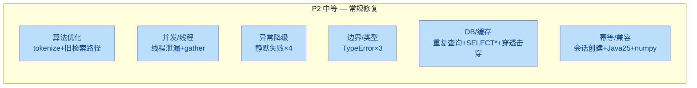

# 修复清单 2 — 常规 (P2 中等)

> **项目**: XH-202630 科研文献智能助手
> **来源**: [代码质量与性能检查报告.md](file:///Users/achieve/Library/Mobile%20Documents/com%7Eapple%7ECloudDocs/Documents/AchiEVE_MacBook_Air/Veritas(求真)/Veritas/代码质量与性能检查报告.md)
> **范围**: 可优化的设计缺陷、降级路径缺陷、类型假设、缓存防护
> **条目数**: 16 项 + 1 附录项
> **修复状态**: 全部已修复 (2026-06-25)
> **验证**: Python 语法检查通过 + Java 编译通过 (mvn compile)

---

## 概览



---

### 1. [P2] `search_service.py` `_tokenize_query` 使用 List 去重导致 O(T²) [已修复]

| 属性 | 值 |
|------|---|
| **文件** | [search_service.py](file:///Users/achieve/Library/Mobile%20Documents/com%7Eapple%7ECloudDocs/Documents/AchiEVE_MacBook_Air/Veritas(求真)/Veritas/ai-service/app/services/search_service.py#L79-L100) |
| **复杂度** | O(T²)，T 为 token 数 |

**问题描述**: `STOP_WORDS` 是 `frozenset`（O(1) 查找），但 `tokens` 是 `List`，`not in tokens` 是 O(n) 线性查找。在分词循环中每次都做线性去重，整体复杂度为 O(T²)。当查询含大量中文 bigram 时性能下降。

**优化建议**: 增加 `seen = set()` 辅助去重，或使用 `dict.fromkeys()` 保序去重。

```python
# 优化前
if token_lower not in STOP_WORDS and token_lower not in tokens:
    tokens.append(token_lower)

# 优化后
if token_lower not in STOP_WORDS and token_lower not in seen:
    seen.add(token_lower)
    tokens.append(token_lower)
```

**验证方法**: 构造含 200+ token 的长查询，对比优化前后耗时。

---

### 2. [P2] `vector_store_service.py` 旧关键词检索路径 N+1 查询 [已修复]

| 属性 | 值 |
|------|---|
| **文件** | [vector_store_service.py](file:///Users/achieve/Library/Mobile%20Documents/com%7Eapple%7ECloudDocs/Documents/AchiEVE_MacBook_Air/Veritas(求真)/Veritas/ai-service/app/services/vector_store_service.py#L375-L414) |
| **复杂度** | O(K) 次 ChromaDB 往返，K 为关键词数 |

**问题描述**: 向后兼容路径对每个关键词发起一次独立的 ChromaDB 查询，共 K 次数据库往返。新路径（293-373 行）已用 `$or` 组合为单次查询，但旧路径仍保留。

**优化建议**: 删除旧路径或在入口处统一转向新路径的 `$or` 查询。

**验证方法**: 调用 `search_by_keywords` 传入 5+ 个关键词（不传 tokens/phrases 参数），确认是否触发旧路径并测量耗时。

---

### 3. [P2] LocalLLMProvider 流式生成线程泄漏风险 [已修复]

| 属性 | 值 |
|------|---|
| **文件** | [llm_service.py](file:///Users/achieve/Library/Mobile%20Documents/com%7Eapple%7ECloudDocs/Documents/AchiEVE_MacBook_Air/Veritas(求真)/Veritas/ai-service/app/services/llm_service.py#L229-L255) |
| **风险** | 线程泄漏 |

**问题描述**: `LocalLLMProvider.generate_stream` 创建两个非守护线程（`thread` 和 `enqueue_thread`），`thread.join()` 和 `enqueue_thread.join()` 未放入 `finally` 块。若异步生成器在消费完成前被取消（客户端断开 SSE），线程不会被 join，导致线程泄漏。非守护线程会阻止进程退出。

**优化建议**: 将线程创建为守护线程 (`daemon=True`)，并将 `join()` 放入 `finally` 块：

```python
thread = threading.Thread(target=..., daemon=True)
try:
    # ... 消费循环 ...
finally:
    thread.join(timeout=5)
    enqueue_thread.join(timeout=5)
```

**验证方法**: 模拟 SSE 客户端提前断开，检查线程数是否回落。

---

### 4. [P2] `asyncio.gather` 缺少 `return_exceptions` 参数 [已修复]

| 属性 | 值 |
|------|---|
| **文件** | [search_service.py](file:///Users/achieve/Library/Mobile%20Documents/com%7Eapple%7ECloudDocs/Documents/AchiEVE_MacBook_Air/Veritas(求真)/Veritas/ai-service/app/services/search_service.py#L244-L247), [analyzer.py](file:///Users/achieve/Library/Mobile%20Documents/com%7Eapple%7ECloudDocs/Documents/AchiEVE_MacBook_Air/Veritas(求真)/Veritas/ai-service/app/agents/analyzer.py#L85) |
| **风险** | 任务级联取消 |

**问题描述**: `asyncio.gather` 未设置 `return_exceptions=True`，一个任务抛出未预期异常（如 `CancelledError`）会导致另一个任务被取消。

**优化建议**: 添加 `return_exceptions=True` 并在后续处理中过滤异常结果。

**验证方法**: 注入一个 `search()` 抛出 `RuntimeError` 的 mock，验证 `keyword_search` 是否仍能正常返回。

---

### 5. [P2] `search_service` 级联降级导致双重静默失败 [已修复]

| 属性 | 值 |
|------|---|
| **文件** | [search_service.py](file:///Users/achieve/Library/Mobile%20Documents/com%7Eapple%7ECloudDocs/Documents/AchiEVE_MacBook_Air/Veritas(求真)/Veritas/ai-service/app/services/search_service.py#L141-L147) |
| **影响** | 底层故障被掩盖 |

**问题描述**: `search()` 和 `hybrid_search()` 用 `except Exception` 捕获后返回 `[]`。`keyword_search` 失败后降级调用 `self.search()`，而 `self.search()` 自身也用 `except Exception` 返回 `[]`。当语义检索与关键词检索同时失败时，最终静默返回 `[]`，调用方无法区分"无结果"与"出错"。

**优化建议**: 降级路径返回 `([], error_metadata)` 元组，或在异常计数器中记录降级事件，供上层判断是否需要告警。

**验证方法**: 关闭 ChromaDB 后调用 `hybrid_search()`，验证返回值和日志是否包含错误信息。

---

### 6. [P2] `vector_store_service.update_paper_metadata` 吞掉写异常 [已修复]

| 属性 | 值 |
|------|---|
| **文件** | [vector_store_service.py](file:///Users/achieve/Library/Mobile%20Documents/com%7Eapple%7ECloudDocs/Documents/AchiEVE_MacBook_Air/Veritas(求真)/Veritas/ai-service/app/services/vector_store_service.py#L227-L239) |
| **影响** | 数据不一致 |

**问题描述**: 更新失败仅记 warning，不重新抛出。调用方认为更新成功，实际元数据可能未持久化。

**优化建议**: 写路径应 re-raise 异常，让调用方决定降级策略。

**验证方法**: 模拟 `self.collection.update` 抛异常，验证调用方是否收到异常。

---

### 7. [P2] `embedding_service.encode` 降级异常信息用错 [已修复]

| 属性 | 值 |
|------|---|
| **文件** | [embedding_service.py](file:///Users/achieve/Library/Mobile%20Documents/com%7Eapple%7ECloudDocs/Documents/AchiEVE_MacBook_Air/Veritas(求真)/Veritas/ai-service/app/services/embedding_service.py#L382-L396) |
| **影响** | 排查困难 |

**问题描述**: 所有 fallback 都失败后，抛出的异常消息用的是 active provider 的原始错误 `e`，而非最后一个 fallback 的错误 `fb_err`。

**优化建议**: 在循环中保留 `last_error = fb_err`，最终抛出 `raise ModelNotLoadedException(f"All embedding providers failed, last error: {last_error}")`。

**验证方法**: 模拟所有 provider 失败，验证异常消息是否包含最后一个 provider 的错误。

---

### 8. [P2] Java `JwtUtil.parseToken` 安全事件仅 debug 级别日志 [已修复]

| 属性 | 值 |
|------|---|
| **文件** | [JwtUtil.java](file:///Users/achieve/Library/Mobile%20Documents/com%7Eapple%7ECloudDocs/Documents/AchiEVE_MacBook_Air/Veritas(求真)/Veritas/backend/src/main/java/com/literatureassistant/util/JwtUtil.java#L65-L84) |
| **影响** | 安全事件被静默 |

**问题描述**: `SecurityException`（签名无效，可能是 token 篡改/伪造攻击）仅以 `debug` 级别记录。生产环境（通常 INFO 级别）此类安全事件会被完全静默。

**优化建议**: `SecurityException` 至少使用 `warn` 级别记录。

**验证方法**: 发送一个篡改签名的 JWT 请求，验证日志中是否出现 warn 级别记录。

---

### 9. [P2] `reranker.py` year/citation_count 类型假设导致 TypeError [已修复]

| 属性 | 值 |
|------|---|
| **文件** | [reranker.py](file:///Users/achieve/Library/Mobile%20Documents/com%7Eapple%7ECloudDocs/Documents/AchiEVE_MacBook_Air/Veritas(求真)/Veritas/ai-service/app/services/reranker.py#L74-L90) |
| **影响** | 重排序静默失效 |

**问题描述**: ChromaDB metadata 的 `year`/`citation_count` 可能是字符串。`or 0`/`or current_year` 只处理 None/空字符串，未处理非数值字符串。若为 `"42"` 或 `"2023"`，除法与减法抛 TypeError，被外层 except 捕获后返回未排序列表。

**优化建议**: 添加类型转换守卫：

```python
try:
    citation_count = int(result.get("citation_count", 0) or 0)
    paper_year = int(result.get("year", current_year) or current_year)
except (ValueError, TypeError):
    citation_count = 0
    paper_year = current_year
```

**验证方法**: 构造 metadata 中 year="2023a" 的测试数据，验证 rerank 不崩溃。

---

### 10. [P2] `reviewer.py` 假设 fact_check 元素为 dict [已修复]

| 属性 | 值 |
|------|---|
| **文件** | [reviewer.py](file:///Users/achieve/Library/Mobile%20Documents/com%7Eapple%7ECloudDocs/Documents/AchiEVE_MacBook_Air/Veritas(求真)/Veritas/ai-service/app/agents/reviewer.py#L245-L273) |
| **影响** | 整次审核被降级 |

**问题描述**: `fact_check` 来自 LLM 输出的 JSON 解析，LLM 可能返回非 dict 元素。对非 dict 调用 `.get()` 抛 AttributeError。

**优化建议**: 添加 `isinstance(item, dict)` 守卫，跳过非 dict 元素。

**验证方法**: 构造 `fact_check = ["string", null, {"accurate": true}]` 的测试数据，验证不崩溃。

---

### 11. [P2] `vector_store_service.search` 假设 ChromaDB 返回并行数组 [已修复]

| 属性 | 值 |
|------|---|
| **文件** | [vector_store_service.py](file:///Users/achieve/Library/Mobile%20Documents/com%7Eapple%7ECloudDocs/Documents/AchiEVE_MacBook_Air/Veritas(求真)/Veritas/ai-service/app/services/vector_store_service.py#L112-L130) |
| **影响** | KeyError/IndexError |

**问题描述**: 只检查 `results["ids"]`，随后直接用相同下标访问 `distances`、`metadatas`、`documents`。若 ChromaDB 返回不等长/缺失数组，抛 KeyError 或 IndexError。

**优化建议**: 添加防御性校验：

```python
ids = results.get("ids", [[]])
if not ids or not ids[0]:
    return []
# 确保所有数组等长
count = len(ids[0])
```

**验证方法**: Mock ChromaDB 返回缺失 `documents` 字段的结果，验证不崩溃。

---

### 12. [P2] Java 25 运行 Spring Boot 3.2.5 超出官方支持 [已修复]

| 属性 | 值 |
|------|---|
| **文件** | [pom.xml](file:///Users/achieve/Library/Mobile%20Documents/com%7Eapple%7ECloudDocs/Documents/AchiEVE_MacBook_Air/Veritas(求真)/Veritas/backend/pom.xml) |

**问题描述**: 编译目标为 Java 17 字节码，本机实际 JDK 为 Temurin OpenJDK 25.0.3。Spring Boot 3.2.5 官方仅支持 Java 17-22。pom.xml 中已添加大量 `--add-opens` 参数和 `-Dnet.bytebuddy.experimental=true`（行 159-168），说明已遇到兼容问题。

**优化建议**: 升级 Spring Boot 至 3.4.x（官方支持 Java 23+），或安装 JDK 17/21 用于此项目。

**验证方法**: 升级后移除 `--add-opens` 参数，验证编译和测试通过。

---

### 13. [P2] numpy 未固定版本 + 缺少 redis-py 依赖 [已修复]

| 属性 | 值 |
|------|---|
| **文件** | [requirements.txt](file:///Users/achieve/Library/Mobile%20Documents/com%7Eapple%7ECloudDocs/Documents/AchiEVE_MacBook_Air/Veritas(求真)/Veritas/ai-service/requirements.txt) |

**问题描述**:
- `numpy>=1.26.0,<2.0.0` 使用范围约束而非精确版本，pip 安装时可能解析为不同版本，无法保证可复现构建
- 缺少 `redis` (redis-py) 依赖。架构图显示 AI 服务与 Redis 有交互，当前可能依赖 Java 后端代理所有 Redis 操作

**优化建议**: 固定为 `numpy==1.26.4`（或升级 chromadb 后改用 `numpy==2.0.2`）；按需添加 `redis==5.0.0`+。

**验证方法**: 在新环境执行 `pip install -r requirements.txt`，验证版本一致性。

---

### 14. [P2] `getAnalysisResult` 流程重复查询 AnalysisResult [已修复]

| 属性 | 值 |
|------|---|
| **文件** | [AnalysisController.java](file:///Users/achieve/Library/Mobile%20Documents/com%7Eapple%7ECloudDocs/Documents/AchiEVE_MacBook_Air/Veritas(求真)/Veritas/backend/src/main/java/com/literatureassistant/controller/AnalysisController.java#L139-L140), [AnalysisService.java](file:///Users/achieve/Library/Mobile%20Documents/com%7Eapple%7ECloudDocs/Documents/AchiEVE_MacBook_Air/Veritas(求真)/Veritas/backend/src/main/java/com/literatureassistant/service/AnalysisService.java#L379-L394) |

**问题描述**: `validateAnalysisAccess` 和 `getAnalysisResult` 都查询了同一个 `analysisResultRepository.findByAnalysisId(analysisId)`。缓存未命中时产生 3 次查询（AnalysisResult + Session + AnalysisResult 重复）。

**优化建议**: `validateAnalysisAccess` 返回查询到的实体，`getAnalysisResult` 复用该实体，或合并为一个方法。

**验证方法**: 开启 SQL 日志，调用 `GET /api/analysis/{analysisId}`，确认查询次数。

---

### 15. [P2] `PaperRepositoryCustomImpl` 搜索使用 SELECT * 和 JSON LIKE 全表扫描 [已修复]

| 属性 | 值 |
|------|---|
| **文件** | [PaperRepositoryCustomImpl.java](file:///Users/achieve/Library/Mobile%20Documents/com%7Eapple%7ECloudDocs/Documents/AchiEVE_MacBook_Air/Veritas(求真)/Veritas/backend/src/main/java/com/literatureassistant/repository/PaperRepositoryCustomImpl.java#L46-L53) |
| **影响** | 不必要的 IO + 全表扫描 |

**问题描述**:
- `SELECT *` 加载所有列（包括 TEXT 类型的 `abstract`），但搜索结果只需 `paperId, title, authors, year, venue, keywords, citationCount`
- `authors LIKE CONCAT('%', ?5, '%')` 对 JSON 列做双侧通配符匹配，无法使用索引

**优化建议**:
1. 替换为 `SELECT paper_id, title, authors, year, venue, keywords, citation_count FROM papers`
2. 对 JSON 数组中的作者搜索使用 `JSON_CONTAINS(authors, JSON_QUOTE(?5))` 或添加虚拟列 + 索引

**验证方法**: `EXPLAIN` 查看优化前后的查询计划，确认 `type` 从 `ALL` 变为 `ref`/`range`。

---

### 16. [P2] 缓存穿透未防护 + 缓存击穿防护不完整 [已修复]

| 属性 | 值 |
|------|---|
| **文件** | 所有 `@Cacheable` 方法（AnalysisService, SessionService, PaperService, UserService, FavoriteService） |

**问题描述**:
- **穿透**: 所有 `@Cacheable` 方法均使用 `unless = "#result == null"`，null 结果不缓存。查询不存在的 ID 时每次穿透到 DB。未实现空值缓存或布隆过滤器。
- **击穿**: 仅 `PaperService` 的三个方法使用 `sync = true`，其余 `@Cacheable` 方法在热点 Key 过期瞬间可能被大量并发请求同时击穿到 DB。

**优化建议**:
1. 对高频查询的不存在 ID 做短 TTL 空值缓存（自定义 CacheInterceptor 对 null 结果缓存 30 秒）
2. 对所有热点 `@Cacheable` 方法添加 `sync = true`

**验证方法**:
- 穿透: 连续查询不存在的 paperId 100 次，监控 DB 查询次数
- 击穿: 在缓存过期瞬间发起 50 个并发请求，监控 DB 查询次数是否仅为 1

---

## 附:会话创建无幂等性 [已修复]

> **注**: 该问题原编号 7.2，与 P1 的用户注册 TOCTOU 竞态（原 2.5/7.3）相关但独立。

| 属性 | 值 |
|------|---|
| **文件** | [SessionController.java](file:///Users/achieve/Library/Mobile%20Documents/com%7Eapple%7ECloudDocs/Documents/AchiEVE_MacBook_Air/Veritas(求真)/Veritas/backend/src/main/java/com/literatureassistant/controller/SessionController.java#L35-L42), [SessionService.java](file:///Users/achieve/Library/Mobile%20Documents/com%7Eapple%7ECloudDocs/Documents/AchiEVE_MacBook_Air/Veritas(求真)/Veritas/backend/src/main/java/com/literatureassistant/service/SessionService.java#L57-L80) |

**问题描述**: 每次创建会话生成新 UUID `sessionId`，无去重机制。用户快速连续点击"创建会话"会产生多个重复会话。

**优化建议**: 支持客户端传入 `clientToken`，基于 `(userId, clientToken)` 做去重。

**验证方法**: 连续发送两个相同创建会话请求，验证是否只创建一个会话。

---

## 验证方法速查

| 验证类别 | 方法 |
|---------|------|
| **N+1 查询** | 开启 `spring.jpa.show-sql=true`，统计 SQL 条数 |
| **缓存穿透/击穿** | 查询不存在的 ID 100 次 / 缓存过期瞬间 50 并发，监控 DB 查询次数 |
| **类型假设** | 构造边界类型数据（字符串数字、null 元素、缺失字段） |
| **异常处理** | Mock 各层抛异常，验证客户端收到的错误事件 |
| **线程泄漏** | 模拟 SSE 客户端提前断开，检查线程数是否回落 |
