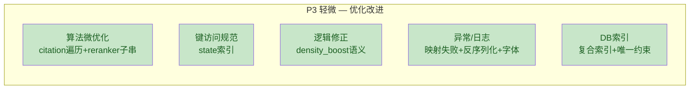

# 修复清单 3 — 优化 (P3 轻微)

> **项目**: XH-202630 科研文献智能助手
> **来源**: [代码质量与性能检查报告.md](file:///Users/achieve/Library/Mobile%20Documents/com%7Eapple%7ECloudDocs/Documents/AchiEVE_MacBook_Air/Veritas(求真)/Veritas/代码质量与性能检查报告.md)
> **范围**: 代码质量与可维护性改进点
> **条目数**: 8 项

---

## 概览



---

### 1. [P3] `citation_parser.py` 冗余二次遍历 O(C·P)

| 属性 | 值 |
|------|---|
| **文件** | [citation_parser.py](file:///Users/achieve/Library/Mobile%20Documents/com%7Eapple%7ECloudDocs/Documents/AchiEVE_MacBook_Air/Veritas(求真)/Veritas/ai-service/app/utils/citation_parser.py#L100-L130) |
| **复杂度** | 2 × O(C·P)，可合并为 1 × O(C·P) |

**问题描述**: `validate_citations` 先做一次 O(C·P) 的引用-论文匹配遍历，紧接着又做一次 O(P·C) 的 `not_found` 推导式遍历，对同样的数据遍历两遍。

**优化建议**: 合并为单次遍历，同时计算 matched/unmatched/not_found。

**验证方法**: 对含 30+ 引用的综述论文调用 `validate_citations`，确认无功能回退。

---

### 2. [P3] `reranker.py` 子串扫描 O(R·Q·L)

| 属性 | 值 |
|------|---|
| **文件** | [reranker.py](file:///Users/achieve/Library/Mobile%20Documents/com%7Eapple%7ECloudDocs/Documents/AchiEVE_MacBook_Air/Veritas(求真)/Veritas/ai-service/app/services/reranker.py#L70-L119) |
| **复杂度** | O(R·Q·L) |

**问题描述**: 每个结果对每个查询关键词在 title/abstract 上做 `in` 子串扫描。当 results 较多且查询关键词较多时开销上升。

**优化建议**: 对短文本（title）预分词为 `set` 加速查找；对长文本（abstract）可接受当前实现。

**验证方法**: 对 top_k=50 的结果集做 rerank，对比优化前后耗时。

---

### 3. [P3] `graph.py` 直接索引 `state["query"]` 键访问

| 属性 | 值 |
|------|---|
| **文件** | [graph.py](file:///Users/achieve/Library/Mobile%20Documents/com%7Eapple%7ECloudDocs/Documents/AchiEVE_MacBook_Air/Veritas(求真)/Veritas/ai-service/app/agents/graph.py#L97) |
| **影响** | KeyError（仅非标准入口时） |

**问题描述**: `coordinator_node` 和 `retrieve_node` 直接用 `state["query"]` 取值，而文件其他地方使用 `state.get()`。当前 `run_workflow` 总是初始化 `query`，但未来新入口可能遗漏。

**优化建议**: 统一使用 `state.get("query", "")` 或在入口处做 schema 校验。

**验证方法**: 构造不包含 `query` 键的 state，验证不抛 KeyError。

---

### 4. [P3] `reranker.py` keyword_density_boost 语义错误

| 属性 | 值 |
|------|---|
| **文件** | [reranker.py](file:///Users/achieve/Library/Mobile%20Documents/com%7Eapple%7ECloudDocs/Documents/AchiEVE_MacBook_Air/Veritas(求真)/Veritas/ai-service/app/services/reranker.py#L84-L86) |
| **影响** | 该 boost 因子实际失效 |

**问题描述**: `keyword_count`（命中数，0-10）除以 `abstract_len`（字符数，500-2000），得到极小值（如 0.002），乘以 `KEYWORD_DENSITY_WEIGHT=0.05` 后几乎为 0，使该 boost 因子形同虚设。

**优化建议**: 改为 `keyword_count / max(len(query_keywords), 1)`（命中率）或 `keyword_count / word_count`（词级密度）。

**验证方法**: 打印 rerank 前后各 boost 分量，确认 keyword_density_boost 的实际贡献。

---

### 5. [P3] Java `PythonAIClient.mapToSearchResults` 静默返回空列表

| 属性 | 值 |
|------|---|
| **文件** | [PythonAIClient.java](file:///Users/achieve/Library/Mobile%20Documents/com%7Eapple%7ECloudDocs/Documents/AchiEVE_MacBook_Air/Veritas(求真)/Veritas/backend/src/main/java/com/literatureassistant/client/PythonAIClient.java#L408-L417) |
| **影响** | 用户看到"无结果"而非错误提示 |

**问题描述**: AI 服务返回的搜索结果映射失败时返回空列表，`log.warn` 仅记录 `e.getMessage()` 不含堆栈。

**优化建议**: 映射失败时应抛出异常或返回错误标识，而非静默空列表；日志应包含完整堆栈 `log.warn("...", e)`。

**验证方法**: 注入格式错误的搜索结果 JSON，验证用户是否收到错误提示。

---

### 6. [P3] Java `AnalysisService.deserializeResult` 反序列化失败缓存 null 结果

| 属性 | 值 |
|------|---|
| **文件** | [AnalysisService.java](file:///Users/achieve/Library/Mobile%20Documents/com%7Eapple%7ECloudDocs/Documents/AchiEVE_MacBook_Air/Veritas(求真)/Veritas/backend/src/main/java/com/literatureassistant/service/AnalysisService.java#L362-L372) |
| **影响** | 用户持续收到损坏结果直到缓存过期 |

**问题描述**: DB 中 `result` JSON 损坏时，反序列化失败返回 `null`。`getAnalysisResult` 返回的 `AnalysisResponse` 对象非 null（只是其 `result` 字段为 null），因此会被 `@Cacheable` 缓存。用户持续收到损坏结果直到缓存过期。

**优化建议**: 反序列化失败时应 evict 缓存或标记为不可用，而非缓存 null result。

**验证方法**: 手动损坏 DB 中的 result JSON，调用 `getAnalysisResult` 后检查 Redis 缓存内容。

---

### 7. [P3] Java `PdfExporter` 字体加载抛 RuntimeException 未被 ExportService 捕获

| 属性 | 值 |
|------|---|
| **文件** | [PdfExporter.java](file:///Users/achieve/Library/Mobile%20Documents/com%7Eapple%7ECloudDocs/Documents/AchiEVE_MacBook_Air/Veritas(求真)/Veritas/backend/src/main/java/com/literatureassistant/util/PdfExporter.java#L80-L91), [ExportService.java](file:///Users/achieve/Library/Mobile%20Documents/com%7Eapple%7ECloudDocs/Documents/AchiEVE_MacBook_Air/Veritas(求真)/Veritas/backend/src/main/java/com/literatureassistant/service/ExportService.java#L62-L69) |
| **影响** | 返回通用 500 错误而非 "PDF导出失败" |

**问题描述**: `resolveChineseFont` 抛出 `RuntimeException`，而 `ExportService.exportPdf` 仅捕获 `IOException`，RuntimeException 冒泡到 GlobalExceptionHandler 的 catch-all。

**优化建议**: `ExportService` 增加对 `RuntimeException` 的捕获，或 `PdfExporter` 统一包装为 `IOException`/`BusinessException`。

**验证方法**: 删除字体文件后调用导出 PDF 接口，验证返回的错误消息。

---

### 8. [P3] 缺少复合索引 + users 表缺唯一约束

| 属性 | 值 |
|------|---|
| **文件** | DDL (01_create_tables.sql) + Repository |

**问题描述**:
- `sessions` 表：`findByUserIdOrderByCreatedAtDesc` 查询只有单列索引 `idx_user_id`，需要 filesort
- `analysis_results` 表：`findBySessionIdAndStatus` 查询只有独立单列索引
- `users` 表：`username` 和 `email` 在 DB 层无 UNIQUE 约束，`existsByUsername`/`existsByEmail` 每次全表扫描

**优化建议**:
```sql
ALTER TABLE sessions ADD INDEX idx_user_created (user_id, created_at DESC);
ALTER TABLE analysis_results ADD INDEX idx_session_status (session_id, status);
ALTER TABLE users ADD UNIQUE KEY uk_username (username);
ALTER TABLE users ADD UNIQUE KEY uk_email (email);
```

**验证方法**: `EXPLAIN` 确认 `Extra` 列不再出现 `Using filesort`；尝试插入重复 username，验证 DB 拒绝。

---

## 附:正面实践（无需修复，供参考）

| 项目 | 评价 |
|------|------|
| **缓存雪崩防护** | [RedisConfig.java](file:///Users/achieve/Library/Mobile%20Documents/com%7Eapple%7ECloudDocs/Documents/AchiEVE_MacBook_Air/Veritas(求真)/Veritas/backend/src/main/java/com/literatureassistant/config/RedisConfig.java#L95-L100) 通过 `applyJitter` 添加 ±10% TTL 随机抖动 |
| **序列化安全** | [RedisConfig.java](file:///Users/achieve/Library/Mobile%20Documents/com%7Eapple%7ECloudDocs/Documents/AchiEVE_MacBook_Air/Veritas(求真)/Veritas/backend/src/main/java/com/literatureassistant/config/RedisConfig.java#L31-L44) 使用 `BasicPolymorphicTypeValidator` 白名单 |
| **Cache Key 设计** | [RedisKeyUtil.java](file:///Users/achieve/Library/Mobile%20Documents/com%7Eapple%7ECloudDocs/Documents/AchiEVE_MacBook_Air/Veritas(求真)/Veritas/backend/src/main/java/com/literatureassistant/util/RedisKeyUtil.java) 包含完整业务参数，null 统一处理 |
| **CacheEvictionHelper** | SessionService/FavoriteService 正确使用 `afterCommit` 回调确保事务提交后删缓存 |
| **统一异常处理** | [GlobalExceptionHandler.java](file:///Users/achieve/Library/Mobile%20Documents/com%7Eapple%7ECloudDocs/Documents/AchiEVE_MacBook_Air/Veritas(求真)/Veritas/backend/src/main/java/com/literatureassistant/exception/GlobalExceptionHandler.java) 覆盖 8 类异常 |
| **try-with-resources** | PdfExporter, CacheEvictionHelper, HealthController, WordExporter 均正确使用 |
| **InterruptedException** | [PythonAIClient.java](file:///Users/achieve/Library/Mobile%20Documents/com%7Eapple%7ECloudDocs/Documents/AchiEVE_MacBook_Air/Veritas(求真)/Veritas/backend/src/main/java/com/literatureassistant/client/PythonAIClient.java#L355-L361) 正确恢复中断标志 |
| **AI 调用长事务规避** | AnalysisService 显式在事务外执行 30s AI 调用，仅 DB 写入用短事务 |
| **BaseAgent 三级降级** | AI 服务降级与容错意识较强 |
| **收藏接口幂等性** | [FavoriteService.java](file:///Users/achieve/Library/Mobile%20Documents/com%7Eapple%7ECloudDocs/Documents/AchiEVE_MacBook_Air/Veritas(求真)/Veritas/backend/src/main/java/com/literatureassistant/service/FavoriteService.java#L66-L94) 应用层检查 + DB 唯一约束双重保障 |
| **Session 状态机** | [SessionService.java](file:///Users/achieve/Library/Mobile%20Documents/com%7Eapple%7ECloudDocs/Documents/AchiEVE_MacBook_Air/Veritas(求真)/Veritas/backend/src/main/java/com/literatureassistant/service/SessionService.java#L42-L46) `ALLOWED_TRANSITIONS` 防止非法状态转换 |
