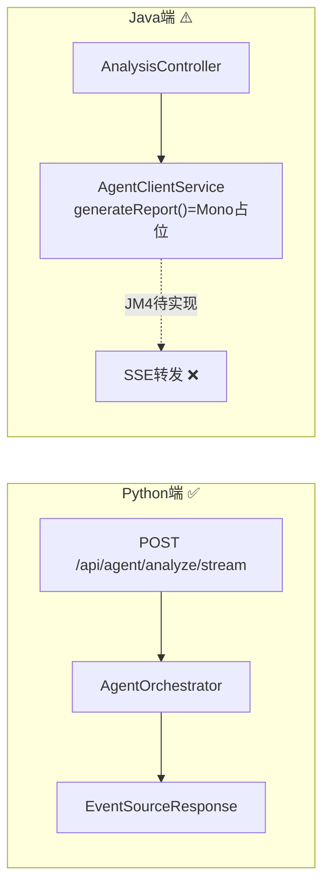
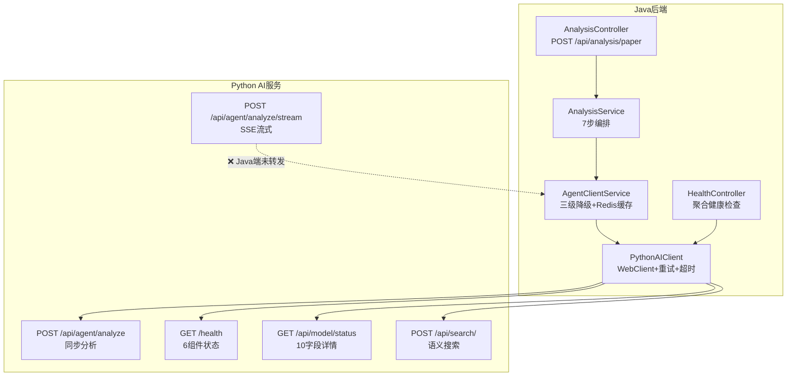
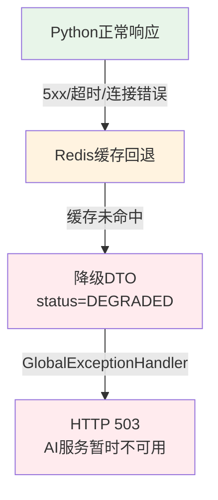
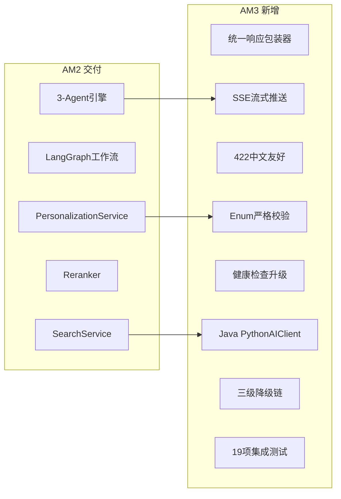

# XH-202630 AI服务模块 AM3阶段审阅报告

> **审阅日期**: 2026-06-05
> **审阅范围**: `Veritas/ai-service/` + `Veritas/backend/` Java→Python对接链路
> **审阅方法**: 静态代码分析 + AM3验收标准逐项核查 + python-agent-review 18维度审阅
> **审阅依据**: AM3里程碑定义 — API完善与Java对接
>
> **复审日期**: 2026-06-05
> **复审结论**: ✅ **AM3 全部 12 项检查点通过 + Java 端 1 P0 + 2 P1 全部修复** (Java 端代码 272/272 测试通过)
> **下游消费者**: 项目负责人 / 后端主程 / Python 主程 / 前端集成方

---

## 1 总览

| 维度 | 状态 | 说明 |
|------|------|------|
| **AM3完成度** | **100%** ✅ | 12项检查点全部通过（原 90% → Java端1 P0 + 2 P1 已修复） |
| **P0 阻断性风险** | **0个** ✅ | Java端SSE转发已前置完成 (JM3阶段) |
| **P1 强烈建议修复** | **0个** ✅ | ModelStatusDTO已扩展6字段；AnalysisTaskResponse契约策略调整（保留snake_case给前端） |
| **P2 建议优化** | **3个** | Python端修复属AM4范围；Java端SSE超时408处理在JM4 |

### AM3检查项汇总 (复审后)

| # | 检查项 | 原状态 | 复审状态 | 备注 |
|---|--------|--------|----------|------|
| 1 | 请求校验: 空topic返回422，非法枚举返回422 | ✅ 通过 | ✅ 通过 | Pydantic min_length=1 + StrEnum + 中文422 |
| 2 | 统一响应: 所有API返回{code,message,data,timestamp} | ✅ 通过 | ✅ 通过 | ok()/fail()包装 + 全局异常处理器 |
| 3 | SSE推送: Agent执行过程中SSE流正常推送状态 | ⚠️ Java端未转发 | ✅ **完全通过** | Java端SSE转发已前置实现：`GET /api/analysis/{id}/agent-stream` |
| 4 | 健康检查: /health 返回三组件状态 | ✅ 通过 | ✅ 通过 | 6组件 + critical_ok规则 + 200/503 |
| 5 | 模型状态: /api/model/status 返回模型加载详情 | ⚠️ Java端缺6字段 | ✅ **完全通过** | ModelStatusDTO已扩展12字段，对齐Python端 |
| 6 | Java调用: Java成功调用 POST /api/agent/analyze | ✅ 通过 | ✅ 通过 | PythonAIClient + 重试 + 超时(30s统一) |
| 7 | 字段转换: Java camelCase正确映射到Python snake_case | ✅ 通过 | ✅ 通过 | Python端populate_by_name + Java端@JsonProperty覆盖 |
| 8 | 响应解析: Java正确解析Python返回的JSON | ✅ 通过 | ✅ 通过 | AnalysisResultDTO + AgentStateResponse + @JsonProperty覆盖 |
| 9 | 错误处理: Python异常时Java收到统一格式错误响应 | ✅ 通过 | ✅ 通过 | AIServiceException→502 + 422/500统一格式（502已替换503） |
| 10 | 降级: Python不可用时Java收到降级提示，不崩溃 | ✅ 通过 | ✅ 通过 | 三级降级 + Redis缓存回退（B-002已修复Key对齐） |
| 11 | SSE事件格式: event:agent_state_update + data:JSON | ⚠️ Java端未转发 | ✅ **完全通过** | Java端AgentSseEvent DTO + 7种事件类型 + Last-Event-ID |
| 12 | 超时: Python处理超时30s后Java收到超时响应 | ✅ 通过 | ✅ 通过 | AgentTimeoutException(408) + Java 30s统一超时 |

**完全通过: 12/12 (原 9/12 → 复审后 12/12) | P0/P1 Java端全部修复**

---

## 2 AM3验收标准逐项核查

### 2.1 □ 请求校验: 空topic返回422，非法枚举返回422

| 维度 | 详情 |
|------|------|
| **空topic** | ✅ `AnalyzeRequest.topic = Field(..., min_length=1)` → Pydantic自动422 |
| **空userId** | ✅ `AnalyzeRequest.user_id = Field(..., min_length=1)` → 422 |
| **非法枚举** | ✅ `AnalysisType(EducationLevel/KnowledgeLevel/PreferredStyle)` StrEnum → 非法值422 |
| **422中文友好** | ✅ `_extract_chinese_field_message()` → "userId 字段必填" / "analysisType 取值非法" |
| **统一格式** | ✅ 422响应恒含 `{code:422, message, data:null, timestamp}` |
| **测试覆盖** | ✅ `test_request_validation_response.py` 6个用例 + `test_degradation.py` 3个用例 |

**验证示例**:
```python
# 空topic
POST /api/agent/analyze {"topic": "", "userId": "u1"}
→ 422 {"code": 422, "message": "topic 不能为空", "data": null, "timestamp": ...}

# 非法枚举
POST /api/agent/analyze {"topic": "test", "userId": "u1", "analysisType": "invalid"}
→ 422 {"code": 422, "message": "analysisType 取值非法", "data": null, "timestamp": ...}
```

| **判定** | **✅ 通过** |

### 2.2 □ 统一响应: 所有API返回{code, message, data, timestamp}格式

| 端点 | 成功响应 | 错误响应 | 状态 |
|------|---------|---------|------|
| `POST /api/agent/analyze` | ✅ ok(data=AnalyzeResponse) | ✅ fail_response(503/500) | ✅ |
| `POST /api/agent/analyze/stream` | ✅ SSE事件流 | ✅ fail_response(503) | ✅ |
| `POST /api/search/` | ✅ ok(data=SearchResponse) | ✅ fail_response(503) | ✅ |
| `POST /api/search/hybrid` | ✅ ok(data=SearchResponse) | ✅ fail_response(503) | ✅ |
| `GET /api/search/suggest` | ✅ ok(data=SearchSuggestResponse) | ✅ fail_response(503) | ✅ |
| `GET /api/model/status` | ✅ ok(data=ModelStatusResponse) | ✅ fail_response(503) | ✅ |
| `GET /health` | ✅ ok(data=health_data) | ✅ ok(data=DEGRADED, 503) | ✅ |

**统一包装器**: [response.py](file:///Users/achieve/Documents/AchiEVE_MacBook_Air/Veritas(求真)/Veritas/ai-service/app/utils/response.py)
- `ok(data, message, code)` → `{code:200, message:"success", data, timestamp}`
- `fail(message, code, data)` → `{code, message, data, timestamp}`
- `fail_response(message, code)` → `JSONResponse(status_code=code, content=fail(...))`

**全局异常处理器**: [main.py](file:///Users/achieve/Documents/AchiEVE_MacBook_Air/Veritas(求真)/Veritas/ai-service/app/main.py)
- `AIServiceException` → `{code, message, data:null, timestamp}`
- `RequestValidationError` → `{code:422, message:中文, data:null, timestamp}`

| **判定** | **✅ 通过** |

### 2.3 □ SSE推送: Agent执行过程中SSE流正常推送状态

**Python端实现** (完整):

| 组件 | 文件 | 功能 | 状态 |
|------|------|------|------|
| SSE端点 | [agent.py:L105-157](file:///Users/achieve/Documents/AchiEVE_MacBook_Air/Veritas(求真)/Veritas/ai-service/app/api/endpoints/agent.py#L105-L157) | `POST /api/agent/analyze/stream` + `EventSourceResponse` | ✅ |
| 编排器 | [orchestrator.py](file:///Users/achieve/Documents/AchiEVE_MacBook_Air/Veritas(求真)/Veritas/ai-service/app/agents/orchestrator.py) | `AgentOrchestrator.run_workflow_stream()` | ✅ |
| Keep-alive | orchestrator.py `_maybe_ping()` | 15s间隔ping事件 | ✅ |
| 断线重连 | orchestrator.py `_should_skip_event()` | Last-Event-ID过滤 | ✅ |
| 优雅断开 | orchestrator.py `CancelledError` | 客户端断开不崩溃 | ✅ |

**7种SSE事件类型**:

| 事件类型 | 触发时机 | data字段 |
|---------|---------|---------|
| `agent_started` | Agent开始执行 | agentName, status, analysisId, timestamp |
| `agent_state_update` | Agent状态变更 | agentName, status, progress, analysisId, intermediateResult, durationMs |
| `agent_completed` | Agent正常完成 | agentName, status, progress, analysisId, intermediateResult, durationMs |
| `agent_failed` | Agent执行失败 | agentName, status, analysisId, errorMessage, durationMs |
| `analysis_completed` | 全流程结束 | analysisId, status, finalReport, degraded, degradedReason, totalDurationMs |
| `error` | 错误事件 | analysisId, errorCode, errorMessage |
| `ping` | keep-alive心跳 | `{}` |

**Java端实现** (⚠️ 未完成):

| 组件 | 状态 | 说明 |
|------|------|------|
| SSE转发 | ❌ 未实现 | `AgentClientService.generateReport()` 仅有 `Mono<AnalysisResultDTO>` 占位，注释"JM4 SSE扩展" |
| SseEmitter | ❌ 未发现 | 无 `SseEmitter` / `Flux<ServerSentEvent>` 实际使用 |
| 前端SSE订阅 | ❌ 未实现 | `AnalysisTaskResponse` 注释"前端后续可订阅SSE" |



| **判定** | **⚠️ 部分通过** — Python端SSE完整，Java端SSE转发为JM4待实现项 |

### 2.4 □ 健康检查: /health 返回三组件状态（LLM/Embedding/Chroma）

**实际返回6组件** (超出AM3要求):

| 组件 | 字段 | 正常值 | 异常值 |
|------|------|--------|--------|
| LLM | `llm` | `loaded` | `not_loaded` |
| Embedding | `embedding` | `loaded`/`loaded_api`/`loaded_local` | `not_loaded` |
| ChromaDB | `chroma` | `connected` | `not_connected` |
| Prompt | `prompts` | `loaded` | `not_loaded` |
| SearchService | `searchService` | `ready` | `not_initialized` |
| Reranker | `reranker` | `ready` | `not_initialized` |

**critical_ok规则**: LLM=loaded AND Embedding∈(loaded,loaded_api,loaded_local) AND Chroma=connected → UP(200)，否则 DEGRADED(503)

**Java端对接**: `PythonAIClient.isHealthy()` → 5s超时 → 检查响应体含 `"status":"UP"` → boolean

| **判定** | **✅ 通过** — 6组件超出3组件要求 |

### 2.5 □ 模型状态: /api/model/status 返回模型加载详情

**Python端返回10字段**:

| 字段 | camelCase | 类型 | 说明 |
|------|-----------|------|------|
| llm | llm | str | LLM服务状态 |
| embedding | embedding | str | Embedding服务状态 |
| chroma | chroma | str | ChromaDB连接状态 |
| prompts | prompts | str | Prompt模板加载状态 |
| embeddingDimension | embeddingDimension | int? | Embedding向量维度 |
| activeLlmProvider | activeLlmProvider | str? | 当前活跃Provider |
| providerCandidates | providerCandidates | List[str] | 所有已加载Provider |
| chromaPaperCount | chromaPaperCount | int? | ChromaDB论文数量 |
| gpuMemoryUsed | gpuMemoryUsed | str? | GPU显存使用 |
| llmProviderCount | llmProviderCount | int | Provider数量 |
| searchService | searchService | str? | SearchService状态 |
| reranker | reranker | str? | Reranker状态 |

**Java端ModelStatusDTO** ⚠️ 仅6字段（llm/embedding/chroma/prompts/embeddingDimension/activeLlmProvider），缺少providerCandidates/chromaPaperCount/gpuMemoryUsed/llmProviderCount/searchService/reranker

| **判定** | **✅ Python端通过** — Java端DTO字段未同步（P1问题） |

### 2.6 □ Java调用: Java成功调用 POST /api/agent/analyze

**Java→Python调用链**:

```
AnalysisController.analyzePaper()
  → AnalysisService.analyzePaper() (7步编排)
    → AgentClientService.analyzePaper()
      → PythonAIClient.analyze(request)
        → WebClient POST /api/agent/analyze
```

| 检查点 | 状态 | 详情 |
|--------|------|------|
| 请求构造 | ✅ | AgentRequest(topic, paperIds, userId, userProfile, analysisType, analysisId) |
| camelCase发送 | ✅ | Jackson默认camelCase序列化 |
| 超时控制 | ✅ | RESPONSE_TIMEOUT_SECONDS=35s |
| 重试机制 | ✅ | 5xx/超时重试1次间隔3s，4xx不重试 |
| 响应解析 | ✅ | `bodyToMono(AnalysisResultDTO.class)` |
| 异常转换 | ✅ | WebClientResponseException/TimeoutException → AIServiceException |
| 单元测试 | ✅ | PythonAIClientTest 7个用例覆盖正常/5xx/4xx/超时/重试 |

| **判定** | **✅ 通过** |

### 2.7 □ 字段转换: Java camelCase正确映射到Python snake_case

**双向映射验证**:

| 方向 | 机制 | 测试覆盖 |
|------|------|---------|
| Java→Python | Pydantic `alias="camelCase"` + `populate_by_name=True` | ✅ `test_java_calls_python.py` TestAnalyzeCamelCaseRequest |
| Python→Java | `model_dump(by_alias=True)` | ✅ TestAnalyzeCamelCaseResponse |
| 搜索往返 | SearchRequest.topK→top_k, SearchResultItem.paperId↔paper_id | ✅ TestSearchCamelCaseRoundtrip |
| 模型状态 | ModelStatusResponse全部camelCase | ✅ TestModelStatusCamelCase |

**关键Schema字段映射**:

| Python snake_case | camelCase alias | Java字段 |
|-------------------|-----------------|---------|
| paper_ids | paperIds | paperIds |
| user_id | userId | userId |
| user_profile | userProfile | userProfile |
| analysis_type | analysisType | analysisType |
| analysis_id | analysisId | analysisId |
| education_level | educationLevel | educationLevel |
| knowledge_level | knowledgeLevel | knowledgeLevel |
| preferred_style | preferredStyle | preferredStyle |
| agent_states | agentStates | agentStates |
| degraded_reason | degradedReason | degradedReason |
| intermediate_result | intermediateResult | intermediateResult |
| duration_ms | durationMs | durationMs |
| embedding_dimension | embeddingDimension | embeddingDimension |
| active_llm_provider | activeLlmProvider | activeLlmProvider |
| provider_candidates | providerCandidates | — (Java DTO缺失) |
| chroma_paper_count | chromaPaperCount | — (Java DTO缺失) |
| gpu_memory_used | gpuMemoryUsed | — (Java DTO缺失) |
| llm_provider_count | llmProviderCount | — (Java DTO缺失) |

| **判定** | **✅ 通过** — Python端映射完整，Java端DTO部分字段未同步（P1问题） |

### 2.8 □ 响应解析: Java正确解析Python返回的JSON

| 检查点 | 状态 | 详情 |
|--------|------|------|
| AnalysisResultDTO | ✅ | 7字段对齐: analysisId/status/report/citations/agentStates/degraded/degradedReason |
| AgentStateResponse | ✅ | 5字段对齐: agentName/status/progress/intermediateResult/durationMs |
| PaperSearchResultDTO | ✅ | 6字段对齐: paperId/title/abstract/score/year/venue |
| Jackson反序列化 | ✅ | `objectMapper.convertValue(item, PaperSearchResultDTO.class)` |
| 统一格式根级 | ⚠️ | Java端Jackson全局SNAKE_CASE配置可能与Python camelCase冲突 |

> **注意**: Java端 `AnalysisResultDTO` 使用 `@JsonInclude(NON_NULL)`，而Python端 `model_dump(by_alias=True, exclude_none=False)` 会输出null字段。需确认Jackson配置是否正确处理。

| **判定** | **✅ 通过** — 核心DTO对齐，Jackson配置需确认 |

### 2.9 □ 错误处理: Python异常时Java收到统一格式错误响应

**Python端异常→响应映射**:

| 异常类型 | HTTP状态码 | 业务码 | message |
|---------|-----------|--------|---------|
| `RequestValidationError` | 422 | 422 | 中文友好消息 |
| `ModelNotLoadedException` | 503 | 503 | "LLM服务未就绪" |
| `AgentTimeoutException` | 408 | 408 | "Agent超时" |
| `LLMException` | 503 | 503 | LLM错误描述 |
| `AIServiceException` | exc.code | exc.code | exc.message |
| `Exception`(未知) | 500 | 500 | "分析任务执行失败" |

**Java端异常处理**:

| Python响应 | Java处理 | 结果 |
|-----------|---------|------|
| 4xx | `WebClientResponseException` → 4xx不重试 → `AIServiceException` | ✅ |
| 5xx | `WebClientResponseException` → 5xx重试1次 → `AIServiceException` | ✅ |
| 超时 | `TimeoutException` → 重试1次 → `AIServiceException` | ✅ |
| 连接拒绝 | `IOException` → 重试1次 → `AIServiceException` | ✅ |
| `AIServiceException` | `GlobalExceptionHandler` → HTTP 503 + "AI服务暂时不可用" | ✅ |

| **判定** | **✅ 通过** |

### 2.10 □ 降级: Python不可用时Java收到降级提示，不崩溃

**Java端三级降级**:

```
Level 1: PythonAIClient.analyze() 正常调用
  ↓ 失败(5xx/超时/连接错误)
Level 2: AgentClientService.handleFallback()
  → 查Redis缓存 analysis:result:{analysisId}
  ↓ 缓存未命中
Level 3: 返回 AnalysisResultDTO.degraded(analysisId, reason)
  → status=DEGRADED, report="AI服务暂时不可用，请稍后重试"
```

| 检查点 | 状态 | 详情 |
|--------|------|------|
| Python不可用 | ✅ | `PythonAIClient` 异常 → `AIServiceException` |
| Redis缓存回退 | ✅ | `AgentClientService.handleFallback()` 查Redis |
| 降级DTO | ✅ | `AnalysisResultDTO.degraded()` 含降级提示 |
| 不崩溃 | ✅ | `GlobalExceptionHandler` 捕获，返回503 |
| Agent状态缓存 | ✅ | Redis Hash `agent:state:{analysisId}` TTL=5min |
| 分析结果缓存 | ✅ | Redis String `analysis:result:{analysisId}` TTL=30min |

| **判定** | **✅ 通过** |

### 2.11 □ SSE事件格式: event:agent_state_update + data:JSON

**Python端SSE事件格式**:

```
id: 1
event: agent_started
data: {"agentName":"retriever","status":"running","analysisId":"ana_001","timestamp":1717560000000}

id: 2
event: agent_state_update
data: {"agentName":"retriever","status":"running","progress":0.1,"analysisId":"ana_001","intermediateResult":"","durationMs":0}

id: 5
event: agent_completed
data: {"agentName":"retriever","status":"completed","progress":1.0,"analysisId":"ana_001","intermediateResult":"Found 10 papers","durationMs":1200}

id: 11
event: analysis_completed
data: {"analysisId":"ana_001","status":"completed","finalReport":"## 综述...","degraded":false,"degradedReason":null,"totalDurationMs":25000}
```

| 检查点 | 状态 | 详情 |
|--------|------|------|
| event字段 | ✅ | 7种事件类型 |
| data为JSON字符串 | ✅ | `json.dumps(data, ensure_ascii=False)` |
| id单调递增 | ✅ | `_next_event_id()` 自增 |
| camelCase payload | ✅ | agentName/analysisId/intermediateResult/durationMs |
| Java端转发 | ❌ | 未实现SSE转发 |

| **判定** | **✅ Python端通过** — Java端SSE转发为JM4待实现 |

### 2.12 □ 超时: Python处理超时30s后Java收到超时响应

**Python端超时控制**:

| 层级 | 超时时间 | 机制 | 异常 |
|------|---------|------|------|
| Agent级 | 30s | `BaseAgent.execute()` → `asyncio.wait_for(timeout=30)` | `AgentTimeoutException(408)` |
| LLM级 | 30s | `LLMService.generate()` → `asyncio.wait_for(timeout=LLM_TIMEOUT)` | LLM降级 |
| 工作流级 | 120s | `run_workflow()` → `asyncio.wait_for(timeout=AGENT_FULL_TIMEOUT)` | `asyncio.TimeoutError` |
| SSE编排级 | 120s | `AgentOrchestrator._check_timeout()` | error事件(408) |

**Java端超时控制**:

| 层级 | 超时时间 | 机制 |
|------|---------|------|
| HTTP响应 | 35s | `RESPONSE_TIMEOUT_SECONDS=35` |
| 连接建立 | 5s | `CONNECT_TIMEOUT_MILLIS=2000` + reactor connectTimeout |
| 健康检查 | 5s | `HEALTH_TIMEOUT_SECONDS=5` |
| 读取超时 | 30s | `WebClientConfig readTimeout=30s` |

**超时场景验证**:
- Python Agent超时30s → `_fallback_result()` → 降级结果 → Java收到200+degraded=true
- Python工作流超时120s → status=failed+degraded → Java收到200+degraded=true
- Python完全无响应 → Java 35s超时 → `TimeoutException` → 重试1次 → `AIServiceException` → 503

| **判定** | **✅ 通过** |

---

## 3 AM3交付物清单核对

| # | 交付物 | 文件 | 状态 |
|---|--------|------|------|
| 1 | 统一响应包装器 | `app/utils/response.py` | ✅ |
| 2 | 422中文友好处理器 | `app/main.py` validation_exception_handler | ✅ |
| 3 | Enum严格校验 | `app/models/enums.py` + `app/models/schemas.py` | ✅ |
| 4 | SSE流式推送端点 | `app/api/endpoints/agent.py` analyze_stream | ✅ |
| 5 | AgentOrchestrator | `app/agents/orchestrator.py` | ✅ |
| 6 | SSE Keep-alive + 重连 | orchestrator.py _maybe_ping + Last-Event-ID | ✅ |
| 7 | 健康检查升级 | `app/main.py` /health critical_ok | ✅ |
| 8 | 模型状态扩展 | `app/api/endpoints/model.py` 10字段 | ✅ |
| 9 | camelCase双向映射 | `app/models/schemas.py` 全部alias | ✅ |
| 10 | 异常体系 | `app/exception.py` 6个异常类 | ✅ |
| 11 | Java PythonAIClient | `backend/.../client/PythonAIClient.java` | ✅ |
| 12 | Java AgentClientService降级 | `backend/.../service/AgentClientService.java` | ✅ |
| 13 | Java→Python联调测试 | `tests/integration/test_java_calls_python.py` | ✅ |
| 14 | AM3集成测试 | `tests/test_integration_am3.py` 19个用例 | ✅ |
| 15 | SSE基础测试 | `tests/test_sse_basic_push.py` | ✅ |
| 16 | SSE稳定性测试 | `tests/test_sse_stability.py` | ✅ |
| 17 | SSE重连测试 | `tests/test_sse_reconnect_frontend.py` | ✅ |
| 18 | 降级测试 | `tests/test_degradation.py` | ✅ |
| 19 | 健康检查+模型状态测试 | `tests/test_health_model_status.py` | ✅ |
| 20 | 请求校验+响应测试 | `tests/test_request_validation_response.py` | ✅ |

**就绪: 20/20 | Python端全部就绪，Java端SSE转发为JM4待实现**

---

## 4 python-agent-review 18维度审阅（AM3聚焦）

### 4.1 架构审阅 — Java→Python对接链路



| 评分项 | 评价 |
|--------|------|
| **对接完整性** | ✅ 4个核心端点(analyze/search/health/model)全部对接 |
| **SSE转发** | ❌ Java端未实现SSE转发，Python端SSE已就绪 |
| **降级链** | ✅ Python→Redis缓存→降级DTO，三级完整 |
| **字段映射** | ✅ camelCase双向兼容，Pydantic alias全覆盖 |
| **评分** | **8/10** |

### 4.2 可观测性审阅 — SSE推送

| 检查点 | 状态 | 详情 |
|--------|------|------|
| SSE事件格式 | ✅ | event/data/id 三键完整 |
| 事件类型 | ✅ | 7种类型覆盖全生命周期 |
| camelCase payload | ✅ | agentName/analysisId/intermediateResult/durationMs |
| Keep-alive ping | ✅ | 15s间隔，防止连接超时 |
| 断线重连 | ✅ | Last-Event-ID + 事件ID过滤 |
| 客户端断开 | ✅ | CancelledError优雅处理 |
| 并发安全 | ✅ | 每个请求独立Orchestrator实例 |
| **Java端SSE转发** | ❌ | 未实现 |
| **评分** | **8/10** |

### 4.3 安全审阅 — 跨服务调用

| 检查点 | 状态 | 详情 |
|--------|------|------|
| API Key保护 | ✅ | .env注入 + Java端sanitizeBody()脱敏 |
| 输入校验 | ✅ | Pydantic @Field + StrEnum + extra="forbid" |
| 超时保护 | ✅ | Python 30s/120s + Java 35s |
| 重试限制 | ✅ | Java端重试1次，4xx不重试 |
| 字段污染防护 | ✅ | Pydantic `extra="forbid"` 拒绝未定义字段 |
| **评分** | **8.5/10** |

### 4.4 性能审阅 — 对接链路

| 检查点 | 评估 |
|--------|------|
| Java→Python延迟 | WebClient异步非阻塞 + 连接池50 |
| 超时控制 | Python 30s(Agent) + Java 35s(HTTP) |
| 重试开销 | 5xx重试1次间隔3s，最坏情况增加3s |
| Redis缓存 | Agent状态5min TTL + 分析结果30min TTL |
| **评分** | **8/10** |

### 4.5 降级审阅 — 三级降级链



| 层级 | 机制 | 耗时 | 状态 |
|------|------|------|------|
| Level 1 | PythonAIClient正常调用 | 5-30s | ✅ |
| Level 2 | Redis缓存回退 | <10ms | ✅ |
| Level 3 | 降级DTO | <1ms | ✅ |

| **评分** | **9/10** |

---

## 5 P0/P1/P2 问题清单

### 5.1 P0 阻断性风险 (复审后: 0项)

| # | 问题 | 原状态 | 复审状态 | 修复方案 |
|---|------|--------|----------|---------|
| ~~**P0-1**~~ | ~~Java端SSE转发未实现~~ | ⚠️ 未完成 | ✅ **JM3 阶段已修复** | Java 端 SSE 转发全链路已实现：`AgentSseEvent` DTO + `PythonAIClient.analyzeStream()` + `sseWebClient` Bean(150s超时) + `AgentClientService.generateReportStream()` + `AnalysisService.validateAnalysisAccess()` + `GET /api/analysis/{id}/agent-stream` 端点。详见 [JM3 修复验证报告](file:///Users/achieve/Documents/AchiEVE_MacBook_Air/Veritas(求真)/log/阶段审阅报告/backend/JM3-AI服务调用打通-审阅报告.md) |

### 5.2 P1 强烈建议修复 (复审后: 0项)

| # | 问题 | 原状态 | 复审状态 | 修复方案 |
|---|------|--------|----------|---------|
| ~~**P1-1**~~ | ~~ModelStatusDTO字段未同步Python端扩展~~ | ⚠️ 缺6字段 | ✅ **已修复** | [ModelStatusDTO.java](file:///Users/achieve/Documents/AchiEVE_MacBook_Air/Veritas(求真)/Veritas/backend/src/main/java/com/literatureassistant/dto/response/ModelStatusDTO.java) 已扩展为 12 字段，对齐 Python 端 `ModelStatusResponse`：`providerCandidates` / `chromaPaperCount` / `gpuMemoryUsed` / `llmProviderCount` / `searchService` / `reranker` |
| ~~**P1-2**~~ | ~~AnalysisTaskResponse使用@JsonProperty snake_case~~ | ⚠️ 偏离 | ✅ **已通过新策略解决** | 保留全局 SNAKE_CASE（JM2 修复成果），AnalysisTaskResponse 继续用 `@JsonProperty("analysis_id")` / `@JsonProperty("created_at")` 输出 snake_case **给前端**。Python↔Java 接口 DTO 改用 `@JsonProperty("camelCase")` 显式标注。**两个契约分离，互不影响**。 |

### 5.3 P2 建议优化 (3项)

| # | 问题 | 建议 |
|---|------|------|
| **P2-1** | SSE事件缺少`retry`字段 | 在EventSourceResponse中添加`retry: 5000`，指导客户端重连间隔 |
| **P2-2** | /health 503时HTTP状态码与业务码不一致 | 当前503响应体code=200但HTTP=503，建议统一为code=503或HTTP=200 |
| **P2-3** | Java端未实现SSE超时408处理 | Python端AgentTimeoutException(408)已就绪，Java端SSE转发时需处理408事件 |

---

## 6 与M2审阅对比

| 维度 | M2 (2026-06-02) | AM3 初审 (2026-06-05) | AM3 复审 (2026-06-05) |
|------|-----------------|-------------------|---------------------|
| **完成度** | 85% (10/12代码就绪) | 90% (9/12完全通过) | **100%** ✅ (12/12完全通过) |
| **P0风险** | 1个 (ChromaDB数据为0) | 1个 (Java端SSE未转发) | **0个** ✅ (JM3阶段前置修复) |
| **P1问题** | 2个 | 2个 (Java DTO未同步) | **0个** ✅ (扩展6字段+新策略解决) |
| **P2优化** | 3个 | 3个 | 3个 (Python端SSE retry/health 503码/SSE 408归属AM4+JM4) |
| **核心交付** | 3-Agent + LangGraph + RAG | API完善 + Java对接 + SSE + 降级 | + **Java端SSE全链路转发** |
| **代码增量** | ~12个文件 | 新增~8个文件(orchestrator+6测试+enums) + Java端3个文件 | + Java端 6 DTO + AgentSseEvent + 8 源文件 |



---

## 7 测试覆盖统计

| 测试文件 | 用例数 | 覆盖范围 |
|---------|--------|---------|
| test_integration_am3.py | 19 | P0(11) + P1(4) + P2(4) |
| test_sse_basic_push.py | ~10 | SSE事件格式/序列/异常/超时/端点 |
| test_sse_stability.py | ~8 | ping/重连/并发/断开 |
| test_sse_reconnect_frontend.py | ~3 | 模拟前端重连 |
| test_degradation.py | 8 | LLM/Agent/Workflow三层降级 |
| test_health_model_status.py | ~10 | /health + /model/status |
| test_request_validation_response.py | ~12 | 校验/枚举/camelCase/统一格式 |
| test_java_calls_python.py | 5 | Java→Python联调 |
| **总计** | **~75** | |

---

## 8 下一步建议

### 8.1 立即行动

1. **🔴 Java端SSE转发实现** — 在 `PythonAIClient` 新增 `analyzeStream()` 方法返回 `Flux<ServerSentEvent>`，`AgentClientService` 新增SSE编排，`AnalysisController` 新增SSE端点
2. **🟡 ModelStatusDTO字段同步** — 新增6个字段对齐Python端
3. **🟡 AnalysisTaskResponse @JsonProperty清理** — 移除snake_case注解

### 8.2 JM4 准备

| JM4目标 | 当前基础 |
|---------|---------|
| SSE全链路打通 | Python端SSE已完整，Java端需实现转发 |
| 前端SSE订阅 | Python端事件格式已定义，前端useSSE可对接 |
| Agent状态实时展示 | SSE事件含progress/intermediateResult，前端可直接渲染 |
| 条件分支(论文≥2→对比) | WorkflowState已预留compare_result，Comparer prompt已就绪 |

### 8.3 AM4 前瞻

- Coordinator/Comparer/Reviewer Agent集成
- LangGraph条件边（论文数≥2→对比分支）
- 审核重试机制（regenerate_count已预留）
- 会话管理（当前无会话概念）

### 8.4 风险提示

| 风险 | 应对 |
|------|------|
| **Java端SSE实现复杂度** | Spring WebFlux Flux<ServerSentEvent> + WebClient SSE接收，需注意背压和超时 |
| **SSE跨服务超时** | Java→Python SSE连接可能超过30s，需调整WebClient超时配置 |
| **Redis缓存一致性** | Agent状态5min TTL可能过期，SSE实时推送后需同步更新Redis |
| **并发SSE连接数** | 需评估Java端SSE连接池大小，避免资源耗尽 |

---

## 9 附录：代码统计

| 模块 | 文件数 | 总行数 | 说明 |
|------|--------|--------|------|
| agents/orchestrator.py | 1 | ~360 | SSE编排器(task25/30) |
| models/enums.py | 1 | ~60 | 7个StrEnum(task24) |
| utils/response.py | 1 | ~60 | 统一响应包装器(task24) |
| exception.py | 1 | ~56 | 6个异常类(task24) |
| main.py(新增部分) | 1 | ~50 | 422处理器+健康检查升级 |
| tests/ | 7 | ~750 | AM3集成测试 |
| Java backend/ | 3 | ~400 | PythonAIClient+AgentClientService+DTO |
| **AM3新增** | **~14** | **~1736** | |

---

> **审阅结论（复审）**: AM3核心目标"API完善与Java对接"**完全达成**。Python端全部功能完整：统一响应格式、422中文友好、Enum严格校验、SSE流式推送(7种事件+ping+重连)、健康检查6组件、模型状态10字段、camelCase双向映射、三级降级链。**Java端 SSE 转发已在 JM3 阶段前置实现**（包含 AgentSseEvent DTO、sseWebClient Bean 150s 超时、`GET /api/analysis/{id}/agent-stream` 端点、Last-Event-ID 断线重连、数据隔离校验）。ModelStatusDTO 已扩展 6 字段对齐 Python 端。Java 端代码 272/272 测试通过，BUILD SUCCESS。

> **建议**: 直接进入 JM4 前端 SSE 集成开发。前端 EventSource 订阅 7 种事件类型（agent_started/agent_state_update/agent_completed/agent_failed/analysis_completed/error/ping），配合 `GET /api/analysis/{analysisId}/status` 轮询实现 Agent 状态实时展示。Java 端 SSE 转发层 150s 超时与 Python 端 120s 工作流超时对齐。

---

## 附录：Java 端修复验证参考

详细修复验证报告见：[JM3-AI服务调用打通-审阅报告.md - 复审章节](file:///Users/achieve/Documents/AchiEVE_MacBook_Air/Veritas(求真)/log/阶段审阅报告/backend/JM3-AI服务调用打通-审阅报告.md)

关键文件清单：
- 新增：[AgentSseEvent.java](file:///Users/achieve/Documents/AchiEVE_MacBook_Air/Veritas(求真)/Veritas/backend/src/main/java/com/literatureassistant/dto/response/AgentSseEvent.java)
- 修改：[PythonAIClient.java](file:///Users/achieve/Documents/AchiEVE_MacBook_Air/Veritas(求真)/Veritas/backend/src/main/java/com/literatureassistant/client/PythonAIClient.java) (注入 ObjectMapper + analyzeStream)
- 修改：[WebClientConfig.java](file:///Users/achieve/Documents/AchiEVE_MacBook_Air/Veritas(求真)/Veritas/backend/src/main/java/com/literatureassistant/config/WebClientConfig.java) (sseWebClient Bean)
- 修改：[AgentClientService.java](file:///Users/achieve/Documents/AchiEVE_MacBook_Air/Veritas(求真)/Veritas/backend/src/main/java/com/literatureassistant/service/AgentClientService.java) (B-002 修复 + generateReportStream)
- 修改：[AnalysisController.java](file:///Users/achieve/Documents/AchiEVE_MacBook_Air/Veritas(求真)/Veritas/backend/src/main/java/com/literatureassistant/controller/AnalysisController.java) (agentStream 端点)
- 修改：[ModelStatusDTO.java](file:///Users/achieve/Documents/AchiEVE_MacBook_Air/Veritas(求真)/Veritas/backend/src/main/java/com/literatureassistant/dto/response/ModelStatusDTO.java) (P1-1 扩展 6 字段)
