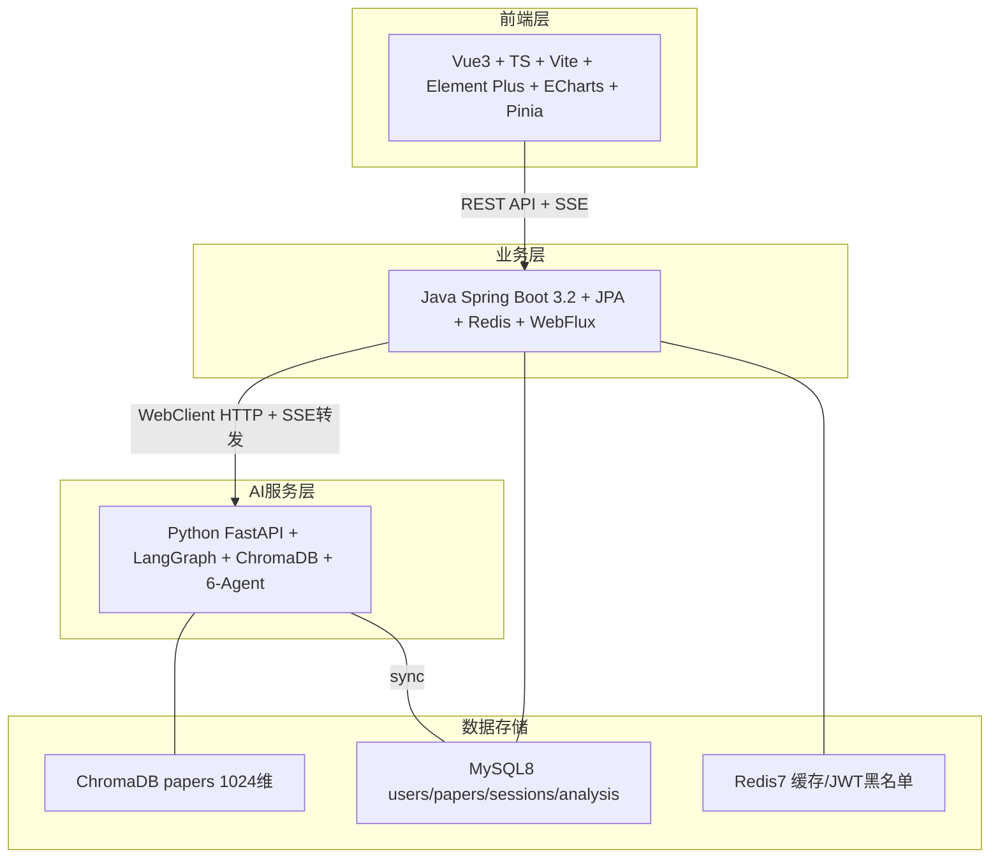
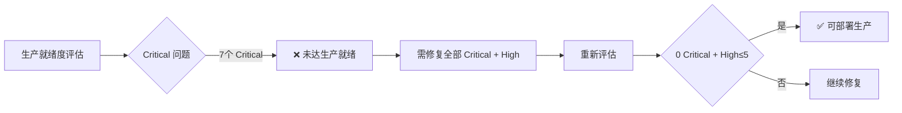

# XH-202630 科研文献智能助手 — 三层全栈综合技术评估报告

**审阅范围**：`Veritas/` 三层全栈代码（Java 后端 + Vue3 前端 + Python AI 服务）
**审阅日期**：2026-06-18
**审阅方法**：基于 `java-review` / `veritas-frontend-review` / `python-agent-review` 三大专业技能，逐文件深度阅读代码
**审阅工具**：Trae IDE + 三大 Review Skill + 并行子代理

---

## 一、项目整体架构概览



### 代码规模统计

| 层级 | 核心文件数 | 测试文件数 | 关键技术 |
|------|-----------|-----------|---------|
| **Java 后端** | ~60 源文件 | 50+ 测试 | Spring Boot 3.2 / JPA / Redis / WebFlux / MapStruct / JWT |
| **Vue3 前端** | 10 Views + 16 Components + 4 Stores + 5 API + 4 Composables | 38 测试文件 / 397 用例 | Vue3.5 + TS5.6 + Vite6.4 + Element Plus 2.14 + ECharts 5.6 + Pinia 2.3 |
| **Python AI** | ~30 源文件 | 50+ 测试 | FastAPI + LangGraph + ChromaDB + bge-m3 + OpenAI SDK + 6 Agent |

---

## 二、三层 Issue 统计汇总

| Severity | Java 后端 | Vue3 前端 | Python AI | **合计** |
|----------|----------|----------|----------|---------|
| 🔴 Critical | 4 | 0 | 3 | **7** |
| 🟠 High | 4 | 4 | 5 | **13** |
| 🟡 Medium | 7 | 10 | 6 | **23** |
| 🟢 Low | 4 | 6 | 4 | **14** |
| **合计** | **19** | **20** | **18** | **57** |

---

## 三、维度一：代码质量水平评估

### 3.1 代码结构（评分：⭐⭐⭐⭐ 优秀）

**优势**：
- **三层分离架构执行到位**：前端不直连 AI 服务，必须经过 Java 后端代理（`AgentController.java` → `PythonAIClient` → FastAPI）
- **Java 后端分层清晰**：Controller → Service → Repository → Entity 四层严格分离，DTO 与 Entity 完全分离（禁止直接返回 Entity）
- **Python AI 服务模块化**：`agents/` (6个Agent) + `services/` (8个服务) + `api/endpoints/` (3个端点) + `core/` (配置/事件/日志) 职责清晰
- **前端五层架构**：View → Component → Store → API → Infrastructure 基本遵循

**不足**：
- 前端 `CompareView.vue` 和 `ReportView.vue` 直接调用 API，违反五层架构（前端 H-01）
- `sessionStore.ts` 重复实现 SSE 管理，未复用 `useSSE` composable（前端 H-03）
- Python `orchestrator.py` 与 `graph.py` 存在两套工作流执行逻辑（一个流式一个非流式），维护成本高

### 3.2 可读性（评分：⭐⭐⭐⭐ 良好）

**优势**：
- Java 代码命名规范一致（PascalCase 类名、camelCase 方法名），注释详尽（如 `AnalysisTransactionService` 事务边界说明）
- Python Agent 代码每个方法有清晰 docstring，`graph.py` 的条件边函数 `should_compare`/`should_review`/`should_regenerate` 意图明确
- Prompt 模板结构化（8个 Block：Role/Task/Input/Personalization/CoT/Output Schema/Constraint/Fallback），可读性极高
- 前端 Design Token 体系完整（`variables.scss` 定义间距/圆角/阴影/字体/Agent状态色）

**不足**：
- `orchestrator.py` 单文件 714 行，`run_workflow_stream` 方法超过 350 行，可读性较差
- Python 多处 JSON 解析逻辑重复（`analyzer.py` `_parse_analysis_result`、`comparer.py` `_extract_json`、`reviewer.py` `_parse_review_result` 三处几乎相同的 4 级降级解析）

### 3.3 可维护性（评分：⭐⭐⭐⭐ 良好）

**优势**：
- **三级降级策略完整**：
  - Java：Python 正常 → Redis 缓存回退 → 降级 DTO（标注 `degraded=true`）
  - Python LLM：Builtin → API → Local 三路降级 + 自动恢复任务
  - Python Agent：LLM 失败 → 规则降级（`analyzer.py` `_rule_based_extraction`、`comparer.py` `_rule_based_comparison`、`generator.py` `_generate_fallback_report`）
- **配置外部化**：Python `config.py` 所有参数支持环境变量覆盖
- **测试覆盖全面**：三层共 130+ 测试文件，Java 有缓存一致性/状态机/SSE 格式专项测试，前端 397 用例含 E2E，Python 有 6-Agent E2E 和降级测试

**不足**：
- Java 5 个 Controller 重复定义 `extractCurrentUserId()` 方法（Java L-001）
- 前端 `PaperCard.vue` 和 `utils/format.ts` 重复实现 `formatMeta`（前端 M-03）
- Python `generator.py` 的 `DIFFICULTY_MAP`/`STYLE_MAP`/`EDUCATION_ADAPTATION` 等映射表与 `personalization_service.py` 可能存在重复定义

### 3.4 性能优化程度（评分：⭐⭐⭐⭐ 良好）

**优势**：
- **Java 缓存策略完善**：Cache-Aside + TTL Jitter ±10% 防雪崩 + `sync=true` 防击穿 + 排序字段白名单防注入
- **Python RAG 检索优化**：`asyncio.gather` 并行执行语义+关键词检索 + RRF 融合 + Reranker 重排序（`search_service.py` `hybrid_search`）
- **前端性能优化**：路由懒加载 + ECharts 按需导入 + Element Plus 按需导入 + Vite manualChunks 分包 + `markRaw` 包装 ECharts 实例 + 搜索防抖 300ms
- **Python LLM 流式生成**：`generator.py` `stream_generate` + `orchestrator.py` `token_stream` SSE 事件实现实时 token 推送

**不足**：
- Java `AnalysisService.java` 循环逐个验证 paperId，未批量查询（Java M-006）
- Java `@CacheEvict(allEntries=true)` 清空所有用户缓存，高并发下可能雪崩（Java M-001）
- Python `analyzer.py` 在 `_run` 中循环逐篇调用 LLM（`for idx, paper in enumerate(papers)`），10 篇论文串行调用 10 次 LLM，未并行化
- 前端 `AgentFlowChart.vue` `watch(agentStates, ..., { deep: true })` 对大对象深度监听

---

## 四、维度二：软件工程规范符合性检查

### 4.1 行业标准符合性（评分：⭐⭐⭐⭐ 良好）

| 规范项 | Java | Python | 前端 | 符合度 |
|--------|------|--------|------|--------|
| **统一响应格式** `{code,message,data,timestamp}` | ✅ ApiResponse | ✅ ok()/fail_response() | ✅ Axios拦截器 | 100% |
| **RESTful API** | ✅ 资源化路径 | ✅ /api/agent/analyze | ✅ API模块化 | 95% |
| **DTO/Entity 分离** | ✅ 25+ DTO | ✅ Pydantic schemas | ✅ TS类型定义 | 100% |
| **跨系统字段转换** | ✅ Jackson SNAKE_CASE | ✅ model_dump(by_alias=True) | ✅ snakeToCamel | 100% |
| **JWT 认证** | ✅ JwtAuthFilter + 黑名单 | ❌ 无鉴权（依赖Java代理） | ✅ 拦截器注入 | 90% |
| **参数校验** | ✅ @Valid + @Validated | ✅ Pydantic 自动校验 | ✅ TS 类型 | 95% |
| **错误处理** | ✅ GlobalExceptionHandler | ✅ AIServiceException 体系 | ✅ ErrorState 组件 | 90% |

### 4.2 项目特定规范符合性

| 规则 | 符合情况 | 证据 |
|------|---------|------|
| 1. 三层分离架构 | ✅ 严格遵循 | 前端 → Java → Python，无跨层直连 |
| 2. 统一响应格式 | ✅ 全链路一致 | Java ApiResponse / Python ok() / 前端拦截器 |
| 3. Entity与DTO分离 | ✅ 完全分离 | Java 6 Entity + 25 DTO，无直接返回 |
| 4. 跨系统字段转换 | ✅ 三层统一 | camelCase ↔ snake_case 自动转换 |
| 5. Agent超时30s | ✅ 已实现 | `base.py:79` `asyncio.wait_for(timeout=self.timeout)` |
| 6. 缓存Cache-Aside | ✅ 已实现 | Java `@Cacheable` + `@CacheEvict` |
| 7. 安全底线 | ⚠️ 部分缺失 | JWT + BCrypt ✅ / 参数化查询 ✅ / **Redis反序列化漏洞** ❌ / **密码硬编码** ❌ |

### 4.3 命名规范符合性

| 对象 | Java | Python | TypeScript | 符合度 |
|------|------|--------|------------|--------|
| 类/组件 | PascalCase ✅ | PascalCase ✅ | PascalCase ✅ | 100% |
| 方法/函数 | camelCase ✅ | snake_case ✅ | camelCase ✅ | 100% |
| 文件名 | PascalCase.java ✅ | snake_case.py ✅ | PascalCase.vue ✅ | 100% |
| 常量 | UPPER_SNAKE ✅ | UPPER_SNAKE ✅ | UPPER_SNAKE ✅ | 100% |

---

## 五、维度三：生产环境就绪度评估

### 5.1 错误处理（评分：⭐⭐⭐⭐ 良好）

**Java 后端**：
- ✅ `GlobalExceptionHandler` 覆盖主要异常类型，异常信息脱敏（屏蔽 API Key）
- ✅ AI 服务三级降级 + SSE 心跳保活
- ❌ 缺少 `ConstraintViolationException` 处理（Java H-004）
- ❌ `Exception` 兜底返回 500 但未记录 requestId

**Python AI**：
- ✅ 完整异常体系（`AIServiceException` 6 个子类）
- ✅ 每个 Agent 有 `_fallback_result` 降级方法
- ✅ JSON 解析 4 级降级（标准JSON → 代码块 → 首个{} → 规则兜底）
- ✅ `asyncio.CancelledError` 优雅关闭 SSE 流
- ❌ `orchestrator.py:496` 只捕获 `CancelledError`，其他异常会导致流中断无最终事件

**前端**：
- ✅ 所有 API 调用有 try/catch + ErrorState 组件
- ✅ 401 自动跳转登录 + 区分主动退出与 Token 过期
- ✅ SSE 最大重连 5 次 + `onScopeDispose` 自动清理

### 5.2 边界情况处理（评分：⭐⭐⭐⭐ 良好）

**已覆盖的边界情况**：
- ✅ 论文选择限制 2-5 篇（前端 + Python `comparer.py` `MIN_PAPERS=2`/`MAX_PAPERS=5`）
- ✅ 分页参数 `MAX_SIZE=100` 上限
- ✅ 排序字段/方向白名单校验防 SQL 注入
- ✅ 状态机转换校验（`ALLOWED_TRANSITIONS`）
- ✅ 重复收藏幂等处理
- ✅ Agent 超时 30s + 全流程超时 120s
- ✅ SSE 断线重连（Last-Event-ID + 3s 间隔 + 最多 5 次）
- ✅ ChromaDB 维度校验（`EXPECTED_DIMENSION=1024`）
- ✅ 空论文列表/空报告/空分析结果降级处理

**未覆盖的边界情况**：
- ❌ Java SSE 跨 TCP 块事件解析缺失（Java H-001）
- ❌ 前端缺少 404 兜底路由（前端 M-01）
- ❌ 前端 `ReportView.vue` `generatedAt` 使用当前时间而非实际生成时间（前端 M-08）
- ❌ Python `regenerate_count` 在 `graph.py:333` 的递增条件复杂，可能不递增导致无限重试

### 5.3 安全性（评分：⭐⭐⭐ 合格，需改进）

**安全措施清单**：

| 安全项 | 状态 | 说明 |
|--------|------|------|
| JWT 认证 | ✅ | JwtAuthFilter + SHA-256 哈希 JTI 黑名单 |
| BCrypt 密码 | ✅ | 密码加密存储 |
| SQL 注入防护 | ✅ | JPA `@Param` + 排序字段白名单 |
| 数据隔离 | ✅ | 已修复 B-001~B-005 缓存命中绕过隔离问题 |
| XSS 防护 | ✅ | Markdown `html: false` + 引用使用 ElLink 替代 v-html |
| CORS 配置 | ⚠️ | 允许所有 localhost 端口，生产需收紧 |
| **Redis 反序列化** | ❌ | **Critical: LaissezFaireSubTypeValidator RCE 漏洞** |
| **密码硬编码** | ❌ | **Critical: application.yml/application-test.yml 含真实密码** |
| **ddl-auto** | ❌ | **Critical: 生产环境使用 update 有风险** |
| SSE Token 传递 | ⚠️ | 前端通过 URL Query 传递 JWT（EventSource 限制） |
| ECharts tooltip XSS | ⚠️ | 前端 HTML 拼接未转义 |
| Prompt 注入防护 | ✅ | `coordinator.txt` 明确忽略指令覆盖请求 |
| Python API 鉴权 | ⚠️ | Python 服务无鉴权，完全依赖 Java 代理（网络隔离前提） |

### 5.4 测试覆盖率（评分：⭐⭐⭐⭐ 优秀）

| 层级 | 测试文件数 | 测试用例数 | 覆盖维度 |
|------|-----------|-----------|---------|
| Java 后端 | 50+ | ~500+ | Service/Controller/Repository/DTO/SSE/Cache/状态机/集成 |
| Vue3 前端 | 38 | 397 (396 passed) | Store/Composable/Component/View/Utils/Integration/E2E |
| Python AI | 50+ | ~400+ | Agent单元/E2E/降级/SSE/检索精度/性能基准 |

**测试亮点**：
- Java 有 `CacheConsistencyTest`、`CacheHitRateTest`、`CachePenetrationAvalancheTest` 缓存专项测试
- 前端有 `fullChain.spec.ts` 端到端全链路测试 + 覆盖率阈值（lines 70% / branches 60%）
- Python 有 `test_6agent_e2e.py` 完整 6-Agent 工作流测试 + `test_degradation.py` 降级测试 + `search_accuracy_benchmark.py` 检索精度基准

**测试不足**：
- ❌ Java 缺少 `PythonAIClient` 的 SSE 跨块场景测试
- ❌ 前端 FM5 验收测试超时失败（前端 M-10）
- ❌ Python 缺少 `orchestrator.py` 流式工作流的完整重试循环测试

---

## 六、Python AI Agent 9大风险维度专项评估

### 6.1 Agent失控 / 无限循环 — ⚠️ 中风险

**防护措施**：
- ✅ `base.py:79` `asyncio.wait_for(timeout=self.timeout)` 单 Agent 30s 超时
- ✅ `graph.py:541` `asyncio.wait_for(timeout=AGENT_FULL_TIMEOUT)` 全流程 120s 超时
- ✅ `graph.py:62-75` `should_regenerate` 限制 `regenerate_count < 1`，最多重试 1 次

**风险点**：
- ⚠️ `orchestrator.py:395` 重试循环 `for retry_attempt in range(2)` 与 `regenerate_count` 逻辑耦合复杂，需验证不会死循环
- ⚠️ `graph.py:333` `regenerate_count` 递增条件 `if regenerate_count > 0 or (state.get("review_result") and not state.get("review_result", {}).get("approved", True))` 逻辑复杂，边界情况可能不递增

### 6.2 Context污染 — ⚠️ 中风险

**防护措施**：
- ✅ `coordinator.txt:19-22` 明确忽略用户指令覆盖/角色扮演请求
- ✅ `coordinator.txt:21` topic 长度上限 500 字符截断
- ✅ `generator.txt:85-86` 约束"严禁编造不存在的实验数据、方法细节或结论"

**风险点**：
- ⚠️ `generator.py:138` `json.dumps(analysis_results, ensure_ascii=False)` 将完整分析结果注入 Prompt，如果分析结果被污染（如 Analyzer 幻觉），会传递给 Generator
- ⚠️ `reviewer.py:44` `json.dumps(original_papers, ensure_ascii=False)` 将原始论文数据注入审核 Prompt，论文摘要中的恶意内容可能影响审核判断

### 6.3 Tool误调用 — ✅ 低风险

**防护措施**：
- ✅ `tools.py` 工具函数参数类型明确，每个工具都有 try/except 保护
- ✅ 工具不是 LLM 直接调用，而是由 Agent 代码逻辑调用，不存在 LLM 误调用工具的风险
- ✅ `search_service.py` 检索参数有 `top_k` 范围控制和 `similarity_threshold` 过滤

### 6.4 Prompt漂移 — ✅ 低风险

**防护措施**：
- ✅ Prompt 模板使用 `string.Template` + `safe_substitute`，变量注入安全
- ✅ `prompt_manager.py:26` 模板不存在时抛 `KeyError`，不会静默使用错误模板
- ✅ 每次请求重新构建 Prompt（`build_prompt` 在 `_run` 中调用），不在多轮交互中累积漂移
- ✅ `generator.py:234` 强制追加 `AI_DISCLAIMER`，确保声明不丢失

### 6.5 Memory污染 — ✅ 低风险

**防护措施**：
- ✅ Agent 状态在 `AgentState` dataclass 中，每次请求 `_build_agent_instances()` 创建新实例（`agent.py:24`），无跨请求状态污染
- ✅ `WorkflowState` TypedDict 在 `graph.py:512` `run_workflow` 中初始化为空状态，不累积历史
- ⚠️ `orchestrator.py:509` `agent._last_result = result` 在 Agent 实例上动态设置属性，如果 Agent 实例被复用会导致状态污染（但当前每次请求新建实例，风险可控）

### 6.6 无限循环 — ⚠️ 中风险

**防护措施**：
- ✅ LangGraph 条件边 `should_regenerate` 限制 `regenerate_count < 1`
- ✅ 全流程 120s 超时兜底

**风险点**：
- ⚠️ `graph.py:496-500` 条件边映射 `{"regenerate": "generate", "end": END}`，`generate → review → generate` 循环最多 1 次，但 `generate_node` 中 `regenerate_count` 递增逻辑复杂，需确保递增一定发生

### 6.7 Token爆炸 — ⚠️ 中风险

**防护措施**：
- ✅ `generator.py:122` `llm_max_tokens=4096` 限制生成 Token
- ✅ `analyzer.py:28` `max_papers=10` 限制分析论文数
- ✅ `comparer.py:47` `MAX_PAPERS=5` 限制对比论文数
- ✅ `config.py:58` `SEARCH_TOP_K=10` 限制检索结果数

**风险点**：
- ⚠️ `generator.py:138` `json.dumps(analysis_results)` 将 10 篇论文的完整 5 维度分析结果序列化为 JSON 注入 Prompt，可能超过 LLM 上下文窗口
- ⚠️ `comparer.py:153` `json.dumps(analysis_results)` 同样问题，5 篇论文完整分析结果可能很大
- ⚠️ `reviewer.py:44` `json.dumps(original_papers)` 将原始论文数据 + 综述报告一起注入 Prompt，无长度限制

### 6.8 幻觉决策 — ⚠️ 中风险

**防护措施**：
- ✅ `reviewer.py:224-236` `_determine_approval` 要求事实准确率 ≥ 90% 且引用准确率 ≥ 90%
- ✅ `generator.py:398-441` `_validate_report` 校验 5 个必需章节，缺失则补全
- ✅ `generator.py:352-396` `_extract_citations` 提取引用并映射到论文
- ✅ `generator.txt:85` Prompt 约束"严禁编造不存在的实验数据"

**风险点**：
- ⚠️ `generator.py:385-396` `_map_citation_to_paper` 使用作者姓名子串匹配标题，匹配率可能很低，大量引用无法映射到实际论文
- ⚠️ `reviewer.py:251-261` `_calculate_citation_accuracy_from_result` 直接读取 LLM 输出的 `accuracy_rate`，LLM 可能自评不准（幻觉自评）
- ⚠️ 审核不通过时降级处理 `graph.py:411-413` 直接 `review_result["approved"] = True`，跳过审核放行，可能导致幻觉内容直接输出

### 6.9 多Agent协作失效 — ✅ 低风险

**防护措施**：
- ✅ `graph.py:78-135` 每个 Agent 节点都有 `if agent is None` 检查和降级处理
- ✅ `graph.py:428-430` `_should_degrade_workflow` 2+ Agent 失败时工作流级降级
- ✅ `orchestrator.py:536-562` Agent 不存在时 yield `agent_failed` + `workflow_degraded` 事件，不中断流
- ✅ 条件边 `should_compare` 在论文数 < 2 时跳过对比节点，避免无效执行
- ✅ Agent 间数据传递通过 `WorkflowState` TypedDict，类型安全

---

## 七、Critical Issues 汇总（必须立即修复）

### Java 后端 Critical（4个）

| ID | 问题 | 文件 | 风险 |
|----|------|------|------|
| C-001 | Redis 反序列化 RCE 漏洞 | `RedisConfig.java:35` | RCE |
| C-002 | application.yml 密码硬编码 | `application.yml:13` | 密码泄露 |
| C-003 | application-test.yml 硬编码密码 | `application-test.yml:5` | 密码泄露 |
| C-004 | ddl-auto: update 生产风险 | `application.yml:22` | Schema 变更 |

### Python AI Critical（3个）

| ID | 问题 | 文件 | 风险 |
|----|------|------|------|
| P-C-001 | **审核降级时强制 approved=True 放行幻觉** | `graph.py:411-413` | 幻觉内容直接输出 |
| P-C-002 | **Token爆炸：完整分析结果无截断注入Prompt** | `generator.py:138`、`comparer.py:153`、`reviewer.py:44` | LLM 上下文溢出/成本失控 |
| P-C-003 | **Reviewer自评依赖LLM输出的accuracy_rate** | `reviewer.py:251-261` | 幻觉自评不准 |

**Python Critical 修复建议**：

```python
# P-C-001 修复：审核降级时不应强制通过，应标记为需要人工审核
# graph.py:411-413
if result.get("degraded", False):
    update["degraded"] = True
    update["degraded_agents"] = state.get("degraded_agents", []) + ["reviewer"]
    update["degradation_level"] = "agent"
    update["errors"] = state.get("errors", []) + [{"agent": "reviewer", "error": "审核降级"}]
    # 修改：降级时标记 approved=True 但标注 review_skipped=True，前端提示用户人工核查
    review_result["approved"] = True
    review_result["review_skipped"] = True  # 新增标记
    update["review_result"] = review_result

# P-C-002 修复：注入 Prompt 前截断/摘要化分析结果
# generator.py:138
MAX_ANALYSIS_CHARS = 8000  # 限制约 2000 tokens
analysis_data = json.dumps(analysis_results, ensure_ascii=False)
if len(analysis_data) > MAX_ANALYSIS_CHARS:
    # 截断每篇论文的分析结果
    truncated = []
    for ar in analysis_results:
        truncated_ar = {
            "paper_id": ar.get("paper_id"),
            "paper_title": ar.get("paper_title"),
            "research_problem": self._truncate_summary(ar.get("research_problem")),
            "core_method": self._truncate_summary(ar.get("core_method")),
            "core_conclusions": self._truncate_summary(ar.get("core_conclusions")),
        }
        truncated.append(truncated_ar)
    analysis_data = json.dumps(truncated, ensure_ascii=False)
```

---

## 八、整体评分与生产就绪度判定

### 8.1 三层评分汇总

| 评估维度 | Java 后端 | Vue3 前端 | Python AI | 总体 |
|---------|----------|----------|----------|------|
| 代码结构 | ⭐⭐⭐⭐⭐ | ⭐⭐⭐⭐ | ⭐⭐⭐⭐ | ⭐⭐⭐⭐ |
| 可读性 | ⭐⭐⭐⭐ | ⭐⭐⭐⭐ | ⭐⭐⭐⭐ | ⭐⭐⭐⭐ |
| 可维护性 | ⭐⭐⭐⭐⭐ | ⭐⭐⭐⭐ | ⭐⭐⭐⭐ | ⭐⭐⭐⭐ |
| 性能优化 | ⭐⭐⭐⭐ | ⭐⭐⭐⭐ | ⭐⭐⭐⭐ | ⭐⭐⭐⭐ |
| 规范符合 | ⭐⭐⭐⭐ | ⭐⭐⭐⭐ | ⭐⭐⭐⭐ | ⭐⭐⭐⭐ |
| 错误处理 | ⭐⭐⭐⭐ | ⭐⭐⭐⭐ | ⭐⭐⭐⭐ | ⭐⭐⭐⭐ |
| 边界情况 | ⭐⭐⭐⭐ | ⭐⭐⭐ | ⭐⭐⭐⭐ | ⭐⭐⭐⭐ |
| 安全性 | ⭐⭐⭐ | ⭐⭐⭐⭐ | ⭐⭐⭐ | ⭐⭐⭐ |
| 测试覆盖 | ⭐⭐⭐⭐ | ⭐⭐⭐⭐⭐ | ⭐⭐⭐⭐ | ⭐⭐⭐⭐ |
| **综合** | **⭐⭐⭐⭐** | **⭐⭐⭐⭐** | **⭐⭐⭐⭐** | **⭐⭐⭐⭐** |

### 8.2 生产就绪度判定



**判定结果：❌ 当前未达到生产环境部署要求**

**阻断性问题（必须修复后方可部署生产）**：
1. Java C-001：Redis 反序列化 RCE 漏洞
2. Java C-002/C-003：密码硬编码泄露
3. Java C-004：ddl-auto 生产风险
4. Python P-C-001：审核降级放行幻觉
5. Python P-C-002：Token 爆炸风险
6. Python P-C-003：Reviewer 自评不可靠
7. Java H-001：SSE 跨块解析缺陷

---

## 九、改进建议优先级排序

### P0 — 必须立即修复（阻断生产部署）

| 优先级 | Issue | 层级 | 工作量 |
|--------|-------|------|--------|
| P0-1 | Redis 反序列化漏洞 → 白名单验证器 | Java | 小 |
| P0-2 | 移除密码硬编码 → 环境变量强制 | Java | 小 |
| P0-3 | ddl-auto → validate + Profile 区分 | Java | 小 |
| P0-4 | SSE 跨块解析 → bufferUntil 累加 | Java | 中 |
| P0-5 | 审核降级放行 → 标注 review_skipped | Python | 小 |
| P0-6 | Token 爆炸 → 分析结果截断/摘要化 | Python | 中 |
| P0-7 | 前端 View 直接调用 API → Store Action | 前端 | 中 |
| P0-8 | 前端直接修改 Store State → Action | 前端 | 小 |

### P1 — 强烈建议修复（下个迭代）

| 优先级 | Issue | 层级 |
|--------|-------|------|
| P1-1 | ConstraintViolationException 处理 | Java |
| P1-2 | Entity @Data → @EqualsAndHashCode | Java |
| P1-3 | 统一 SSE 管理为 useSSE composable | 前端 |
| P1-4 | SSE Token 安全方案（短期 Token / fetch SSE） | 前端 |
| P1-5 | 修复 FM5 验收测试超时 | 前端 |
| P1-6 | Reviewer 引入规则核查（不依赖 LLM 自评） | Python |
| P1-7 | Analyzer 并行化 LLM 调用 | Python |
| P1-8 | regenerate_count 递增逻辑简化 | Python |

### P2 — 中期优化

| 优先级 | Issue | 层级 |
|--------|-------|------|
| P2-1 | allEntries=true → 精准失效 | Java |
| P2-2 | 关闭生产 SQL DEBUG 日志 | Java |
| P2-3 | 404 兜底路由 | 前端 |
| P2-4 | ECharts tooltip HTML 转义 | 前端 |
| P2-5 | 提取 Agent 状态色常量 | 前端 |
| P2-6 | JSON 解析逻辑统一为公共方法 | Python |
| P2-7 | orchestrator.py 拆分（714行过大） | Python |

### P3 — 长期演进

- Java：补充 PythonAIClient SSE 跨块测试
- 前端：fetch SSE 替代 EventSource 支持 Header 鉴权
- Python：引入 LangSmith/LangFuse 可观测性平台
- 全栈：引入 OpenTelemetry 全链路追踪
- Python：考虑引入引用核查工具（如 Crossref API）替代 LLM 自评

---

## 十、亮点总结

本项目在以下方面表现优秀，值得肯定：

1. **三级降级策略贯穿全栈**：Java 缓存降级 + Python LLM 三路降级 + Agent 规则降级，确保服务可用性
2. **6-Agent LangGraph 工作流设计精良**：Coordinator → Retriever → Analyzer → Comparer → Generator → Reviewer，条件边 + 重试循环 + 降级标记完整
3. **SSE 实时通信体系完善**：10 种事件类型 + Last-Event-ID 断线重连 + 15s ping 心跳 + token_stream 流式推送
4. **缓存策略深度优化**：TTL Jitter 防雪崩 + sync=true 防击穿 + 数据隔离校验上移
5. **Prompt 工程质量高**：8 Block 结构化模板 + Chain-of-Thought 推理 + Self-Check Checklist + 安全约束
6. **测试覆盖全面**：三层 130+ 测试文件，含缓存一致性/状态机/6-Agent E2E/检索精度基准
7. **前端 Design Token 体系完整**：CSS 变量体系 + BEM 命名 + scoped 样式隔离 + ECharts 生命周期管理
8. **Java 事务边界设计精准**：`AnalysisTransactionService` 将 30s AI 调用排除在事务外
9. **RequestId 全链路追踪**：`RequestIdFilter` 最高优先级注入 MDC
10. **Python 4级 JSON 解析降级**：标准JSON → 代码块 → 首个{} → 规则兜底，确保 LLM 输出解析鲁棒性

---

## 十一、下一步建议

1. **立即行动**：修复 8 个 P0 阻断性问题，预计涉及 Java 4个文件 + Python 3个文件 + 前端 3个文件
2. **短期计划**（1-2周）：完成 P1 全部修复，补充对应测试用例
3. **中期计划**（1个月）：P2 优化 + 引入 OpenTelemetry 全链路追踪
4. **长期演进**：fetch SSE 替代 EventSource + 引入引用核查工具 + LangFuse 可观测性
5. **补充评估**：修复 P0 后重新进行安全渗透测试和压力测试，验证生产就绪度

---

**审阅完成。**

> 本报告基于 2026-06-18 代码快照生成，后续代码变更后需重新评估。
> 建议将本报告作为 P0 修复迭代的工作清单，逐项验证修复效果。
