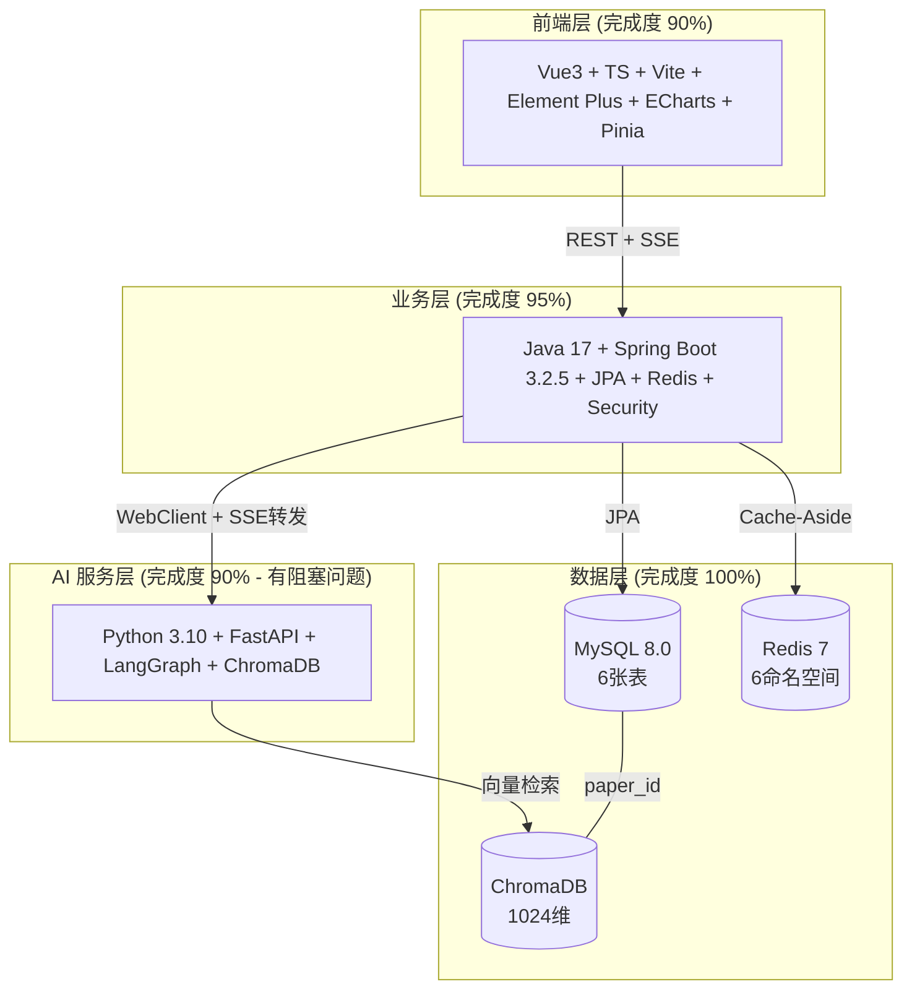

# Veritas 项目整体实现情况检查报告

| 项目 | 内容 |
|------|------|
| **课题编号** | XH-202630 |
| **子项目** | 科研文献智能助手 |
| **检查日期** | 2026-06-17 |
| **检查方式** | 只读分析，未修改任何代码 |
| **项目路径** | `/Users/achieve/Documents/AchiEVE_MacBook_Air/Veritas(求真)/Veritas` |
| **三层架构** | Vue3 前端 → Java Spring Boot 后端 → Python FastAPI + LangGraph AI 服务 |

---

## 一、整体架构概览

---

## 二、各层实现情况汇总

### 1. Java Spring Boot 后端 — 完成度 **95%** ✅

**核心实现**：
- **6 个 Controller**：Agent / Analysis / Health / Paper / Session / User，端点齐全
- **6 个 Service**：含 AgentClientService 三级降级、AnalysisService 事务边界优化
- **6 个 Entity + 7 个 Repository**：JPA 映射正确，双 ID 设计（Long + String UUID）
- **安全体系**：JWT + BCrypt + Redis 黑名单 + 数据隔离校验 + 参数化查询防注入
- **AI 集成**：双 WebClient（同步 + SSE）+ 7 种 SSE 事件标准化 + 心跳 + 超时 + 断线重连
- **测试覆盖**：**322 个测试用例**（41 个测试类），覆盖所有核心模块
- **代码质量**：无 TODO/FIXME，无未实现方法，命名规范统一

**关键问题**：

| 优先级 | 问题 | 位置 |
|--------|------|------|
| 高 | `application.yml` 中 `sse-timeout: 150000` 与代码实际 120s 不一致（配置项未被读取） | `backend/src/main/resources/application.yml` |
| 高 | CORS 配置硬编码 `http://localhost:*`，未读取 `cors.allowed-origins` 配置项 | `SecurityConfig.java` |
| 中 | PaperFavoriteRepository 已实现但无 Service/Controller 暴露收藏功能 | `PaperFavoriteRepository.java` |
| 中 | SessionController 的 `getSessionDetail`/`updateStatus`/`deleteSession` 未显式传递 currentUserId，依赖 SecurityContext | `SessionController.java` |
| 低 | SessionService.isTerminal() 死代码未使用 | `SessionService.java` |
| 低 | AgentClientService.generateReportStream(无 heartbeat 版本) 已废弃但保留 | `AgentClientService.java` |

### 2. Python AI 服务 — 完成度 **90%** ⚠️（有阻塞问题）

**核心实现**：
- **6 个 Agent 全部实现**：Coordinator / Retriever / Analyzer / Comparer / Generator / Reviewer，每个都有降级策略
- **LangGraph 工作流**：6 节点编排 + 条件边 + 审核重试闭环 + 全流程 120s 超时
- **SSE 编排器**：9 种事件类型 + Keep-alive ping + Last-Event-ID 断线重连
- **三级降级**：LLM 级（builtin → api → local）+ Agent 级（规则降级）+ 工作流级
- **7 个 Service**：LLM / Embedding / Search / VectorStore / Reranker / Personalization / Prompt
- **6 个 Prompt 模板**：含 Role / Task / Schema / Constraint / Fallback / Self-Check
- **测试覆盖**：**743 个测试函数**（39 个测试文件）

**🚨 阻塞性问题**：
- **`app/models/` 目录完全缺失**！20 个文件引用 `app.models.schemas` 和 `app.models.enums`，但目录不存在
- **影响**：AI 服务无法启动（ImportError），所有依赖 models 的测试无法运行
- **推测**：可能被误删或未提交到当前分支

**其他问题**：

| 优先级 | 问题 | 位置 |
|--------|------|------|
| 高 | `config.py` 默认 `LLM_MODE=api` 与 `.env.example` 的 `auto` 不一致 | `app/core/config.py` |
| 中 | Embedding 本地模型下载被禁用，DASHSCOPE_API_KEY 未配置时服务不可用 | `app/services/embedding_service.py` |
| 中 | `validation_report.json` 显示 25 篇论文中 10 篇重复 | `ai-service/validation_report.json` |
| 低 | `retriever.txt` Prompt 较简略（44 行 vs 其他 100-230 行） | `prompts/retriever.txt` |
| 低 | `tools.py` 的 TOOL_REGISTRY 未被 Agent 实际使用 | `app/agents/tools.py` |
| 低 | `orchestrator.py` 通过 `agent._last_result` 动态添加属性 | `app/agents/orchestrator.py` |

### 3. Vue3 前端 — 完成度 **90%** ✅

**核心实现**：
- **9 条路由**：Home / Login / Register / Search / PaperDetail / Compare / Report / AgentFlow / UserCenter，全部懒加载
- **5 个 API 模块**：含 snake_case → camelCase 递归转换 + 401 自动登出
- **4 个 Pinia Store**：agent / paper / session / user，状态机完整
- **3 个 Composable**：useAuth / usePagination / useSSE（含重连策略）
- **15 个组件**：agent(4) + analysis(2) + common(5) + layout(2) + paper(1) + report(2)
- **ECharts 可视化**：AgentFlowChart（Graph + EffectScatter 脉冲动画）+ TimeStats（柱状图）
- **测试覆盖**：**184 个测试用例**（24 个测试文件），含全链路集成测试

**关键问题**：

| 优先级 | 问题 | 位置 |
|--------|------|------|
| 中 | `paperStore.fetchFavorites` 标注 "FM5 待实现"，收藏列表刷新后丢失 | `src/stores/paperStore.ts:140` |
| 中 | SSE 存在两套重复实现（useSSE vs sessionStore.connectAgentStream） | `src/composables/useSSE.ts` / `src/stores/sessionStore.ts` |
| 中 | 缺少 404 兜底路由 | `src/router/index.ts` |
| 中 | AppFooter 未全局引入；agentStore.flowData 死代码 | `src/App.vue` / `src/stores/agentStore.ts` |
| 低 | 测试覆盖不均衡：缺 userStore/agentStore/api 拦截器/LoginView 等测试 | `src/__tests__/` |
| 低 | `ReportView.vue` 使用 v-html 渲染 Markdown，建议加 DOMPurify | `src/views/ReportView.vue` |

### 4. 数据库与基础设施 — 完成度 **100%** ✅

**MySQL DDL**（`backend/src/main/resources/db/01_create_tables.sql`）：
- 6 张表：users / user_profiles / papers / sessions / analysis_results / paper_favorites
- utf8mb4 字符集 + InnoDB 引擎 + 外键级联删除
- papers 表含 FULLTEXT 索引（ngram 中文分词）
- 枚举字段与 Java Enum 完全对应

**Docker Compose**（`docker-compose.yml`）：
- 5 个服务：mysql(8.0) / redis(7-alpine) / ai-service / java-backend / frontend
- 健康检查 + 依赖编排 + 数据卷持久化 + 桥接网络
- **注意**：`docker-compose.yml:36` 有 `# TODO: 待后续任务完善` 注释（ai-service 配置）

---

## 三、整体完成度评估

| 层级 | 完成度 | 状态 | 测试用例数 |
|------|--------|------|-----------|
| Java 后端 | 95% | ✅ 已完成 | 322 |
| Python AI 服务 | 90% | ⚠️ 有阻塞问题 | 743 |
| Vue3 前端 | 90% | ✅ 已完成 | 184 |
| 数据库 / 基础设施 | 100% | ✅ 已完成 | - |
| **整体加权** | **~92%** | **⚠️ 需修复阻塞问题** | **1249** |

---

## 四、关键问题优先级排序

### 🚨 P0 - 阻塞性问题（必须立即修复）

1. **AI 服务 `app/models/` 目录缺失**
   - 20 个源文件和测试文件引用 `app.models.schemas` / `app.models.enums`
   - 导致 AI 服务完全无法启动
   - **修复方案**：创建 `app/models/__init__.py`、`app/models/enums.py`（AnalysisType / EducationLevel / KnowledgeLevel / PreferredStyle）、`app/models/schemas.py`（AnalyzeRequest / AnalyzeResponse / AgentStateResponse / UserProfile / SearchRequest 等 Pydantic 模型）

### 🔴 P1 - 高优先级问题

2. **后端配置不一致**：`application.yml` 的 `sse-timeout: 150000` 与代码 120s 不一致
3. **后端 CORS 硬编码**：未读取 `cors.allowed-origins` 配置项，生产部署受限
4. **前端收藏功能未串联**：`paperStore.fetchFavorites` 为 FM5 待实现占位
5. **AI 服务 LLM_MODE 默认值不一致**：config.py `api` vs .env.example `auto`

### 🟡 P2 - 中优先级问题

6. PaperFavorite 功能未在 Controller / Service 暴露
7. 前端 SSE 两套重复实现
8. AI 服务论文数据有 10 篇重复
9. 前端测试覆盖不均衡（缺 userStore / agentStore / api 拦截器等）

---

## 五、下一步建议

### 立即行动（解除阻塞）
1. **优先恢复 `app/models/` 目录** — 这是 AI 服务启动的前提，建议参考 `ai-service/docs/FIELD_MAPPING.md` 中的字段契约创建 Pydantic schemas 和 enums
2. 修复后运行 `cd ai-service && python -m pytest` 验证 743 个测试是否通过

### 短期（1-2 天）
3. 同步 `application.yml` 的 sse-timeout 为 120000 或删除未使用配置项
4. SecurityConfig 读取 `cors.allowed-origins` 配置项
5. 统一 `LLM_MODE` 默认值为 `auto`
6. 前端补全 404 兜底路由 + 清理 agentStore.flowData 死代码

### 中期（1 周）
7. **补全收藏功能全链路**：后端新增 PaperFavoriteService + Controller 端点 → 前端实现 fetchFavorites
8. **统一前端 SSE 实现**：sessionStore.connectAgentStream 改为内部调用 useSSE
9. **清理 AI 服务重复论文数据** + 重建向量数据库
10. **补全前端测试缺口**：userStore / agentStore / api 拦截器 / LoginView 等

### 长期（未来迭代）
11. 接入 Actuator + Micrometer 监控（AI 服务调用成功率 / 降级率 / SSE 连接数）
12. 增加 Testcontainers 端到端集成测试（MySQL / Redis / ChromaDB 真实环境）
13. 前端引入 DOMPurify 加固 v-html XSS 防护
14. 完善 `retriever.txt` Prompt（补 Few-shot 和 Self-Check）
15. 补充 `docker-compose.yml` 中 ai-service 的环境变量配置（删除 TODO 注释）

---

## 六、补充观察

- **测试规模惊人**：全项目共 **1249 个测试用例**（Java 322 + Python 743 + 前端 184），远超一般毕设项目水平
- **降级策略完善**：三级降级（LLM / Agent / 工作流）+ SSE 流降级 + 服务启动降级，符合 AGENTS.md 要求
- **架构规范**：严格遵循三层分离、Entity / DTO 分离、统一响应格式、Cache-Aside 缓存等所有关键规则
- **唯一致命问题**是 `app/models/` 目录缺失，修复后项目即可达到生产可用状态

---

## 七、详细检查子报告索引

本次检查由三个并行子代理完成，详细分项报告见各层审阅报告目录：

| 层级 | 详细报告位置 |
|------|-------------|
| Java 后端 | `log/阶段审阅报告/backend/`（JM1-JM4 历史报告） |
| Python AI 服务 | `log/阶段审阅报告/ai-service/`（M1-M4 历史报告） |
| Vue3 前端 | `log/阶段审阅报告/frontend/`（FM1-FM3 历史报告） |
| **本次整体检查** | **`log/阶段审阅报告/项目整体实现情况检查报告-2026-06-17.md`**（本文件） |

---

**报告生成时间**：2026-06-17
**检查工具**：Trae IDE + 三个并行 search 子代理
**下次检查建议**：修复 P0 阻塞问题后，重新运行全项目测试验证
